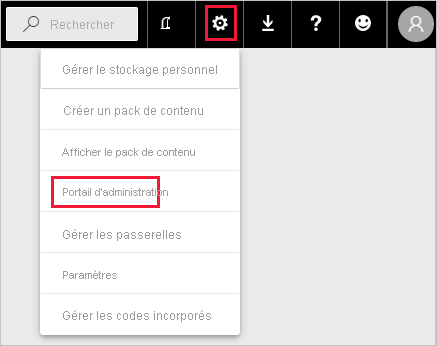
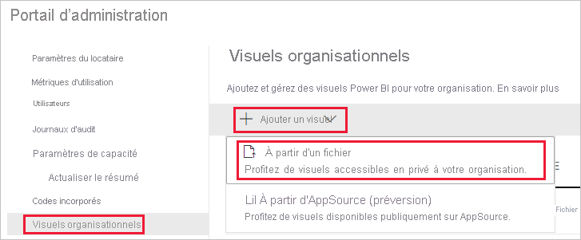
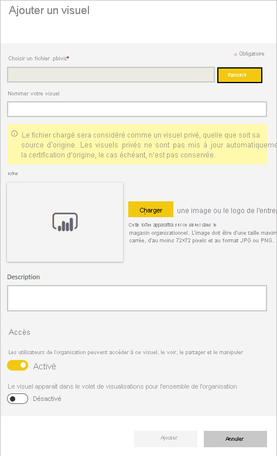
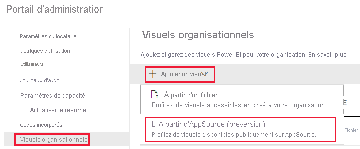
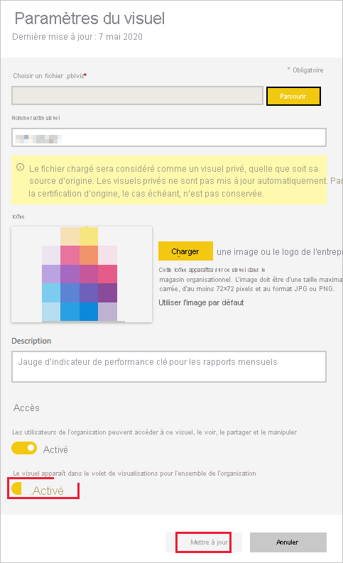

# Gérer les paramètres d’administration des visuels Power BI

En tant qu’administrateur Power BI de votre organisation, vous pouvez contrôler les types de visuels Power BI auxquels les utilisateurs peuvent accéder au sein de l’organisation.

Pour gérer les visuels Power BI, vous devez être administrateur général dans Office 365 ou avoir reçu le rôle d’administrateur de service Power BI. Pour plus d’informations sur le rôle d’administrateur de Service Power BI, voir [Présentation du rôle d’administrateur Power BI](service-admin-role.md).

## Accéder au portail d’administration

Pour activer les paramètres décrits dans l’article, vous devez accéder au portail d’administration.

1. Dans le service Power BI, sélectionnez **Paramètres**.

2. Dans le menu déroulant des paramètres, sélectionnez **Portail d’administration**.

    

## Paramètres de locataire de visuels Power BI

En tant qu’administrateur Power BI de votre organisation, vous pouvez contrôler les types de visuels Power BI auxquels les utilisateurs peuvent accéder au sein de l’organisation.

Les paramètres de locataire de l’interface utilisateur affectent uniquement le service Power BI. Si vous voulez que ces paramètres prennent effet dans Power BI Desktop, utilisez des stratégies de groupe. Un tableau à la fin de chaque section fournit des indications pour activer le paramètre dans Power BI Desktop.

>[!NOTE]
>Les modifications apportées aux paramètres de locataire n’affectent pas les visuels Power BI listés sous l’onglet [Visuels d’organisation](#organizational-visuals).

### Visuels issus d’AppSource ou d’un fichier

Gérez l’accès organisationnel pour les types de visuels Power BI suivants :

* Visuels créés par des développeurs et enregistrés sous forme de fichier. pbiviz.

* Visuels disponibles à partir d’AppSource.

Suivez les instructions ci-dessous pour permettre aux utilisateurs de votre organisation de charger les fichiers .pbiviz et d’ajouter des visuels issus d’AppSource à leurs rapports et tableaux de bord.

1. Développez les paramètres **Autoriser les visuels créés avec le kit Power BI SDK**.

2. Cliquez sur **Activé**.

3. Choisissez qui peut charger les visuels .pbiviz et AppSource :

    * Sélectionnez l’option **Toute l’organisation** pour autoriser tous les membres de votre organisation à charger des fichiers .pbiviz et à ajouter des visuels issus d’AppSource.

     * Sélectionnez l’option **Groupes de sécurité spécifiques** pour gérer le chargement des fichiers .pbiviz et l’ajout des visuels issus d’AppSource à l’aide de groupes de sécurité. Ajoutez les groupes de sécurité que vous souhaitez gérer à la barre de texte *Entrer les groupes de sécurité*. Les groupes de sécurité que vous avez spécifiés sont exclus par défaut. Si vous souhaitez inclure ces groupes de sécurité et exclure tous les autres membres de l’organisation, sélectionnez l’option **À l’exception des groupes de sécurité spécifiques**.

4. Cliquez sur **Appliquer**.

Les modifications apportées aux paramètres de locataire à partir de l’interface utilisateur s’appliquent uniquement au service Power BI. Pour autoriser les utilisateurs de votre organisation à charger les fichiers .pbiviz et à ajouter des visuels issus d’AppSource à leur volet de visualisation dans Power BI Desktop, utilisez une [stratégie de groupe Azure AD](https://docs.microsoft.com/azure/active-directory-domain-services/manage-group-policy).

|Key  |Nom de la valeur  |Valeur  |
|---------|---------|---------|
|Software\Policies\Microsoft\Power BI Desktop\    |EnableCustomVisuals    |0 – Désactiver  1 – Activer (par défaut)         |
|

### Visuels Power BI certifiés

Quand ce paramètre est activé, seuls les [visuels Power BI certifiés](../developer/visuals/power-bi-custom-visuals-certified.md) s’affichent dans les rapports et les tableaux de bord de votre organisation. Les visuels Power BI issus d’AppSource ou de fichiers qui ne sont pas certifiés retournent un message d’erreur.

1. Sur le portail d’administration, sélectionnez **Ajouter et utiliser des visuels certifiés uniquement**.

2. Cliquez sur **Activé**.

3. Cliquez sur **Appliquer**.

Les modifications apportées aux paramètres de locataire à partir de l’interface utilisateur s’appliquent uniquement au service Power BI. Pour gérer le paramètre de locataire de visuels certifiés dans Power BI Desktop, utilisez une [stratégie de groupe Azure AD](https://docs.microsoft.com/azure/active-directory-domain-services/manage-group-policy).

|Key  |Nom de la valeur  |Valeur  |
|---------|---------|---------|
|Software\Policies\Microsoft\Power BI Desktop\    |EnableUncertifiedVisuals    |0 – Désactiver  1 – Activer (par défaut)         |
|

## Visuels organisationnels

En tant qu’administrateur Power BI, vous pouvez gérer la liste des visuels Power BI disponibles dans le [magasin organisationnel](../developer/visuals/power-bi-custom-visuals.md#organizational-store) de votre organisation. L’onglet **Visuels d’organisation** du *portail d’administration* vous permet d’ajouter ou de supprimer des visuels et de choisir ceux qui s’afficheront automatiquement dans le volet de visualisation des utilisateurs de votre organisation. Vous pouvez ajouter à la liste tout type de visuel, notamment des visuels non certifiés et des visuels .pbiviz, même s’ils contredisent les [paramètres de locataire ](#power-bi-visuals-tenant-settings) de votre organisation.

Les paramètres des visuels organisationnels sont déployés automatiquement dans Power BI Desktop.

>[!NOTE]
>Les visuels organisationnels ne sont pas pris en charge dans Power BI Report Server.

### Ajouter un visuel à partir d’un fichier

Utilisez cette méthode pour ajouter un nouveau visuel Power BI à partir d’un fichier .pbiviz.

> [!WARNING]
> Un visuel Power BI chargé à partir d’un fichier est susceptible de contenir du code présentant des risques pour la sécurité ou la confidentialité ; vérifiez que l’auteur et la source du visuel sont dignes de confiance avant de le déployer dans le référentiel de l’organisation.

1. Sélectionnez **Ajouter un visuel** > **À partir d’un fichier**.

    

2. Remplissez les champs suivants :

    * **Choisir un fichier .pbiviz** : sélectionnez le fichier de visuel à charger.

    * **Nommer votre visuel** : donnez un titre court au visuel pour permettre aux auteurs de rapports de comprendre facilement à quoi il sert.

    * **Icône** : chargez un fichier d’icône à afficher dans le volet de visualisation.

    * **Description** : rédigez une brève description du visuel pour donner plus de contexte à l’utilisateur.

    * **Accès** : cette section comporte deux options :
    
        * Indiquez si les utilisateurs de votre organisation peuvent accéder à ce visuel. Ce paramètre est activé par défaut.

        * Indiquez si ce visuel doit apparaître dans le volet de visualisation des utilisateurs de votre organisation. Ce paramètre est désactivé par défaut. Pour plus d’informations, consultez [Ajouter un visuel au volet de visualisation](#add-a-visual-to-the-visualization-pane).

    

3. Pour lancer la demande de chargement, sélectionnez **Ajouter**. Une fois chargé, le visuel s’affiche dans la liste des visuels organisationnels.

### Ajouter un visuel à partir d’AppSource (préversion)

Utilisez cette méthode pour ajouter un nouveau visuel Power BI à partir d’AppSource.

Les visuels Power BI issus d’AppSource sont automatiquement mis à jour. Les utilisateurs de votre organisation disposent toujours de la dernière version du visuel.

1. Sélectionnez **Ajouter un visuel** > **À partir d’AppSource**.

    

2. Dans la fenêtre **Visuels Power BI**, recherchez le visuel AppSource que vous voulez ajouter, puis cliquez sur **Ajouter**. Une fois chargé, le visuel s’affiche dans la liste des visuels organisationnels.

### Ajouter un visuel au volet Visualisation

Vous pouvez choisir des visuels à partir de la page de visuels organisationnels pour les afficher automatiquement dans le volet de visualisation de tous les utilisateurs de votre organisation.

1. Dans la ligne du visuel que vous voulez ajouter, cliquez sur **paramètres**.

    volet-organisationnel

2. Activez le paramètre du volet de visualisation, puis cliquez sur **Mettre à jour**.

    

### Supprimer un visuel chargé à partir d’un fichier

Sélectionnez l’icône de la corbeille pour supprimer définitivement le visuel du référentiel.

> [!IMPORTANT]
> La suppression est irréversible. Le rendu du visuel supprimé disparaît immédiatement des rapports existants. Même si vous chargez à nouveau un même visuel, il ne remplace pas celui qui a été supprimé. Toutefois, les utilisateurs peuvent réimporter le nouveau visuel et remplacer l’instance présente dans leurs rapports.

### Désactiver un visuel .pbiviz

Vous pouvez désactiver un visuel .pbiviz pour le rendre indisponible dans le [magasin organisationnel](../developer/visuals/power-bi-custom-visuals.md#organizational-store), tout en le conservant dans la liste des visuels organisationnels.

1. Dans la ligne du visuel .pbiviz que vous voulez désactiver, cliquez sur **paramètres**.

2. Dans la section **Accès**, désactivez le paramètre suivant : *Les utilisateurs de l’organisation peuvent accéder à ce visuel, le voir, le partager et le manipuler*.

Une fois que vous avez désactivé le visuel .pbiviz, il ne s’affiche plus dans les rapports existants et le message d’erreur suivant apparaît :

*Ce visuel personnalisé n’est plus disponible. Pour plus d’informations, contactez votre administrateur.*

>[!NOTE]
>Les visuels .pbiviz marqués d’un signet continuent de fonctionner après avoir été désactivés.

### Mettre à jour un visuel

Les visuels AppSource sont mis à jour automatiquement. Dès qu’une nouvelle version est disponible auprès d’AppSource, elle remplace la version antérieure déployée via la liste des visuels organisationnels.

Pour mettre à jour un visuel .pbiviz, suivez ces étapes pour remplacer le visuel.

1. Dans la ligne du visuel que vous voulez ajouter, cliquez sur **paramètres**.

2. Cliquez sur **Parcourir**, puis sélectionnez le visuels .pbiviz que vous voulez remplacer par le visuel actuel.

3. Cliquez sur **Update**.

## Étapes suivantes

> [!div class="nextstepaction"]
>[Administration de Power BI dans le portail d’administration](service-admin-portal.md)

> [!div class="nextstepaction"]
>[Visuels dans Power BI](../developer/visuals/power-bi-custom-visuals.md)

> [!div class="nextstepaction"]
>[Visuels organisationnels dans Power BI](../developer/visuals/power-bi-custom-visuals-organization.md)