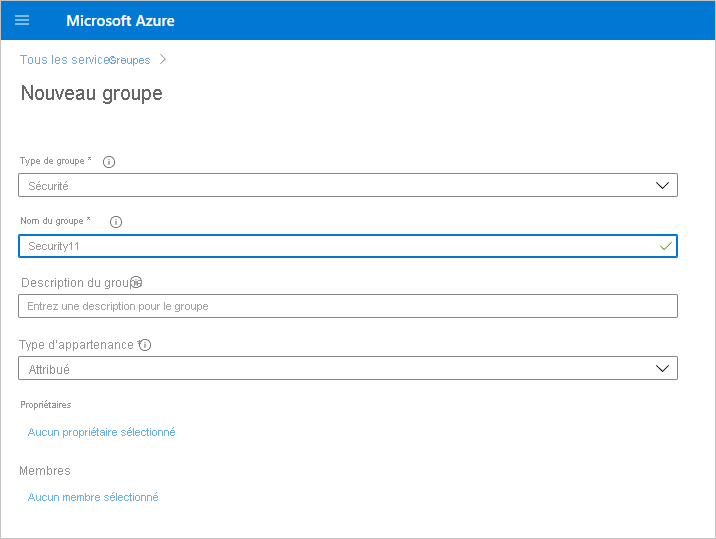
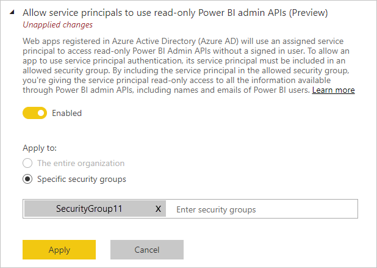

# Activer l’authentification du principal de service pour les API d’administration en lecture seule (préversion)

Le principal de service est une méthode d’authentification qui peut être utilisée pour permettre l’accès d’une application Azure Active Directory (Azure AD) à du contenu ou à des API du service Power BI.
Quand vous créez une application Azure AD, un [objet de principal de service](https://docs.microsoft.com/azure/active-directory/develop/app-objects-and-service-principals#service-principal-object) est créé. L’objet de principal de service, aussi appelé simplement « principal de service », permet à Azure AD d’authentifier votre application. Une fois authentifié, l’application peut accéder aux ressources de l’abonné Azure AD.

## Méthode

Pour activer l’authentification du principal de service pour les API en lecture seule de Power BI, procédez comme suit :

1. [Créez une application Azure AD](https://docs.microsoft.com/azure/active-directory/develop/howto-create-service-principal-portal). Vous pouvez ignorer cette étape si vous avez déjà une application Azure AD que vous voulez utiliser. Prenez note de l’ID d’application pour les étapes ultérieures. 
2. Créez un **groupe de sécurité** dans Azure Active Directory. [Découvrez comment créer un groupe de base et comment ajouter des membres en utilisant Azure Active Directory](https://docs.microsoft.com/azure/active-directory/fundamentals/active-directory-groups-create-azure-portal). Vous pouvez ignorer cette étape si vous avez déjà un groupe de sécurité que vous souhaitez utiliser.
    Veillez à sélectionner **Sécurité** pour Type de groupe.

    

3. Ajoutez votre ID d’application comme membre du groupe de sécurité que vous avez créé. Pour ce faire :
    1. Accédez à **Portail Azure > Azure Active Directory > Groupes**, puis sélectionnez le groupe de sécurité que vous avez créé à l’étape 2.
    1. Sélectionnez **Ajouter des membres**.
    Remarque : Vérifiez que l’application que vous utilisez n’a pas de rôle d’administrateur Power BI défini dans le portail Azure. Pour vérifier cela : 
       * Connectez-vous au **portail Azure** comme administrateur général, administrateur d’application ou administrateur d’application cloud. 
        * Sélectionnez **Azure Active Directory**, puis **Applications d’entreprise**. 
        * Sélectionnez l’application à laquelle vous voulez accorder l’accès à Power BI. 
        * Sélectionnez **Autorisations**. Vérifiez qu’il n’existe pas d’autorisations avec consentement requis de l’administrateur Power BI définies sur cette application. Pour plus d’informations, consultez [Gestion du consentement pour les applications et évaluation des demandes de consentement](https://docs.microsoft.com/azure/active-directory/manage-apps/manage-consent-requests). 
4. Activez les paramètres d’administrateur de service Power BI. Pour ce faire :
    1. Connectez-vous au portail d’administration de Power BI. Vous devez être administrateur Power BI pour voir la page des paramètres du locataire.
    1. Sous **Paramètres des API d’administration**, vous voyez **Autoriser les principaux de service à utiliser les API d’administration Power BI en lecture seule (préversion)** . Définissez le bouton bascule sur Activé, puis sélectionnez la case d’option **Groupes de sécurité spécifiques** et ajoutez le groupe de sécurité que vous avez créé à l’étape 2 dans le champ de texte qui apparaît en dessous de celui-ci, comme illustré dans la figure ci-dessous.

        

 5. Commencez à utiliser les API d’administration en lecture seule. Consultez la liste des API prises en charge ci-dessous.

    >[!IMPORTANT]
    >Une fois que vous activez l’utilisation du principal de service avec Power BI, les autorisations Azure AD de l’application n’ont plus d’effet. Les autorisations de l’application sont ensuite gérées par le biais du portail d’administration Power BI.

## Observations et limitations
* Vous ne pouvez pas vous connecter au portail Power BI avec un principal de service.
* Vous devez disposer de droits d’administrateur Power BI pour activer le principal de service dans les paramètres des API d’administration dans le portail d’administration de Power BI.
* Le principal de service prend actuellement en charge les API suivantes :
    * [GetGroupsAsAdmin](https://docs.microsoft.com/rest/api/power-bi/admin/groups_getgroupsasadmin) avec $expand pour les tableaux de bord, les jeux de données, les rapports et les dataflows 
    * [GetDashboardsAsAdmin](https://docs.microsoft.com/rest/api/power-bi/admin/dashboards_getdashboardsasadmin) avec le vignettes $expand
    * [GetDatasourcesAsAdmin](https://docs.microsoft.com/rest/api/power-bi/admin/datasets_getdatasourcesasadmin) 
    * [GetDatasetToDataflowsLinksAsAdmin](https://docs.microsoft.com/rest/api/power-bi/admin/datasets_getdatasettodataflowslinksingroupasadmin)
    * [GetDataflowDatasourcesAsAdmin](https://docs.microsoft.com/rest/api/power-bi/admin/dataflows_getdataflowdatasourcesasadmin) 
    * [GetDataflowUpstreamDataflowsAsAdmin](https://docs.microsoft.com/rest/api/power-bi/admin/dataflows_getupstreamdataflowsingroupasadmin) 
    * [GetCapacitiesAsAdmin](https://docs.microsoft.com/rest/api/power-bi/admin/getcapacitiesasadmin)
    * [GetActivityLog](https://docs.microsoft.com/rest/api/power-bi/admin/getactivityevents)
    * [GetModifiedWorkspaces](https://docs.microsoft.com/rest/api/power-bi/admin/workspaceinfo_getmodifiedworkspaces)
    * [WorkspaceGetInfo](https://docs.microsoft.com/rest/api/power-bi/admin/workspaceinfo_postworkspaceinfo)
    * [WorkspaceScanStatus](https://docs.microsoft.com/rest/api/power-bi/admin/workspaceinfo_getscanstatus)
    * [WorkspaceScanResult](https://docs.microsoft.com/rest/api/power-bi/admin/workspaceinfo_getscanresult)
