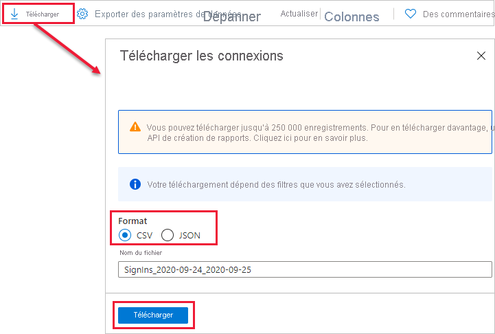

# Trouver les utilisateurs Power BI qui se sont connectés

Si vous occupez un poste d’administrateur dans votre organisation et si vous souhaitez voir quels utilisateurs se sont connectés à Power BI, utilisez les [rapports d’accès et d’utilisation Azure Active Directory](/azure/active-directory/reports-monitoring/concept-sign-ins).

> [!NOTE]
> Le rapport **Connexions** fournit des informations utiles, mais n’indique pas le type de licence dont dispose chaque utilisateur. Utilisez le Centre d’administration Microsoft 365 pour voir les licences.

## Configuration requise

N’importe quel utilisateur peut afficher le rapport de ses propres connexions. Pour afficher le rapport de tous les utilisateurs, vous devez avoir l’un des rôles suivants : Administrateur général, Administrateur de sécurité, Lecteur Sécurité, Lecteur général ou Lecteur de rapports

## Utiliser le Centre d’administration Azure Active Directory pour voir les connexions

Pour afficher l’activité de connexion, procédez comme suit.

1. Connectez-vous au [Centre d’administration Azure Active Directory](https://aad.portal.azure.com), puis sélectionnez **Azure Active Directory** dans le menu du portail.

1. Dans le menu Ressource, sélectionnez **Supervision** > **Connexions**.
   
    

1. Par défaut, toutes les connexions des dernières 24 heures sont affichées (utilisateurs et applications). Pour choisir une autre période, sélectionnez **Date** dans le volet actif, puis choisissez parmi les intervalles de temps disponibles. Seules les informations des sept derniers jours sont disponibles. Pour voir uniquement les connexions à Power BI, ajoutez des filtres. Sélectionnez **Ajouter un filtre** > choisissez **Application** comme champ à utiliser pour le filtrage, puis sélectionnez **Appliquer**. Sélectionnez **L’application commence par** en haut du volet actif, puis entrez le nom de l’application. Sélectionnez **Appliquer**.

    **Microsoft Power BI** filtre les activités de connexion liées au service. **Power BI Gateway** filtre les activités de connexion propres à la passerelle de données locale.
   
    

## Exporter les données

Vous pouvez [télécharger un rapport de connexion](/azure/active-directory/reports-monitoring/quickstart-download-sign-in-report) dans deux formats : CSV et JSON.

1. Dans la barre de commandes du rapport **Connexions**, sélectionnez **Télécharger**, puis l’une des options suivantes :

   * **CSV** pour télécharger un fichier CSV correspondant aux données actuellement filtrées.

   * **JSON** pour télécharger un fichier JSON correspondant aux données actuellement filtrées.

2. Tapez un nom de fichier, puis sélectionnez **Télécharger**.

## Rétention de données

Les données relatives aux connexions sont disponibles pendant sept jours, sauf si votre organisation dispose d’une licence Azure AD Premium. Si vous utilisez Azure AD Premium P1 ou Azure AD Premium P2, vous pouvez voir les données des 30 derniers jours. Pour plus d’informations, consultez [Stratégies de rétention de rapport Azure Active Directory](/azure/active-directory/reports-monitoring/reference-reports-data-retention).

## Étapes suivantes

[Auditer l’activité des utilisateurs](service-admin-auditing.md)

D’autres questions ? [Essayez d’interroger la communauté Power BI](https://community.powerbi.com/)