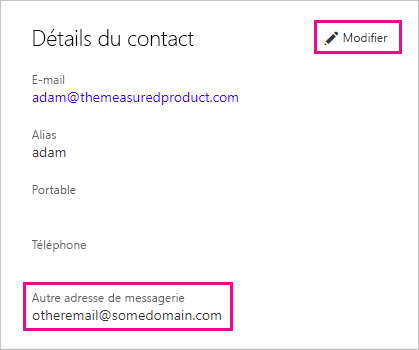

# <a name="use-an-alternate-email-address"></a>Utiliser une autre adresse e-mail

Lorsque vous vous inscrivez à Power BI, vous fournissez une adresse e-mail. Par défaut, Power BI utilise cette adresse pour vous envoyer des mises à jour sur l’activité dans le service. Par exemple, quand quelqu’un vous envoie une invitation de partage, elle est expédiée à cette adresse.

Dans certains cas, vous souhaiterez peut-être que ces e-mails soient envoyés à une autre adresse e-mail que celle utilisée pour vous inscrire. Cet article explique comment spécifier une autre adresse dans Microsoft 365 et dans PowerShell. Cet article explique également comment Azure Active Directory (Azure AD) résout une adresse e-mail.

> [!NOTE]
> La spécification d’une autre adresse n’affecte pas l’adresse e-mail utilisée par Power BI pour les abonnements par e-mail, les mises à jour du service, les lettres d’information et les autres communications publicitaires. Ces communications sont toujours envoyées à l’adresse e-mail que vous avez utilisée pour vous inscrire à Power BI.

## <a name="use-microsoft-365"></a>Utiliser Microsoft 365

Pour spécifier une autre adresse dans Microsoft 365, effectuez les étapes suivantes.

1. Ouvrez la page [Informations personnelles](https://portal.office.com/account/#personalinfo) de votre compte. Si l’application vous le demande, connectez-vous avec l’adresse de messagerie et le mot de passe que vous utilisez pour Power BI.

1. Dans le menu de gauche, sélectionnez **informations personnelles**.

1. Dans la section **Détails du contact**, sélectionnez **Modifier**.

    Si vous ne pouvez pas modifier les détails vous concernant, cela signifie que votre administrateur gère votre adresse e-mail. Contactez votre administrateur pour mettre à jour votre adresse e-mail.

    

1. Dans le champ **Autre adresse e-mail**, entrez l’adresse e-mail que Microsoft 365 doit utiliser pour les mises à jour de Power BI.

## <a name="use-powershell"></a>Utiliser PowerShell

Pour spécifier une autre adresse dans PowerShell, utilisez la commande [Set-AzureADUser](/powershell/module/azuread/set-azureaduser/).

```powershell
Set-AzureADUser -ObjectId john@contoso.com -OtherMails "otheremail@somedomain.com"
```

## <a name="email-address-resolution-in-azure-ad"></a>Résolution d’adresse e-mail ans Azure AD

Pour capturer un jeton d'intégration d'Azure AD pour Power BI, vous pouvez utiliser trois types d'e-mails différents :

* L’adresse e-mail principale associée au compte Azure AD d’un utilisateur

* L’adresse e-mail UPN (UserPrincipalName)

* L’attribut de tableau *autre adresse e-mail*

Power BI sélectionne l’e-mail à utiliser en fonction de la séquence suivante :

1. Si l’attribut de messagerie est défini dans l’objet utilisateur Azure AD, Power BI l’utilise pour l’adresse e-mail.

1. Si l’adresse e-mail UPN n’est *pas* une adresse e-mail du domaine **\*.onmicrosoft.com** (informations après le symbole « \@ »), Power BI utilise cet attribut de messagerie pour l’adresse e-mail.

1. Si l’attribut de tableau *autre adresse e-mail* est défini dans l’objet utilisateur Azure AD, Power BI utilise la première adresse e-mail de cette liste (quand plusieurs e-mails sont spécifiés dans cet attribut).

1. Si aucune des conditions ci-dessus n’est remplie, Power BI utilise l’adresse UPN.

D’autres questions ? [Posez vos questions à la communauté Power BI](https://community.powerbi.com/)
