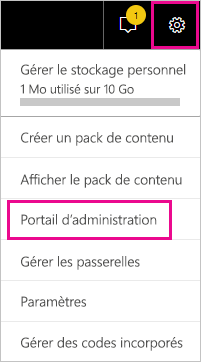
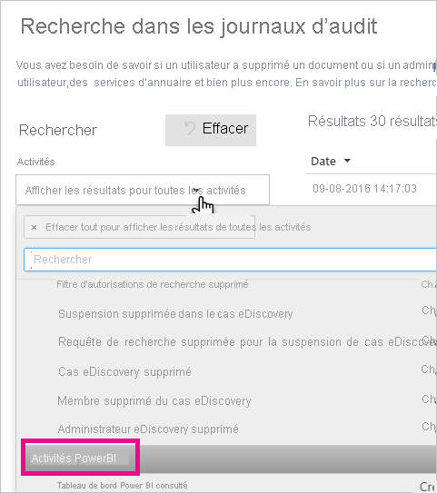
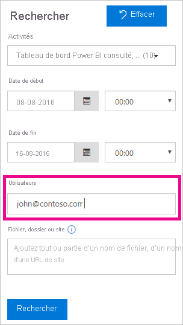
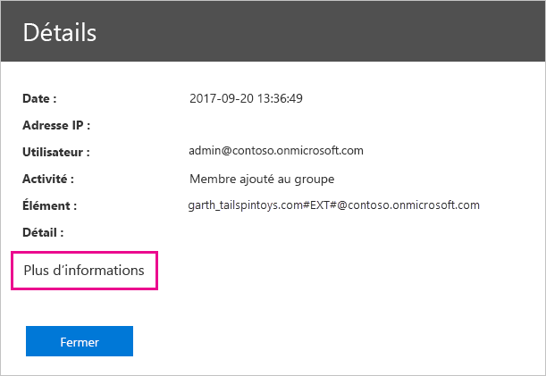

# <a name="track-user-activities-in-power-bi"></a>Suivre les activités utilisateur dans Power BI

Il est important de savoir qui effectue une action sur un élément donné de votre abonné Power BI, afin de permettre à votre entreprise de répondre à ses exigences, notamment en matière de conformité réglementaire et de gestion des enregistrements. Power BI propose deux options pour suivre l’activité utilisateur : le [journal d’activité de Power BI](#use-the-activity-log) et le [journal d’audit unifié](#use-the-audit-log). Ces journaux contiennent tous les deux une copie complète des [données d’audit de Power BI](#operations-available-in-the-audit-and-activity-logs), mais il existe plusieurs différences importantes qui sont résumées dans le tableau ci-après.

| **Journal d’audit unifié** | **Journal d’activité de Power BI** |
| --- | --- |
| Inclut les événements de SharePoint Online, Exchange Online, Dynamics 365 et d’autres services en plus des événements d’audit de Power BI. | Inclut uniquement les événements d’audit de Power BI. |
| Seuls les utilisateurs ayant des autorisations Journaux d’audit ou Journaux d’audit en affichage seul, comme les administrateurs généraux et les auditeurs, ont accès à ce journal. | Les administrateurs généraux et les administrateurs de service Power BI ont accès à ce journal. |
| Les administrateurs généraux et les auditeurs peuvent faire des recherches dans le journal d’audit unifié à l’aide du Centre de sécurité Microsoft 365 et du Centre de conformité Microsoft 365. | Il n’existe pas encore d’interface utilisateur permettant d’effectuer des recherches dans le journal d’activité. |
| Les administrateurs généraux et les auditeurs peuvent télécharger des entrées du journal d’audit à l’aide d’API et d’applets de commande de gestion Microsoft 365. | Les administrateurs généraux et les administrateurs de service Power BI peuvent télécharger des entrées du journal d’activité à l’aide d’une API REST Power BI et d’une applet de commande de gestion. |
| Conserve les données d’audit pendant 90 jours. | Conserve les données d’activité pendant 30 jours (préversion publique). |
| Conserve les données d’audit, même si le locataire est déplacé vers une autre région Azure. | Ne conserve pas les données d’activité lorsque le client est déplacé vers une autre région Azure. |


## <a name="use-the-activity-log"></a>Utiliser le journal d’activité

En tant qu’administrateur de service Power BI, vous pouvez analyser l’utilisation de toutes les ressources Power BI au niveau du locataire à l’aide de rapports personnalisés basés sur le journal d’activité de Power BI. Vous pouvez télécharger les activités à l’aide d’une API REST ou d’une applet de commande PowerShell. Vous pouvez aussi filtrer les données d’activité par plage de dates, par utilisateur et par type d’activité.

### <a name="activity-log-requirements"></a>Conditions requises pour le journal d’activité

Vous devez remplir ces conditions requises pour accéder au journal d’activité de Power BI :

- Être administrateur général ou administrateur de service Power BI.
- Avoir installé les [applets de commande de gestion Power BI](https://www.powershellgallery.com/packages/MicrosoftPowerBIMgmt) localement ou utiliser les applets de commande de gestion Power BI dans Azure Cloud Shell.

### <a name="activityevents-rest-api"></a>API REST ActivityEvents

Vous pouvez utiliser une application d’administration basée sur les API REST de Power BI pour exporter des événements d’activité vers un magasin d’objets blob ou une base de données SQL. Vous pouvez ensuite créer un rapport d’utilisation personnalisé à partir des données exportées. Dans l’appel de l’API REST **ActivityEvents**, vous devez spécifier une date de début et une date de fin, et éventuellement un filtre pour sélectionner des activités par type d’activité ou ID d’utilisateur. Du fait que le journal d’activité est susceptible de contenir une grande quantité de données, l’API **ActivityEvents** limite le téléchargement à un seul jour de données par requête. En d’autres termes, les dates de début et de fin doivent spécifier le même jour, comme dans l’exemple suivant. Vous devez spécifier les valeurs DateTime au format UTC.

```
https://api.powerbi.com/v1.0/myorg/admin/activityevents?startDateTime='2019-08-31T00:00:00'&endDateTime='2019-08-31T23:59:59'
```

Si le nombre d’entrées est élevé, l’API **ActivityEvents** retourne seulement environ 5 000 à 10 000 entrées ainsi qu’un jeton de continuation. Rappelez l’API **ActivityEvents** avec le jeton de continuation retourné pour obtenir le lot d’entrées suivant, en répétant cette opération jusqu’à ce que vous ayez récupéré toutes les entrées et que vous ne receviez plus de jeton de continuation. L’exemple suivant montre comment utiliser le jeton de continuation.

```
https://api.powerbi.com/v1.0/myorg/admin/activityevents?continuationToken='%2BRID%3ARthsAIwfWGcVAAAAAAAAAA%3D%3D%23RT%3A4%23TRC%3A20%23FPC%3AARUAAAAAAAAAFwAAAAAAAAA%3D'
```

Quel que soit le nombre d’entrées retournées, tant qu’un jeton de continuation est retourné dans les résultats, vous devez rappeler l’API à l’aide de ce jeton pour récupérer les données restantes. Il peut arriver qu’un appel retourne un jeton de continuation même en l’absence d’entrées d’événement. L’exemple suivant montre comment effectuer une boucle avec un jeton de continuation retourné dans la réponse :

```
while(response.ContinuationToken != null)
{
   // Store the activity event results in a list for example
    completeListOfActivityEvents.AddRange(response.ActivityEventEntities);

    // Make another call to the API with continuation token
    response = GetPowerBIActivityEvents(response.ContinuationToken)
}
completeListOfActivityEvents.AddRange(response.ActivityEventEntities);
```
> [!NOTE]
> L’affichage de tous les événements peut prendre jusqu’à 24 heures, bien que les données complètes soient généralement disponibles plus tôt.
>
>
### <a name="get-powerbiactivityevent-cmdlet"></a>Applet de commande Get-PowerBIActivityEvent

Téléchargez les événements d’activité à l’aide des applets de commande de gestion Power BI pour PowerShell. L’applet de commande **Get-PowerBIActivityEvent** gère automatiquement le jeton de continuation. L’applet de commande **Get-PowerBIActivityEvent** utilise les paramètres StartDateTime et EndDateTime avec les mêmes restrictions que l’API REST **ActivityEvents**. Autrement dit, les dates de début et de fin doivent faire référence à la même valeur de date, car vous pouvez récupérer les données d’activité d’un seul jour à la fois.

Le script suivant montre comment télécharger toutes les activités Power BI. La commande convertit les résultats au format JSON en objets .NET pour pouvoir accéder directement aux propriétés de chaque activité. Ces exemples montrent le plus petit et le plus grand horodatages possibles pour une journée, afin de garantir qu’aucun événement n’est manqué.

```powershell
Login-PowerBI

$activities = Get-PowerBIActivityEvent -StartDateTime '2019-08-31T00:00:00' -EndDateTime '2019-08-31T23:59:59' | ConvertFrom-Json

$activities.Count
$activities[0]

```

### <a name="filter-activity-data"></a>Filtrer les données d’activité

Vous pouvez filtrer les événements d’activité par type d’activité et ID d’utilisateur. Le script suivant montre comment télécharger seulement les données d’événement correspondant à l’activité **ViewDashboard**. Pour plus d’informations sur les paramètres pris en charge, utilisez la commande `Get-Help Get-PowerBIActivityEvent`.

```powershell
Login-PowerBI

$activities = Get-PowerBIActivityEvent -StartDateTime '2019-08-31T00:00:00' -EndDateTime '2019-08-31T23:59:59' -ActivityType 'ViewDashboard' | ConvertFrom-Json

$activities.Count
$activities[0]

```

## <a name="use-the-audit-log"></a>Utiliser le journal d’audit

Si vous devez effectuer le suivi des activités des utilisateurs dans Power BI et Microsoft 365, utilisez l’audit dans le Centre de sécurité et de conformité Office 365 ou utilisez PowerShell. L’audit s’appuie sur des fonctionnalités d’Exchange Online, qui est automatiquement configuré de façon à prendre en charge Power BI.

Vous pouvez filtrer les données d’audit par période, utilisateur, tableau de bord, rapport, jeu de données et type d’activité. Vous pouvez également télécharger les activités dans un fichier .csv (valeurs séparées par des virgules) pour les analyser hors connexion.

### <a name="audit-log-requirements"></a>Conditions requises pour le journal d’audit

Vous devez remplir ces conditions requises pour accéder aux journaux d’audit :

- Vous devez être administrateur général ou avoir le rôle Journaux d’audit ou Journaux d’audit en affichage seul dans Exchange Online pour pouvoir accéder au journal d’audit. Par défaut, ces rôles sont affectés aux groupes de rôles Gestion de la conformité et Gestion de l’organisation sur la page **Autorisations** du Centre d’administration Exchange.

    Pour donner accès au journal d’audit à des comptes non administrateurs, ajoutez l’utilisateur à la liste des membres de l’un de ces groupes de rôles. Une autre possibilité, si vous le souhaitez, consiste à créer un groupe de rôles personnalisé dans le Centre d’administration Exchange, à affecter à ce groupe le rôle Journaux d’audit ou Journaux d’audit en affichage seul, puis à ajouter le compte non administrateur au nouveau groupe de rôles. Pour plus d’informations, voir [Gérer les groupes de rôles dans Exchange Online](/Exchange/permissions-exo/role-groups).

    Si vous ne pouvez pas accéder au Centre d’administration Exchange à partir du centre d’administration Microsoft 365, accédez à https://outlook.office365.com/ecp et connectez-vous avec vos informations d’identification.

- Si vous avez accès au journal d’audit, mais que vous n’êtes ni administrateur général ni administrateur de service Power BI, vous ne pouvez pas accéder au portail d’administration de Power BI. Dans ce cas, utilisez un lien direct vers le [Centre de sécurité et conformité Office 365](https://sip.protection.office.com/#/unifiedauditlog).

### <a name="access-your-audit-logs"></a>Accéder à vos journaux d’audit

Pour accéder aux journaux, vous devez d’abord activer la journalisation dans Power BI. Pour plus d’informations, consultez [Journaux d’audit](service-admin-portal.md#audit-logs) dans la documentation du portail d’administration. Il peut y avoir jusqu’à un délai de 48 heures entre l’activation de l’audit et le moment où vous pouvez afficher les données d’audit. Si vous ne voyez immédiatement les données, consultez les journaux d’audit plus tard. Le délai est sensiblement le même entre le moment où vous obtenez l’autorisation de voir les journaux d’audit et le moment où vous pouvez réellement y accéder.

Les journaux d’audit de Power BI sont disponibles directement dans le [Centre Sécurité et conformité Office 365](https://sip.protection.office.com/#/unifiedauditlog). Vous trouverez également un lien dans le portail d’administration Power BI :

1. Dans Power BI, sélectionnez l’icône d’**engrenage** dans le coin supérieur droit, puis **Portail d’administration**.

   

1. Sélectionnez **Journaux d’audit**.

1. Sélectionnez **Accéder au Centre d’administration Microsoft 365**.

   

### <a name="search-only-power-bi-activities"></a>Rechercher des activités Power BI uniquement

Limitez les résultats aux seules activités Power BI en suivant ces étapes. Pour la liste des activités, consultez la liste des [activités auditées par Power BI](#operations-available-in-the-audit-and-activity-logs) plus loin dans cet article.

1. Dans la page **Recherche dans le journal d’audit**, sous **Recherche**, sélectionnez la liste déroulante **Activités**.

2. Sélectionnez **Activités Power BI**.

   

3. Sélectionnez n’importe quel emplacement en dehors de la zone de sélection pour la fermer.

Vos recherches ne retournent que des activités Power BI.

### <a name="search-the-audit-logs-by-date"></a>Rechercher les journaux d’audit par date

Vous pouvez rechercher dans les journaux par plage de dates à l’aide des champs **Date de début** et **Date de fin**. La sélection par défaut est Sept derniers jours. L’affichage présente la date et l’heure au format UTC (temps universel coordonné). La période maximale que vous pouvez spécifier est de 90 jours. 

Vous recevez une erreur si la période sélectionnée est supérieure à 90 jours. Si vous utilisez la période maximale de 90 jours, sélectionnez l’heure actuelle comme **Date de début**. Sinon, vous recevez une erreur indiquant que la date de début est antérieure à la date de fin. Si vous avez activé l’audit dans les 90 derniers jours, la plage de dates ne peut pas commencer avant la date à laquelle l’audit a été activé.


### <a name="search-the-audit-logs-by-users"></a>Rechercher les journaux d’audit par utilisateur

Vous pouvez rechercher des entrées du journal d’audit pour les activités effectuées par des utilisateurs spécifiques. Entrez un ou plusieurs noms d’utilisateur dans le champ **Utilisateurs**. Le nom d’utilisateur ressemble à une adresse e-mail. Il s’agit du compte auquel les utilisateurs se connectent à Power BI. Laissez cette zone vide afin de renvoyer les entrées pour tous les utilisateurs (et les comptes de service) de votre organisation.



### <a name="view-search-results"></a>Afficher les résultats de recherche

Une fois que vous sélectionnez **Rechercher**, les résultats de la recherche sont chargés. Après quelques instants, ils s’affichent sous **Résultats**. Une fois la recherche terminée, l’affichage indique le nombre de résultats trouvés. **Recherche dans le journal d’audit** affiche un maximum de 1000 événements. Si plus de 1000 événements répondent aux critères de recherche, l’application affiche les 1000 événements les plus récents.

#### <a name="view-the-main-results"></a>Afficher les principaux résultats

La zone **Résultats** contient les informations suivantes sur chaque événement retourné par la recherche. Sélectionnez un en-tête de colonne sous **Résultats** pour trier les résultats.

| **Colonne** | **Définition** |
| --- | --- |
| Date |Date et heure (au format UTC) auxquelles l’événement s’est produit. |
| Adresse IP |L’adresse IP de l’appareil utilisé pour l’activité journalisée. L’application affiche l’adresse IP au format d’adresse IPv4 ou IPv6. |
| Utilisateur |L’utilisateur (ou compte de service) qui a effectué l’action qui a déclenché l’événement. |
| Activité |Activité exécutée par l’utilisateur. Cette valeur correspond aux activités que vous avez sélectionnées dans la liste déroulante **Activités**. Pour un événement du journal d’audit d’administrateur Exchange, la valeur de cette colonne est une cmdlet Exchange. |
| Article |Objet créé ou modifié en raison de l’activité correspondante. Par exemple, le fichier affiché ou modifié, ou le compte d’utilisateur mis à jour. Certaines activités n’ont pas de valeur dans cette colonne. |
| Détails |Détails supplémentaires sur une activité. Là encore, seule une partie des activités a une valeur. |

#### <a name="view-the-details-for-an-event"></a>Afficher les détails d’un événement

Pour afficher plus de détails sur un événement, sélectionnez l’enregistrement de l’événement dans la liste des résultats de recherche. Une page **Détails** s’affiche avec les propriétés détaillées de l’enregistrement de l’événement. La page **Détails** affiche les propriétés en fonction du service Microsoft 365 dans lequel l’événement se produit.

Pour afficher ces détails, sélectionnez **Plus d’informations**. Toutes les entrées Power BI ont une valeur de 20 pour la propriété RecordType. Pour plus d’informations sur les autres propriétés, consultez [Propriétés détaillées dans le journal d’audit](/office365/securitycompliance/detailed-properties-in-the-office-365-audit-log/).

   

### <a name="export-search-results"></a>Exporter les résultats de recherche

Pour exporter le journal d’audit Power BI dans un fichier CSV, suivez ces étapes.

1. Sélectionnez **Exporter les résultats**.

1. Sélectionnez **Enregistrer les résultats chargés** ou **Télécharger tous les résultats**.

    

### <a name="use-powershell-to-search-audit-logs"></a>Utiliser PowerShell pour rechercher dans les journaux d’audit

Vous pouvez aussi utiliser PowerShell pour accéder aux journaux d’audit en fonction de votre connexion. L’exemple suivant montre comment se connecter à Exchange Online PowerShell, puis utiliser la commande [Search-UnifiedAuditLog](/powershell/module/exchange/policy-and-compliance-audit/search-unifiedauditlog?view=exchange-ps/) pour extraire les entrées du journal d’audit Power BI. Pour exécuter le script, un administrateur doit vous attribuer les autorisations nécessaires, qui sont décrites dans la section [Conditions requises pour le journal d’audit](#audit-log-requirements).

```powershell
Set-ExecutionPolicy RemoteSigned

$UserCredential = Get-Credential

$Session = New-PSSession -ConfigurationName Microsoft.Exchange -ConnectionUri https://outlook.office365.com/powershell-liveid/ -Credential $UserCredential -Authentication Basic -AllowRedirection

Import-PSSession $Session
Search-UnifiedAuditLog -StartDate 9/11/2018 -EndDate 9/15/2018 -RecordType PowerBI -ResultSize 1000 | Format-Table | More
```

### <a name="use-powershell-to-export-audit-logs"></a>Utiliser PowerShell pour exporter les journaux d’audit

Vous pouvez également utiliser PowerShell pour exporter les résultats de votre recherche de journaux d’audit. L’exemple suivant montre comment envoyer à partir de la commande [Search-UnifiedAuditLog](/powershell/module/exchange/policy-and-compliance-audit/search-unifiedauditlog?view=exchange-ps/) et exporter les résultats avec l’applet de commande [Export-Csv](/powershell/module/microsoft.powershell.utility/export-csv). Pour exécuter le script, un administrateur doit vous attribuer les autorisations nécessaires, qui sont décrites dans la section [Conditions requises pour le journal d’audit](#audit-log-requirements).

```powershell
$UserCredential = Get-Credential

$Session = New-PSSession -ConfigurationName Microsoft.Exchange -ConnectionUri https://outlook.office365.com/powershell-liveid/ -Credential $UserCredential -Authentication Basic -AllowRedirection

Import-PSSession $Session
Search-UnifiedAuditLog -StartDate 9/11/2019 -EndDate 9/15/2019 -RecordType PowerBI -ResultSize 5000 |
Export-Csv -Path "c:\temp\PowerBIAuditLog.csv" -NoTypeInformation

Remove-PSSession $Session
```

Pour plus d’informations sur la connexion à Exchange Online, consultez [Se connecter à Exchange Online PowerShell](/powershell/exchange/exchange-online/connect-to-exchange-online-powershell/connect-to-exchange-online-powershell/). Pour un autre exemple d’utilisation de PowerShell avec les journaux d’audit, consultez [Utilisation du journal d’audit Power BI et de PowerShell pour attribuer des licences Power BI Pro](https://powerbi.microsoft.com/blog/using-power-bi-audit-log-and-powershell-to-assign-power-bi-pro-licenses/).

## <a name="operations-available-in-the-audit-and-activity-logs"></a>Opérations disponibles dans les journaux d’audit et d’activité

Les opérations suivantes sont disponibles à la fois dans les journaux d’audit et les journaux d’activité.

| Nom convivial                                     | Nom de l’opération                              | Notes                                  |
|---------------------------------------------------|---------------------------------------------|------------------------------------------|
| Accéder aux tables recommandées Power BI dans Excel | AnalyzedByExternalApplication |    |
| Source de données ajoutée à la passerelle Power BI             | AddDatasourceToGateway                      |                                          |
| Accès au dossier Power BI ajouté                      | AddFolderAccess                             | Non utilisée actuellement                       |
| Membres ajoutés au groupe Power BI                      | AddGroupMembers                             |                                          |
| Compte de stockage de dataflow attaché au locataire par l’administrateur | AdminAttachedDataflowStorageAccountToTenant | Non utilisée actuellement                       |
| Jeu de données Power BI analysé                         | AnalyzedByExternalApplication               | Généré lorsque les utilisateurs interagissent avec le service                                         |
| Rapport Power BI analysé                          | AnalyzeInExcel                              |                                          |
| Espace de travail attribué à un pipeline de déploiement                          | AssignWorkspaceToPipeline                              |                                          |
| Compte de stockage de dataflow attaché                 | AttachedDataflowStorageAccount              |                                          |
| Jeu de données Power BI lié à la passerelle                | BindToGateway                               |                                          |
| Actualisation de dataflow annulée                        | CancelDataflowRefresh                       |                                          |
| État de la capacité modifié                            | ChangeCapacityState                         |                                          |
| Affectation d’utilisateurs de capacité modifiée                  | UpdateCapacityUsersAssignment               |                                          |
| Connexions de jeu de données Power BI modifiées              | SetAllConnections                           |                                          |
| Administrateurs de passerelle Power BI modifiés                   | ChangeGatewayAdministrators                 |                                          |
| Modification des utilisateurs de la source de données de la passerelle Power BI        | ChangeGatewayDatasourceUsers                |                                          |
| Visuel personnalisé d’une organisation créé                          | InsertOrganizationalGalleryItem                                |                                          |
| Pack de contenu d’organisation Power BI créé      | CreateOrgApp                                |                                          |
| Pipeline de déploiement créé      | CreateAlmPipeline                                |                                          |
| Application Power BI créée                              | CreateApp                                   |                                          |
| Tableau de bord Power BI créé                        | CreateDashboard                             |                                          |
| Dataflow Power BI créé                         | CreateDataflow                              |                                          |
| Jeu de données Power BI créé                          | CreateDataset                               |                                          |
| Abonnement à l’e-mail Power BI créé               | CreateEmailSubscription                     |                                          |
| Dossier Power BI créé                           | CreateFolder                                |                                          |
| Passerelle Power BI créée                          | CreateGateway                               |                                          |
| Groupe Power BI créé                            | CreateGroup                                 |                                          |
| Rapport Power BI créé                           | CreateReport <sup>1</sup>                                |                                          |
| Visuel personnalisé ayant demandé le jeton d’accès Azure AD                           | GenerateCustomVisualAADAccessToken                                |                                          |
| Visuel personnalisé ayant demandé le jeton d’accès Office Web Apps                           | GenerateCustomVisualWACAccessToken                                |                                          |
| Dataflow migré vers un compte de stockage externe     | DataflowMigratedToExternalStorageAccount    | Non utilisée actuellement                       |
| Autorisations de dataflow ajoutées                        | DataflowPermissionsAdded                    | Non utilisée actuellement                       |
| Autorisations de dataflow supprimées                      | DataflowPermissionsRemoved                  | Non utilisée actuellement                       |
| Visuel personnalisé d’une organisation supprimé     | DeleteOrganizationalGalleryItem                                |                                          |
| Pipeline de déploiement supprimé      | DeleteAlmPipeline                                |                                          |
| Pack de contenu d’organisation Power BI supprimé      | DeleteOrgApp                                |                                          |
| Commentaire Power BI supprimé                          | DeleteComment                               |                                          |
| Tableau de bord Power BI supprimé                        | DeleteDashboard                             | Non utilisée actuellement                       |
| Dataflow Power BI supprimé                         | DeleteDataflow                              | Non utilisée actuellement                       |
| Jeu de données Power BI supprimé                          | DeleteDataset                               |                                          |
| Abonnement à l’e-mail Power BI supprimé               | DeleteEmailSubscription                     |                                          |
| Dossier Power BI supprimé                           | DeleteFolder                                |                                          |
| Accès au dossier Power BI supprimé                    | DeleteFolderAccess                          | Non utilisée actuellement                       |
| Passerelle Power BI supprimée                          | DeleteGateway                               |                                          |
| Groupe Power BI supprimé                            | DeleteGroup                                 |                                          |
| Rapport Power BI supprimé                           | DeleteReport                                |                                          |
| Phase Déployé dans un pipeline                           | DeployAlmPipeline                                |                                          |
| Sources de données de jeu de données Power BI détectées          | GetDatasources                              |                                          |
| Rapport Power BI téléchargé                        | DownloadReport                              |                                          |
| Propriétés de dataflow modifiées                        | EditDataflowProperties                      |                                          |
| Autorisation de certification Power BI modifiée          | EditCertificationPermission                 | Non utilisée actuellement                       |
| Tableau de bord Power BI modifié                         | EditDashboard                               | Non utilisée actuellement                       |
| Jeu de données Power BI modifié                           | EditDataset                                 |                                          |
| Propriétés du jeu de données Power BI modifiées                | EditDatasetProperties                       | Non utilisée actuellement                       |
| Rapport Power BI modifié                            | EditReport                                  |                                          |
| Dataflow Power BI exporté                        | ExportDataflow                              |                                          |
| Données des visuels de rapport Power BI exportées              | ExportReport                                |                                          |
| Données de vignette Power BI exportées                       | ExportTile                                  |                                          |
| Échec de l’ajout d’autorisations de dataflow                | FailedToAddDataflowPermissions              | Non utilisée actuellement                       |
| Échec de la suppression d’autorisations de dataflow             | FailedToRemoveDataflowPermissions           | Non utilisée actuellement                       |
| Jeton SAS de dataflow Power BI généré             | GenerateDataflowSasToken                    |                                          |
| Jeton d’incorporation Power BI généré                    | GenerateEmbedToken                          |                                          |
| Fichier importé dans Power BI                         | Importer                                      |                                          |
| Application Power BI installée                            | InstallApp                                  |                                          |
| Espace de travail migré vers une capacité                  | MigrateWorkspaceIntoCapacity                |                                          |
| Commentaire Power BI publié                           | PostComment                                 |                                          |
| Tableau de bord Power BI imprimé                        | PrintDashboard                              |                                          |
| Page de rapport Power BI imprimée                      | PrintReport                                 |                                          |
| Rapport Power BI publié sur le web                  | PublishToWebReport <sup>2</sup>                         |                                          |
| Tables recommandées publiées ou mises à jour | UpdateFeaturedTables <sup>3</sup>   | |
| Secret de dataflow Power BI reçu du coffre de clés  | ReceiveDataflowSecretFromKeyVault           |                                          |
| Espace de travail supprimé d’un pipeline de déploiement         | UnassignWorkspaceFromPipeline                 |                                          |
| Source de données supprimée de la passerelle Power BI         | RemoveDatasourceFromGateway                 |                                          |
| Membres supprimés du groupe Power BI                    | DeleteGroupMembers                          |                                          |
| Espace de travail supprimé d’une capacité                 | RemoveWorkspacesFromCapacity                |                                          |
| Tableau de bord Power BI renommé                        | RenameDashboard                             |                                          |
| Actualisation demandée du dataflow Power BI               | RequestDataflowRefresh                      | Non utilisée actuellement                       |
| Actualisation demandée du jeu de données Power BI                | RefreshDataset                              |                                          |
| Espaces de travail Power BI récupérés                     | GetWorkspaces                               |                                          |
| Emplacement de stockage de dataflow défini pour un espace de travail     | SetDataflowStorageLocationForWorkspace      |                                          |
| Actualisation planifiée sur le dataflow Power BI définie        | SetScheduledRefreshOnDataflow               |                                          |
| Actualisation planifiée sur le jeu de données Power BI définie         | SetScheduledRefresh                         |                                          |
| Tableau de bord Power BI partagé                         | ShareDashboard                              |                                          |
| Rapport Power BI partagé                            | ShareReport                                 |                                          |
| Essai gratuit étendu de Power BI démarré                   | OptInForExtendedProTrial                    | Non utilisée actuellement                       |
| Essai Power BI démarré                            | OptInForProTrial                            |                                          |
| Prise de contrôle d’une source de données Power BI                   | TakeOverDatasource                          |                                          |
| Prise de contrôle d’un jeu de données Power BI                        | TakeOverDataset                             |                                          |
| Prise de contrôle d’un dataflow Power BI                     | TookOverDataflow                             |                                          |
| Application Power BI dépubliée                          | UnpublishApp                                |                                          |
| Mettre à jour les paramètres de gouvernance des ressources de capacité      | UpdateCapacityResourceGovernanceSettings    | Absente du Centre d’administration Microsoft 365 |
| Visuel personnalisé d’une organisation mis à jour                     | UpdateOrganizationalGalleryItem                   |                                          |
| Administrateur de capacité mis à jour                            | UpdateCapacityAdmins                        |                                          |
| Nom d’affichage de capacité mis à jour                     | UpdateCapacityDisplayName                   |                                          |
| Autorisations d’affectation de stockage de dataflow mises à jour   | UpdatedDataflowStorageAssignmentPermissions |                                          |
| Accès au pipeline de déploiement mis à jour   | UpdateAlmPipelineAccess |                                          |
| Configuration du pipeline de déploiement mise à jour   | SetConfigurationAlmPipeline |                                          |
| Paramètres Power BI de l’organisation mis à jour          | UpdatedAdminFeatureSwitch                   |                                          |
| Application Power BI mise à jour                              | UpdateApp                                   |                                          |
| Dataflow Power BI mis à jour                         | UpdateDataflow                              |                                          |
| Sources de données de jeu de données Power BI mises à jour             | UpdateDatasources                           |                                          |
| Paramètres de jeu de données Power BI mis à jour               | UpdateDatasetParameters                     |                                          |
| Abonnement à l’e-mail Power BI mis à jour               | UpdateEmailSubscription                     |                                          |
| Dossier Power BI mis à jour                           | UpdateFolder                                |                                          |
| Accès au dossier Power BI mis à jour                    | UpdateFolderAccess                          |                                          |
| Informations d’identification de la source de données de passerelle Power BI mises à jour  | UpdateDatasourceCredentials                 |                                          |
| Tableau de bord Power BI affiché                         | ViewDashboard                               |                                          |
| Dataflow Power BI affiché                          | ViewDataflow                                |                                          |
| Rapport Power BI affiché                            | ViewReport                                  |                                          |
| Vignette Power BI affichée                              | ViewTile                                    |                                          |
| Métriques d’utilisation de Power BI affichées                     | ViewUsageMetrics                            |                                          |
|                                                   |                                             |                                          |

<sup>1</sup> La publication à partir de Power BI Desktop vers le service est un événement CreateReport dans le service.

<sup>2</sup> PublishtoWebReport fait référence à la fonctionnalité [Publier sur le web](../collaborate-share/service-publish-to-web.md).

<sup>3</sup> UpdateFeaturedTables fait référence à [Tables Power BI recommandées dans Excel](../collaborate-share/service-excel-featured-tables.md).

## <a name="next-steps"></a>Étapes suivantes

[Présentation de l’administration de Power BI](service-admin-administering-power-bi-in-your-organization.md)  

[Portail d’administration Power BI](service-admin-portal.md)  

D’autres questions ? [Essayez d’interroger la communauté Power BI](https://community.powerbi.com/)
