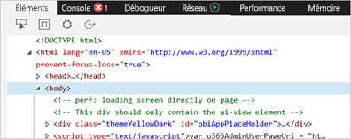
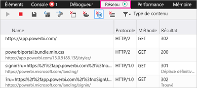
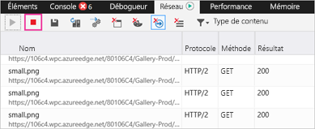
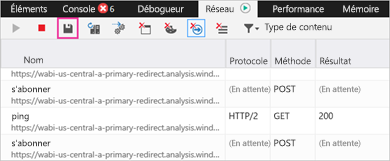

# Capturer des informations de diagnostic supplémentaires pour Power BI

Cet article donne les instructions pour collecter manuellement des informations de diagnostic supplémentaires à partir du client web Power BI.

1. Accédez à [Power BI](https://app.powerbi.com) avec Microsoft Edge ou Internet Explorer.

1. Appuyez sur **F12** pour ouvrir les outils de développement Microsoft Edge.

   

1. Sélectionnez l’onglet **Réseau**. Il répertorie le trafic capturé.

   

    Vous pouvez :

    * Parcourez la fenêtre et reproduisez les problèmes que vous pouvez rencontrer.

    * Masquez ou affichez la fenêtre Outils de développement à tout moment pendant la session en appuyant sur F12.

1. Pour arrêter le profilage de la session, il vous suffit de sélectionner le carré rouge sous l’onglet **Réseau** de la zone d’outils de développement.

   

1. Sélectionnez l’icône représentant une disquette pour exporter les données sous la forme de fichier d’archive HTTP (HAR).

   

1. Entrez un nom de fichier, puis enregistrez le fichier HAR.

    Ce dernier contient toutes les informations sur les demandes réseau entre la fenêtre du navigateur et Power BI, dont :

    * Les ID d’activité pour chaque demande.

    * L’horodatage précis pour chaque requête.

    * Toutes les informations d’erreur retournées au client.

    Ce suivi contient également les données utilisées pour renseigner les éléments visuels affichés à l’écran.

1. Vous pouvez fournir le fichier HAR à prendre en charge pour la révision.

D’autres questions ? [Essayez d’interroger la communauté Power BI](https://community.powerbi.com/)
