# Administration de Power BI dans le portail d’administration

Le portail d’administration vous permet de gérer les paramètres Power BI pour votre organisation. Le portail comprend notamment des métriques d’utilisation, un accès au Centre d’administration Microsoft 365 et des paramètres de l’abonné.

Le portail d’administration complet est accessible par les administrateurs généraux et les utilisateurs qui ont le rôle d’Administrateur de service Power BI. Si vous n’appartenez pas à l’un de ces rôles, seuls les **Paramètres de capacité** s’affichent sur le portail. Pour plus d’informations sur le rôle d’administrateur de Service Power BI, voir [Présentation du rôle d’administrateur Power BI](service-admin-role.md).

## Accès au portail d’administration

Vous devez être administrateur général ou administrateur de service Power BI pour accéder au portail Administrateur Power BI. Pour plus d’informations sur le rôle d’administrateur de Service Power BI, voir [Présentation du rôle d’administrateur Power BI](service-admin-role.md). Pour accéder au portail Administrateur Power BI, procédez comme suit :

1. Connectez-vous à [Power BI](https://app.powerbi.com) à l’aide des informations d’identification du compte administrateur.

1. Dans l’en-tête de page, sélectionnez **Paramètres** > **Portail Administrateur**.

    

Le portail d’administration contient plusieurs sections. Le reste de cet article fournit des informations sur chacune de ces sections.

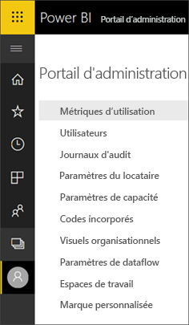

* [Métriques d’utilisation](#usage-metrics)
* [Utilisateurs](#users)
* [Journaux d’audit](#audit-logs)
* [Paramètres du locataire](#tenant-settings)
* [Paramètres de capacité](#capacity-settings)
* [Codes incorporés](#embed-codes)
* [Visuels organisationnels](organizational-visuals.md#organizational-visuals)
* [Connexions Azure (préversion)](#azure-connections-preview)
* [Espaces de travail](#workspaces)
* [Marque personnalisée](#custom-branding)
* [Mesures de protection](#protection-metrics)
* [Contenu proposé](#featured-content)

## Métriques d'utilisation

Les **Métriques d’utilisation** vous permettent de contrôler l’utilisation de Power BI dans votre organisation. Elles indiquent également les utilisateurs et les groupes de votre organisation qui sont les plus actifs dans Power BI.

> [!NOTE]
> La première fois que vous accédez au tableau de bord ou si vous y accédez de nouveau après une longue période, un écran de chargement s’affiche probablement pendant le chargement du tableau de bord.

Une fois le tableau de bord chargé, deux sections de mosaïques s’affichent. La première section comprend des données d’utilisation pour chacun des utilisateurs et la deuxième comporte des informations similaires pour les groupes.

Voici le détail de ce que vous pouvez voir dans chaque vignette :

* Le nombre de tableaux de bord, de rapports et de jeux de données de l’espace de travail utilisateur.
  
    

* Le tableau de bord le plus utilisé par nombre d’utilisateurs autorisés à y accéder. Par exemple : vous avez un tableau de bord partagé avec trois utilisateurs. Vous avez également ajouté le tableau de bord à un pack de contenu auquel deux utilisateurs différents se sont connectés. Le nombre du tableau de bord est de 6 (1 + 3 + 2).
  
    

* Le contenu auquel est connecté le plus grand nombre d’utilisateurs. Il peut s’agir de tout ce que les utilisateurs peuvent obtenir via le processus Obtenir des données, par exemple, des packs de contenu SaaS, des packs de contenu d’organisation, des fichiers ou des bases de données.

  
    

* Vue des utilisateurs les plus actifs, en fonction du nombre de tableaux de bord qu’ils possèdent, à la fois ceux qu’ils ont créés eux-mêmes et ceux qui ont été partagés avec eux.
  
    

* Vue des utilisateurs les plus actifs, en fonction du nombre de rapports qu’ils possèdent.
  
    

La deuxième section affiche le même type d’informations, mais pour les groupes. Cette section vous permet de savoir quels sont les groupes les plus actifs dans votre organisation et le type de contenu qu’ils utilisent.

Grâce à ces informations, vous pouvez avoir un aperçu de la façon dont les personnes utilisent Power BI au sein de votre organisation.

## Contrôler les métriques d’utilisation

Les rapports de métriques d’utilisation sont une fonctionnalité que l’administrateur Power BI ou l’administrateur général peut activer ou désactiver. Les administrateurs ont un contrôle granulaire sur l’accès des utilisateurs aux métriques d’utilisation. Ils sont **Activés** par défaut pour tous les utilisateurs de l’organisation.

Les administrateurs peuvent aussi déterminer si les créateurs de contenu peuvent voir les données par utilisateur dans les métriques d’utilisation. 

Pour plus d’informations sur les rapports eux-mêmes, consultez [Superviser les métriques d’utilisation de tableaux de bord et de rapports Power BI](../collaborate-share/service-usage-metrics.md).

### Métriques d'utilisation pour les créateurs de contenu

1. Dans le portail Administrateur, sélectionnez **Paramètres de l’abonné** > **Paramètres d’audit et d’utilisation** > **Métriques d’utilisations pour les créateurs de contenu**.

    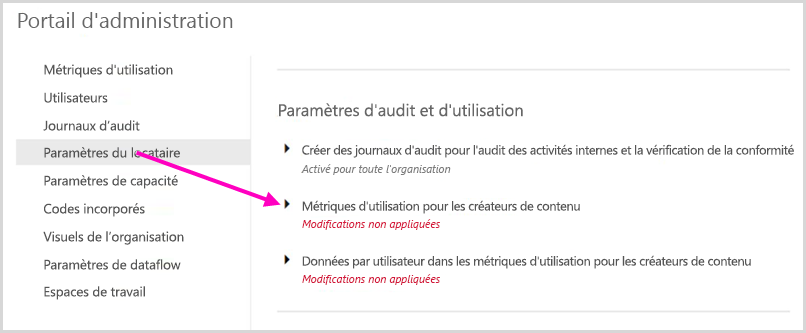

1. Activez (ou désactivez) les métriques d’utilisation > **Appliquer**.

    

### Données par utilisateur dans les métriques d'utilisation pour les créateurs de contenu

Par défaut, les données par utilisateur sont activées pour les métriques d’utilisation et les informations sur le compte sont incluses dans le rapport des mesures. Si vous ne souhaitez pas inclure ces informations sur le compte pour tout ou partie des utilisateurs, désactivez la fonctionnalité pour des groupes de sécurité spécifiés ou pour l’ensemble de l’organisation. Les informations de compte figurent alors dans le rapport sous l’intitulé *Sans nom*.

### Supprimer tous le contenu des métriques d’utilisation existantes

Lors de la désactivation des métriques d’utilisation pour leur organisation toute entière, les administrateurs peuvent également choisir une ou plusieurs options pour :

- **Supprimer tout le contenu des métriques d’utilisation** pour supprimer toutes les vignettes de rapports et de tableaux de bord existantes générées à l’aide de rapports et de jeux de données des métriques d’utilisation. Cette option supprime tout accès aux données de métriques d’utilisation pour tous les utilisateurs au sein de l’organisation qui peuvent déjà les utiliser.
- **Supprimer toutes les données existantes par utilisateur dans le contenu des métriques d’utilisation actuelles** afin de supprimer tout accès aux données par utilisateur pour tous les utilisateurs de l’organisation qui les utilisent peut-être déjà.

Soyez prudent, car la suppression du contenu de métriques existantes d’utilisation et par utilisateur est irréversible.

## Utilisateurs

Les utilisateurs, les groupes et les administrateurs Power BI sont gérés dans le Centre d’administration Microsoft 365. L’onglet **Utilisateurs** contient un lien qui donne accès au Centre Administrateur.

## Journaux d'audit

Les journaux d’audit Power BI sont gérés dans le Centre de sécurité et de conformité Office 365. L’onglet **Journaux d’audit** contient un lien qui donne accès au Centre de sécurité et de conformité. Pour en savoir plus, consultez [Suivre les activités utilisateur dans Power BI](service-admin-auditing.md).

Pour utiliser les journaux d’audit, vérifiez que le paramètre [**Créer des journaux d’audit pour l’audit et la conformité des activités internes**](#create-audit-logs-for-internal-activity-auditing-and-compliance) est activé.

## Paramètres du locataire

**Paramètres de l’abonné** fournit un contrôle affiné sur les fonctionnalités mises à la disposition de votre organisation. Si vous avez des inquiétudes à propos de vos données sensibles, il se peut que certaines de nos fonctionnalités ne soient pas adaptées à votre organisation. Vous pouvez aussi choisir de mettre à disposition une fonctionnalité déterminée à un groupe précis.

> [!NOTE]
> Les paramètres de l’abonné qui contrôlent la disponibilité des fonctionnalités dans l’interface utilisateur Power BI peuvent aider à établir des stratégies de gouvernance, mais ils ne constituent pas une mesure de sécurité. Par exemple, le paramètre **Exporter les données** ne limite pas les autorisations d’un utilisateur Power BI sur un jeu de données. Les utilisateurs Power BI disposant d’un accès en lecture à un jeu de données ont l’autorisation d’interroger ce jeu de données et peuvent conserver les résultats sans utiliser la fonctionnalité **Exporter les données** dans l’interface utilisateur de Power BI.

L’image suivante présente plusieurs paramètres de l’onglet **Paramètres du client**.

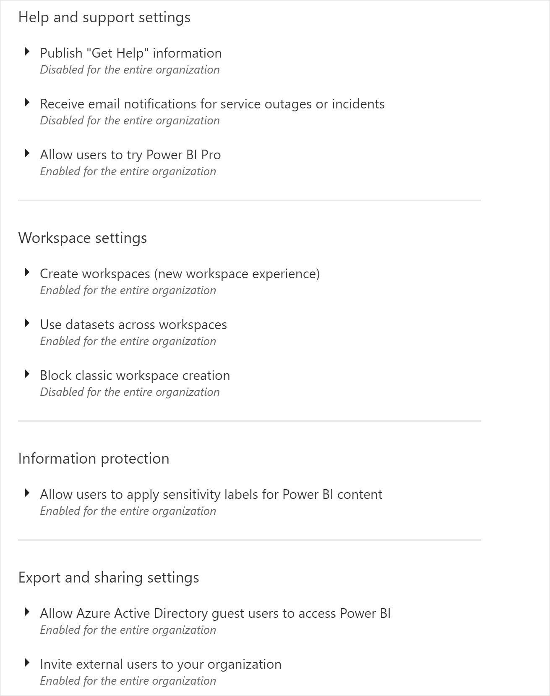

> [!NOTE]
> Jusqu’à 15 minutes peuvent être nécessaires à la prise en compte de la modification d’un paramètre pour tous les utilisateurs de votre organisation.

Les paramètres peuvent présenter un des trois états suivants :

* **Désactivé pour toute l’organisation** : Personne dans votre organisation ne peut utiliser cette fonctionnalité.

    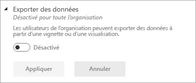

* **Activé pour toute l’organisation** : Tout le monde dans votre organisation peut utiliser cette fonctionnalité.

    

* **Activé pour une partie de l’organisation** : certains groupes de sécurité de votre organisation sont autorisés à utiliser cette fonctionnalité.

    Vous pouvez activer la fonctionnalité pour toute votre organisation, **Excepter aux groupes de sécurité spécifiques**.

    

    Vous pouvez aussi combiner des paramètres afin de n’activer que la fonctionnalité pour un groupe d’utilisateurs spécifique, mais aussi la désactiver pour un autre groupe d’utilisateurs. Cette approche permet de faire en sorte que certains utilisateurs n’aient pas accès à la fonctionnalité, même s’ils se trouvent dans le groupe autorisé. Le paramètre le plus restrictif pour un utilisateur s’applique.

    

Les sections suivantes fournissent une vue d’ensemble des différents types de paramètres de locataire.

## Paramètres d’aide et de support

### Publier des informations « Obtenir de l’aide »

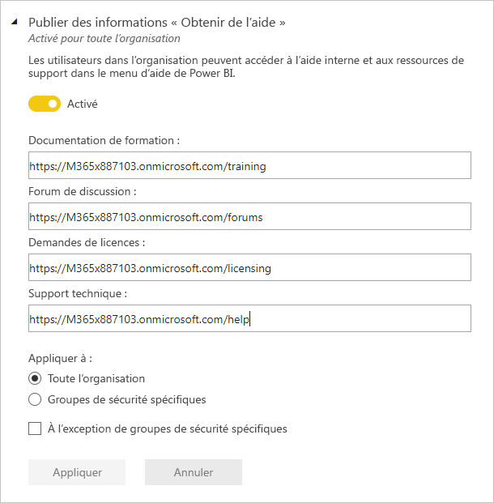

Les administrateurs peuvent spécifier des URL internes pour remplacer la destination des liens dans le menu aide de Power BI et pour les mises à niveau de licence. Si des URL personnalisées sont définies, les utilisateurs de l’organisation accèdent aux ressources d’aide et de support internes au lieu des destinations par défaut. Les destinations de ressources suivantes peuvent être personnalisées :

* **Learn**. Par défaut, ce lien de menu d’aide cible une [liste de tous nos parcours d’apprentissage et modules Power BI](/learn/browse/?products=power-bi). Pour diriger ce lien vers des ressources de formation internes, définissez plutôt une URL personnalisée pour la **Documentation de formation**.

* **Communauté**. Pour transférer les utilisateurs vers un forum interne à partir du menu d’aide, plutôt que vers la [Communauté Power BI](https://community.powerbi.com/), définissez une URL personnalisée pour le **Forum de discussion**.

* **Mises à niveau des licences**. Les utilisateurs disposant d’une licence Power BI (gratuite) peuvent avoir la possibilité de mettre à niveau leur compte vers Power BI Pro lors de l’utilisation du service. Si vous spécifiez une URL interne pour les **requêtes de licences**, vous redirigez les utilisateurs vers un flux interne de requêtes et d’achats et vous empêchez l’achat en libre-service. Si vous souhaitez empêcher les utilisateurs d’acheter des licences, mais que les utilisateurs peuvent démarrer une évaluation gratuite de Power BI Pro, consultez [Autoriser les utilisateurs à essayer Power BI Pro](#allow-users-to-try-power-bi-pro) pour séparer les expériences d’achat et de test.

* **Obtenir de l’aide**. Pour transférer les utilisateurs vers un forum interne à partir du menu d’aide, plutôt que vers le [Support Power BI](https://powerbi.microsoft.com/support/), définissez une URL personnalisée pour le **Support technique**.

### Recevoir des notifications par e-mail pour les pannes ou incidents du service

Les groupes de sécurité à extension messagerie reçoivent des notifications par e-mail si ce locataire est affecté par une panne ou un incident du service. En savoir plus sur les [notifications d’interruption de service](service-interruption-notifications.md).

### Autoriser les utilisateurs à essayer Power BI Pro

Le paramètre **Autoriser les utilisateurs à essayer Power BI Pro** est activé par défaut. Il augmente votre contrôle sur la façon dont les utilisateurs acquièrent des licences Power BI Pro. Dans les scénarios où vous avez bloqué l’achat en libre-service, ce paramètre permet aux utilisateurs de démarrer une évaluation gratuite de Power BI Pro. L’expérience de l’utilisateur final dépend de la façon dont vous combinez les paramètres de licence. Le tableau ci-dessous montre comment l’expérience de mise à niveau de Power BI (gratuite) à Power BI Pro est affectée par différentes combinaisons de paramètres :

| Paramètre d’achat en libre-service | Autoriser les utilisateurs à essayer le paramètre Power BI Pro | Expérience de l’utilisateur final |
| ------ | ------ | ----- |
| activé | Désactivé | L’utilisateur peut acheter une licence Pro, mais ne peut pas démarrer une évaluation gratuite |
| activé | activé | L’utilisateur peut démarrer une évaluation gratuite de Pro et peut effectuer une mise à niveau vers une licence payante |
| Désactivé | Désactivé | L’utilisateur voit un message lui demandant de contacter l’administrateur informatique pour demander une licence |
| Désactivé | activé | L’utilisateur peut démarrer une évaluation gratuite de Pro, mais il doit contacter l’administrateur informatique pour obtenir une licence payante |

> [!NOTE]
> Vous pouvez ajouter une URL interne pour les demandes de licences dans [Paramètres d’aide et de support](#help-and-support-settings). Si vous définissez l’URL, elle remplace l’expérience d’achat en libre-service par défaut. Elle ne redirige pas l’inscription à un essai de la licence Power BI Pro. Les utilisateurs qui peuvent acheter une licence dans les scénarios décrits dans le tableau ci-dessus sont redirigés vers votre URL interne.

Pour en savoir plus, consultez [Activer ou désactiver l’inscription et l’achat en libre-service](service-admin-disable-self-service.md).

## Paramètres de l’espace de travail

Dans **Paramètres de l’abonné**, le portail Administrateur comporte deux sections pour le contrôle des espaces de travail :

- [Créer les nouvelles expériences d'espace de travail](#create-the-new-workspaces).
- [Utiliser des jeux de données entre des espaces de travail](#use-datasets-across-workspaces).
- [Bloquer la création de l’espace de travail classique](#block-classic-workspace-creation).

### Créer de nouveaux espaces de travail

Les espaces de travail sont des endroits où les utilisateurs collaborent sur des tableaux de bord, des rapports et d’autres contenus. Les administrateurs utilisent le paramètre **Créer des espaces de travail (nouvelle expérience d’espace de travail)** pour indiquer quels utilisateurs de l’organisation peuvent créer des espaces de travail. Les administrateurs peuvent autoriser tout le monde ou personne dans une organisation à créer des espaces de travail avec la nouvelle expérience d’espace de travail. Il peuvent également limiter la création aux membres de groupes de sécurité spécifiques. En savoir plus sur les [espaces de travail](../collaborate-share/service-new-workspaces.md)

:::image type="content" source="media/service-admin-portal/power-bi-admin-workspace-settings.png" alt-text="Créer les nouvelles expériences d'espace de travail":::

Pour les espaces de travail classiques basés sur les groupes Microsoft 365, l’administration continue à s’effectuer dans le portail d’administration Microsoft 365 et Azure Active Directory.

> [!NOTE]
> Par défaut, le paramètre **Créer des espaces de travail (nouvelle expérience d’espace de travail)** est défini pour autoriser uniquement les utilisateurs pouvant créer des groupes Microsoft 365 à créer les nouveaux espaces de travail Power BI. Veillez à définir une valeur dans le portail d’administration Power BI pour garantir que les utilisateurs appropriés peuvent les créer.

**Liste des espaces de travail**

Le portail d’administration comporte une autre section de paramètres sur les espaces de travail dans votre locataire. Dans cette section, vous pouvez trier et filtrer la liste des espaces de travail et afficher les détails de chaque espace de travail. Pour plus d’informations, consultez [Espaces de travail](#workspaces), plus loin dans cet article.

**Publier des packs de contenu et des applications**

Dans le portail d’administration, vous contrôlez également les utilisateurs qui disposent des autorisations nécessaires pour distribuer des applications à l’organisation. Consultez la section [Publier des packs de contenu et des applications pour toute l’organisation](#publish-content-packs-and-apps-to-the-entire-organization) de cet article pour plus de détails.

### Utiliser des jeux de données entre des espaces de travail

Les administrateurs peuvent contrôler les utilisateurs de l’organisation qui peuvent utiliser des jeux de données dans les espaces de travail. Quand ce paramètre est activé, les utilisateurs ont toujours besoin de l’autorisation de build requise pour un jeu de données spécifique.

:::image type="content" source="media/service-admin-portal/power-bi-admin-datasets-workspaces.png" alt-text="Créer les nouvelles expériences d'espace de travail":::

Pour plus d’informations, consultez [Initiation aux jeux de données sur plusieurs espaces de travail](../connect-data/service-datasets-across-workspaces.md).

### Bloquer la création de l’espace de travail classique

Les administrateurs peuvent contrôler si l’organisation peut créer des espaces de travail classiques. Quand ce paramètre est activé, les utilisateurs qui créent un espace de travail peuvent uniquement créer des espaces de travail d’expérience d’espace de travail. 

Quand ils sont activés, les nouveaux groupes Office 365 ne s’affichent pas dans la liste des espaces de travail Power BI. Les espaces de travail classiques existants continuent à être affichés dans la liste. Quand le paramètre est désactivé, tous les groupes Office 365 dont l’utilisateur est membre s’affichent dans la liste des espaces de travail. Découvrez plus d’informations sur les [nouveaux espaces de travail d’expérience d’espace de travail](../collaborate-share/service-new-workspaces.md).

## Paramètres d'exportation et de partage

### Autoriser les utilisateurs invités Azure Active Directory à accéder à Power BI

L’activation de ce paramètre permet aux utilisateurs invités à Azure Active Directory Business-to-Business (Azure AD B2B) d’accéder à Power BI. Si vous désactivez ce paramètre, les utilisateurs invités reçoivent une erreur lorsqu’ils tentent d’accéder à Power BI. Le désactiver pour l’ensemble de l’organisation permet également d’empêcher les utilisateurs de convier des invités à votre organisation. Utilisez l’option Groupes de sécurité spécifiques pour contrôler les utilisateurs invités qui peuvent accéder à Power BI.

### Inviter des utilisateurs externes dans votre organisation 

Le paramètre **Inviter des utilisateurs externes dans votre organisation** permet aux organisations de déterminer si de nouveaux utilisateurs externes peuvent être invités dans l’organisation par le biais des expériences d’autorisations et de partage Power BI. S’il est désactivé, il n’est pas possible d’ajouter à l’organisation un utilisateur externe qui n’est pas déjà un utilisateur invité de l’organisation par le biais de Power BI.

> [!IMPORTANT]
> Ce paramètre était précédemment appelé « Partager du contenu avec des utilisateurs externes ». Le nom modifié reflète de manière plus précise l’action du paramètre.

Pour inviter des utilisateurs externes dans votre organisation, un utilisateur a également besoin du rôle Inviteur d’invités Azure Active Directory. Ce paramètre contrôle uniquement la possibilité d’inviter par le biais de Power BI. 

### Publier sur le web

En tant qu’administrateur d’un locataire Power BI, le paramètre **Publier sur le web** vous propose des options pour lesquelles les utilisateurs peuvent créer des codes incorporés pour publier des rapports sur le web. Cette fonctionnalité rend le rapport et ses données accessibles à n’importe qui sur le web. Découvrez plus d’informations sur la [publication sur le web](../collaborate-share/service-publish-to-web.md).

> [!NOTE]
> Seul les administrateurs Power BI peuvent autoriser la création de codes incorporés « Publier sur le web ». Les organisations peuvent avoir des codes incorporés existants. Consultez la section [Codes incorporés](service-admin-portal.md#embed-codes) du portail d’administration pour passer en revue les rapports actuellement publiés.

L’image suivante montre le menu **Plus d’options (...)** pour un rapport quand le paramètre **Publier sur le web** est activé.

Le paramètre **Publier sur le web** du portail d’administration fournit des options pour lesquelles les utilisateurs peuvent créer des codes incorporés.

Les administrateurs peuvent définir **Publier sur le web** sur **Activé** et **Choisir le mode de fonctionnement des codes incorporés** sur **Autoriser seulement les codes incorporés existants**. Dans ce cas, les utilisateurs peuvent créer des codes incorporés, mais ils doivent contacter l’administrateur Power BI pour les y autoriser.

Les options présentées aux utilisateurs dans l’interface utilisateur varient en fonction de la nature du paramètre **Publier sur le web**.

|Caractéristique |Activée pour toute l’organisation |Désactivée pour toute l’organisation |Groupes de sécurité spécifiques   |
|---------|---------|---------|---------|
|**Publier sur le web** sous le menu **Plus d’options (...)** d’un rapport|Activée pour tous|Non visible pour tous|Visible uniquement par les utilisateurs ou groupes autorisés.|
|**Gérer les codes d’incorporation** sous **Paramètres**|Activée pour tous|Activée pour tous|Activée pour tous  Option * **Supprimer** uniquement pour les utilisateurs ou groupes autorisés. * **Obtenir les codes** activé pour tous.|
|**Codes d’incorporation** au sein du portail d’administration|L’état reflète l’une des options suivantes : * Actif * Non pris en charge * Bloqué|L’état affiche **Désactivé**|L’état reflète l’une des options suivantes : * Actif * Non pris en charge * Bloqué  Si un utilisateur n’est pas autorisé en fonction du paramètre de locataire, l’état indique **Enfreint**.|
|Rapports publiés existants|Tout activé|Tout désactivé|Les rapports continuent à être restitués pour tous.|

### Exporter des données

Les utilisateurs de l’organisation peuvent exporter des données à partir d’une vignette ou d’une visualisation. Ce paramètre contrôle la fonction Analyser dans Excel, l’exportation au format .csv, le téléchargement de jeux de données (.pbix) et les fonctionnalités Live Connect du service Power BI. Découvrez-en plus sur l’[exportation de données à partir d’une vignette ou d’un visuel](../visuals/power-bi-visualization-export-data.md).

>[!NOTE]
> Avant l’introduction du paramètre Exporter vers Excel, ce paramètre contrôlait également l’exportation des données vers des fichiers Excel. Pour plus d’informations, consultez la [remarque sous Exporter vers Excel](#export-to-excel).

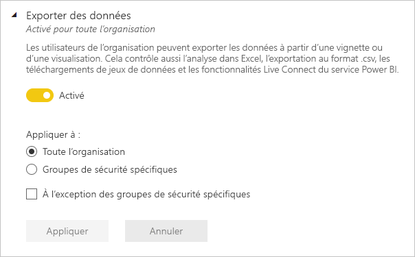

L’image suivante présente l’option d’exportation de données à partir d’une vignette.

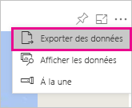

> [!NOTE]
> La désactivation du paramètre **Exporter des données** empêche également les utilisateurs d’utiliser la fonctionnalité [Analyser dans Excel](../collaborate-share/service-analyze-in-excel.md) ainsi que la connexion active du service Power BI.

### Exporter vers Excel

Les utilisateurs de l’organisation peuvent exporter les données à partir d’une visualisation dans un fichier Excel.

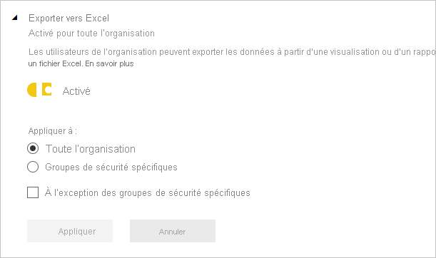

>[!IMPORTANT]
> Avant l’introduction du paramètre Exporter vers Excel, l’exportation vers un fichier Excel était contrôlée par le paramètre Exportation des données. Ainsi, sur les locataires qui existaient avant l’introduction du paramètre Exporter vers Excel, la première fois que les administrateurs de locataires regardent le paramètre Exporter vers Excel, ils voient la présence de *modifications non appliquées*. Ils doivent appliquer ces modifications pour que le nouveau paramètre prenne effet. Dans le cas contraire, l’exportation vers un fichier Excel continue d’être contrôlée par le paramètre Exporter des données.

### Exporter les rapports comme présentations PowerPoint ou documents PDF

Les utilisateurs de l’organisation peuvent exporter des rapports Power BI sous forme de fichiers PowerPoint ou de documents PDF. [En savoir plus](../consumer/end-user-powerpoint.md)

L’image suivante présente le menu **Fichier** qui s’affiche pour un rapport quand le paramètre **Exporter les rapports comme présentations PowerPoint ou documents PDF** est activé.

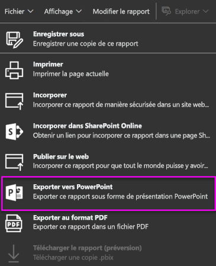

### Imprimer des tableaux de bord et des rapports

Les utilisateurs de l’organisation peuvent imprimer des tableaux de bord et des rapports. [En savoir plus](../consumer/end-user-print.md)

L’image suivante présente l’option d’impression d’un tableau de bord.

L’image suivante présente le menu **Fichier** qui s’affiche pour un rapport quand le paramètre **Imprimer des tableaux de bord et des rapports** est activé.

### Autoriser les utilisateurs invités externes à modifier et à gérer le contenu de l’organisation

Les utilisateurs invités Azure AD B2B peuvent modifier et gérer le contenu de l’organisation. [En savoir plus](service-admin-azure-ad-b2b.md)

L’image suivante présente l’option permettant d’autoriser les utilisateurs invités externes à modifier et à gérer le contenu de l’organisation.

Dans le portail d’administration, vous contrôlez également les utilisateurs qui disposent des autorisations nécessaires pour inviter des utilisateurs externes à l’organisation. Pour plus d’informations, consultez [Partager du contenu avec des utilisateurs externes](#export-and-sharing-settings) dans cet article.

### Abonnements par e-mail
Les utilisateurs de l'organisation peuvent créer des abonnements par courrier. En savoir plus sur les [abonnements](../collaborate-share/service-publish-to-web.md).

### Contenu proposé

Autorisez certains ou tous les auteurs de rapports de votre organisation à présenter leur contenu dans la section À la une de la page d’accueil Power BI. Les nouveaux utilisateurs verront le contenu proposé en haut de leur page d’accueil Power BI. Le contenu proposé descend dans la page d’accueil à mesure que les utilisateurs ajoutent des éléments **favoris**, **fréquents** et **récents**. 

Nous vous recommandons de commencer avec un ensemble réduit d’approbateurs. Permettre à l’ensemble de l’organisation de présenter du contenu dans la page d’accueil peut compliquer le suivi de tout le contenu promu. 

Une fois que vous avez activé le contenu proposé, vous pouvez également le gérer dans le portail d’administration. Consultez [Gérer le contenu proposé](#manage-featured-content) dans cet article pour en savoir plus sur le contrôle du contenu proposé dans votre domaine.

## Paramètres des applications et des packs de contenu

### Publier des packs de contenu et des applications pour toute l’organisation

Les administrateurs utilisent ce paramètre pour décider si les utilisateurs peuvent publier des packs de contenu et des applications pour toute l’organisation, plutôt que pour des groupes spécifiques. En savoir plus sur la [publication d’applications](../collaborate-share/service-create-distribute-apps.md).

L’image suivante montre l’option **Toute mon organisation** lors de la création d’un pack de contenu.

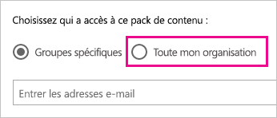

### Créer des modèles d’applications et des packs de contenu d’organisation

Les utilisateurs peuvent créer des modèles d’applications et des packs de contenu d’organisation qui utilisent des jeux de données basés sur une même source de données dans Power BI Desktop. En savoir plus sur les [applications modèles](../connect-data/service-template-apps-create.md).

### Effectuer une transmission de type push des applications pour les utilisateurs finaux

Les auteurs de rapports peuvent partager directement des applications avec les utilisateurs finaux sans installation à partir d’[AppSource](https://appsource.microsoft.com). En savoir plus sur l’[installation automatique d’applications pour les utilisateurs finaux](../collaborate-share/service-create-distribute-apps.md#automatically-install-apps-for-end-users).

## Paramètres d’intégration

### Utiliser Analyser dans Excel avec des jeux de données locaux

Les utilisateurs de l’organisation peuvent utiliser Excel pour afficher et interagir avec des jeux de données Power BI locaux. [En savoir plus](../collaborate-share/service-analyze-in-excel.md)

> [!NOTE]
> La désactivation du paramètre **Exporter des données** empêche également les utilisateurs d’utiliser la fonctionnalité **Analyser dans Excel**.

### Utiliser ArcGIS Maps for Power BI

Les utilisateurs de l’organisation peuvent utiliser la visualisation ArcGIS Maps for Power BI fournie par Esri. [En savoir plus](../visuals/power-bi-visualization-arcgis.md)

### Utiliser la recherche générale pour Power BI (préversion)

Les utilisateurs de l’organisation peuvent utiliser les fonctionnalités de recherche externe qui reposent sur le service Recherche Azure.

## Paramètres de tables recommandés

Sous **Tenant settings**, le paramètre **Allow connections to featured tables** permet aux administrateurs Power BI de contrôler qui, dans l’organisation, peut utiliser des tables proposées dans la Galerie de types de données Excel. 

:::image type="content" source="media/service-admin-portal/admin-allow-connections-featured-tables.png" alt-text="Créer les nouvelles expériences d'espace de travail":::

Les connexions aux tables proposées sont également désactivées si le paramètre locataire **Exporter des données** est défini sur **Désactivé**.

En savoir plus sur [les tables Power BI dans Excel](../collaborate-share/service-excel-featured-tables.md).

## Paramètre client Partager dans Teams

Le paramètre **Partager dans Teams** se trouve dans la section **Paramètres du client** du portail d’administration Power BI. Le paramètre permet aux organisations de masquer les boutons **Partager dans Teams** dans le service Power BI. Quand l’option est désactivée, les utilisateurs ne voient pas les boutons **Partager dans Teams** dans la barre d’action ou les menus contextuels quand ils affichent des rapports et tableaux de bord dans le service Power BI.

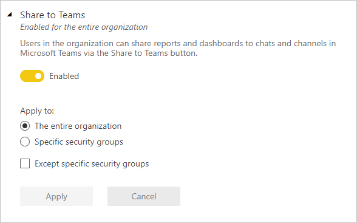

Découvrez plus d’informations sur le [partage de contenu Power BI dans Teams](../collaborate-share/service-share-report-teams.md).

## Paramètres des visuels R

### Utiliser et partager des éléments visuels R

Les utilisateurs de l’organisation peuvent manipuler et partager des visuels créés avec des scripts R. [En savoir plus](../visuals/service-r-visuals.md)

> [!NOTE]
> Ce paramètre s’applique à toute l’organisation et ne peut pas être limité à des groupes en particulier.

## Paramètres d'audit et d'utilisation

### Créer des journaux d'audit pour l'audit des activités internes et la vérification de la conformité

Les utilisateurs de l’organisation peuvent utiliser l’audit pour surveiller les actions effectuées dans Power BI par d’autres utilisateurs de l’organisation. [En savoir plus](service-admin-auditing.md)

Ce paramètre doit être activé pour pouvoir enregistrer les entrées du journal d’audit. Une fois que vous avez activé l’audit, le délai avant de pouvoir voir les données d’audit peut aller jusqu’à 48 heures. Si vous ne voyez immédiatement les données, consultez les journaux d’audit plus tard. Le délai est sensiblement le même entre le moment où vous obtenez l’autorisation de voir les journaux d’audit et le moment où vous pouvez réellement y accéder.

> [!NOTE]
> Ce paramètre s’applique à toute l’organisation et ne peut pas être limité à des groupes en particulier.

### Métriques d'utilisation pour les créateurs de contenu

Les utilisateurs de l’organisation peuvent voir les métriques d’utilisation des tableaux de bord et des rapports qu’ils créent. [En savoir plus](../collaborate-share/service-usage-metrics.md)

### Données par utilisateur dans les métriques d'utilisation pour les créateurs de contenu

Les métriques d'utilisation pour créateurs de contenu exposent les noms d'affichage et les adresses e-mail des utilisateurs qui accèdent à du contenu. [En savoir plus](../collaborate-share/service-usage-metrics.md)

Par défaut, les données par utilisateur sont activées pour les métriques d’utilisation et les informations des comptes de créateur de contenu sont incluses dans le rapport des métriques. Si vous ne souhaitez pas recueillir ces informations pour tous les utilisateurs, vous pouvez désactiver la fonctionnalité pour des groupes de sécurité spécifiés ou pour l’ensemble de l’organisation. Les informations de compte des utilisateurs exclus figurent alors dans le rapport sous l’intitulé *Sans nom*.

## Paramètres du tableau de bord

### Classification des données des tableaux de bord

Les utilisateurs de l’organisation peuvent étiqueter les tableaux de bord avec des classifications indiquant les niveaux de sécurité des tableaux de bord. [En savoir plus](../create-reports/service-data-classification.md)

> [!NOTE]
> Ce paramètre s’applique à toute l’organisation et ne peut pas être limité à des groupes en particulier.

## Paramètres de développement

### Incorporer du contenu dans les applications

Les utilisateurs de l’organisation peuvent incorporer des tableaux de bord et des rapports Power BI dans des applications Saas (Software as a Service). La désactivation de ce paramètre empêche les utilisateurs d’utiliser les API REST pour incorporer du contenu Power BI dans leur application. [En savoir plus](../developer/embedded/embedding.md)

### Autoriser les principaux de service à utiliser les API Power BI

Les applications web inscrites dans Azure Active Directory (Azure AD) utiliseront un principal de service affecté pour accéder aux API Power BI sans utilisateur connecté. Pour pouvoir autoriser une application à utiliser l'authentification du principal de service, ce dernier doit faire partie d'un groupe de sécurité autorisé. [En savoir plus](../developer/embedded/embed-service-principal.md)

> [!NOTE]
> Les principaux de service héritent des autorisations de leur groupe de sécurité pour tous les paramètres du locataire Power BI. Pour limiter les autorisations, créez un groupe de sécurité dédié pour les principaux de service et ajoutez-le à la liste « À l’exception des groupes de sécurité spécifiques » pour les paramètres Power BI pertinents activés.

## Paramètres de dataflow

### Créer et utiliser des dataflows

Les utilisateurs de l'organisation peuvent créer et utiliser des dataflows. Pour une vue d’ensemble des dataflows, consultez [Préparation des données en libre-service dans Power BI](../transform-model/service-dataflows-overview.md). Pour activer les dataflows dans une capacité Premium, consultez [Configurer des charges de travail](service-admin-premium-workloads.md).

> [!NOTE]
> Ce paramètre s’applique à toute l’organisation et ne peut pas être limité à des groupes en particulier.

## Paramètres des applications modèles

Trois paramètres contrôlent la capacité des applications modèles à publier ou installer des applications modèles.

### Publier des applications modèles

Les utilisateurs de l'organisation peuvent créer des espaces de travail d’applications modèles. Choisissez quels utilisateurs peuvent publier des applications modèles ou les distribuer à des clients extérieurs à votre organisation via [AppSource](https://appsource.microsoft.com) ou d’autres méthodes de distribution.

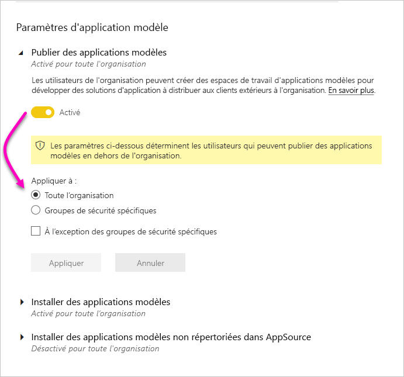

### Installer des applications modèles répertoriées sur AppSource

Les utilisateurs de l’organisation peuvent télécharger et installer des applications modèles **uniquement** depuis [AppSource](https://appsource.microsoft.com). Choisissez quels utilisateurs spécifiques ou groupes de sécurité peuvent installer des applications modèles depuis AppSource.

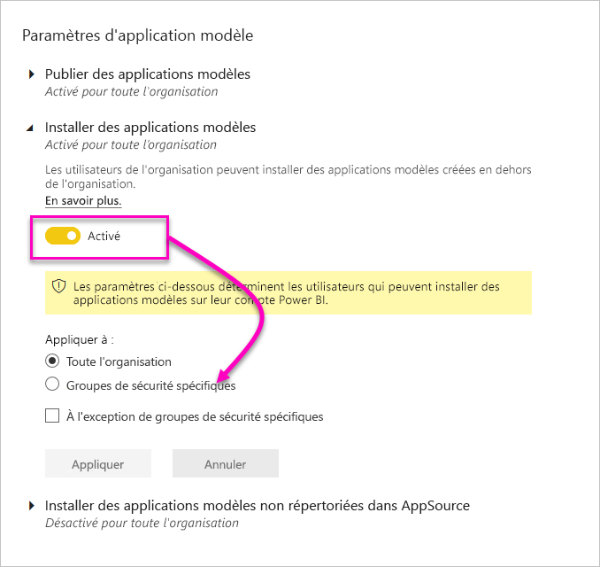

### Installer des applications modèles non répertoriées sur AppSource

Choisissez quels utilisateurs dans l’organisation peuvent télécharger et installer des applications modèles **non répertoriées sur [AppSource](https://appsource.microsoft.com)** .

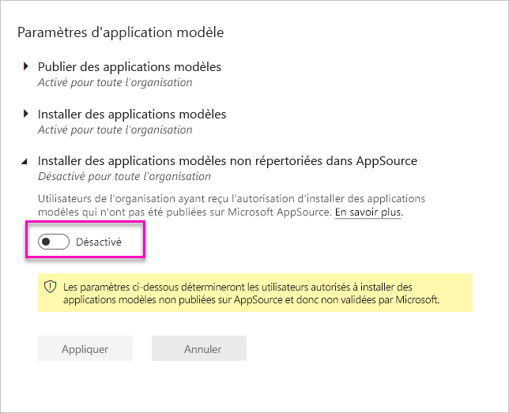

## Paramètres de capacité

### Power BI Premium

L’onglet **Power BI Premium** vous permet de gérer les capacités Power BI Premium (EM ou SKU P) achetées pour votre organisation. Tous les utilisateurs dans votre organisation peuvent voir l’onglet **Power BI Premium**, mais ne peuvent en voir le contenu que s’ils disposent d’autorisations *d’administrateur de capacité* ou d’autorisations d’affectation. Si un utilisateur ne possède aucune autorisation, le message suivant apparaît.

### Power BI Embedded

L’onglet **Power BI Embedded** vous permet d’afficher les capacités de Power BI Embedded (référence SKU A) que vous avez achetées pour votre client. Dans la mesure où vous ne pouvez acheter des références SKU A qu’à partir d’Azure, vous [gérez les capacités incorporées dans Azure](../developer/embedded/azure-pbie-create-capacity.md) depuis **le portail Azure**.

Pour plus d’informations sur la gestion des paramètres de Power BI Embedded (référence SKU A), consultez [Qu’est-ce que Power BI Embedded](../developer/embedded/azure-pbie-what-is-power-bi-embedded.md).

## Codes incorporés

En tant qu’administrateur, vous pouvez afficher les codes incorporés générés pour votre tenant pour partager publiquement les rapports. Vous pouvez également révoquer ou supprimer des codes. [En savoir plus](../collaborate-share/service-publish-to-web.md)

## Visuels organisationnels

Tous les paramètres d’administration d’éléments visuels Power BI, y compris les paramètres de l’abonné des éléments visuels Power BI, sont décrits dans [Gérer les paramètres d’administration des éléments visuels Power BI](organizational-visuals.md).

## Connexions Azure (préversion)

### Stockage au niveau de l’abonné (préversion)

Par défaut, les données utilisées avec Power BI sont stockées dans le stockage interne offert par Power BI. Avec l’intégration entre les flux de données et Azure Data Lake Storage Gen2 (ADLS Gen2), vous pouvez stocker vos flux de données dans le compte Azure Data Lake Storage Gen2 de votre organisation. Pour plus d’informations, consultez [Flux de données et intégration à Azure Data Lake (préversion)](../transform-model/service-dataflows-azure-data-lake-integration.md).

### Autorisations de stockage au niveau de l’espace de travail (préversion)

Par défaut, les administrateurs des espaces de travail ne peuvent pas se connecter à leur propre compte de stockage. Cette fonctionnalité d’évaluation vous permet d’activer un paramètre qui autorise les administrateurs de l’espace de travail à se connecter à leur propre compte de stockage.

## Workspaces

En tant qu’administrateur, vous pouvez afficher les espaces de travail qui existent dans votre abonné sur l’onglet **Espaces de travail**. Dans cet onglet, vous pouvez effectuer les actions suivantes :

- actualiser la liste des espaces de travail et leurs détails,
- exporter les données relatives aux espaces de travail dans un fichier .csv, 
- consulter les détails relatifs à un espace de travail, y compris son ID, ses utilisateurs et ses rôles, ainsi que ses tableaux de bord, rapports et jeux de données,
- modifier la liste des personnes qui y ont accès. Cela signifie que vous pouvez supprimer l’espace de travail. Vous pouvez vous ajouter à un espace de travail en tant qu’administrateur, puis ouvrir l’espace de travail et le supprimer.
- Modifiez les champs Nom et Description.

Les administrateurs peuvent également contrôler la capacité des utilisateurs à créer de nouveaux espaces de travail, des espaces de travail d’expérience et des espaces de travail classiques. Pour plus d’informations, consultez [Paramètres des espaces de travail](#workspace-settings), dans cet article. 

Les colonnes de la table de l’onglet**Espaces de travail** correspondent aux propriétés retournées par l’[API REST administrateur Power BI](/rest/api/power-bi/admin) pour les espaces de travail. Les espaces de travail personnels sont de type **PersonalGroup**, les espaces de travail classiques sont de type **Group**, et les nouveaux espaces de travail modernes sont de type **Workspace**. Pour plus d’informations, consultez [Organiser le travail dans les nouveaux espaces de travail](../collaborate-share/service-new-workspaces.md).

Sous l’onglet **Espaces de travail**, vous voyez l’*état* pour chaque espace de travail. Le tableau suivant fournit plus de détails sur la signification de ces états.

|État  |Description  |
|---------|---------|
| **Actif** | Un espace de travail normal. Il n’indique rien sur l’utilisation ou ce qui se trouve à l’intérieur, mais seulement le fait que l’espace de travail lui-même est « normal ». |
| **Orphelin** | Un espace de travail sans administrateur. |
| **Supprimé** | Un espace de travail supprimé. Pendant un délai pouvant atteindre 90 jours, nous conservons suffisamment de métadonnées pour restaurer l’espace de travail si nécessaire. |
| **Suppression** | Un espace de travail en cours de suppression, mais qui n’est pas encore supprimé. Les utilisateurs peuvent supprimer leurs propres espaces de travail, en plaçant les éléments en Suppression, puis en Supprimé. |

Les administrateurs peuvent également gérer et récupérer des espaces de travail à l’aide du portail d’administration ou des applets de commande PowerShell. 

## Marque personnalisée

En tant qu’administrateur, vous pouvez personnaliser l’apparence de Power BI pour l’ensemble de votre organisation. Actuellement, il existe trois options principales :

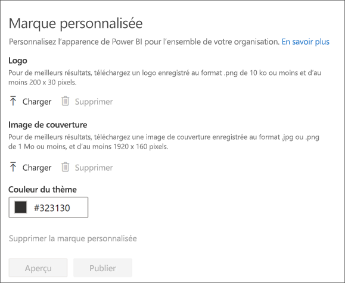

* **Télécharger le logo** : Pour de meilleurs résultats, téléchargez un logo enregistré au format .png de 10 ko ou moins et d’au moins 200 x 30 pixels.

* **Télécharger l’image de couverture** : Pour de meilleurs résultats, téléchargez une image de couverture enregistrée au format .jpg ou .png de 1 Mo ou moins, et d’au moins 1920 x 160 pixels.

* **Sélectionner la couleur du thème** : Vous pouvez sélectionner votre thème en fonction d’une valeur hexadécimale #, RVB ou de la palette fournie.

Pour plus d’informations, consultez [Marque personnalisée pour votre organisation](https://aka.ms/orgBranding).

## Mesures de protection

Une fois que vous avez activé la protection des informations pour Power BI, les mesures de protection des données sont affichées dans le portail Administrateur. Le rapport montre comment les étiquettes de confidentialité contribuent à protéger votre contenu.

## Gérer le contenu proposé

En tant qu’administrateur de locataire, vous pouvez gérer tous les rapports, les tableaux de bord et les applications qui ont été promus dans la section À la une de la page d’accueil Power BI à l’échelle de votre organisation.

- Dans le portail d’administration, sélectionnez **Contenu proposé**.

Vous y trouverez ici une vue d’ensemble des personnes qui ont proposé le contenu, du moment où il a été proposé et de toutes les métadonnées qui s’y rapportent. Si quelque chose semble suspect ou si vous souhaitez nettoyer la section À la une, vous pouvez supprimer le contenu promu en fonction des besoins.

Consultez [Contenu proposé](#featured-content) dans cet article pour obtenir des informations sur l’activation du contenu proposé.

## Étapes suivantes

[Administration de Power BI dans votre organisation](service-admin-administering-power-bi-in-your-organization.md)  
[Présentation du rôle d’administrateur Power BI](service-admin-role.md)  
[Audit de Power BI dans votre organisation](service-admin-auditing.md)  

D’autres questions ? [Essayez d’interroger la communauté Power BI](https://community.powerbi.com/)