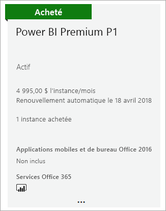
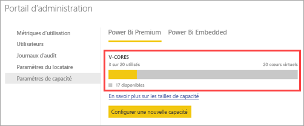
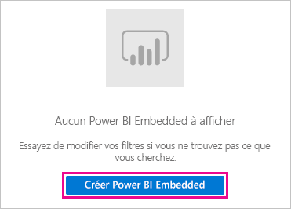
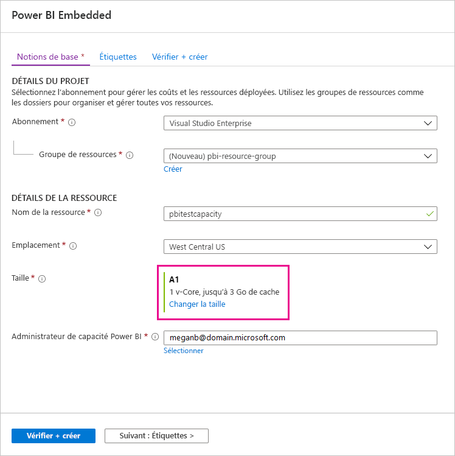

# Acheter Power BI Premium

Cet article explique comment acheter de la capacité Power BI Premium pour votre organisation. L’article décrit deux scénarios :

- L’utilisation de références SKU P pour les scénarios de production classiques. Les références SKU P nécessitent un engagement mensuel ou annuel et donnent lieu à une facturation mensuelle.

- L’utilisation de références SKU A pour les scénarios de test ou dans les cas où vous n’avez pas les autorisations nécessaires pour acheter des références SKU P (rôle Administrateur général Microsoft 365 ou rôle Administrateur de facturation). Les références SKU ne nécessitent aucun engagement et sont facturées à l’heure. Vous achetez des références SKU A dans le [portail Azure](https://portal.azure.com).

Pour plus d’informations sur Power BI Premium, consultez [Qu’est-ce que Power BI Premium ?](service-premium-what-is.md) Pour connaître le tarif actuel et obtenir des informations sur la planification, consultez la [page des tarifs de Power BI](https://powerbi.microsoft.com/pricing/) et la [Calculatrice Power BI Premium](https://powerbi.microsoft.com/calculator/). Les créateurs de contenu ont toujours besoin d’une [licence Power BI Pro](service-admin-purchasing-power-bi-pro.md), même si votre organisation utilise Power BI Premium. Veillez à acheter au moins une licence Power BI Pro pour votre organisation. Avec des références SKU A, _tous les utilisateurs_ qui consomment du contenu ont également besoin d’une licence Pro.

> [!NOTE]
> Si un abonnement Premium expire, vous avez un accès total à votre capacité pendant 30 jours. Après cela, votre contenu reviendra à une capacité partagée. Les modèles de plus de 1 Go ne sont pas pris en charge dans une capacité partagée.

## Acheter des références SKU P pour les scénarios de production classiques

Vous pouvez créer un locataire avec une référence SKU Power BI Premium P1 configurée, ou acheter une capacité Power BI Premium pour une organisation existante. Dans les deux cas, vous pouvez ensuite ajouter une capacité supplémentaire en cas de besoin.

### Créer un locataire avec Power BI Premium P1

Si vous ne disposez pas déjà d’un locataire et que vous voulez en créer un, vous pouvez acheter Power BI Premium en même temps. Le lien suivant vous guide lors du processus de création d’un locataire et vous permet d’acheter Power BI Premium : [Offre Power BI Premium P1](https://signup.microsoft.com/Signup?OfferId=b3ec5615-cc11-48de-967d-8d79f7cb0af1). Quand vous créez votre locataire, le rôle Administrateur général Microsoft 365 vous est automatiquement attribué pour ce locataire.

Après avoir acheté une capacité, découvrez comment [gérer les capacités](service-admin-premium-manage.md#manage-capacity) et comment [affecter des espaces de travail](service-admin-premium-manage.md#assign-a-workspace-to-a-capacity) à une capacité.

### Acheter une capacité Power BI Premium pour votre organisation

Si vous avez une organisation existante (locataire), vous devez avoir le rôle Administrateur général ou Administrateur de facturation Microsoft 365 pour acheter des abonnements et des licences. Pour plus d’informations, consultez [À propos des rôles d’administrateur Microsoft 365](https://support.office.com/article/About-Office-365-admin-roles-da585eea-f576-4f55-a1e0-87090b6aaa9d).

Pour acheter la capacité Premium, effectuez les étapes suivantes.

1. Dans le service Power BI, choisissez le sélecteur d’application Microsoft 365, puis sélectionnez **Administrateur**.

    

    Vous pouvez également accéder au Centre d’administration Microsoft 365.

1. Sélectionnez **Facturation** > **Acheter des services**.

1. Sous **Autres offres**, recherchez les offres Power BI Premium. Celles-ci s’affichent sous les noms P1 à P3, EM3 et P1 (de mois en mois).

1. Placez le curseur sur les points de suspension  **(...)** , puis sélectionnez **Acheter maintenant**.

    

1. Suivez les étapes pour terminer l’achat.

Une fois l’achat terminé, la page **Acheter des services** indique que l’élément est acheté et actif.

Après avoir acheté une capacité, découvrez comment [gérer les capacités](service-admin-premium-manage.md#manage-capacity) et comment [affecter des espaces de travail](service-admin-premium-manage.md#assign-a-workspace-to-a-capacity) à une capacité.

### Acheter des capacités supplémentaires

Maintenant que vous avez une capacité, vous pouvez en ajouter plus à mesure que vos besoins augmentent. Vous pouvez utiliser une combinaison de références SKU de capacité Premium (P1 à P3) au sein de votre organisation. Les différentes références fournissent différentes capacités de ressources.

1. Dans le Centre d’administration Microsoft 365, sélectionnez **Facturation** > **Acheter des services**.

1. Recherchez l’élément Power BI Premium que vous souhaitez acheter en plus grand nombre sous **Autres offres**.

1. Positionnez le curseur sur **Plus d’options** (...), puis sélectionnez **Modifier la quantité de licences**.

    

1. Modifiez le nombre d’instances dont vous souhaitez disposer pour cet élément. Lorsque vous avez terminé, sélectionnez **Soumettre** une fois.

   > [!IMPORTANT]
   > La sélection de **Soumettre** débite la carte bancaire enregistrée.

La page **Acheter des services** indique ensuite le nombre d’instances dont vous disposez. Dans le portail d’administration Power BI, sous **Paramètres de capacité**, les v-cores disponibles reflètent la nouvelle capacité achetée.

### Annuler votre abonnement

Vous pouvez annuler votre abonnement à partir du Centre d’administration Microsoft 365. Pour annuler votre abonnement Premium, procédez comme suit.

1. Accédez au Centre d’administration Microsoft 365.

1. Sélectionnez **Facturation** > **Abonnements**.

1. Dans la liste, sélectionnez votre abonnement Power BI Premium.

1. Sélectionnez **Autres actions** > **Annuler l’abonnement**.

1. La page **Annuler l’abonnement** indique si vous devez régler des [frais d’arrêt anticipé](https://support.office.com/article/early-termination-fees-6487d4de-401a-466f-8bc3-c0beb5cc40d3). Cette page vous permet aussi de savoir quand les données sont supprimées de l’abonnement.

1. Lisez les informations et si vous souhaitez continuer, sélectionnez **Annuler l’abonnement**.

#### En cas d’annulation ou lorsque vos licence arrive à expiration

Lorsque vous annulez votre abonnement Premium ou que votre licence de capacité arrive à expiration, vous pouvez continuer à accéder à vos capacités Premium pendant une période de 30 jours à partir de la date d’annulation ou d’expiration de la licence. Après 30 jours, vous ne pourrez plus accéder à vos capacités Premium ou aux espaces de travail qui s’y trouvent.

## Acheter des références SKU A pour les tests et d’autres scénarios

Vous pouvez acheter des références SKU A par le biais du service Azure Power BI Embedded. Utilisez ensuite vos références SKU A pour :

- Permettre l’incorporation de Power BI dans des applications tierces. Pour plus d’informations, consultez [Power BI Embedded](../developer/embedded/azure-pbie-what-is-power-bi-embedded.md).

- Tester les fonctionnalités Premium avant d’acheter une référence SKU P.

- Créer des environnements de développement et de test parallèlement à un environnement de production qui utilise des références SKU P.

- Acheter Power BI Premium même si vous n’avez pas un rôle Administrateur général Microsoft 365 ou un rôle Administrateur de facturation.

> [!NOTE]
> Si vous achetez une référence A4 ou supérieure, vous bénéficiez de toutes les fonctionnalités Premium, à l’exception du partage illimité de contenu. Avec des références SKU A, _tous les utilisateurs_ qui consomment du contenu ont besoin d’une licence Pro.

Pour acheter des références SKU A dans le portail Azure, effectuez les étapes suivantes :

1. Connectez-vous au [portail Azure](https://portal.azure.com) avec un compte qui dispose au moins des autorisations d’administrateur de capacité dans Power BI.

1. Recherchez _Power BI Embedded_ et sélectionnez le service dans les résultats de la recherche.

    

1. Sélectionnez **Créer Power BI Embedded**.

    

1. Dans l’écran de création de **Power BI Embedded**, entrez les informations suivantes :

    - L’**abonnement** dans lequel créer le service Power BI Embedded.

    - L’**emplacement** physique où créer le groupe de ressources qui contient le service. Pour de meilleures performances, choisissez un emplacement proche de l’emplacement de votre locataire Azure Active Directory pour Power BI.

    - Le **groupe de ressources** existant à utiliser (ou créez-en un comme indiqué dans l’exemple).

    - L’**administrateur de capacité Power BI**. L’administrateur de capacité doit être un utilisateur membre ou un principal de service dans votre locataire Azure AD.

    

1. Si vous souhaitez utiliser toutes les fonctionnalités de Power BI Premium (à l’exception du partage illimité), vous avez besoin au minimum d’une référence SKU A4. Sélectionnez **Changer la taille**.

    

1. Sélectionnez une taille de capacité A4, A5 ou A6, qui correspond à P1, P2 et P3.

    

1. Sélectionnez **Vérifier + Créer**, vérifiez les options choisies, puis sélectionnez **Créer**.

    

1. Le déploiement peut prendre plusieurs minutes. Quand il est terminé, sélectionnez **Accéder à la ressource**.

    

1. Dans l’écran de gestion, passez en revue les options dont vous disposez pour gérer le service, notamment la mise en pause du service lorsque vous ne l’utilisez pas.

    

Après avoir acheté une capacité, découvrez comment [gérer les capacités](service-admin-premium-manage.md#manage-capacity) et comment [affecter des espaces de travail](service-admin-premium-manage.md#assign-a-workspace-to-a-capacity) à une capacité.

## Étapes suivantes

[Configurer et gérer les capacités dans Power BI Premium](service-admin-premium-manage.md)\
[Page de tarification de Power BI](https://powerbi.microsoft.com/pricing/)\
[Calculatrice Power BI Premium](https://powerbi.microsoft.com/calculator/)\
[FAQ Power BI Premium](service-premium-faq.md)\
[Planification d’un livre blanc sur le déploiement de Power BI en entreprise](https://aka.ms/pbienterprisedeploy)

D’autres questions ? [Essayez d’interroger la communauté Power BI](https://community.powerbi.com/)
