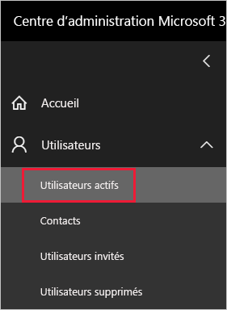
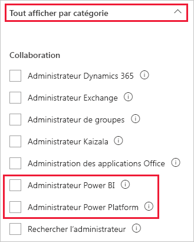

# <a name="understanding-power-bi-service-administrator-roles"></a>Présentation des rôles d’administrateur de service Power BI

Pour administrer un locataire Power BI, vous devez avoir l’un des rôles suivants : administrateur Power BI, administrateur Power Platform ou administrateur général Microsoft 365. Les administrateurs de gestion des utilisateurs Microsoft 365 affectent des utilisateurs aux rôles administrateur Power BI ou administrateur Power Platform dans le Centre d’administration Microsoft 365 ou à l’aide d’un script PowerShell. Pour plus d’informations, consultez [Attribuer des rôles à des comptes utilisateur avec Office 365 PowerShell](/office365/enterprise/powershell/assign-roles-to-user-accounts-with-office-365-powershell).

Les utilisateurs ayant l’un de ces rôles administrateur ont un contrôle total sur un locataire Power BI et ses fonctionnalités d’administration, à l’exception des licences. Une fois qu’un utilisateur est assigné, il peut accéder au [portail d’administration Power BI](service-admin-portal.md). À partir de là, il a accès aux mesures d’utilisation du locataire et peut contrôler l’utilisation que celui-ci fait des fonctionnalités de Power BI. Ces rôles administrateur sont parfaits pour les utilisateurs qui ont besoin d’accéder au portail d’administration Power BI, mais auxquels vous ne voulez pas accorder un accès administratif complet à Microsoft 365.

> [!NOTE]
> Dans la documentation Power BI, « administrateur Power BI » fait référence aux utilisateurs qui ont un rôle Administrateur Power BI ou un rôle Administrateur Power Platform. Quand le rôle Administrateur général Microsoft 365 est requis pour une tâche, la documentation l’indique clairement.

## <a name="limitations-and-considerations"></a>Considérations et limitations

Les rôles administrateur Power BI et administrateur Power Platform n’offrent pas les fonctionnalités suivantes :

* Modification des utilisateurs et des licences dans le Centre d’administration Microsoft 365.

* Accès aux journaux d’audit. Pour plus d’informations, consultez [Suivre les activités utilisateur dans Power BI](service-admin-auditing.md).

Ces fonctionnalités demandent le rôle Administrateur général Microsoft 365.

## <a name="assign-users-to-an-admin-role-in-the-microsoft-365-admin-center"></a>Affecter des utilisateurs à un rôle administrateur dans le Centre d’administration Microsoft 365

Pour affecter des utilisateurs à un rôle administrateur dans le Centre d’administration Microsoft 365, effectuez les étapes suivantes.

1. Dans le [Centre d’administration Microsoft 365](https://portal.office.com/adminportal/home#/homepage), sélectionnez **Utilisateurs** > **Utilisateurs actifs**.

    

1. Sélectionnez l’utilisateur que vous souhaitez assigner au rôle.

1. Sous **Rôles**, sélectionnez **Gérer les rôles**.

    

1. Développez **Afficher tout par catégorie**, puis sélectionnez **Administrateur Power BI** ou **Administrateur Power Platform**.

    

1. Sélectionnez **Enregistrer les modifications**.

## <a name="assign-users-to-the-admin-role-with-powershell"></a>Affecter des utilisateurs au rôle administrateur avec PowerShell

Vous pouvez également affecter des rôles à des utilisateurs à l’aide de PowerShell. Les utilisateurs sont gérés dans Azure Active Directory (Azure AD). Si vous ne disposez pas du module Azure AD PowerShell, [télécharger et installer la dernière version](https://www.powershellgallery.com/packages/AzureAD/).

1. Tout d’abord, connectez-vous à Azure AD :
   ```
   PS C:\Windows\system32> Connect-AzureAD
   ```

1. Vous devez ensuite obtenir **l’ObjectId** pour le rôle **Administrateur de service Power BI**. Pour obtenir l’**ObjectId**, vous pouvez exécuter l’applet de commande [Get-AzureADDirectoryRole](/powershell/module/azuread/get-azureaddirectoryrole).

    ```
    PS C:\Windows\system32> Get-AzureADDirectoryRole

    ObjectId                             DisplayName                        Description
    --------                             -----------                        -----------
    00f79122-c45d-436d-8d4a-2c0c6ca246bf Power BI Service Administrator     Full access in the Power BI Service.
    250d1222-4bc0-4b4b-8466-5d5765d14af9 Helpdesk Administrator             Helpdesk Administrator has access to perform..
    3ddec257-efdc-423d-9d24-b7cf29e0c86b Directory Synchronization Accounts Directory Synchronization Accounts
    50daa576-896c-4bf3-a84e-1d9d1875c7a7 Company Administrator              Company Administrator role has full access t..
    6a452384-6eb9-4793-8782-f4e7313b4dfd Device Administrators              Device Administrators
    9900b7db-35d9-4e56-a8e3-c5026cac3a11 AdHoc License Administrator        Allows access manage AdHoc license.
    a3631cce-16ce-47a3-bbe1-79b9774a0570 Directory Readers                  Allows access to various read only tasks in ..
    f727e2f3-0829-41a7-8c5c-5af83c37f57b Email Verified User Creator        Allows creation of new email verified users.
    ```

    Dans ce cas, **l’ObjectID** du rôle est 00f79122-c45d-436d-8d4a-2c0c6ca246bf.

1. Ensuite, obtenez **l’ObjectId** de l’utilisateur. Vous pouvez le trouver en exécutant l’applet de commande [Get-AzureADUser](/powershell/module/azuread/get-azureaduser).

    ```
    PS C:\Windows\system32> Get-AzureADUser -ObjectId 'tim@contoso.com'

    ObjectId                             DisplayName UserPrincipalName      UserType
    --------                             ----------- -----------------      --------
    6a2bfca2-98ba-413a-be61-6e4bbb8b8a4c Tim         tim@contoso.com        Member
    ```

1. Pour ajouter le membre au rôle, exécutez l’applet de commande [Add-AzureADDirectoryRoleMember](/powershell/module/azuread/add-azureaddirectoryrolemember).

    | Paramètre | Description |
    | --- | --- |
    | ObjectId |ObjectId du rôle. |
    | RefObjectId |ObjectId des membres. |

    ```powershell
    Add-AzureADDirectoryRoleMember -ObjectId 00f79122-c45d-436d-8d4a-2c0c6ca246bf -RefObjectId 6a2bfca2-98ba-413a-be61-6e4bbb8b8a4c
    ```

## <a name="next-steps"></a>Étapes suivantes

[Administration de Power BI dans votre organisation](service-admin-administering-power-bi-in-your-organization.md)  
[Portail d’administration Power BI](service-admin-portal.md)  

D’autres questions ? [Essayez d’interroger la communauté Power BI](https://community.powerbi.com/)