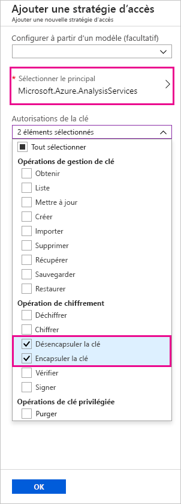
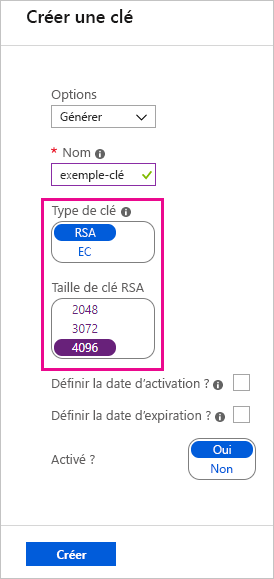
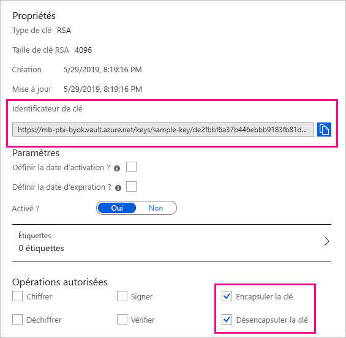

# <a name="bring-your-own-encryption-keys-for-power-bi"></a>Apporter vos propres clés de chiffrement pour Power BI

Power BI chiffre les données _au repos_ et _in-process_. Par défaut, Power BI utilise des clés managées par Microsoft pour chiffrer vos données. Dans Power BI Premium, vous pouvez également utiliser vos propres clés pour les données au repos qui sont importées dans un jeu de données (voir [Considérations relatives aux données sources et au stockage](#data-source-and-storage-considerations) pour plus d’informations). Cette approche est souvent décrite par le terme _Bring Your Own Key_ (BYOK).

## <a name="why-use-byok"></a>Pourquoi utiliser BYOK ?

BYOK facilite le respect des exigences de conformité qui spécifient des modalités d’utilisation des clés avec le fournisseur de services cloud (en l’occurrence, Microsoft). Avec BYOK, vous fournissez et contrôlez les clés de chiffrement pour vos données au repos Power BI au niveau de l’application. Ainsi, vous pouvez exercer un contrôle et révoquer les clés de votre organisation, si vous décidez de quitter le service. Quand vous révoquez les clés, les données deviennent illisibles par le service dans les 30 minutes qui suivent.

## <a name="data-source-and-storage-considerations"></a>Considérations relatives aux sources de données et au stockage

Pour utiliser BYOK, vous devez charger les données sur le service Power BI à partir d’un fichier Power BI Desktop (PBIX). Vous ne pouvez pas utiliser BYOK dans les scénarios suivants :

- Connexions actives Analysis Services
- Classeurs Excel (sauf si les données sont d’abord importées dans Power BI Desktop)
- [Transmettre des jeux de données](/rest/api/power-bi/pushdatasets)
- [Jeux de données en streaming](../connect-data/service-real-time-streaming.md#set-up-your-real-time-streaming-dataset-in-power-bi)


BYOK s’applique uniquement aux jeux de données. Les jeux de données d’envoi (push), les fichiers Excel et les fichiers CSV que les utilisateurs peuvent charger vers le service ne sont pas chiffrés à l’aide de votre propre clé. Pour identifier les artefacts stockés dans vos espaces de travail, utilisez la commande PowerShell suivante :

```PS C:\> Get-PowerBIWorkspace -Scope Organization -Include All```

> [!NOTE]
> Cette cmdlet nécessite le module de gestion Power BI v1.0.840. Pour savoir quelle version vous utilisez, exécutez Get-InstalledModule -Name MicrosoftPowerBIMgmt. Installez la version la plus récente en exécutant Install-Module -Name MicrosoftPowerBIMgmt. Pour plus d’informations sur les cmdlets Power BI et leurs paramètres, consultez [Modules PowerShell pour cmdlets Power BI](/powershell/power-bi/overview).

## <a name="configure-azure-key-vault"></a>Configurer Azure Key Vault

Dans cette section, vous apprenez à configurer Azure Key Vault, un outil autorisant le stockage et l’accès sécurisés aux secrets tels que des clés de chiffrement. Vous pouvez utiliser un coffre de clés existant pour stocker des clés de chiffrement, ou vous pouvez en créer un spécifiquement pour une utilisation avec Power BI.

Les instructions dans cette section supposent une connaissance élémentaire d’Azure Key Vault. Pour plus d’informations, consultez la page [Qu’est-ce qu’Azure Key Vault ?](/azure/key-vault/key-vault-whatis) Configurez votre coffre de clés de la façon suivante :

1. Ajoutez le service Power BI en tant que service principal pour le coffre de clés, avec des autorisations de chiffrement et de déchiffrement.

1. Créez une clé RSA avec une longueur de 4 096 bits (ou utilisez une clé existante de ce type), avec des autorisations de chiffrement et de déchiffrement.

    > [!IMPORTANT]
    > Power BI BYOK prend uniquement en charge les clés RSA ayant une longueur de 4 096 bits.

1. Configuration recommandée : Vérifiez que l’option _Suppression réversible_ est activée pour le coffre de clés.

### <a name="add-the-service-principal"></a>Ajouter le principal du service

1. Dans le portail Azure, dans votre coffre de clés, sous **Stratégies d’accès** , sélectionnez **Ajouter nouveau**.

1. Sous **Sélectionner le principal** , recherchez et sélectionnez Microsoft.Azure.AnalysisServices.

    > [!NOTE]
    > Si vous ne trouvez pas « Microsoft.Azure.AnalysisServices », il est probable que l’abonnement Azure associé à votre solution Azure Key Vault n’ait jamais eu de ressource Power BI associée. Essayez plutôt de rechercher la chaîne suivante : 00000009-0000-0000-c000-000000000000.

1. Sous **Autorisations de clé** , sélectionnez **Ne pas inclure la clé** et **Inclure la clé**.

    

1. Sélectionnez **OK** , puis **Enregistrer**.

> [!NOTE]
> Pour que Power BI ne puisse plus accéder à vos données à l’avenir, supprimez les droits d’accès à ce principal de service à partir de votre coffre de clés Azure.

### <a name="create-an-rsa-key"></a>Créer une clé RSA

1. Dans votre coffre de clés, sous **Clés** , sélectionnez **Générer/importer**.

1. Sélectionnez RSA comme **Type de clé** , et une **Taille de clé RSA** de 4 096.

    

1. Sélectionnez **Create** (Créer).

1. Sous **Clés** , sélectionnez la clé que vous avez créée.

1. Sélectionnez le GUID de la **Version actuelle** de la clé.

1. Vérifiez que les options **Inclure la clé** et **Ne pas inclure la clé** sont toutes les deux sélectionnées. Copiez l’ **Identificateur de clé** à utiliser quand vous activez BYOK dans Power BI.

    

### <a name="soft-delete-option"></a>Option de suppression réversible

Nous vous recommandons d’activer la [suppression réversible](/azure/key-vault/key-vault-ovw-soft-delete) sur votre coffre de clés, afin de bénéficier d’une protection contre la perte de données en cas de suppression accidentelle d’une clé (ou d’un coffre de clés). Vous devez utiliser [PowerShell pour activer la propriété « suppression réversible »](/azure/key-vault/key-vault-soft-delete-powershell) sur le coffre de clés, car cette option n’est pas encore disponible à partir du portail Azure.

Azure Key Vault étant correctement configuré, vous êtes prêt à activer BYOK sur votre locataire.

## <a name="enable-byok-on-your-tenant"></a>Activer BYOK sur votre locataire

Vous activez BYOK au niveau du locataire avec [PowerShell](https://www.powershellgallery.com/packages/MicrosoftPowerBIMgmt.Admin) en introduisant d’abord dans votre locataire Power BI les clés de chiffrement que vous avez créées et stockées dans Azure Key Vault. Ensuite, vous affectez ces clés de chiffrement par capacité Premium afin de chiffrer le contenu de la capacité.

### <a name="important-considerations"></a>Considérations importantes

Avant d’activer BYOK, gardez à l’esprit les points suivants :

- À l’heure actuelle, vous ne pouvez pas désactiver BYOK après l’avoir activé. Selon la façon dont vous spécifiez les paramètres pour `Add-PowerBIEncryptionKey`, vous pouvez contrôler la façon dont vous utilisez BYOK pour une ou plusieurs de vos capacités. Toutefois, vous ne pouvez pas annuler l’introduction des clés dans votre locataire. Pour plus d’informations, consultez [Activer BYOK](#enable-byok).

- Vous ne pouvez pas déplacer un espace de travail qui utilise le service BYOK d’une capacité dans Power BI Premium _directement_ vers une capacité partagée. Vous devez d’abord déplacer l’espace de travail vers une capacité pour laquelle le service BYOK n’est pas activé.

- Si vous déplacez un espace de travail qui utilise BYOK à partir d’une capacité Power BI Premium vers une capacité partagée, les rapports et les jeux de données deviendront inaccessibles, car ils sont chiffrés avec la clé. Pour éviter cette situation, vous devez d’abord déplacer l’espace de travail vers une capacité pour laquelle le BYOK n’est pas activé.

### <a name="enable-byok"></a>Activer BYOK

Pour activer BYOK, vous devez être administrateur Power BI et connecté à l’aide de l’applet de commande `Connect-PowerBIServiceAccount`. Utilisez ensuite [`Add-PowerBIEncryptionKey`](/powershell/module/microsoftpowerbimgmt.admin/Add-PowerBIEncryptionKey) pour activer BYOK, comme indiqué dans l’exemple suivant :

```powershell
Add-PowerBIEncryptionKey -Name'Contoso Sales' -KeyVaultKeyUri'https://contoso-vault2.vault.azure.net/keys/ContosoKeyVault/b2ab4ba1c7b341eea5ecaaa2wb54c4d2'
```

Pour ajouter plusieurs clés, exécutez `Add-PowerBIEncryptionKey` avec différentes valeurs pour -`-Name` et `-KeyVaultKeyUri`. 

Le cmdlet accepte deux paramètres de commutateur qui affectent le chiffrement pour les capacités actuelles et futures. Par défaut, aucun des commutateurs n’est défini :

- `-Activate` : indique que cette clé sera utilisée pour toutes les capacités existantes dans le locataire qui ne sont pas déjà chiffrées.

- `-Default` : indique que cette clé est maintenant la clé par défaut pour l’ensemble du locataire. Quand vous créez une nouvelle capacité, elle hérite de cette clé.

> [!IMPORTANT]
> Si vous spécifiez `-Default`, toutes les capacités créées sur votre locataire à partir de ce point sont chiffrées à l’aide de la clé que vous spécifiez (ou d’une clé par défaut mise à jour). Étant donné que vous ne pouvez pas annuler l’opération par défaut, vous perdez la capacité à créer une capacité premium dans votre locataire qui n’utilise pas BYOK.

Après avoir activé BYOK sur votre locataire, définissez la clé de chiffrement pour une ou plusieurs capacités Power BI :

1. Utilisez [`Get-PowerBICapacity`](/powershell/module/microsoftpowerbimgmt.capacities/get-powerbicapacity) pour obtenir l’ID de capacité requis pour l’étape suivante.

    ```powershell
    Get-PowerBICapacity -Scope Individual
    ```

    L’applet de commande retourne une sortie similaire à la suivante :

    ```
    Id              : xxxxxxxx-xxxx-xxxx-xxxx-xxxxxxxxxxxx
    DisplayName     : Test Capacity
    Admins          : adam@sometestdomain.com
    Sku             : P1
    State           : Active
    UserAccessRight : Admin
    Region          : North Central US
    ```

1. Utilisez [`Set-PowerBICapacityEncryptionKey`](/powershell/module/microsoftpowerbimgmt.admin/set-powerbicapacityencryptionkey) pour définir la clé de chiffrement :

    ```powershell
    Set-PowerBICapacityEncryptionKey -CapacityId xxxxxxxx-xxxx-xxxx-xxxx-xxxxxxxxxxxx -KeyName 'Contoso Sales'
    ```

Vous contrôlez comment vous utilisez BYOK dans votre locataire. Par exemple, pour chiffrer une seule capacité, appelez `Add-PowerBIEncryptionKey` sans `-Activate` ou `-Default`. Appelez ensuite `Set-PowerBICapacityEncryptionKey` pour la capacité où vous souhaitez activer BYOK.

## <a name="manage-byok"></a>Gérer BYOK

Power BI fournit des applets de commande supplémentaires pour vous aider à gérer BYOK dans votre locataire :

- Utilisez [`Get-PowerBICapacity`](/powershell/module/microsoftpowerbimgmt.capacities/get-powerbicapacity) pour obtenir la clé utilisée actuellement par une capacité :

    ```powershell
    Get-PowerBICapacity -Scope Organization -ShowEncryptionKey
    ```

- Utilisez [`Get-PowerBIEncryptionKey`](/powershell/module/microsoftpowerbimgmt.admin/get-powerbiencryptionkey) pour obtenir la clé utilisée actuellement par votre locataire :

    ```powershell
    Get-PowerBIEncryptionKey
    ```

- Utilisez [`Get-PowerBIWorkspaceEncryptionStatus`](/powershell/module/microsoftpowerbimgmt.admin/get-powerbiworkspaceencryptionstatus) pour voir si les jeux de données dans un espace de travail sont chiffrés et si leur état de chiffrement est synchronisé avec l’espace de travail :

    ```powershell
    Get-PowerBIWorkspaceEncryptionStatus -Name'Contoso Sales'
    ```

    Notez que le chiffrement est activé au niveau de la capacité, mais que vous obtenez l’état du chiffrement au niveau du jeu de données pour l’espace de travail spécifié.

- Utilisez [`Switch-PowerBIEncryptionKey`](/powershell/module/microsoftpowerbimgmt.admin/switch-powerbiencryptionkey) pour basculer (ou _faire pivoter_ ) la version de la clé utilisée pour le chiffrement. L’applet de commande met simplement à jour la valeur `-KeyVaultKeyUri` pour une clé `-Name` :

    ```powershell
    Switch-PowerBIEncryptionKey -Name'Contoso Sales' -KeyVaultKeyUri'https://contoso-vault2.vault.azure.net/keys/ContosoKeyVault/b2ab4ba1c7b341eea5ecaaa2wb54c4d2'
    ```


## <a name="next-steps"></a>Étapes suivantes

* [Modules PowerShell pour applets de commande Power BI](/powershell/power-bi/overview) 

* [Moyens de partager votre travail dans Power BI](../collaborate-share/service-how-to-collaborate-distribute-dashboards-reports.md)

* [Filtrer un rapport à l’aide de paramètres de chaîne de requête dans l’URL](../collaborate-share/service-url-filters.md)

* [Incorporer avec le composant WebPart Rapport dans SharePoint Online](../collaborate-share/service-embed-report-spo.md)

* [Publier sur le web à partir de Power BI](../collaborate-share/service-publish-to-web.md)