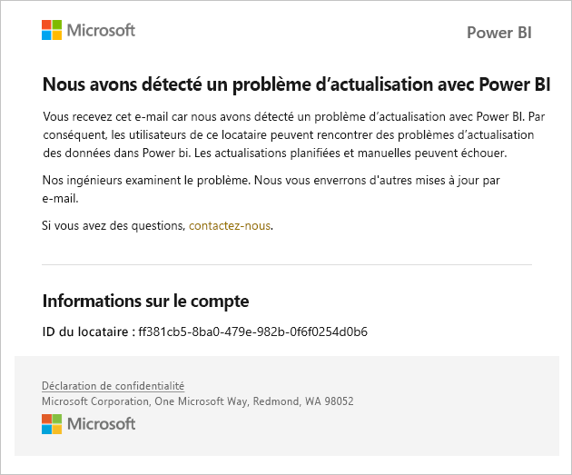

# Notifications d’interruption de service

Il est essentiel d’avoir un aperçu de la disponibilité de vos applications métier stratégiques. Power BI fournit une notification d’incident pour vous permettre de recevoir éventuellement des e-mails en cas de dégradation ou de perturbation du service. Même si le contrat de niveau de service (SLA) de 99,9 % de Power BI rend ces occurrences rares, nous voulons nous assurer que vous êtes tenu informé. La capture d’écran suivante montre le type d’e-mail que vous recevrez si vous activez les notifications :

À l’heure actuelle, nous envoyons des e-mails pour les _scénarios de fiabilité_ suivants :

- Fiabilité des rapports ouverts
- Fiabilité des actualisations de modèles
- Fiabilité des actualisations de requêtes

Des notifications sont envoyées en cas de _délai prolongé_ lors d’opérations telles que l’ouverture de rapports, l’actualisation du jeu de données ou l’exécution de requêtes. Après la résolution d’un incident, vous recevez un e-mail de suivi.

> [!NOTE]
> Cette fonctionnalité est actuellement disponible uniquement pour les capacités dédiées dans Power BI Premium. Elle n’est pas disponible pour la capacité partagée ou embarquée.

## Notifications de capacité et de fiabilité

Quand une capacité Power BI Premium connaît des périodes prolongées d’utilisation intensive des ressources susceptibles d’impacter la fiabilité, un e-mail de notification est envoyé. Parmi ces impacts, citons des retards prolongés dans des opérations telles que l’ouverture d’un rapport, l’actualisation d’un jeu de données et l’exécution de requêtes. 

L’e-mail de notification fournit des informations sur la raison de l’utilisation intensive des ressources, notamment :

* ID du jeu de données responsable
* Type d'opération
* Temps processeur associé à l’utilisation intensive des ressources

Power BI envoie également des notifications par e-mail en cas de détection d’une surcharge dans une capacité Power BI Premium. L’e-mail indique la raison probable de la surcharge, les opérations qui ont généré la charge au cours des 10 dernières minutes et la quantité de charge générée par chaque opération. 

Si vous avez plusieurs capacités Premium, l’e-mail contient des informations sur ces capacités pendant la période surchargée. Vous pouvez donc envisager de déplacer les espaces de travail contenant des éléments nécessitant beaucoup de ressources vers les capacités avec les charges les plus faibles.

Les notifications de surcharge par e-mail ne sont envoyées que si un seuil de surcharge est déclenché. Vous ne recevez pas de deuxième e-mail quand la charge sur cette capacité Premium revient à un niveau non surchargé.

L’image suivante représente un exemple de notification par e-mail :

## Activer les notifications

Un administrateur de locataire Power BI active les notifications dans le portail d’administration :

1. Identifiez ou créez un groupe de sécurité prenant en charge les e-mails qui doit recevoir des notifications.

1. Dans le portail d’administration, sélectionnez **Paramètres du locataire**. Sous **Paramètres d’aide et de support**, développez **Recevoir des notifications par e-mail pour les pannes ou incidents du service**.

1. Activez les notifications, entrez un groupe de sécurité, puis sélectionnez **Appliquer**.

    

> [!NOTE]
> Power BI envoie des notifications à partir du compte no-reply-powerbi@microsoft.com. Vérifiez que ce compte est ajouté à votre liste des expéditeurs approuvés afin d’éviter que les notifications ne se trouvent dans un dossier Courrier indésirable.

## Étapes suivantes

[Options de support Power BI Pro et Power BI Premium](service-support-options.md)

D’autres questions ? [Posez vos questions à la communauté Power BI](https://community.powerbi.com/)
