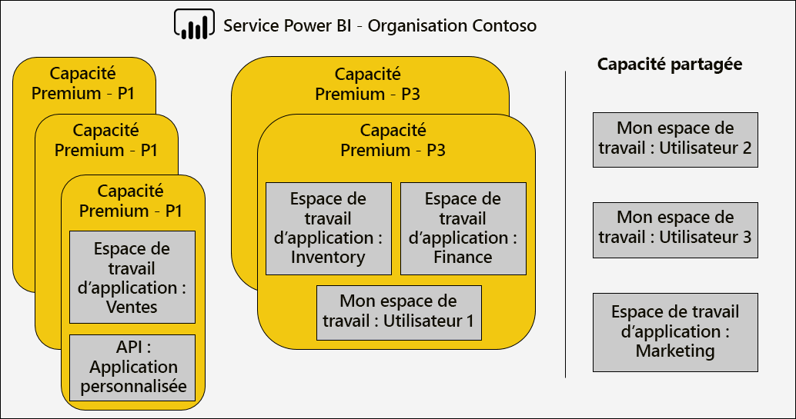
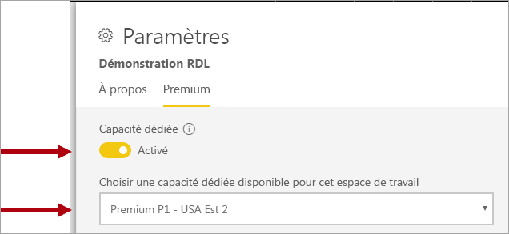

# Gérer les capacités Premium

La gestion de Power BI Premium implique la création, la gestion et la surveillance des capacités Premium. Cet article fournit une vue d’ensemble des capacités ; pour obtenir des instructions pas à pas, consultez [Configurer et gérer les capacités](service-admin-premium-manage.md).

## Création et gestion des capacités

La page **Paramètres de capacité** du portail d’administration Power BI affiche le nombre de v-cores achetés et de capacités Premium disponibles. La page permet aux administrateurs généraux et administrateurs du service Power BI de créer des capacités Premium à partir des v-cores disponibles ou modifier les capacités Premium existantes.

Lors de la création d’une capacité Premium, les administrateurs doivent définir les éléments suivants :

- Nom de la capacité (unique au sein du locataire).
- Administrateur(e) de capacité.
- Taille de la capacité.
- Région pour la résidence des données.

Au moins un administrateur de capacité doit être affecté. Les utilisateurs affectés en tant qu’administrateurs de la capacité peuvent :

- Affecter des espaces de travail à la capacité.
- Gérer les autorisations utilisateur, pour ajouter des administrateurs de capacité supplémentaires ou des utilisateurs disposant d’autorisations d’affectation (pour leur permettre d’affecter des espaces de travail à la capacité).
- Gérer les charges de travail, pour configurer l’utilisation maximale de la mémoire pour les rapports paginés et les charges de travail de dataflow.
- Redémarrer la capacité pour réinitialiser toutes les opérations en case de surcharge du système.

Les administrateurs de capacité ne peuvent pas accéder au contenu de l’espace de travail sauf autorisation explicite dans l’espace de travail. Ils n’ont pas non plus accès à l’ensemble des zones d’administration Power BI (sauf en cas d’attribution explicite), notamment les métriques d’utilisation, les journaux d’audit et les paramètres du locataire. Il est important de noter que les administrateurs de capacité ne sont pas autorisés à créer de nouvelles capacités ou à mettre à l’échelle des capacités existantes. Les administrateurs sont affectés sur la base de la capacité, ce qui garantit qu’ils ne peuvent afficher et gérer que les capacités auxquelles ils sont affectés.

La taille de la capacité est sélectionnée à partir d’une liste de références SKU disponibles, restreinte par le nombre de cœurs disponibles dans le pool. Il est possible de créer plusieurs capacités à partir du pool, qui peuvent provenir d’une ou plusieurs références SKU achetées. Par exemple, une référence SKU P3 (32 v-cores) peut être utilisée pour créer trois capacités : un P2 (16 v-cores) et deux P1 (2 x 8 v-cores). Il est possible d’améliorer les performances et la mise à l’échelle en créant des capacités de taille inférieure, comme décrit dans l’article [Optimiser les capacités Premium](service-premium-capacity-optimize.md). L’illustration suivante montre un exemple de configuration de l’organisation fictive Contoso comportant cinq capacités Premium (3 x P1 et 2 x P3) dont chacune contient des espaces de travail ainsi que plusieurs espaces de travail dans une capacité partagée.

Une capacité Premium peut être attribuée à une région autre que la région d’hébergement du locataire Power BI. C’est ce qu’on appelle la fonctionnalité Multi-Geo. Le Multi-Geo fournit un contrôle administratif des centres de données dans lesquels votre contenu Power BI réside au sein de régions géographiques définies. L’objectif de l’utilisation d’un déploiement Multi-Geo est généralement la conformité de l’entreprise ou du gouvernement, plutôt que les performances et la mise à l’échelle. Le chargement de rapports et de tableaux de bord implique toujours des requêtes à la région d’origine pour les métadonnées. Pour plus d’informations, consultez [Prise en charge Multi-Geo pour Power BI Premium](service-admin-premium-multi-geo.md).

Les administrateurs de service Power BI et les administrateurs généraux peuvent modifier les capacités Premium. Plus précisément, ils peuvent :

- Modifier la taille de la capacité pour mettre à l’échelle les ressources.
- Ajouter ou supprimer des administrateurs de capacité.
- Ajouter ou supprimer des utilisateurs disposant d’autorisations d’affectation.
- Ajouter ou supprimer des charges de travail supplémentaires.
- Changer la région.

Des autorisations d’affectation sont requises pour affecter un espace de travail à une capacité Premium spécifique. Les autorisations peuvent être accordées à l’ensemble de l’organisation, à des utilisateurs spécifiques ou à des groupes.

Par défaut, les capacités Premium prennent en charge les charges de travail associées aux requêtes Power BI en cours d’exécution. Les capacités Premium prennent également en charge des charges de travail supplémentaires : **IA (Cognitive Services)** , **Rapports paginés** et **Dataflows**. Chaque charge de travail nécessite de configurer la mémoire maximale (sous forme d’un pourcentage de la mémoire totale disponible) qui peut être utilisée par la charge de travail. Il est important de comprendre que l’amélioration de l’allocation de mémoire maximale peut avoir un impact sur le nombre de modèles actifs qui peuvent être hébergés et le débit des actualisations. 

La mémoire est allouée dynamiquement aux flux de données, mais elle est allouée statiquement aux rapports paginés. La raison de l’allocation statique de la mémoire maximale est que les rapports paginés s’exécutent dans un espace contenu sécurisé de la capacité. Vous devez faire attention lors de la définition de la mémoire paginée des rapports, car elle réduit la mémoire disponible pour le chargement des modèles. Pour plus d’informations, consultez les [Paramètres de mémoire par défaut](service-admin-premium-workloads.md#default-memory-settings).

La suppression d’une capacité Premium est possible et n’entraîne pas la suppression de ses espaces de travail et de son contenu. Au lieu de cela, elle déplace tous les espaces de travail attribués vers une capacité partagée. Lorsque la capacité Premium a été créée dans une autre région, l’espace de travail est déplacé vers la capacité partagée de la région d’hébergement.

### Affectation d’espaces de travail à des capacités

Les espaces de travail peuvent être affectés à une capacité Premium dans le portail d’administration Power BI ou, pour un espace de travail, dans le volet **Espace de travail**.

Les administrateurs de capacité, ainsi que les administrateurs généraux ou administrateurs de service Power BI peuvent attribuer en bloc des espaces de travail dans le portail d’administration de Power BI. L’attribution en bloc peut s’appliquer à :

- **Espaces de travail par utilisateurs** : tous les espaces de travail détenus par ces utilisateurs, y compris les espaces de travail personnels, sont affectés à la capacité Premium. Cela inclut la réaffectation des espaces de travail lorsqu’ils sont déjà affectés à une capacité Premium différente. En outre, les utilisateurs reçoivent également des autorisations d’affectation d’espace de travail.

- **Espaces de travail spécifiques**
- **Les espaces de travail de toute l’organisation** : tous les espaces de travail, y compris les espaces de travail personnels, sont affectés à la capacité Premium. Les autorisations d’affectation d’espace de travail sont attribuées à tous les utilisateurs actuels et futurs. Cette approche n’est pas recommandée. Une approche plus ciblée est préférable.

Un espace de travail peut être ajouté à une capacité Premium à l’aide du volet **Espace de travail**, car l’utilisateur est à la fois administrateur d’espace de travail et détenteur d’autorisations d’affectation.

Les administrateurs de l’espace de travail peuvent enlever un espace de travail d’une capacité (vers une capacité partagée) sans avoir besoin de l’autorisation d’attribution. Le retrait des espaces de travail des capacités dédiées déplace de fait l’espace de travail vers une capacité partagée. Notez que le retrait d’un espace de travail d’une capacité Premium peut avoir des conséquences négatives, par exemple en cas d’indisponibilité d’un contenu partagé pour les utilisateurs titulaires d’une licence gratuite Power BI, ou la suspension de l’actualisation planifiée lorsque les allocations prises en charge par la capacité partagée sont dépassées.

Dans le service Power BI, un espace de travail affecté à une capacité Premium est facilement identifié par l’icône en losange qui orne le nom de l’espace de travail.

## Superviser les capacités

La supervision des capacités Premium permet aux administrateurs de connaître les performances de chaque capacité. Vous pouvez superviser les capacités dans le portail d’administration Power BI ou avec l’application **Métriques de capacité Power BI Premium** (Power BI).

### Portail d’administration Power BI

Dans le portail d’administration, pour chaque capacité, l'onglet **Intégrité** fournit des métriques récapitulatives pour la capacité et chaque charge de travail activée. Les métriques indiquent une moyenne au cours des sept derniers jours.  

Au niveau de la capacité, les métriques sont cumulatives pour toutes les charges de travail activées. Les métriques suivantes sont fournies :

- **UTILISATION DU PROCESSEUR** : fournit une utilisation moyenne du processeur comme pourcentage de l’UC totale disponible pour la capacité.  
- **UTILISATION DE LA MÉMOIRE** : fournit une utilisation moyenne de la mémoire (en Go) comme quantité totale de mémoire disponible pour la capacité. 

Pour chaque charge de travail activée, l’utilisation de l’UC et l’utilisation de la mémoire sont fournies, ainsi qu’un certain nombre de métriques spécifiques à la charge de travail. Par exemple, pour la charge de travail Dataflow, le **Nombre total** affiche les actualisations totales pour chaque dataflow, et **Durée moyenne** affiche la durée moyenne d’actualisation du dataflow.

Pour en savoir plus sur toutes les métriques disponibles pour chaque charge de travail, consultez [Superviser les capacités dans le portail d’administration](service-admin-premium-monitor-portal.md).

Les fonctionnalités de supervision dans le portail d’administration Power BI sont conçues pour fournir un résumé rapide des métriques de capacité clés. Pour une analyse plus détaillée, il est recommandé d’utiliser l’application **Métriques de capacité Power BI Premium**.

### Application Métriques de capacité Power BI Premium

L’application [Métriques de capacité Power BI Premium](https://appsource.microsoft.com/product/power-bi/pbi_pcmm.pbi-premiumcapacitymonitoring?tab=Overview) est une application Power BI disponible pour les administrateurs de capacité et installée comme n’importe quelle autre application Power BI. Elle contient un tableau de bord et un rapport.

Lorsque l’application s’ouvre, le tableau de bord est chargé pour présenter de nombreuses vignettes exprimant une vue agrégée de toutes les capacités dont l’utilisateur est un administrateur de capacité. La disposition du tableau de bord comprend cinq sections principales :

- **Vue d’ensemble** : version de l’application, nombre de capacités et d’espaces de travail
- **Résumé du système** : métriques de mémoire et de processeur
- **Résumé du jeu de données** : nombre de jeux de données, DQ/LC, actualisation et métriques de requête
- **Résumé du dataflow** : nombre de dataflows et métriques du jeu de données
- **Résumé de rapport paginé** : actualiser et afficher les métriques

Le rapport sous-jacent, à partir duquel les vignettes du tableau de bord ont été épinglées, est accessible en cliquant sur n’importe quelle vignette du tableau de bord. Il fournit une perspective plus détaillée de chacune des sections du tableau de bord et prend en charge le filtrage interactif. 

Le filtrage peut être effectué en définissant des segments par plage de dates, capacité, espace de travail et charge de travail (rapport, jeu de données, dataflow) et en sélectionnant des éléments dans les visuels de rapport pour appliquer un filtre croisé à la page de rapport. Le filtrage croisé est une technique puissante pour limiter les périodes, capacités, espaces de travail, jeux de données, etc., et peut être très utile lors d’une analyse de cause racine.

Pour plus d’informations sur les mesures de tableau de bord et de rapport dans l’application, consultez [Superviser les capacités Premium avec l’application](service-admin-premium-monitor-capacity.md).

### Interprétation des métriques

Les métriques doivent être supervisées pour établir une compréhension de base de l’activité de la charge de travail et de l’utilisation des ressources. Si la capacité devient lente, il est important de comprendre les métriques à surveiller et les conclusions que vous pouvez en tirer.

Dans l’idéal, les requêtes doivent être exécutées en moins d’une seconde pour fournir des expériences réactives aux utilisateurs de rapport et permettre un débit de requête plus élevé. Il est généralement moins gênant que les processus d’arrière-plan, y compris les actualisations, prennent plus de temps pour s’exécuter.

En général, les rapports lents peuvent indiquer une capacité en surchauffe. Lorsque le chargement des rapports échoue, il s’agit d’une indication d’une capacité en surchauffe. Dans les deux cas, la cause racine peut être imputable à de nombreux facteurs, notamment :

- **Les requêtes qui échouent** indiquent certainement que la mémoire est sollicitée et qu’un modèle n’a pas pu être chargé en mémoire. Le service Power BI tente de charger un modèle pendant 30 secondes avant d’échouer.

- **Les temps d’attente de requête excessifs** peuvent être causés par plusieurs choses :
  - La nécessité pour le service Power BI d’éliminer d’abord les modèles, puis de charger le modèle à interroger (souvenez-vous que les taux d’éviction de jeu de données les plus élevés ne sont pas une indication de la contrainte de capacité, sauf s’ils sont accompagnés par des temps d’attente de requête longs qui indiquent une surcharge de mémoire).
  - Temps de chargement du modèle (particulièrement l’attente pour charger un grand modèle en mémoire).
  - Requêtes longues.
  - Trop de connexions LC/DQ (dépassement des limites de capacité).
  - Saturation de l’UC.
  - Conceptions de rapport complexes avec un nombre excessif d’éléments visuels sur une page (rappelez-vous que chaque visuel est une requête).

- **Des durées de requête longues** peuvent indiquer que les conceptions de modèle ne sont pas optimisées, en particulier lorsque plusieurs jeux de données sont actifs dans une capacité, et qu’un seul jeu de données génère des durées de requête longues. Cela suggère que la capacité dispose de suffisamment de ressources et que le jeu de données en question est sous-optimal ou simplement lent. Les requêtes longues peuvent être problématiques, car elles peuvent bloquer l’accès aux ressources requises par d’autres processus.
- **Une durée d’attente d’actualisation longue** indique une mémoire insuffisante en raison de nombreux modèles actifs consommant de la mémoire ou une actualisation problématique qui bloque les autres actualisations (dépassant les limites d’actualisations parallèles).

Une explication plus détaillée de l’utilisation des métriques est traitée dans l'article [Optimiser les capacités Premium](service-premium-capacity-optimize.md).

## Accusés de réception

Cet article a été écrit par Peter Myers, expert Data Plateform MVP et BI indépendant avec des solutions [Bitwise](https://www.bitwisesolutions.com.au/).

## Étapes suivantes

> [!div class="nextstepaction"]
> [Optimiser les capacités Premium](service-premium-capacity-optimize.md)   
> [!div class="nextstepaction"]
> [Configurer des charges de travail dans une capacité Premium](service-admin-premium-workloads.md)   

D’autres questions ? [Essayez d’interroger la communauté Power BI](https://community.powerbi.com/)

