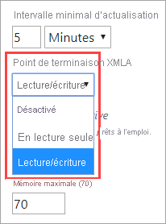
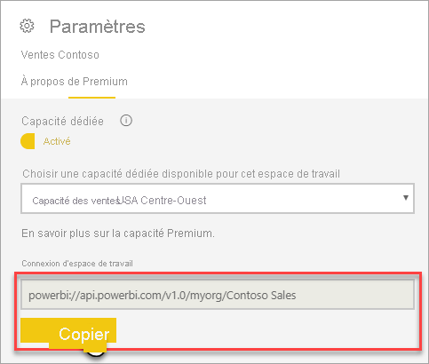
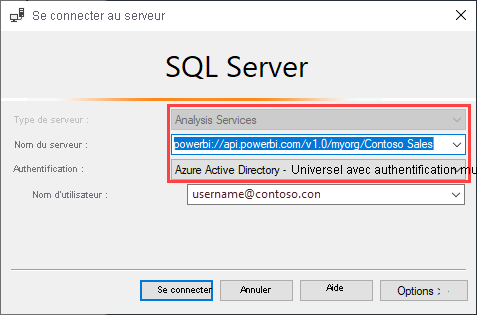
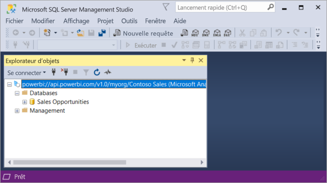
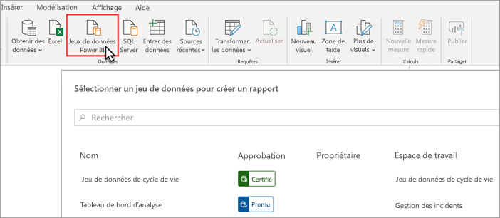
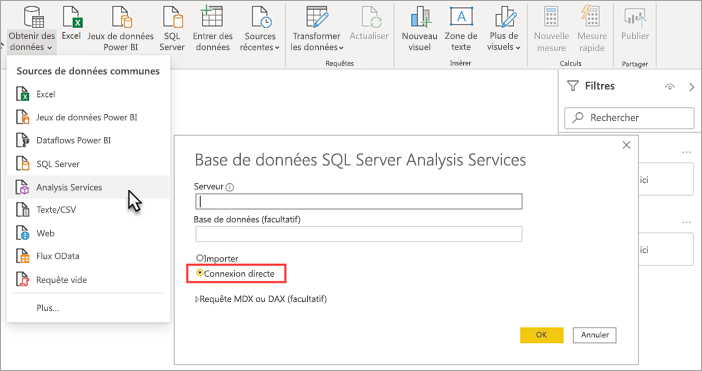

# Connectivité des jeux de données avec le point de terminaison XMLA (préversion)

Les espaces de travail et les jeux de données Power BI Premium au niveau de compatibilité 1500 et supérieur prennent en charge la connectivité Open-plateforme à partir d’applications et d’outils clients Microsoft et tiers à l’aide d’un *point de terminaison XMLA*.

> [!NOTE]
> Cette caractéristique est en **Préversion**. Les caractéristiques en Préversion ne doivent pas être utilisées dans un environnement de production. Certaines fonctionnalités, le support et la documentation sont limités.  Reportez-vous aux [Conditions OST (Online Services Terms) Microsoft](https://www.microsoft.com/licensing/product-licensing/products?rtc=1) pour plus d’informations.

## Qu’est-ce qu’un point de terminaison XMLA ?

Power BI Premium utilise le protocole [XML for Analysis](https://docs.microsoft.com/analysis-services/xmla/xml-for-analysis-xmla-reference?view=power-bi-premium-current) (XMLA) pour les communications entre des applications clientes et le moteur qui gère vos espaces de travail et jeux de données Power BI. Ces communications s’effectuent via ce qui est communément appelé « points de terminaison XMLA ». XMLA est le même protocole de communication que celui utilisé par le moteur Microsoft Analysis Services, qui, sous le capot, exécute la modélisation sémantique, la gouvernance, le cycle de vie et la gestion des données de Power BI.

Par défaut, la connexion en *lecture seule* à l’aide du point de terminaison est activée pour la **charge de travail des jeux de données** dans une capacité. Avec l’accès en lecture seule, les applications et les outils de visualisation des données peuvent interroger les données, les métadonnées, les événements et le schéma du modèle de jeux de données. Les opérations en *lecture/écriture* utilisant le point de terminaison peuvent être activées pour fournir une gestion, une gouvernance, une modélisation sémantique avancée, un débogage et une surveillance des jeux de données supplémentaires. Avec l’option lecture-écriture activée, les jeux de données Power BI Premium ont plus de parité avec les outils et les processus de modélisation tabulaire de niveau entreprise Azure Analysis Services et SQL Server Analysis Services.

> [!NOTE]
> Il est recommandé d’utiliser l’expérience d’espace de travail moderne, en particulier lors de la connexion à vos jeux de données à l’aide du point de terminaison XMLA. Les opérations telles que la création ou la suppression de jeux de données ne sont pas prises en charge avec les espaces de travail classiques. Pour mettre à niveau les espaces de travail classiques vers l’expérience moderne, consultez [Mettre à niveau les espaces de travail classiques dans Power BI](../collaborate-share/service-upgrade-workspaces.md).

## Outils de gestion et de modélisation des données

Voici quelques-uns des outils les plus courants utilisés avec Azure Analysis Services et SQL Server Analysis Services, et désormais pris en charge par les jeux de données Power BI Premium :

**Visual Studio avec Analysis Services projets** , également appelé SQL Server Data Tools ou simplement **SSDT**, est un outil de création de modèles de niveau entreprise pour les modèles tabulaires Analysis Services. Les extensions de projets Analysis Services sont prises en charge sur toutes les éditions de Visual Studio 2017 et versions ultérieures, y compris l’édition Communauté gratuite. La version d’extension 2.9.6 ou ultérieure est requise pour déployer des modèles tabulaires dans un espace de travail Premium. Lors du déploiement vers un espace de travail Premium, le modèle doit être au niveau de compatibilité 1500 ou supérieur. La lecture-écriture XMLA est requise sur la charge de travail des jeux de données. Pour en savoir plus, consultez [Outils pour Analysis Services](https://docs.microsoft.com/analysis-services/tools-and-applications-used-in-analysis-services?view=power-bi-premium-current).

**SQL Server Management Studio (SSMS)**   : prend en charge les requêtes DAX, MDX et XMLA. Effectuez des opérations d’actualisation précises et des scripts de métadonnées du jeu de données à l’aide du [Langage de script de modèle tabulaire](https://docs.microsoft.com/analysis-services/tmsl/tabular-model-scripting-language-tmsl-reference) (TMSL). L’accès en lecture seule est requis pour les opérations de requête. L’accès en lecture/écriture est requis pour les métadonnées de script. Requiert SSMS version 18.4 ou ultérieure. Téléchargez [ici](https://docs.microsoft.com/sql/ssms/download-sql-server-management-studio-ssms).

**SQL Server Profiler**  : installé avec SSMS, cet outil fournit le traçage et le débogage des événements des jeux de données. Bien qu’officiellement déprécié pour SQL Server, Profiler continue à être inclus dans SSMS. Il reste pris en charge pour Analysis Services et Power BI Premium. L’accès en lecture seule XMLA est requis. Pour en savoir plus, consultez  [SQL Server Profiler pour Analysis Services](https://docs.microsoft.com/analysis-services/instances/use-sql-server-profiler-to-monitor-analysis-services?view=power-bi-premium-current).

**Assistant de déploiement Analysis Services**  : installé avec SSMS, cet outil permet de déployer des projets de modèles tabulaires créés par Visual Studio dans des espaces de travail Analysis Services et Power BI Premium. Il peut être exécuté de manière interactive ou à partir de la ligne de commande pour l’automatisation. L’accès en lecture/écriture XMLA est requis. Pour en savoir plus, consultez [Assistant de déploiement Analysis Services](https://docs.microsoft.com/analysis-services/deployment/deploy-model-solutions-using-the-deployment-wizard?view=power-bi-premium-current).

**Cmdlets PowerShell**  : les cmdlets Analysis Services peuvent être utilisées pour automatiser des tâches de gestion de jeux de données telles que les opérations d’actualisation. L’accès en lecture/écriture XMLA est requis. La version **21.1.18221** ou une version ultérieure du [module SqlServer PowerShell](https://www.powershellgallery.com/packages/SqlServer/) est requise. Les cmdlets Azure Analysis Services dans le module Az. AnalysisServices ne sont pas prises en charge pour Power BI Premium. Pour en savoir plus, consultez [Référence Analysis Services PowerShell](https://docs.microsoft.com/analysis-services/powershell/analysis-services-powershell-reference?view=power-bi-premium-current) .

**Power BI Report Builder**  : outil qui permet de créer des rapports paginés. Créez une définition de rapport qui spécifie les données à récupérer, où les obtenir et comment les afficher. Vous pouvez prévisualiser votre rapport dans le Générateur de rapports, puis, publier votre rapport dans le service Power BI. L’accès en lecture seule XMLA est requis. Pour en savoir plus, consultez  [Power BI Report Builder](https://docs.microsoft.com/power-bi/report-builder-power-bi).

**Éditeur tabulaire** : outil Open source permettant de créer, de maintenir et de gérer des modèles tabulaires à l’aide d’un éditeur simplifié et intuitif. Une vue hiérarchique affiche tous les objets de votre modèle tabulaire. Les objets sont organisés par dossiers d’affichage avec support de la modification de propriété à sélection multiple et de la mise en surbrillance de la syntaxe DAX. L’accès en lecture seule XMLA est requis pour les opérations de requête. L’accès en lecture/écriture est requis pour les opérations de métadonnées. Pour en savoir plus, consultez [tabulareditor.github.io](https://tabulareditor.github.io/).

**DAX Studio**  : outil Open source pour la création, le diagnostic, le réglage des performances et l’analyse DAX. Les fonctionnalités incluent l’exploration des objets, le traçage intégré, l’analyse de l’exécution de la requête avec des statistiques détaillées, la mise en surbrillance et la mise en forme de la syntaxe DAX. L’accès en lecture seule XMLA est requis pour les opérations de requête. Pour en savoir plus, consultez [daxstudio.org](https://daxstudio.org/).

**ALM Toolkit** : outil de comparaison de schémas Open source pour les jeux de données Power BI, le plus souvent utilisé pour les scénarios de gestion du cycle de vie des applications (ALM). Effectuez le déploiement dans des environnements et conservez les données historiques de l’actualisation incrémentielle. Comparez et fusionnez des fichiers de métadonnées, branches et référentiels. Réutilisez les définitions communes entre les jeux de données. L’accès en lecture seule est requis pour les opérations de requête. L’accès en lecture/écriture est requis pour les opérations de métadonnées. Pour plus d’informations, consultez [alm-toolkit.com](http://alm-toolkit.com/).

**Microsoft Excel**  : les tableaux croisés dynamiques Excel sont l’un des outils les plus courants utilisés pour résumer, analyser, explorer et présenter des données de synthèse à partir de jeux de données Power BI. L’accès en lecture seule est requis pour les opérations de requête. La version « démarrer en un clic » d’Office 16.0.11326.10000 ou une version ultérieure est requise.

**Tiers**  : inclut des applications et des outils de visualisation de données clients qui peuvent se connecter aux jeux de données, les interroger et les consommer dans Power BI Premium. La plupart des outils nécessitent les dernières versions des bibliothèques clientes MSOLAP, mais certains peuvent utiliser ADOMD. Le point de terminaison XMLA en lecture seule ou en lecture-écriture dépend des opérations.

### Bibliothèques clientes

Les applications clientes ne communiquent pas directement avec le point de terminaison XMLA. Au lieu de cela, ils utilisent des *bibliothèques clientes* en tant que couche d’abstraction. Il s’agit des mêmes applications de bibliothèques clientes que celles utilisées pour se connecter à Azure Analysis Services et SQL Server Analysis Services. Les applications Microsoft telles que Excel, SQL Server Management Studio (SSMS), ainsi que les extensions de projets Analysis Services pour Visual Studio installent les trois bibliothèques clientes et les mettent à jour avec des mises à jour régulières des applications et des extensions. Les développeurs peuvent également utiliser les bibliothèques clientes pour générer des applications personnalisées. Dans certains cas, en particulier avec les applications tierces, si elles ne sont pas installées avec l’application, vous devrez peut-être installer des versions plus récentes des bibliothèques clientes. Les bibliothèques clientes sont mises à jour tous les mois. Pour en savoir plus, consultez  [Bibliothèques clientes pour se connecter à Analysis Services](https://docs.microsoft.com/azure/analysis-services/analysis-services-data-providers).

## Opérations d'écriture prise en charge

Les métadonnées du jeu de données sont exposées via les bibliothèques clientes basées sur le modèle d’objet tabulaire (TOM) pour permettre aux développeurs de générer des applications personnalisées. Cela permet à Visual Studio et aux outils communautaires Open source tels que l’éditeur tabulaire de fournir des fonctionnalités de déploiement et de modélisation des données supplémentaires prises en charge par le moteur Analysis Services, mais pas encore prises en charge dans Power BI Desktop. Les fonctionnalités de modélisation des données supplémentaires incluent :

- [Groupes de calcul](https://docs.microsoft.com/analysis-services/tabular-models/calculation-groups?view=power-bi-premium-current) pour la réutilisation des calculs et la consommation simplifiée des modèles complexes.

- [Traductions des métadonnées](https://docs.microsoft.com/analysis-services/tabular-models/translations-in-tabular-models-analysis-services?view=power-bi-premium-current) pour prendre en charge des rapports et jeux de données multilingues.

- [Perspectives](https://docs.microsoft.com/analysis-services/tabular-models/perspectives-ssas-tabular?view=power-bi-premium-current) pour définir des vues de métadonnées du jeu de données ciblées et spécifiques à un domaine d’entreprise.

La sécurité au niveau de l’objet (OLS) n’est pas encore prise en charge dans les jeux de données Power BI Premium.

## Optimiser les jeux de données pour les opérations d’écriture

Lorsque vous utilisez le point de terminaison XMLA pour la gestion des jeux de données avec des opérations d’écriture, il est recommandé d’activer le jeu de données pour les grands modèles. Cela réduit la surcharge des opérations d’écriture, ce qui peut les rendre beaucoup plus rapides. Pour les jeux de données dont la taille est supérieure à 1 Go (après compression), la différence peut être importante. Pour en savoir plus, consultez [Grands modèles dans Power BI Premium](service-premium-large-models.md).

## Activer l’accès en lecture-écriture XMLA

Par défaut, une capacité Premium a le paramètre de propriété de point de terminaison XMLA activé pour la lecture seule. Cela signifie que les applications peuvent uniquement interroger un jeu de données. Pour que les applications effectuent des opérations d’écriture, la propriété de point de terminaison XMLA doit être activée pour l’accès en lecture-écriture. Le paramètre de propriété de point de terminaison XMLA pour une capacité est configuré dans la **Charge de travail des jeux de données**. Le paramètre de point de terminaison XMLA s’applique à *tous les espaces de travail et jeux de données* affectés à la capacité.

### Pour activer l’accès en lecture/écriture pour une capacité

1. Dans le portail d’administrateur, cliquez sur **Paramètres de capacité** > **Power BI Premium** > nom de la capacité.
2. Développez **Charges de travail**. Dans le paramètre **Point de terminaison XMLA**, sélectionnez **Accès en lecture/écriture**.

    

## Connexion à un espace de travail Premium

Les espaces de travail attribués à une capacité dédiée ont une chaîne de connexion au format d’URL telle que : `powerbi://api.powerbi.com/v1.0/[tenant name]/[workspace name]`.

Les applications se connectant à l’espace de travail utilisent l’URL, comme un nom de serveur Analysis Services. Par exemple, `powerbi://api.powerbi.com/v1.0/contoso.com/Sales Workspace`.

Les utilisateurs avec des UPN dans le même abonné (non B2B) peuvent remplacer le nom de l’abonné par `myorg`. Par exemple :  `powerbi://api.powerbi.com/v1.0/myorg/Sales Workspace`.

### Pour accéder à l’URL de connexion de l’espace de travail

Dans **Paramètres** > **Premium** > **Connexion à l’espace de travail** de l’espace de travail, cliquez sur **Copier**.

## Exigences relatives aux connexions

### Catalogue initial

Pour certains outils, comme SQL Server Profiler, vous devrez peut-être spécifier un *Catalogue initial*. Spécifiez un jeu de données (une base de données) dans votre espace de travail. Dans la boîte de dialogue **Se connecter au serveur**, cliquez sur **Options** > **Propriétés de la connexion** > **Se connecter à une base de données**, entrez le nom du jeu de données.

### Noms d’espaces de travail dupliqués

[Nouveaux espaces de travail](../collaborate-share/service-new-workspaces.md) (créés à l’aide de la nouvelle expérience de l’espace de travail) dans Power BI imposent la validation pour interdire la création ou le changement de nom des espaces de travail par des noms dupliqués. Les espaces de travail qui n’ont pas été migrés peuvent entraîner des noms dupliqués. Quand vous vous connectez à un espace de travail portant le même nom qu’un autre espace de travail, l’erreur suivante peut s’afficher :

**Impossible de se connecter à powerbi://api.powerbi.com/v1.0/[nom_locataire]/[nom_espace_de_travail].**

Pour contourner cette erreur, spécifiez, en plus du nom de l’espace de travail, l’ObjectIDGuid, qui peut être copié à partir de l’objectID de l’espace de travail dans l’URL. Ajoutez l’ID d’objet (objectID) à l’URL de connexion. Par exemple,  
'powerbi://api.powerbi.com/v1.0/myorg/Contoso Sales - 9d83d204-82a9-4b36-98f2-a40099093830'.

### Nom de jeu de données en double

Quand vous vous connectez à un jeu de données portant le même nom qu’un autre jeu de données du même espace de travail, ajoutez le GUID du jeu de données à son nom. Vous pouvez obtenir le nom et le GUID du jeu de données quand vous vous connectez à l’espace de travail dans SSMS.

### Retards dans les jeux de données affichés

Lors de la connexion à un espace de travail, les changements des jeux de données nouveaux, supprimés et renommés peuvent mettre plusieurs minutes à s’afficher.

### Jeux de données non pris en charge

Les jeux de données suivants ne sont pas accessibles par le point de terminaison XMLA. Ces jeux de données ne s’affichent pas sous l’espace de travail dans SSMS ou dans d’autres outils :

- Jeux de données basés sur une connexion active à un modèle Azure Analysis Services ou SQL Server Analysis Services. 
- Jeux de données basés sur une connexion active à un jeu de données Power BI dans un autre espace de travail. Pour en savoir plus, consultez [Présentation de jeux de données dans des espaces de travail](../connect-data/service-datasets-across-workspaces.md).
- Jeux de données avec des données push à l’aide de l’API REST.
- Jeux de données de classeur Excel.

## Sécurité

En plus de la propriété de point de terminaison XMLA activée en lecture-écriture par l’administrateur de capacité, le paramètre **Exporter des données** au niveau de l’abonné, dans le portail d’administrateur Power BI, également requis pour l’analyse dans Excel, doit être activé.

L’accès via le point de terminaison XMLA respectera l’appartenance au groupe de sécurité définie au niveau de l’espace de travail/application.

Les contributeurs de l’espace de travail et les versions ultérieures ont accès en écriture au jeu de données et sont donc équivalents aux administrateurs de bases de données Analysis Services. Ils peuvent déployer de nouveaux jeux de données à partir de Visual Studio et exécuter des scripts TMSL dans SSMS.

Les opérations qui requièrent des autorisations d’administrateur de serveur Analysis Services (plutôt que l’administrateur de base de données), tels que les suivis au niveau du serveur et l’emprunt d’identité d’utilisateur à l’aide de la propriété de chaîne de connexion [EffectiveUserName](https://docs.microsoft.com/analysis-services/instances/connection-string-properties-analysis-services?view=power-bi-premium-current#bkmk_auth) ne sont pas prises en charge dans Power BI Premium pour l’instant.

Les autres utilisateurs qui ont une [autorisation Build](../connect-data/service-datasets-build-permissions.md) sur un jeu de données sont équivalents aux lecteurs de base de données Analysis Services. Ils peuvent se connecter et parcourir les jeux de données pour la consommation et la visualisation des données. Les règles de sécurité au niveau des lignes (RLS) sont respectées et ils ne peuvent pas voir les métadonnées du jeu de données interne.

### Rôles de modèle

Les métadonnées du jeu de données via le point de terminaison XMLA peuvent créer, modifier ou supprimer des rôles de modèle à partir d’un jeu de données, y compris définir des filtres de sécurité au niveau des lignes (RLS). Les rôles de modèle dans Power BI sont utilisés uniquement pour la sécurité au niveau des lignes. Utilisez le modèle de sécurité Power BI pour contrôler les autorisations au-delà de la RLS.

Les limitations suivantes s’appliquent lorsque vous utilisez des rôles de jeu de données via le point de terminaison XMLA :

- **Pendant la préversion publique, vous ne pouvez pas spécifier d’appartenance de rôle pour un jeu de données à l’aide du point de terminaison XMLA**. Au lieu de cela, spécifiez les membres du rôle sur la page de sécurité au niveau des lignes pour un jeu de données dans le service Power BI.
- La seule autorisation pour un rôle qui peut être défini pour les jeux de données Power BI est l’autorisation d’accès en lecture. L’autorisation build pour un jeu de données est requise pour l’accès en lecture via le point de terminaison XMLA, indépendamment de l’existence de rôles de jeu de données. Utilisez le modèle de sécurité Power BI pour contrôler les autorisations au-delà de la RLS.
- Les règles de sécurité au niveau de l’objet (OLS) ne sont actuellement pas prises en charge dans Power BI.

### Définition des informations d'identification pour la source de données

Les métadonnées spécifiées via le point de terminaison XMLA peuvent créer des connexions aux sources de données, mais ne peuvent pas définir les informations d’identification de la source de données. Au lieu de cela, les informations d’identification peuvent être définies dans la page Paramètres du jeu de données dans le service Power BI.

### Principaux de service

Pendant la préversion publique, la connexion au point de terminaison XMLA à l’aide d’un [principal de service](https://docs.microsoft.com/azure/active-directory/develop/app-objects-and-service-principals) pour les scénarios d’automatisation n’est pas encore prise en charge.

## Déployez des projets de modèle à partir de Visual Studio (SSDT)

Le déploiement d’un projet de modèle tabulaire dans Visual Studio vers un espace de travail Power BI Premium est très similaire au déploiement sur un serveur Azure ou SQL Server Analysis Services. Les seules différences se trouvent dans la propriété du serveur de déploiement spécifiée pour le projet, et la façon dont les informations d’identification de la source de données sont spécifiées afin que les opérations de traitement puissent importer des données à partir de sources de données dans le nouveau jeu de données sur l’espace de travail.

> [!IMPORTANT]
> Pendant la préversion publique, les appartenances aux rôles ne peuvent pas être spécifiées par des outils utilisant le point de terminaison XMLA. En cas d’échec du déploiement de votre projet de modèle, assurez-vous qu’aucun utilisateur n’est spécifié dans aucun rôle. Une fois que le modèle a été déployé avec succès, spécifiez les utilisateurs pour les rôles de jeu de données dans le service Power BI. Pour en savoir plus, consultez [Rôles de modèle](#model-roles) plus haut dans cet article.

Pour déployer un projet de modèle tabulaire créé dans Visual Studio, vous devez d’abord définir l’URL de connexion de l’espace de travail dans la propriété **Serveur de déploiement** du projet. Dans Visual Studio, **Explorateur de solutions**, cliquez avec le bouton de droite sur le projet > **Propriétés**. Dans la propriété **Serveur**, collez l’URL de connexion à l’espace de travail.

Une fois la propriété Serveur de déploiement spécifiée, le projet peut alors être déployé.

**Lors du premier déploiement**, un jeu de données est créé dans l’espace de travail à l’aide des métadonnées du modèle.bim. Dans le cadre de l’opération de déploiement, une fois le jeu de données créé dans l’espace de travail à partir des métadonnées du modèle, le traitement pour charger des données dans le jeu de données à partir de sources de données échoue.

Le traitement échoue car, contrairement au déploiement sur une instance Azure ou SQL Server Analysis Server, où les informations d’identification de la source de données sont demandées dans le cadre de l’opération de déploiement, lors du déploiement sur un espace de travail Premium, les informations d’identification de la source de données ne peuvent pas être spécifiées dans le cadre de l’opération de déploiement. Au lieu de cela, une fois le déploiement des métadonnées réussi et le jeu de données créé, les informations d’identification de la source de données sont spécifiées dans le service Power BI, dans les paramètres du jeu de données. Dans l’espace de travail, cliquez sur **Jeux de données** > **Paramètres** > **Informations d’identification de la source de données** > **Modifier les informations d’identification**.

Une fois les informations d’identification de la source de données spécifiées, vous pouvez actualiser le jeu de données dans le service Power BI, configurer, planifier, actualiser ou traiter (actualiser) à partir de SQL Server Management Studio pour charger des données dans le jeu de données.

La propriété de déploiement **Option de traitement** spécifiée dans le projet, dans Visual Studio, est observée. Toutefois, si une source de données n’a pas encore d’informations d’identification spécifiées dans le service Power BI, même si le déploiement des métadonnées réussit, le traitement échoue. Vous pouvez définir la propriété sur **Ne pas traiter**, en empêchant toute tentative de traitement dans le cadre du déploiement, mais vous pouvez redéfinir la propriété sur **Par défaut**, car une fois les informations d’identification de la source de données spécifiées dans les paramètres de source de données pour le nouveau jeu de données, le traitement dans le cadre des opérations de déploiement ultérieures réussit.

## Se connecter à SSMS

L’utilisation de SSMS pour se connecter à un espace de travail est similaire à la connexion à un serveur Azure ou SQL Server Analysis Services. La seule différence est que vous spécifiez l’URL de l’espace de travail dans le nom du serveur et que vous devez utiliser **Active Directory-Universal avec l’authentification MFA**.

### Se connecter à un espace de travail à l’aide de SSMS

1. Dans SQL Server Management Studio, cliquez sur **Se connecter** > **Se connecter au serveur**.

2. Dans **Type de serveur**, sélectionnez **Analysis Services**. Dans **Nom du serveur**, entrez l’URL de l’espace de travail. Dans **Authentification**, sélectionnez **Active Directory - Universel avec MFA**, puis dans **Nom d’utilisateur**, entrez votre ID d’utilisateur d’organisation.

    

Une fois que vous êtes connecté, l’espace de travail est affiché en tant que serveur Analysis Services, et les jeux de données de l’espace de travail sont affichés en tant que bases de données.  

Pour en savoir plus sur l’utilisation de SSMS pour des scripts de métadonnées, consultez [Créer des scripts Analysis Services](https://docs.microsoft.com/analysis-services/instances/create-analysis-services-scripts-in-management-studio?view=power-bi-premium-current) et [TMSL (Tabular Model Scripting Language)](https://docs.microsoft.com/analysis-services/tmsl/tabular-model-scripting-language-tmsl-reference?view=power-bi-premium-current).

## Actualisation du jeu de données

Le point de terminaison XMLA active un large éventail de scénarios pour les fonctionnalités d’actualisation affinées à l’aide de SSMS, l’automation avec PowerShell, [Azure Automation](https://docs.microsoft.com/azure/automation/automation-intro) et [Azure Functions](https://docs.microsoft.com/azure/azure-functions/functions-overview) à l’aide de TOM. Vous pouvez, par exemple, actualiser certaines partitions historiques [d’actualisation incrémentielle](service-premium-incremental-refresh.md) sans avoir à recharger toutes les données d’historique.

Contrairement à la configuration de l’actualisation dans le service Power BI, les opérations d’actualisation via le point de terminaison XMLA ne sont pas limitées à 48 actualisations par jour et le [délai d’expiration d’actualisation planifié](../connect-data/refresh-troubleshooting-refresh-scenarios.md#scheduled-refresh-timeout) n’est pas imposé.

## Vues de gestion dynamique (DMV)

Les [DMV](https://docs.microsoft.com/analysis-services/instances/use-dynamic-management-views-dmvs-to-monitor-analysis-services) Analysis Services assurent la visibilité des métadonnées du jeu de données, la traçabilité et l’utilisation des ressources. Les DMV disponibles pour l’interrogation dans Power BI via le point de terminaison XMLA sont limitées, au moins, à celles qui nécessitent des autorisations d’administrateur de base de données. Par exemple, certaines DMV ne sont pas accessibles car elles exigent des autorisations d’administrateur de serveur Analysis Services.

## Jeux de données créés par Power BI Desktop

### Métadonnées améliorées

Les opérations d’écriture XMLA sur les jeux de données créés dans Power BI Desktop et publiées dans un espace de travail Premium nécessitent l’activation de métadonnées améliorées. Pour en savoir plus, consultez [Métadonnées de jeu de données améliorées](../connect-data/desktop-enhanced-dataset-metadata.md).

> [!CAUTION]
> À ce stade, une opération d’écriture sur un jeu de données créé dans Power BI Desktop empêche son nouveau téléchargement en tant que fichier PBIX. Veillez à conserver votre fichier PBIX d’origine.

### Déclaration de la source de données

Lors de la connexion à des sources de données et de l’interrogation de données, Power BI Desktop utilise des expressions Power Query M comme déclarations de la source de données en ligne. Bien que prise en charge dans les espaces de travail Power BI Premium, la déclaration de la source de données en ligne Power Query M n’est pas prise en charge par Azure Analysis Services ou SQL Server Analysis Services. Au lieu de cela, les outils de modélisation des données Analysis Services, tels que Visual Studio, créent des métadonnées à l’aide de déclarations de la source de données *structurées* et/ou *fournisseur*. Avec le point de terminaison XMLA, Power BI Premium prend également en charge les sources de données structurées et fournisseur, mais pas dans le cadre des déclarations de la source de données en ligne Power Query M dans les modèles Power BI Desktop. Pour plus d’informations, consultez [Compréhension des fournisseurs](https://docs.microsoft.com/azure/analysis-services/analysis-services-datasource#understanding-providers).

### Power BI Desktop en mode de connexion active

Power BI Desktop peut se connecter à un jeu de données Power BI Premium à l’aide d’une connexion active. Lorsqu’une connexion active est utilisée, il n’est pas nécessaire de répliquer les données localement, ce qui permet aux utilisateurs de consommer plus facilement des modèles sémantiques. Les utilisateurs peuvent se connecter de deux manières :

En sélectionnant **Jeux de données Power BI**, puis en sélectionnant un jeu de données pour créer un rapport. C’est ce qui est **recommandé** aux utilisateurs pour se connecter en temps réel à des jeux de données. Cette méthode fournit une expérience de découverte améliorée qui montre le niveau d’approbation de jeux de données. Les utilisateurs n’ont besoin ni de trouver les URL de l’espace de travail, ni d’effectuer leur suivi. Pour trouver un jeu de données, les utilisateurs tapent simplement le nom du jeu de données ou font défiler pour trouver le jeu de données qu’ils recherchent.

Les utilisateurs peuvent également se connecter en utilisant **Obtenir des données** > **Analysis Services**, spécifier un nom d’espace de travail Power BI Premium en tant qu’URL, sélectionner **Connecter en direct**, puis sélectionner un jeu de données dans le navigateur. Dans ce cas, Power BI Desktop utilise le point de terminaison XMLA pour se connecter en temps réel au jeu de données comme s’il s’agissait d’un modèle de données Analysis Services. 

Les organisations qui ont des rapports existants connectés en temps réel à des modèles de données Analysis Services destinés à migrer vers des jeux de données Power BI Premium doivent uniquement modifier l’URL du nom de serveur dans **Transformer des données** > **Paramètres de source de données**.

> [!NOTE]
> Dans la préversion publique en lecture-écriture XMLA, lorsque Power BI Desktop est utilisé pour se connecter à un jeu de données Power BI Premium avec **Obtenir des données** > **Analysis Services** et en sélectionnant l’option **Connecter en temps réel**, la publication d’un rapport dans le service Power BI n’est pas encore prise en charge.

## Journaux d'audit

Quand des applications se connectent à un espace de travail, l’accès via les points de terminaison XMLA est enregistré dans les journaux d’audit Power BI sous les opérations suivantes :

|Nom convivial de l’opération   |Nom de l’opération   |
|---------|---------|
|Connecté au jeu de données Power BI à partir d’une application externe      |  ConnectFromExternalApplication        |
|Actualisation du jeu de données Power BI demandée à partir d’une application externe      | RefreshDatasetFromExternalApplication        |
|Jeu de données Power BI créé à partir d’une application externe      |  CreateDatasetFromExternalApplication        |
|Jeu de données Power BI modifié à partir d’une application externe     |  EditDatasetFromExternalApplication        |
|Jeu de données Power BI supprimé d’une application externe      |  DeleteDatasetFromExternalApplication        |

Pour en savoir plus, consultez  [Audit Power BI](service-admin-auditing.md).

## Voir aussi

D’autres questions ? [Essayez d’interroger la communauté Power BI](https://community.powerbi.com/)

