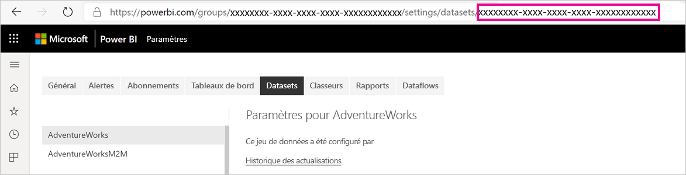
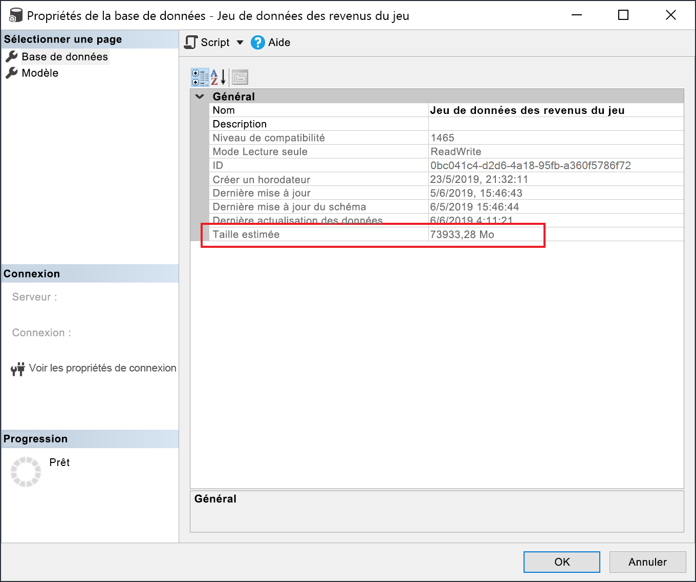

# <a name="large-datasets-in-power-bi-premium"></a>Grands jeux de données dans Power BI Premium

Les jeux de données Power BI peuvent stocker des données dans un cache en mémoire fortement compressé pour des performances optimisées des requêtes, ce qui permet une interactivité rapide des utilisateurs. Avec les capacités Premium, les grands jeux de données au-delà de la limite par défaut de 10 Go peuvent être activés avec le paramètre **Format de stockage des grands jeux de données**. Quand ce paramètre est activé, la taille du jeu de données est limitée par la taille de *capacité* Premium ou la taille maximale définie par l’administrateur.

Les grands jeux de données peuvent être activés pour toutes les références SKU Premium P et A Embedded. La limite de taille des grands jeux de données dans Premium est comparable à celle d’Azure Analysis Services, en termes de limitations de taille des modèles de données.

Si l’activation du paramètre Format de stockage des grands jeux de données est nécessaire pour permettre aux jeux de données d’aller au-delà de 10 Go, elle offre aussi d’autres avantages. Si vous prévoyez d’utiliser des outils basés sur un point de terminaison XMLA pour les opérations d’écriture des jeux de données, veillez à activer ce paramètre, même pour les jeux de données que vous ne classeriez pas nécessairement en tant que *grands* jeux de données. Quand ce paramètre est activé, le format de stockage des grands jeux de données peut améliorer les performances des opérations d’écriture de XMLA.

Les grands jeux de données dans le service n’affectent pas la taille de chargement du modèle Power BI Desktop, qui est reste limitée à 10 Go. Au lieu de cela, les jeux de données peuvent dépassent 10 Go dans le service lors de l’actualisation.

## <a name="enable-large-datasets"></a>Activer les grands jeux de données

Les étapes ci-dessous décrivent l’activation des grands jeux de données pour un nouveau modèle publié sur le service. Pour les jeux de données existants, seule l’étape 3 est nécessaire.

1. Créez un modèle de données dans Power BI Desktop. Si votre jeu de données va devenir plus grand et consommer progressivement plus de mémoire, veillez à configurer [Actualisation incrémentielle](service-premium-incremental-refresh.md).

1. Publiez le modèle en tant que jeu de données sur le service.

1. Dans le service > jeu de données > **Paramètres**, développez **Format de stockage des grands jeux de données**, cliquez sur le curseur pour le placer sur **Activé**, puis cliquez sur **Appliquer**.

    :::image type="content" source="media/service-premium-large-models/enable-large-dataset.png" alt-text="Activer le curseur pour les grands jeux de données":::

1. Appelez une actualisation pour charger les données d’historique en fonction de la stratégie d’actualisation incrémentielle. La première actualisation peut prendre un certain temps pour charger l’historique. Les actualisations suivantes doivent être plus rapides, selon votre stratégie d’actualisation incrémentielle.

## <a name="set-default-storage-format"></a>Définir le format de stockage par défaut

Tous les nouveaux jeux de données créés dans un espace de travail affecté à la capacité Premium peuvent avoir le format de stockage des grands jeux de données activé par défaut.

1. Dans l’espace de travail, cliquez sur **Paramètres** > **Premium**.

1. Dans **Format de stockage par défaut**, sélectionnez **Format de stockage des grands jeux de données**, puis cliquez sur **Enregistrer**.

    :::image type="content" source="media/service-premium-large-models/default-storage-format.png" alt-text="Activer le format de stockage par défaut":::

### <a name="enable-with-powershell"></a>Activer avec PowerShell

Vous pouvez aussi activer le format de stockage des grands jeux de données en utilisant PowerShell. Vous devez disposer de privilèges d’administrateur de capacité et d’administrateur d’espace de travail pour exécuter les applets de commande PowerShell.

1. Recherchez l’ID de jeu de données (GUID). Sous l’onglet **Jeux de données** de l’espace de travail, sous les paramètres du jeu de données, vous pouvez voir l’ID dans l’URL.

    

1. À partir d’une invite d’administrateur PowerShell, installez le module [MicrosoftPowerBIMgmt](/powershell/module/microsoftpowerbimgmt.data/).

    ```powershell
    Install-Module -Name MicrosoftPowerBIMgmt
    ```

1. Exécutez les applets de commande suivantes pour vous connecter et vérifier le mode de stockage du jeu de données.

    ```powershell
    Login-PowerBIServiceAccount

    (Get-PowerBIDataset -Scope Organization -Id <Dataset ID> -Include actualStorage).ActualStorage
    ```

    La réponse doit être la suivante. Le mode de stockage est ABF (fichier de sauvegarde Analysis Services), qui est la valeur par défaut.

    ```
    Id                   StorageMode

    --                   -----------

    <Dataset ID>         Abf
    ```

1. Exécutez les applets de commande suivantes pour définir le mode de stockage. La conversion en fichiers Premium peut prendre quelques secondes.

    ```powershell
    Set-PowerBIDataset -Id <Dataset ID> -TargetStorageMode PremiumFiles

    (Get-PowerBIDataset -Scope Organization -Id <Dataset ID> -Include actualStorage).ActualStorage
    ```

    La réponse doit être la suivante. Le mode de stockage est maintenant défini sur les fichiers Premium.

    ```
    Id                   StorageMode
    
    --                   -----------
    
    <Dataset ID>         PremiumFiles
    ```

Vous pouvez vérifier l’état des conversions de jeu de données vers et depuis les fichiers Premium à l’aide de l’applet de commande [Get-PowerBIWorkspaceMigrationStatus](/powershell/module/microsoftpowerbimgmt.workspaces/get-powerbiworkspacemigrationstatus).

## <a name="dataset-eviction"></a>Éviction de jeux de données

Power BI utilise la gestion de mémoire dynamique pour supprimer les jeux de données inactifs de la mémoire. Power BI supprime des jeux de données afin de pouvoir charger d’autres jeux de données pour répondre aux requêtes des utilisateurs. La gestion de mémoire dynamique permet à la somme des tailles des jeux de données d’être beaucoup plus importante que la mémoire disponible sur la capacité, mais un seul jeu de données doit tenir dans la mémoire. Pour plus d’informations sur la gestion de mémoire dynamique, consultez [Fonctionnement des capacités](service-premium-what-is.md#how-capacities-function).

Vous devez prendre en compte l’impact de l’éviction sur les grands modèles. Malgré des temps de chargement de jeux de données relativement rapides, il peut toujours y avoir un délai notable pour les utilisateurs s’ils doivent attendre le rechargement des jeux de données volumineux supprimés. C’est la raison pour laquelle, sous sa forme actuelle, la fonctionnalité des grands modèles est recommandée principalement pour les capacités dédiées aux exigences décisionnelles de l’entreprise plutôt que pour celles mélangées à des exigences décisionnelles libre-service. Les capacités dédiées aux exigences décisionnelles de l’entreprise sont moins susceptibles de déclencher une éviction et de recharger des jeux de données. En revanche, les capacités pour le décisionnel libre-service peuvent avoir de nombreux petits jeux de données qui sont plus souvent chargés en mémoire et supprimés de celle-ci.

## <a name="checking-dataset-size"></a>Vérification de la taille du jeu de données

Après avoir chargé les données d’historique, vous pouvez utiliser [SSMS](/sql/ssms/download-sql-server-management-studio-ssms) par le biais du [point de terminaison XMLA](service-premium-connect-tools.md) pour vérifier la taille estimée du jeu de données dans la fenêtre des propriétés du modèle.



Vous pouvez également vérifier la taille du jeu de données en exécutant les requêtes DMV suivantes à partir de SSMS. Additionnez les colonnes DICTIONARY\_SIZE et USED\_SIZE à partir de la sortie pour afficher la taille du jeu de données en octets.

```sql
SELECT * FROM SYSTEMRESTRICTSCHEMA
($System.DISCOVER_STORAGE_TABLE_COLUMNS,
 [DATABASE_NAME] = '<Dataset Name>') //Sum DICTIONARY_SIZE (bytes)

SELECT * FROM SYSTEMRESTRICTSCHEMA
($System.DISCOVER_STORAGE_TABLE_COLUMN_SEGMENTS,
 [DATABASE_NAME] = '<Dataset Name>') //Sum USED_SIZE (bytes)
```

## <a name="limitations-and-considerations"></a>Considérations et limitations

Gardez à l’esprit les restrictions suivantes lors de l’utilisation de grands jeux de données :

- **Les nouveaux espaces de travail sont obligatoires** : Les grands jeux de données fonctionnent seulement avec les [nouveaux espaces de travail](../collaborate-share/service-create-the-new-workspaces.md).

- **Télécharger sur Power BI Desktop** : si un jeu de données est stocké dans des fichiers Premium, le [téléchargement en tant que fichier. pbix](../create-reports/service-export-to-pbix.md) échoue.
- **Régions prises en charge** : Les grands jeux de données sont pris en charge dans toutes les régions Azure qui prennent en charge le stockage Premium Files. Pour en savoir plus, consultez [Produits disponibles par région](https://azure.microsoft.com/global-infrastructure/services/?products=storage) et consultez le tableau de la section suivante.

- **Définition de la taille maximale du jeu de données** : la taille maximale du jeu de données peut être définie par les administrateurs. La valeur maximale peut être définie entre 0,1 Go et la capacité maximale de la référence SKU.

## <a name="region-availability"></a>Disponibilité des régions

Les grands jeux de données dans Power BI sont disponibles seulement dans certaines régions Azure qui prennent en charge le [stockage Azure Premium Files](/azure/storage/files/storage-files-planning#storage-tiers).

La liste suivante contient les régions où les grands jeux de données dans Power BI sont disponibles. Les régions qui ne sont pas dans la liste suivante ne sont pas prises en charge pour les modèles volumineux :

|Région Azure  |Abréviation des régions Azure  |
|---------|---------|
|Australie Est     | australiaeast        |
|Australie Sud-Est     | australiasoutheast        |
|Est du Canada     | canadaeast        |
|Centre du Canada     | canadacentral        |
|Inde Centre     | centralindia        |
|USA Centre     | centralus        |
|Asie Est     | eastasia        |
|USA Est     | eastus        |
|USA Est 2     | eastus2        |
|Japon Est     | japaneast        |
|OuJapon Est     | japanwest        |
|Centre de la Corée     | KoreaCentral        |
|Corée du Sud     | KoreaSouth        |
|Centre-Nord des États-Unis     | northcentralus        |
|Europe Nord     | northeurope        |
|États-Unis - partie centrale méridionale     | southcentralus        |
|Asie Sud-Est     | southeastasia        |
|Sud du Royaume-Uni     | uksouth        |
|Ouest du Royaume-Uni     | ukwest        |
|Europe Ouest     | westeurope        |
|Inde Ouest     | westindia        |
|USA Ouest     | westus        |
|USA Ouest 2     | westus2        |

## <a name="next-steps"></a>Étapes suivantes

Les liens suivants fournissent des informations qui peuvent être utiles pour travailler avec des modèles volumineux :

* [Stockage Azure Premium Files](/azure/storage/files/storage-files-planning#storage-tiers)
* [Configurer la prise en charge multigéographique pour Power BI Premium](service-admin-premium-multi-geo.md)
* [Apporter vos propres clés de chiffrement pour Power BI](service-encryption-byok.md)
* [Fonctionnement des capacités](service-premium-what-is.md#how-capacities-function)
* [Actualisation incrémentielle](service-premium-incremental-refresh.md).

Introduite par Power BI, l’offre en préversion Power BI Premium Gen2 apporte les améliorations suivantes à l’expérience Power BI Premium :
* Performances
* Licences par utilisateur
* Mise à l’échelle supérieure
* Métriques améliorées
* Mise à l’échelle automatique
* Charge de gestion réduite

Pour plus d’informations sur Power BI Premium Gen2, consultez [Power BI Premium Generation 2 (préversion)](service-premium-what-is.md#power-bi-premium-generation-2-preview).
