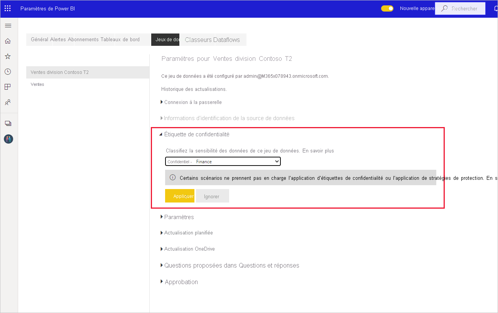
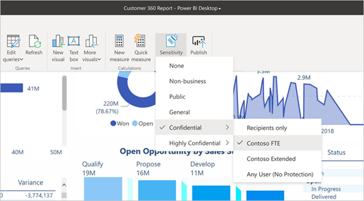

# Guide pratique pour appliquer des étiquettes de sensibilité dans Power BI

Les étiquettes de sensibilité de Microsoft Information Protection sur vos rapports, tableaux de bord, jeux de données, dataflows et fichiers .pbix peuvent protéger votre contenu sensible contre les accès non autorisés aux données et contre les fuites de données. L’étiquetage correct des données avec des étiquettes de sensibilité garantit que seules les personnes autorisées peuvent accéder à vos données. Cet article explique comment appliquer des étiquettes de sensibilité dans le service Power BI et dans Power BI Desktop.

Pour plus d’informations sur les étiquettes de sensibilité dans Power BI, consultez [Étiquettes de sensibilité dans Power BI](service-security-sensitivity-label-overview.md).

## Appliquer des étiquettes de sensibilité dans le service Power BI

Dans le service Power BI, vous pouvez appliquer des étiquettes de sensibilité à des rapports, tableaux de bord, jeux de données et dataflows.

Pour pouvoir appliquer des étiquettes de sensibilité dans le service Power BI :
* Vous devez disposer d’une [licence Power BI Pro](./service-admin-purchasing-power-bi-pro.md) et d’autorisations de modification sur le contenu que vous souhaitez étiqueter.
* Les étiquettes de sensibilité doivent être activées pour votre organisation. En cas de doute, contactez votre administrateur Power BI.
* Vous devez appartenir à un groupe de sécurité qui dispose des autorisations nécessaires pour appliquer des étiquettes de sensibilité, comme décrit dans [Activer les étiquettes de sensibilité dans Power BI](./service-security-enable-data-sensitivity-labels.md).
* Toutes les [Licences et autres configurations requises](./service-security-enable-data-sensitivity-labels.md#licensing-and-requirements) doivent être respectées.

Quand la protection des données est activée sur votre locataire, les étiquettes de sensibilité apparaissent dans la colonne de sensibilité dans la vue Liste des tableaux de bord, des rapports, des jeux de données et des dataflows.

**Pour appliquer ou modifier une étiquette de sensibilité sur un rapport ou un tableau de bord**
1. Cliquez sur **Plus d’options (...)** .
1. Sélectionnez **Paramètres**.
1. Dans le volet latéral des paramètres, choisissez l’étiquette de sensibilité appropriée.
1. Enregistrez les paramètres.

L’image suivante montre ces étapes sur un rapport

**Pour appliquer ou modifier une étiquette de sensibilité sur un jeu de données ou un dataflow**

1. Cliquez sur **Plus d’options (...)** .
1. Sélectionnez **Paramètres**.
1. Sélectionnez l’onglet des jeux de données ou des dataflows, selon ce qui est pertinent.
1. Développez la section des étiquettes de sensibilité, puis choisissez l’étiquette de sensibilité appropriée.
1. Appliquez les paramètres.

Les deux images suivantes montrent ces étapes sur un jeu de données.

Choisissez **Plus d’options (...)** , puis **Paramètres**.

Dans l’onglet des paramètres du jeu de données, ouvrez la section Étiquette de sensibilité, choisissez l’étiquette de sensibilité souhaitée, puis cliquez sur **Appliquer**.

## Appliquer des étiquettes de sensibilité dans Power BI Desktop (préversion)

Pour utiliser des étiquettes de sensibilité dans Power BI Desktop :
* Vous devez disposer d’une licence [Power BI Pro](./service-admin-purchasing-power-bi-pro.md).
* Les étiquettes de sensibilité doivent être activées pour votre organisation. En cas de doute, contactez votre administrateur Power BI.
* Vous devez appartenir à un groupe de sécurité qui dispose des autorisations nécessaires pour appliquer des étiquettes de sensibilité, comme décrit dans [Activer les étiquettes de sensibilité dans Power BI](./service-security-enable-data-sensitivity-labels.md).
* Toutes les [Licences et autres configurations requises](./service-security-enable-data-sensitivity-labels.md#licensing-and-requirements) doivent être respectées.
* Le commutateur de la fonctionnalité en préversion Information Protection de Power BI Desktop doit être activé. Si le bouton de sensibilité apparaît dans l’onglet Accueil, la fonctionnalité en préversion est activée. Si le bouton n’apparaît pas, choisissez **Fichier > Options et paramètres > Options > Fonctionnalités en préversion**, puis cochez la case **Information Protection**.

    

    >[!Important]
    >Après avoir activé la fonctionnalité en préversion Information Protection, vous devez redémarrer Desktop pour pouvoir commencer à utiliser des étiquettes de sensibilité.
    >
    >Si Desktop plante lorsque vous le redémarrez, cela peut être dû au fait que la version requise de la bibliothèque Runtime Redistributable Visual C++ n’est pas installée sur votre ordinateur. Si vous rencontrez ce problème, accédez à la [page de téléchargement de Microsoft Visual C++ 2015 Redistributable Update 3](https://www.microsoft.com/download/details.aspx?id=53587) pour obtenir des instructions sur le téléchargement et l’installation de la mise à jour. Après avoir installé la mise à jour, réessayez de démarrer Desktop.

    Si vous ne voyez pas l’option en préversion Information Protection, cette fonctionnalité est peut être bloquée pour votre organisation. Dans ce cas, contactez votre administrateur Power BI.

* Vous devez être connecté.

Pour appliquer une étiquette de sensibilité sur le fichier sur lequel vous travaillez, cliquez sur le bouton de sensibilité dans l’onglet Accueil, puis choisissez l’étiquette souhaitée dans le menu qui s’affiche.

>[!NOTE]
> Si vous avez activé la fonctionnalité des étiquettes de sensibilité dans les fonctionnalités en préversion, mais que vous ne voyez toujours pas le bouton de sensibilité, cela peut signifier que vous n’avez pas de licence appropriée ou que vous n’appartenez pas au groupe de sécurité qui dispose des autorisations pour appliquer des étiquettes de sensibilité, comme décrit dans [Activer les étiquettes de sensibilité dans Power BI](./service-security-enable-data-sensitivity-labels.md).

Une fois que vous avez appliqué l’étiquette, celle-ci est visible dans la barre d’état.

### Étiquettes de sensibilité lors du chargement ou du téléchargement de fichiers .pbix à partir du service
* Lorsque vous publiez un fichier .pbix dans le service Power BI à partir de Desktop, ou lorsque vous chargez un fichier .pbix sur le service Power BI directement à l’aide de **Obtenir des données**, l’étiquette du fichier .pbix est appliquée au rapport et au jeu de données créés dans le service. Si le fichier .pbix que vous publiez ou chargez remplace des ressources existantes (c’est-à-dire des ressources qui portent le même nom que le fichier .pbix), l’étiquette du fichier .pbix remplacera toutes les étiquettes sur ces ressources.
* Quand vous utilisez l’option « Download to .pbix » (Télécharger dans .pbix) dans le service Power BI, si le rapport et le jeu de données téléchargés comportent des étiquettes et que ces étiquettes sont différentes, l’étiquette la plus restrictive sera appliquée au fichier .pbix.

## Supprimer des étiquettes de sensibilité

### Service
Pour supprimer une étiquette de sensibilité d’un rapport, d’un tableau de bord, d’un jeu de données ou d’un flux de données, suivez la [même procédure que celle utilisée pour appliquer des étiquettes dans le service Power BI](#apply-sensitivity-labels-in-the-power-bi-service), mais choisissez **(Aucune)** quand vous êtes invité à classifier la sensibilité des données.

### Bureau
La suppression de l’étiquette de sensibilité d’un fichier .pbix après son enregistrement avec l’étiquette n’est pas prise en charge actuellement dans Desktop. Dans ce cas, il est recommandé de publier le fichier sur le service Power BI, puis de supprimer l’étiquette du rapport et du jeu de données suivants dans le service.

## Considérations et limitations

Consultez [Étiquettes de sensibilité dans Power BI](service-security-sensitivity-label-overview.md#limitations) pour obtenir la liste des limitations relatives aux étiquettes de sensibilité dans Power BI.

## Étapes suivantes

L’objectif de cet article était d’expliquer comment appliquer des étiquettes de sensibilité dans Power BI. Les articles suivants fournissent plus de détails sur la protection des données dans Power BI. 

* [Vue d’ensemble des étiquettes de sensibilité dans Power BI](./service-security-sensitivity-label-overview.md)
* [Activer les étiquettes de sensibilité dans Power BI](./service-security-enable-data-sensitivity-labels.md)
* [Utilisation de contrôles Microsoft Cloud App Security dans Power BI](./service-security-using-microsoft-cloud-app-security-controls.md)