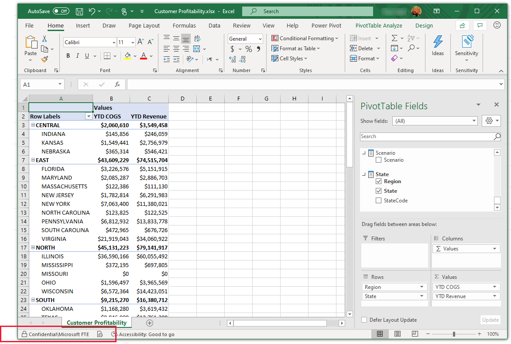
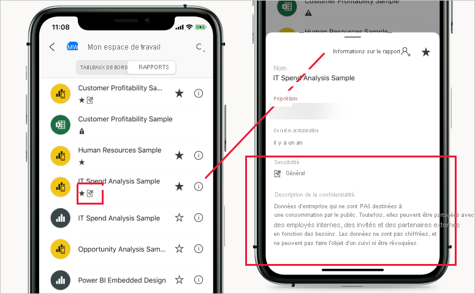

# Étiquettes de sensibilité dans Power BI

Cet article décrit les fonctionnalités des étiquettes de sensibilité de Microsoft Information Protection dans Power BI.

Pour plus d’informations sur l’activation des étiquettes de confidentialité sur un locataire, et notamment les conditions de licence et les prérequis, consultez [Activation des étiquettes de confidentialité des données dans Power BI](service-security-enable-data-sensitivity-labels.md).

Pour plus d’informations sur la façon d’appliquer des étiquettes de sensibilité à votre contenu et vos fichiers Power BI, consultez [Guide pratique pour appliquer des étiquettes de sensibilité dans Power BI](./service-security-apply-data-sensitivity-labels.md).

>[!NOTE]
>La prise en charge des étiquettes de sensibilité dans Power BI Desktop est actuellement en préversion.

## Introduction

Les étiquettes de sensibilité de Microsoft Information Protection offrent aux utilisateurs un moyen simple de classifier du contenu critique dans Power BI sans compromettre la productivité ni la possibilité de collaborer. Elles peuvent être appliquées à la fois dans Power BI Desktop (préversion) et dans le service Power BI, ce qui vous permet de protéger vos données sensibles depuis le moment où vous commencez à développer votre contenu jusqu’au moment où vous accédez à ce contenu depuis Excel via une connexion active. Les étiquettes de sensibilité sont conservées sous la forme de fichiers .pbix lorsque vous déplacez votre contenu entre Desktop et le service.

Dans le service Power BI, les étiquettes de confidentialité peuvent être appliquées à des jeux de données, à des rapports, à des tableaux de bord et à des dataflows. Quand les données étiquetées quittent Power BI, que ce soit par exportation dans des fichiers Excel, PDF ou .pbix, ou suivant d’autres scénarios d’exportation pris en charge (par exemple, Analyser dans Excel ou tableaux croisés dynamiques de connexion active dans Excel), Power BI applique automatiquement l’étiquette au fichier exporté et le protège en fonction des paramètres de chiffrement de fichier de l’étiquette. De cette façon, vos données sensibles restent protégées, même quand elles quittent Power BI.

En outre, les étiquettes de sensibilité peuvent être appliquées aux fichiers .pbix dans Power BI Desktop pour sécuriser vos données et contenus lorsqu’ils sont partagés en dehors de Power BI (par exemple, afin que seuls les utilisateurs de votre organisation puissent ouvrir un fichier .pbix confidentiel partagé ou joint à un e-mail), même avant sa publication sur le service Power BI. Pour plus d’informations, consultez [Restreindre l’accès au contenu à l’aide d’étiquettes de sensibilité afin d’appliquer un chiffrement](https://docs.microsoft.com/microsoft-365/compliance/encryption-sensitivity-labels?view=o365-worldwide) .

Les étiquettes de confidentialité appliquées à des rapports, tableaux de bord, jeux de données et dataflows sont visibles à de nombreux endroits du service Power BI. Les étiquettes de sensibilité sur les rapports et les tableaux de bord sont également visibles dans les applications mobiles Power BI sur iOS et Android, et dans les visuels incorporés. Dans Desktop, vous pouvez voir l’étiquette sensibilité dans la barre d’état.

Un [rapport des métriques de protection](service-security-data-protection-metrics-report.md) disponible dans le portail d’administration Power BI donne aux administrateurs Power BI une visibilité complète sur les données sensibles du locataire Power BI. Par ailleurs, les journaux d’audit Power BI comportent des informations relatives aux étiquettes de confidentialité concernant diverses activités (par exemple, l’application, la suppression et la modification des étiquettes, ainsi que la visualisation des rapports, des tableaux de bord, etc.), ce qui donne aux administrateurs Power BI et aux administrateurs de la sécurité une visibilité sur la consommation des données sensibles à des fins de monitoring et d’examen des alertes de sécurité.

## Considérations importantes

Dans le service Power BI, les étiquettes de sensibilité **n’affectent pas** l’accès au contenu. L’accès au contenu du service est géré uniquement par des autorisations Power BI. Les étiquettes sont visibles, mais les paramètres de chiffrement associés (configurés dans le [Centre de sécurité Microsoft 365](https://security.microsoft.com/) ou dans le [Centre de conformité Microsoft 365](https://compliance.microsoft.com/)) ne sont pas appliqués. Elles ne s’appliquent qu’aux données qui quittent le service via un chemin d'exportation pris en charge, par exemple une exportation vers Excel, PowerPoint ou PDF, ou un téléchargement vers .pbix.

Dans Power BI Desktop (préversion), les étiquettes de sensibilité avec des paramètres de chiffrement **affectent** l’accès au contenu. Si un utilisateur ne dispose pas des [autorisations](#power-bi-desktop-preview) suffisantes en fonction des paramètres de chiffrement de l’étiquette de sensibilité pour le fichier .pbix, il ne pourra pas ouvrir le fichier. En outre, dans Desktop, lorsque vous enregistrez votre travail, toute étiquette de sensibilité que vous avez ajoutée et les paramètres de chiffrement associés sont appliqués au fichier .pbix enregistré.

Ni les étiquettes de confidentialité, ni le chiffrement de fichier **ne s’appliquent** dans les chemins d’exportation non pris en charge. L’administrateur Power BI peut bloquer l’exportation à partir de chemins d’exportation non pris en charge.

>[!NOTE]
> Les utilisateurs qui disposent d’une autorisation d’accès à un rapport sont autorisés à accéder à l’ensemble du jeu de données sous-jacent, sauf si la [sécurité au niveau des lignes (SNL)](./service-admin-rls.md) limite leur accès. Les auteurs de rapports peuvent classifier et étiqueter les rapports en utilisant des étiquettes de confidentialité. Si l’étiquette de sensibilité a des paramètres de protection, Power BI les applique quand les données des rapports quittent Power BI via un chemin d’exportation pris en charge, par exemple une exportation vers Excel, PowerPoint ou PDF, ou un téléchargement vers .pbix, et que vous sélectionnez **Enregistrer** (Desktop). Seuls les utilisateurs autorisés peuvent ouvrir des fichiers protégés.

### Chemins d’exportation pris en charge
L’application des étiquettes de confidentialité et de la protection associée aux données qui quittent le service Power BI est actuellement prise en charge pour les chemins d’exportation suivants :
* Exportation vers des fichiers Excel, PDF (service uniquement) et PowerPoint.
* Analyser dans Excel à partir du service Power BI, qui déclenche le téléchargement d’un fichier Excel avec une connexion active à un jeu de données Power BI
* Tableau croisé dynamique dans Excel avec une connexion active à un jeu de données Power BI, pour les utilisateurs disposant de M365 E3 (ou version ultérieure)
* Télécharger vers .pbix (service)

>[!NOTE]
>Lorsque vous utilisez **Télécharger vers .pbix** dans le service Power BI, si le rapport téléchargé et son jeu de données comportent des étiquettes différentes, l’étiquette la plus restrictive sera appliquée au fichier .pbix. 

## Fonctionnement des étiquettes de sensibilité dans Power BI

L’application d’une étiquette de sensibilité à un contenu et des fichiers Power BI est similaire à l’application d’une balise à cette ressource, ce qui offre les avantages suivants :
* **Personnalisable** : vous pouvez créer des catégories pour différents niveaux de contenu sensible dans votre organisation, comme Personnel, Public, Général, Confidentiel et Hautement confidentiel.
* **Texte en clair** : étant donné que l’étiquette est en texte clair, les utilisateurs peuvent facilement comprendre comment traiter le contenu en fonction des indications relatives à l’étiquette de sensibilité.
* **Persistante** : une fois qu’une étiquette de sensibilité a été appliquée au contenu, elle accompagne ce contenu quand il est exporté vers des fichiers Excel, PowerPoint et PDF, téléchargé vers .pbix, ou enregistré (dans Desktop) et devient la base pour l’application de stratégies.

Voici un exemple rapide de la façon dont fonctionnent les étiquettes de sensibilité dans Power BI. L’image ci-dessous montre comment une étiquette de sensibilité est appliquée à un rapport dans le service Power BI, puis comment les données du rapport sont exportées vers un fichier Excel, et enfin comment l’étiquette de sensibilité et ses protections persistent dans le fichier exporté.

Les étiquettes de confidentialité appliquées au contenu sont conservées et suivent le contenu au fil de ses utilisations et partages dans Power BI. Vous pouvez utiliser l’étiquetage pour générer des rapports d’utilisation et voir les données d’activité de votre contenu sensible.

## Étiquettes de sensibilité dans Power BI Desktop (préversion)

Les étiquettes de sensibilité peuvent également être appliquées dans Power BI Desktop. Vous pouvez ainsi protéger vos données à partir du moment où vous commencez à développer votre contenu. Lorsque vous enregistrez votre travail dans Desktop, l’étiquette de sensibilité que vous avez appliquée, ainsi que tous les paramètres de chiffrement associés, sont appliquées au fichier .pbix résultant. Si l’étiquette comporte des paramètres de chiffrement, le fichier est donc protégé quelle que soit sa destination, mais il est transmis. Seuls les utilisateurs ayant les [autorisations RMS nécessaires](#power-bi-desktop-preview) pourront l’ouvrir.

>[!NOTE]
>* Dans cette préversion, certaines limitations peuvent s’appliquer. Voir [Limitations](#limitations).
>* Pour pouvoir utiliser des étiquettes de confidentialité dans Power BI Desktop, vous devez d’abord [activer la fonctionnalité Information Protection (préversion)](service-security-apply-data-sensitivity-labels.md#apply-sensitivity-labels-in-power-bi-desktop-preview), puis redémarrer le programme. Si le programme plante après son redémarrage, cela peut être dû au fait que la version requise de la bibliothèque Runtime Redistributable Visual C++ n’est pas installée sur votre ordinateur. Si vous rencontrez ce problème, accédez à la [page de téléchargement de Microsoft Visual C++ 2015 Redistributable Update 3](https://www.microsoft.com/download/details.aspx?id=53587) pour obtenir des instructions sur le téléchargement et l’installation de la mise à jour. Après avoir installé la mise à jour, réessayez de démarrer Desktop.

Si vous appliquez une étiquette de sensibilité dans Desktop, lorsque vous publiez votre travail sur le service ou téléchargez un fichier .pbix de ce travail vers le service, l’étiquette se déplace avec les données dans le service. Dans le service, l’étiquette est appliquée au jeu de données et au rapport que vous avez obtenus avec le fichier. Si le jeu de données et le rapport ont déjà des étiquettes de sensibilité, ces étiquettes seront remplacées par l’étiquette provenant de Desktop.
 
Si vous chargez un fichier .pbix qui n’a jamais été publié sur le service, et qui porte le même nom qu’un rapport ou un jeu de données déjà présent sur le service, le téléchargement réussit uniquement si le chargeur dispose des autorisations RMS nécessaires pour modifier l’étiquette.

Il en va de même dans la direction opposée : lorsque vous téléchargez vers .pbix dans le service, puis chargez le fichier .pbix dans Desktop, l’étiquette qui se trouvait dans le service sera appliquée au fichier .pbix téléchargé et, à partir de là, il sera chargé dans Desktop. Si le rapport et le jeu de données dans le service comportent des étiquettes différentes, la plus restrictive des deux sera appliquée au fichier .pbix téléchargé.

Lorsque vous appliquez une étiquette dans Desktop, elle s’affiche dans la barre d’état.

[Découvrez comment appliquer des étiquettes de sensibilité à du contenu et des fichiers Power BI](./service-security-apply-data-sensitivity-labels.md).

## Héritage des étiquettes de sensibilité lors de la création d’un nouveau contenu

Quand de nouveaux rapports et tableaux de bord sont créés dans le service Power BI, ils héritent automatiquement de l’étiquette de sensibilité précédemment appliquée sur le jeu de données ou le rapport parent. Par exemple, un nouveau rapport créé sur un jeu de données qui a une étiquette de sensibilité « Hautement confidentiel » reçoit automatiquement cette étiquette « Hautement confidentiel ».

L’illustration suivante montre comment l’étiquette de sensibilité d’un jeu de données est automatiquement appliquée à un rapport basé sur le jeu de données.

>[!NOTE]
>Si pour une raison quelconque, l’étiquette de sensibilité ne peut pas être appliquée sur le nouveau rapport ou tableau de bord, Power BI ne bloque **pas** la création du nouvel élément.

## Étiquettes de sensibilité et protection sur les données exportées

Quand des données sont exportées depuis Power BI vers des fichiers Excel, PDF (service uniquement) ou PowerPoint, Power BI applique automatiquement une étiquette de sensibilité sur le fichier exporté et le protège en fonction des paramètres de chiffrement de fichier de l’étiquette. De cette façon, vos données sensibles restent protégées, quel que soit l’endroit où elles se trouvent.

Un utilisateur qui exporte un fichier à partir de Power BI dispose d’autorisations pour accéder à ce fichier et le modifier en fonction des paramètres d’étiquette de sensibilité ; il ne reçoit pas les autorisations de propriétaire sur le fichier.

>[!NOTE]
>Lorsque vous utilisez **Télécharger vers .pbix** dans le service Power BI, si le rapport téléchargé et son jeu de données comportent des étiquettes différentes, l’étiquette la plus restrictive sera appliquée au fichier .pbix. 

Les étiquettes de sensibilité et la protection ne sont pas appliquées quand les données sont exportées vers des fichiers .csv ou d’autres chemins d’exportation non pris en charge.

L’application d’une étiquette de sensibilité et d’une protection à un fichier exporté n’ajoute pas de marquage du contenu au fichier. Cependant, si l’étiquette est configurée pour appliquer des marquages de contenu, ceux-ci sont automatiquement appliqués par le client d’étiquetage unifié Azure Information Protection quand le fichier est ouvert dans des applications de poste de travail Office. Les marquages de contenu ne sont pas appliqués automatiquement quand vous utilisez l’étiquetage intégré pour les applications de bureau, mobiles ou web. Pour plus d’informations, consultez [Lorsque les applications Office appliquent le marquage de contenu et le chiffrement](/microsoft-365/compliance/sensitivity-labels-office-apps#when-office-apps-apply-content-marking-and-encryption).

L’exportation échoue si une étiquette ne peut pas être appliquée quand les données sont exportées vers un fichier. Pour vérifier si l’exportation a échoué parce que l’étiquette n’a pas pu être appliquée, cliquez sur le nom du rapport ou du tableau de bord au centre de la barre de titre et vérifiez si le message « Impossible de charger l’étiquette de confidentialité » apparaît dans la liste déroulante des informations qui s’ouvre. Ceci peut se produire à la suite d’un problème système temporaire, ou si l’étiquette appliquée a été supprimée ou si sa publication a été annulée par l’administrateur de la sécurité.

## Héritage des étiquettes de sensibilité dans Analyser dans Excel

Lorsque vous créez un tableau croisé dynamique dans Excel avec une connexion active à un jeu de données Power BI (vous pouvez le faire à partir de Power BI à l’aide de [Analyser dans Excel](../collaborate-share/service-analyze-in-excel.md) ou de [Excel](https://support.microsoft.com/office/create-a-pivottable-from-power-bi-datasets-31444a04-9c38-4dd7-9a45-22848c666884?ui=en-US&rs=en-US&ad=US)), l’étiquette de sensibilité du jeu de données est héritée et appliquée à votre fichier Excel, ainsi que toute protection associée. Si, par la suite, l’étiquette du jeu de données devient plus restrictive, l’étiquette appliquée sur le fichier Excel lié est automatiquement mise à jour lors de l’actualisation des données.

 
Les étiquettes de sensibilité dans Excel qui ont été définies manuellement ne sont pas automatiquement remplacées par l’étiquette de sensibilité du jeu de données. Au lieu de cela, une bannière vous avertit que le jeu de données a une étiquette de sensibilité et vous recommande de l’appliquer.

>[!NOTE]
>Si l’étiquette de sensibilité du jeu de données est moins restrictive que l’étiquette de sensibilité du fichier Excel, aucun héritage ou mise à jour d’étiquette n’a lieu. Un fichier Excel n’hérite jamais d’une étiquette de sensibilité moins restrictive.

## Persistance des étiquettes de sensibilité dans les rapports et tableaux de bord incorporés

Vous pouvez incorporer des rapports, des tableaux de bord et des visuels Power BI dans des applications métier, comme Microsoft Teams et SharePoint, ou sur le site web d’une organisation. Quand vous incorporez un visuel, un rapport ou un tableau de bord auquel une étiquette de sensibilité est appliquée, l’étiquette de sensibilité est visible dans la vue incorporée et l’étiquette et sa protection persistent quand les données sont exportées vers Excel.

Les scénarios d’incorporation suivants sont pris en charge :
* [Incorporer pour votre organisation](../developer/embedded/embed-sample-for-your-organization.md)
* Applications Microsoft 365 (par exemple [Teams](../collaborate-share/service-embed-report-microsoft-teams.md) et [SharePoint](../collaborate-share/service-embed-report-spo.md))
* [Sécuriser l’incorporation d’URL](../collaborate-share/service-embed-secure.md) (incorporation à partir du service Power BI) 

## Étiquettes de sensibilité dans les applications mobiles Power BI

Les étiquettes de sensibilité peuvent être visualisées sur les rapports et les tableaux de bord dans les applications mobiles Power BI. Une icône près du nom du rapport ou du tableau de bord indique qu’il a une étiquette de sensibilité, et le type d’étiquette et sa description se trouvent dans la zone d’informations du rapport ou du tableau de bord.

## Clouds pris en charge
Les étiquettes de confidentialité sont prises en charge seulement pour les locataires dans des clouds (publics) mondiaux ; elles ne sont pas prises en charge dans des clouds comme les clouds nationaux.

## Licences et configuration requise

Consultez [Licences et configuration requise](service-security-enable-data-sensitivity-labels.md#licensing-and-requirements).

## Création et gestion des étiquettes de sensibilité

Les étiquettes de sensibilité sont créées et gérées dans le [Centre de sécurité Microsoft 365](https://security.microsoft.com/) ou dans le [Centre de conformité Microsoft 365](https://compliance.microsoft.com/).

Pour accéder aux étiquettes de sensibilité dans un de ces centres, accédez à **Classification > Étiquettes de sensibilité**. Ces étiquettes de sensibilité peuvent être utilisées par plusieurs services Microsoft, comme Azure Information Protection, les applications Office et les services Office 365.

>[!Important]
> Si votre organisation utilise des étiquettes de sensibilité Azure Information Protection, vous devez [les migrer](/azure/information-protection/configure-policy-migrate-labels) vers un des services listés précédemment pour que les étiquettes soient utilisées dans Power BI.

## Limites

### Général

* Il n’est pas recommandé d’autoriser les utilisateurs à appliquer des étiquettes parentes dans Power BI (une étiquette n’est considérée comme une étiquette parente que si elle comporte des sous-étiquettes). Si une étiquette parent est appliquée au contenu, l’exportation de données à partir de ce contenu vers un fichier (Excel, PowerPoint et PDF) échouera. Consultez [Sous-étiquettes (étiquettes de regroupement)](/microsoft-365/compliance/sensitivity-labels#sublabels-grouping-labels).

* Les étiquettes de sensibilité de données ne sont pas prises en charge pour les applications de modèle. Les étiquettes de sensibilité définies par le créateur de l’application de modèle sont supprimées lors de l’extraction et de l’installation de l’application, et les étiquettes de sensibilité ajoutées aux artefacts dans un modèle d’application installé par le consommateur de l’application sont perdues (réinitialisées sur Nothing (pas de sélection)) lorsque l’application est mise à jour.

* Dans le service Power BI, si un jeu de données comporte une étiquette qui a été supprimée du centre d’administration des étiquettes, vous ne pourrez pas exporter ou télécharger les données. Dans Analyser dans Excel, un avertissement s’affiche et les données sont exportées vers un fichier .odc sans étiquette de sensibilité. Dans Desktop, si un fichier .pbix comporte ce type d’étiquette non valide, vous ne pourrez pas enregistrer le fichier.

* Power BI ne prend pas en charge les étiquettes de sensibilité des types de protection [Ne pas transférer](/microsoft-365/compliance/encryption-sensitivity-labels#let-users-assign-permissions), [Défini par l’utilisateur](/microsoft-365/compliance/encryption-sensitivity-labels#let-users-assign-permissions) et [HYOK](/azure/information-protection/configure-adrms-restrictions). Les types de protection Ne pas transférer et Défini par l’utilisateur font référence aux étiquettes définies dans le [Centre de sécurité Microsoft 365](https://security.microsoft.com/) ou dans le [Centre de conformité Microsoft 365](https://compliance.microsoft.com/).

### service Power BI

* Les étiquettes de sensibilité peuvent être appliquées seulement sur des tableaux de bord, des rapports, des jeux de données et des dataflows. Les étiquettes de sensibilité ne sont pas disponibles pour les [rapports paginés](../paginated-reports/report-builder-power-bi.md) et les classeurs.

* Les étiquettes de sensibilité sur les ressources Power BI sont visibles dans les vues Liste d’espaces de travail, Traçabilité, Favoris et Applications ; elles ne sont actuellement pas visibles dans la vue Partagé avec moi. Notez, toutefois, qu’une étiquette appliquée à une ressource Power BI, même si elle n’est pas visible, est toujours conservée sur les données exportées vers des fichiers Excel, PowerPoint et PDF.

### Power BI Desktop (préversion)

* Les fichiers .pbix protégés peuvent uniquement être ouverts et/ou publiés par un utilisateur qui est le propriétaire RMS du fichier (l’utilisateur qui a appliqué l’étiquette au fichier à l’origine) ou qui dispose d’un [**contrôle total** et/ou des droits d’utilisation **Exporter**](https://docs.microsoft.com/microsoft-365/compliance/encryption-sensitivity-labels?view=o365-worldwide) pour l’étiquette correspondante. Le propriétaire RMS dispose d’un contrôle total et ne peut jamais être exclu. [Consultez plus de détails](https://docs.microsoft.com/azure/information-protection/configure-usage-rights#rights-management-issuer-and-rights-management-owner)

* Si l’étiquette appliquée à un fichier .pbix n’a pas été publiée pour l’utilisateur dans le Centre de sécurité Microsoft 365 ou dans le Centre de conformité Microsoft 365, l’utilisateur ne pourra pas enregistrer le fichier dans Desktop.

* Les utilisateurs Power BI Desktop peuvent rencontrer des problèmes lors de l’enregistrement de leur travail si la connectivité Internet est perdue, par exemple après une mise hors connexion. Sans connexion Internet, certaines actions liées aux étiquettes de sensibilité et à la gestion des droits peuvent ne pas se terminer correctement. Dans ce cas, il est recommandé de revenir en ligne et de réessayer d’enregistrer le travail.

* Si vous avez créé un modèle de grande taille et que le fichier .pbix protégé résultant est très volumineux (plus de 2 Go), il peut se bloquer quand vous essayez de l’enregistrer ou de l’ouvrir. Pour contourner ce contournement, supprimez la protection du fichier .pbix et réappliquez-la une fois le fichier publié sur le service Power BI.

    En général, lorsque vous protégez un fichier avec une étiquette de sensibilité qui applique un chiffrement, il est recommandé d’utiliser également une autre méthode de chiffrement, par exemple le chiffrement du fichier d’échange, le chiffrement NTFS, BitLocker, un logiciel anti-programme malveillant, etc.

* Les fichiers temporaires ne sont pas chiffrés.

* L’option **Obtenir des données** permet de charger des fichiers protégés uniquement s’ils sont locaux. Les fichiers protégés provenant de services en ligne comme SharePoint Online ou OneDrive Entreprise ne peuvent pas être chargés. Pour un fichier protégé, vous pouvez le charger à partir de votre appareil local, ou supprimer d’abord l’étiquette du fichier dans Power BI Desktop puis charger le fichier via l’un des services en ligne.

* L’option **Exporter au format PDF** ne prend pas en charge les étiquettes de sensibilité. Si vous exportez un fichier dont l’étiquette de sensibilité est au format PDF, le fichier PDF ne reçoit pas l’étiquette et aucune protection n’est appliquée.

* La protection des informations dans Power BI Desktop ne prend pas en charge **B2B** ni les **scénarios mutualisés**.

## Étapes suivantes

Cet article a fourni une vue d’ensemble de la protection des données dans Power BI. Les articles suivants fournissent plus de détails sur la protection des données dans Power BI. 

* [Activer les étiquettes de sensibilité dans Power BI](service-security-enable-data-sensitivity-labels.md)
* [Guide pratique pour appliquer des étiquettes de sensibilité dans Power BI](service-security-apply-data-sensitivity-labels.md)
* [Utilisation de contrôles Microsoft Cloud App Security dans Power BI](service-security-using-microsoft-cloud-app-security-controls.md)
* [Rapport des métriques de protection](service-security-data-protection-metrics-report.md)