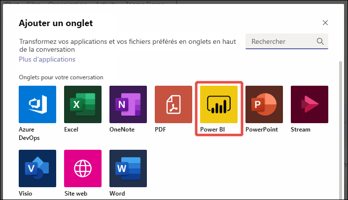
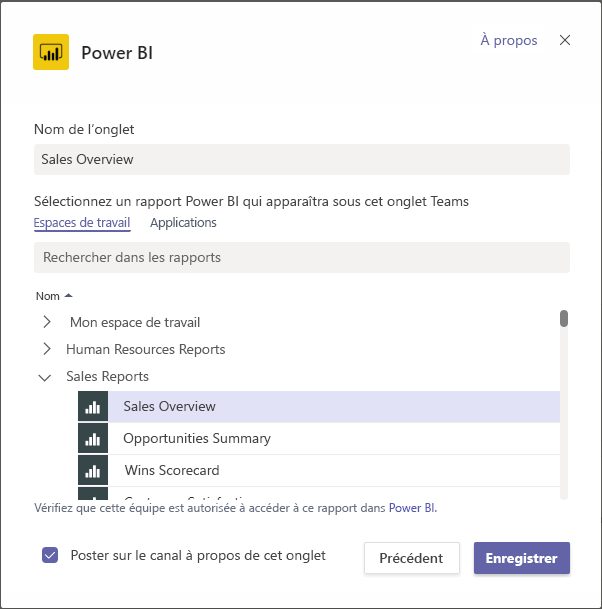
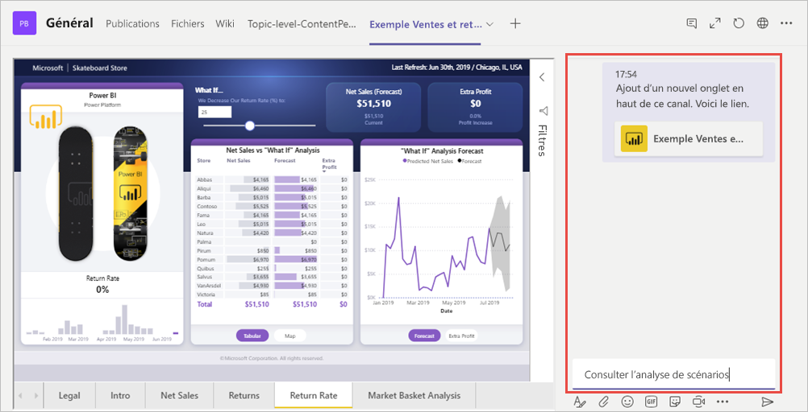

# Incorporer du contenu Power BI dans Microsoft Teams

Vous pouvez facilement incorporer des rapports Power BI interactifs dans les canaux et conversations Microsoft Teams. 

## Configuration requise

Pour utiliser l’onglet **Power BI** dans Microsoft Teams, vérifiez les éléments suivants :

- Microsoft Teams a l’onglet **Power BI**.
- Pour ajouter un rapport dans Microsoft Teams avec l’onglet **Power BI**, vous disposez au moins du rôle Lecteur dans l’espace de travail qui héberge le rapport. Pour plus d’informations sur les différents rôles, consultez [Rôles dans les nouveaux espaces de travail](service-new-workspaces.md#roles-in-the-new-workspaces).
- Pour afficher le rapport sous l’onglet **Power BI** dans Microsoft Teams, les utilisateurs doivent être autorisés à visualiser le rapport.
- Les utilisateurs doivent être des utilisateurs de Microsoft Teams ayant accès aux canaux et aux conversations.

Consultez [Collaborer dans Microsoft Teams avec Power BI](service-embed-report-microsoft-teams.md) pour obtenir des informations générales sur la façon dont Power BI et Teams fonctionnent ensemble et sur d’autres exigences.

## Incorporer un rapport dans Teams

Suivez ces étapes pour incorporer votre rapport dans un canal ou une conversation Microsoft Teams.

1. Ouvrez un canal ou une conversation dans Microsoft Teams, puis sélectionnez l’icône **+** .

    

1. Sélectionnez l’onglet **Power BI**.

    

1. Utilisez les options fournies pour sélectionner un rapport dans un espace de travail ou une application Power BI.

    

1. Le nom de l’onglet est automatiquement mis à jour pour correspondre au nom du rapport, mais vous pouvez le modifier.

1. Sélectionnez **Enregistrer**.

### Rapports que vous pouvez incorporer sous l’onglet Power BI

Vous pouvez incorporer les types de rapports suivants sur l’onglet **Power BI** :

- Rapports interactifs et paginés.
- Rapports dans **Mon espace de travail**, les nouvelles expériences d’espace de travail et les espaces de travail classiques.
- Rapports dans des applications Power BI.

## Démarrer une conversation

Quand vous ajoutez un onglet de rapport Power BI dans Microsoft Teams, Teams crée automatiquement un onglet de conversation pour le rapport.

- Sélectionnez l’icône **Afficher l’onglet de conversation** dans l’angle supérieur droit.

    

    Le premier commentaire est un lien vers le rapport. Tout le monde dans ce canal Microsoft Teams peut voir le rapport et en discuter dans la conversation.

    

## Problèmes connus et limitations

- Vous ne pouvez pas incorporer les tableaux de bord Power BI dans l’onglet **Power BI** pour Microsoft Teams.
- Les [filtres d’URL](service-url-filters.md) ne sont pas pris en charge avec l’onglet **Power BI** pour Microsoft Teams.
- Dans les clouds nationaux, le nouvel onglet **Power BI** n’est pas disponible. Une version plus ancienne peut être disponible, qui ne prend pas en charge la nouvelle expérience ni les rapports dans les applications Power BI.
- Une fois que vous avez enregistré l’onglet, vous ne changez pas son nom via les paramètres des onglets. Utilisez l’option **Renommer** pour le changer.
- Pour d’autres problèmes, consultez la section [Problèmes connus et limitations](service-collaborate-microsoft-teams.md#known-issues-and-limitations) de l’article « Collaborer dans Microsoft Teams ».

## Étapes suivantes

- [Collaborer dans Microsoft Teams avec Power BI](service-collaborate-microsoft-teams.md)

D’autres questions ? [Essayez d’interroger la communauté Power BI](https://community.powerbi.com/)
