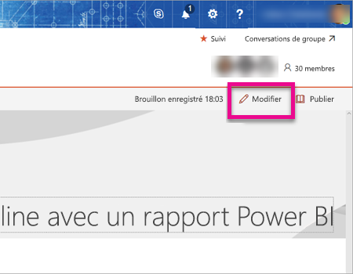
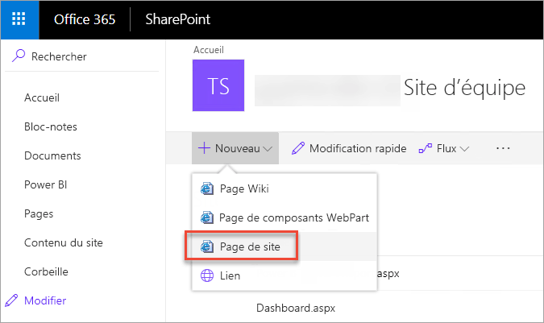
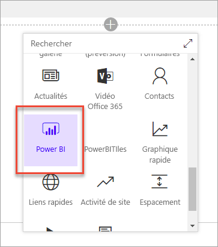
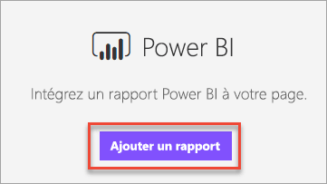
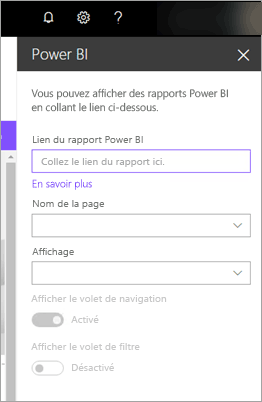
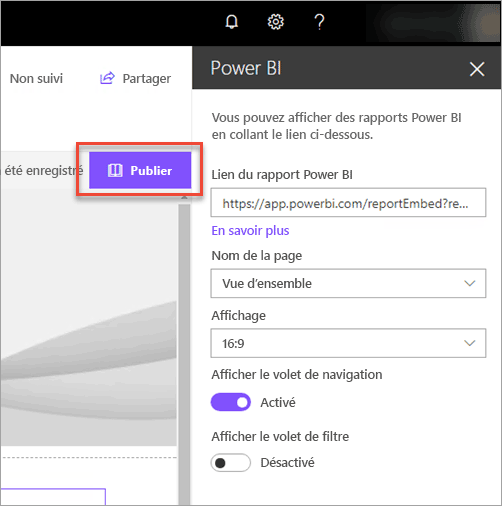
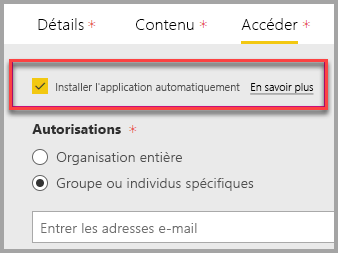
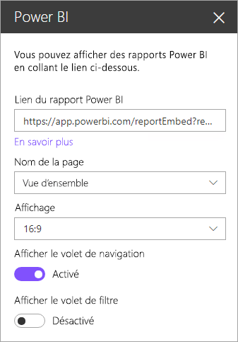
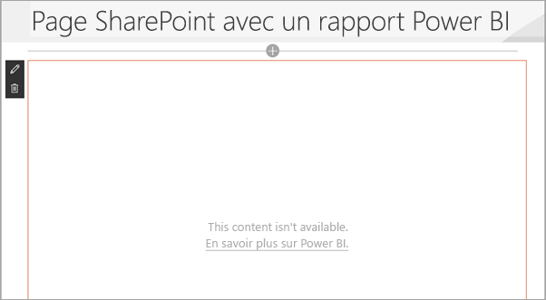

# Incorporer un composant WebPart Rapport dans SharePoint Online

Avec le nouveau composant WebPart Rapport pour SharePoint Online, vous pouvez incorporer facilement des rapports Power BI interactifs dans les pages SharePoint Online.

Quand vous utilisez l’option **Incorporer dans SharePoint Online**, les rapports incorporés respectent toutes les autorisations des éléments et la sécurité des données via la [sécurité au niveau des lignes (RLS)](../admin/service-admin-rls.md) : vous pouvez ainsi créer facilement des portails internes sécurisés.

## Configuration requise

Pour que les rapports **Incorporer dans SharePoint Online** fonctionnent, vous devez respecter les exigences suivantes :

* Une licence Power BI Pro ou une [capacité Power BI Premium (référence SKU EM ou P)](../admin/service-premium-what-is.md) avec une licence Power BI.
* Le composant WebPart Power BI pour SharePoint Online nécessite des [pages modernes](https://support.office.com/article/Allow-or-prevent-creation-of-modern-site-pages-by-end-users-c41d9cc8-c5c0-46b4-8b87-ea66abc6e63b).
* Pour consommer un rapport incorporé, les utilisateurs doivent se connecter au service Power BI pour activer leur licence Power BI.

## Incorporer votre rapport
Pour incorporer votre rapport dans SharePoint Online, vous devez obtenir l’URL de rapport et l’utiliser avec le composant WebPart Power BI de SharePoint Online.

### Obtenir une URL de rapport

1. Dans Power BI, affichez le rapport.

2. Dans le menu déroulant **Plus d’options (...)** , sélectionnez **Incorporer** > **SharePoint Online**.

    

3. Copiez l’URL de rapport à partir de la boîte de dialogue.

    

### Ajouter le rapport Power BI à une page SharePoint Online

1. Ouvrez la page cible dans SharePoint Online et sélectionnez **Modifier**.

    

    Vous pouvez aussi dans SharePoint Online sélectionner **+ Nouveau** pour créer une page de site moderne.

    

2. Sélectionnez le menu déroulant **+** , puis le composant WebPart **Power BI**.

    

3. Sélectionnez **Ajouter un rapport**.

      

4. Collez l’URL de rapport précédemment copiée dans le volet **Lien du rapport Power BI**. Le rapport se charge automatiquement.

    

5. Sélectionnez **Publier** pour que les utilisateurs de SharePoint Online puissent voir les modifications.

    

## Accorder l’accès aux rapports

L’incorporation d’un rapport dans SharePoint Online n’accorde pas automatiquement aux utilisateurs l’autorisation d’afficher le rapport : vous devez définir des autorisations d’affichage dans Power BI.

> [!IMPORTANT]
> Veillez à passer en revue les utilisateurs qui peuvent afficher le rapport dans le service Power BI et à accorder l’accès à ceux qui ne sont pas répertoriés.

Il existe deux moyens de fournir l’accès aux rapports dans Power BI. Le premier, si vous utilisez un groupe Microsoft 365 pour créer votre site d’équipe SharePoint Online, consiste à lister l’utilisateur comme membre de l’**espace de travail dans le service Power BI** et la **page SharePoint**. Pour plus d’informations, consultez [Gérer un espace de travail](service-manage-app-workspace-in-power-bi-and-office-365.md).

Le deuxième consiste à incorporer un rapport dans une application et à le partager directement avec les utilisateurs :  

1. L’auteur, qui doit être un utilisateur Pro, crée un rapport dans un espace de travail. Pour pouvoir être partagé avec des *utilisateurs de la version gratuite de Power BI*, l’espace de travail doit être défini comme *espace de travail Premium*.

2. L’auteur publie l’application, puis l’installe. L’auteur doit installer l’application de façon à pouvoir accéder à l’URL de rapport qui est utilisée pour l’incorporation dans SharePoint Online.

3. Maintenant, tous les utilisateurs finaux doivent aussi installer l’application. Vous pouvez aussi utiliser la fonctionnalité **Installer l’application automatiquement**, qui peut être activée dans le [portail d’administration Power BI](../admin/service-admin-portal.md) afin que l’application soit préinstallée pour les utilisateurs finaux.

   

4. L’auteur ouvre l’application et accède au rapport.

5. L’auteur copie l’URL du rapport incorporé à partir du rapport installé par l’application. N’utilisez pas l’URL du rapport d’origine figurant dans l’espace de travail.

6. Créez un nouveau site d’équipe dans SharePoint Online.

7. Ajoutez l’URL de rapport précédemment copiée au composant WebPart Power BI.

8. Ajoutez tous les utilisateurs finaux et/ou groupes qui auront besoin des données dans la page SharePoint Online et dans l’application Power BI que vous avez créée.

    > [!NOTE]
    > **Les utilisateurs ou les groupes doivent avoir accès à la page SharePoint Online et au rapport dans l’application Power BI pour voir le rapport dans la page SharePoint.**

Les utilisateurs finaux peuvent maintenant accéder au site d’équipe dans SharePoint Online et consulter les rapports dans la page.

## Multi-Factor Authentication

Si votre environnement Power BI nécessite une connexion via l’authentification multifacteur, vous pouvez être invité à vous connecter avec un dispositif de sécurité pour vérifier votre identité. Ce cas de figure se produit si vous ne vous êtes pas connecté à SharePoint Online avec l’authentification multifacteur, mais que votre environnement Power BI nécessite un dispositif de sécurité pour valider un compte.

> [!NOTE]
> Power BI ne prend pas encore en charge l’authentification multifacteur avec Azure Active Directory 2.0 : les utilisateurs verront un message d’erreur. Si l’utilisateur se reconnecte à SharePoint Online en utilisant son dispositif de sécurité, il peut visualiser le rapport.

## Paramètres des composants WebPart

Voici les paramètres que vous pouvez ajuster pour le composant WebPart Power BI pour SharePoint Online.

| Propriété | Description |
| --- | --- |
| Nom de la page |Définit la page par défaut du composant WebPart. Sélectionnez une valeur dans la liste déroulante. Si aucune page ne s’affiche, votre rapport ne contient qu’une seule page ou l’URL que vous avez collée contient un nom de page. Supprimez la section du rapport de l’URL pour sélectionner une page spécifique. |
| Affichage |Permet de définir la façon dont le rapport est ajusté à la page SharePoint Online. |
| Afficher le volet de navigation |Affiche ou masque le volet de navigation de la page. |
| Afficher le volet de filtre |Affiche ou masque le volet Filtre. |

## Rapports qui ne sont pas chargés

Si votre rapport ne se charge pas dans le composant WebPart Power BI, le message suivant peut s’afficher :

Il existe deux raisons habituelles pour ce message.

1. Vous n’avez pas accès au rapport.
2. Le rapport a été supprimé.

Contactez le propriétaire de la page SharePoint Online pour qu’il vous aide à résoudre le problème.

## Licences

Les utilisateurs affichant un rapport dans SharePoint ont besoin au choix d’une **licence Power BI Pro** ou le contenu doit se trouver dans un espace de travail qui se trouve dans une **[capacité Power BI Premium (référence SKU EM ou P)](../admin/service-admin-premium-purchase.md)** .

## Problèmes connus et limitations

* Erreur : « Une erreur s’est produite. Essayez de vous déconnecter, de vous reconnecter, puis de revenir sur cette page. ID de corrélation : indéfini, état de la réponse http : 400, code d’erreur du serveur 10001, message : Jeton d’actualisation manquant »
  
  Si vous recevez cette erreur, essayez l’une des étapes de dépannage ci-dessous.
  
  1. Déconnectez-vous de SharePoint, puis reconnectez-vous. Veillez à fermer toutes les fenêtres du navigateur avant de vous reconnecter.

  2. Si votre compte d’utilisateur nécessite l’authentification multifacteur, connectez-vous à SharePoint en utilisant votre dispositif d’authentification multifacteur (application sur un téléphone, carte à puce, etc.).
  
  3. Les comptes d’utilisateur invités Azure B2B ne sont pas pris en charge. Les utilisateurs voient le logo Power BI qui montre que le composant WebPart se chargement, mais le rapport ne s’affiche pas.

* Power BI ne prend pas en charge les mêmes langues localisées que SharePoint Online. Par conséquent, vous risquez de ne pas voir la localisation appropriée dans le rapport incorporé.

* Vous pouvez rencontrer des problèmes si vous utilisez Internet Explorer 10. <!--You can look at the [browsers support for Power BI](../consumer/end-user-browsers.md) and for [Microsoft 365](https://products.office.com/office-system-requirements#Browsers-section). -->

* Le composant WebPart Power BI n’est pas disponible pour les [clouds nationaux](https://powerbi.microsoft.com/clouds/).

* Le serveur SharePoint classique n’est pas pris en charge avec ce composant WebPart.

* Les [filtres d’URL](service-url-filters.md) ne sont pas pris en charge avec le composant WebPart SPO.

## Étapes suivantes

* [Autoriser ou empêcher la création de pages de site moderne par les utilisateurs finaux](https://support.office.com/article/Allow-or-prevent-creation-of-modern-site-pages-by-end-users-c41d9cc8-c5c0-46b4-8b87-ea66abc6e63b)  
* [Créer et distribuer une application dans Power BI](service-create-distribute-apps.md)  
* [Partager un tableau de bord avec vos collègues et les autres utilisateurs](service-share-dashboards.md)  
* [Qu’est-ce que Power BI Premium ?](../admin/service-premium-what-is.md)
* [Incorporer un rapport dans un site web ou portail sécurisé](service-embed-secure.md)

D’autres questions ? [Essayez d’interroger la communauté Power BI](https://community.powerbi.com/)
