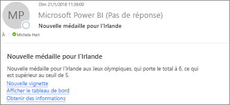
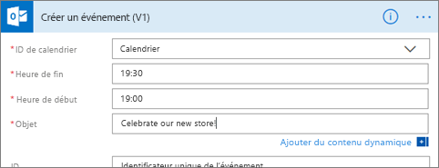

# Intégrer des alertes de données Power BI à Power Automate

Utilisez [Power Automate](/power-automate/getting-started) pour intégrer Power BI à vos applications et services favoris. Avec Power Automate, vous pouvez créer des workflows automatisés pour obtenir des notifications, synchroniser des fichiers, collecter des données, etc. Dans cet article, vous allez automatiser la génération d’un e-mail provoquée par une alerte de données Power BI.

## Prérequis
Cet article montre comment créer deux flux différents : l’un à partir d’un modèle et l’autre à partir de zéro. Pour suivre la procédure, [créez une alerte de données dans Power BI](../create-reports/service-set-data-alerts.md), puis [inscrivez-vous à Power Automate](https://flow.microsoft.com/#home-signup). C’est gratuit !

## Créer un flux à partir d’un modèle
Dans cette tâche, nous utilisons un modèle pour créer un flux simple qui déclenche par un alerte de données Power BI (notification).

1. Connectez-vous à Power Automate (flow.microsoft.com).
2. Sélectionnez **Modèles**, puis recherchez **Power BI** > **Envoyer un e-mail à une audience quand une alerte de données Power BI est déclenchée**.
   
    :::image type="content" source="media/service-flow-integration/power-automate-templates.png" alt-text="Capture d’écran de l’option Envoyer un e-mail à une audience quand une alerte de données Power BI est déclenchée dans Power Automate":::.

### Générer le flux
Ce modèle comprend un déclencheur, une alerte de données Power BI et une action permettant d’envoyer un e-mail. Lorsque vous sélectionnez un champ, Power Automate affiche un contenu dynamique que vous pouvez inclure.  Dans cet exemple, nous incluons la valeur et l’URL de la mosaïque dans le corps du message.

1. Sélectionnez **Continuer**.

    :::image type="content" source="media/service-flow-integration/power-automate-power-bi-mail.png" alt-text="Capture d’écran de l’envoi d’un e-mail par Power BI dans Power Automate":::

1. Dans le champ **ID d’alerte**, sélectionnez une alerte de données Power BI. Pour savoir comment créer une alerte, voir [Alertes de données dans Power BI](../create-reports/service-set-data-alerts.md).
   
    :::image type="content" source="media/service-flow-integration/power-automate-select-alert-id.png" alt-text="Capture d’écran de la sélection d’une alerte dans le champ ID d’alerte":::.
2. Entrez une ou plusieurs adresses e-mail valides.

3. Power Automate génère automatiquement un **objet** et **corps**, que vous pouvez conserver ou modifier. Le corps du texte utilise une mise en forme HTML.

    :::image type="content" source="media/service-flow-integration/power-automate-autogenerated-email.png" alt-text="Capture d’écran du texte de l’e-mail généré automatiquement dans Power Automate":::

1. Une fois que vous avez terminé le message, sélectionnez **Étape suivante** ou **Enregistrer**.  Le flux est créé et évalué.  Power Automate vous indique s’il trouve des erreurs.
2. S’il en détecte, sélectionnez **Modifier le flux** pour les corriger ; sinon, sélectionnez **Terminé** pour exécuter le nouveau flux.
   
   
5. Lorsque l’alerte de données est déclenchée, Power Automate envoie un e-mail aux adresses que vous avez indiquées.  
   
   

## Créer entièrement un flux
Dans cette tâche, nous créons un flux simple à partir de zéro, déclenché par une alerte de données Power BI (notification).

1. Connectez-vous à Power Automate (flow.microsoft.com).
2. Sélectionnez **Créer** > **Flux automatisé**.

    :::image type="content" source="media/service-flow-integration/power-automate-create-automated-flow.png" alt-text="Capture d’écran de Power Automate > Créer un flux automatisé":::   
3. Dans **Générer un flux automatisé**, attribuez un nom au flux.
1. Dans **Choisir le déclencheur de votre flux**, recherchez **Power BI**.
1. Sélectionnez **Power BI - Lorsqu’une alerte de données est déclenchée** > **Créer**.

    :::image type="content" source="media/service-flow-integration/power-automate-build-automated-flow.png" alt-text="Capture d’écran de l’option Générer un flux automatisé":::

### Créer votre flux
1. Dans le champ **ID d’alerte**, sélectionnez le nom de votre alerte. Pour savoir comment créer une alerte, voir [Alertes de données dans Power BI](../create-reports/service-set-data-alerts.md).

    :::image type="content" source="media/service-flow-integration/power-automate-select-alert-id-scratch.png" alt-text="Capture d’écran de la sélection du nom de l’alerte":::   

2. Sélectionnez **Nouvelle étape**.
   
3. Dans **Choisir une action**, recherchez **Outlook** > **Créer un événement**.

    :::image type="content" source="media/service-flow-integration/power-automate-choose-action-create-event.png" alt-text="Capture d’écran de l’option Choisir une action > Créer un événement":::   
4. Complétez les champs de l’événement. Lorsque vous sélectionnez un champ, Power Automate affiche un contenu dynamique que vous pouvez inclure.
   
   
5. Quand vous avez terminé, sélectionnez **Créer un flux**.  Power Automate enregistre et évalue le flux. S’il n’y a pas d’erreurs, sélectionnez **Terminé** pour exécuter ce flux.  Le nouveau flux est ajouté à votre page **Mes flux**.
   
   
6. Lorsque le flux est déclenché par l’alerte de données Power BI, vous recevez une notification d’événement Outlook semblable à celle-ci.
   
    

## Étapes suivantes
* [Bien démarrer avec Power Automate](/power-automate/getting-started/)
* [Exporter et envoyer par e-mail un rapport Power BI avec Power Automate](service-automate-power-bi-report-export.md)
* D’autres questions ? [Posez vos questions à la communauté Power BI](https://community.powerbi.com/)
