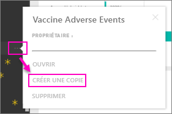

# Packs de contenu d’organisation : Copier, actualiser et obtenir l’accès

> [!NOTE]
> Les packs de contenu d’organisation sont dépréciés. C’est donc le bon moment pour mettre à niveau vos packs de contenu vers des applications, si vous n’avez pas encore commencé à le faire. Consultez la section sur la feuille de route de mise à niveau de l’espace de travail dans le billet de blog intitulé [Announcing Power BI admins can upgrade classic workspaces](https://powerbi.microsoft.com/blog/announcing-power-bi-admins-can-upgrade-classic-workspaces-and-roadmap-update/) (Annonce relative au fait que les administrateurs Power BI peuvent mettre à niveau les espaces de travail classiques) pour connaître la chronologie.
> 

Quand un pack de contenu d’organisation est publié, tous les destinataires voient les mêmes tableaux de bord, rapports, classeurs Excel, jeux de données et données (sauf s’il s’agit d’une source de données SQL Server Analysis Services (SSAS)).  [Seul l’auteur du pack de contenu peut modifier et republier](service-organizational-content-pack-manage-update-delete.md) celui-ci.  Toutefois, tous les destinataires peuvent enregistrer une copie du pack de contenu qui peut coexister avec l’original.

La création de packs de contenu est différente du partage de tableaux de bord ou de la collaboration sur ces derniers dans un groupe. Pour déterminer l’option la plus adaptée, consultez [Comment partager des tableaux de bord, rapports et vignettes ?](service-how-to-collaborate-distribute-dashboards-reports.md). 

## Créer une copie d’un pack de contenu d’organisation
Créez votre propre copie du pack de contenu, non visible à d’autres personnes.

1. Sélectionnez **Plus d’options** (...) en regard du tableau de bord du pack de contenu > Faire une copie.

    
2. Sélectionnez **Enregistrer**.  

Vous disposez maintenant d’une copie que vous pouvez modifier. Personne d’autre ne peut voir les modifications que vous apportez.

> [!NOTE]
> Avant, à chaque installation d’un pack de contenu ou création d’une copie, un nouveau jeu de données s’affichait dans la liste de contenu de l’espace de travail. Une mise à jour récente a simplifié l’expérience afin d’afficher un seul élément avec la nouvelle icône de jeu de données référencé :
>
> 
>

## Au secours !  Je ne peux plus accéder au pack de contenu
Cela peut se produire pour plusieurs raisons :

* **Modifications d’appartenance** :  Les packs de contenu sont publiés à l’adresse de groupes de distribution d’e-mails, de groupes de sécurité et de [groupes Power BI basés sur Microsoft 365](https://support.office.com/article/Create-a-group-in-Office-365-7124dc4c-1de9-40d4-b096-e8add19209e9).  Si vous êtes supprimé d’un groupe, vous n’avez plus accès au pack de contenu.
* **Modifications de la distribution** : L’auteur du pack de contenu modifie la distribution. Par exemple, si le pack de contenu a été publié à l’origine pour l’organisation entière, puis que son créateur l’a republié à l’adresse d’un public plus restreint, il se peut que vous ne figuriez plus parmi ses destinataires.
* **Modification des paramètres de sécurité** : Si le tableau de bord et les rapports sont connectés à des sources de données SSAS locales et si des modifications sont apportées aux paramètres de sécurité, vos autorisations concernant ce serveur peuvent être révoquées.

## Comment les packs de contenu d’organisation sont-ils actualisés ?
Quand un pack de contenu est créé, les paramètres d’actualisation sont hérités avec le jeu de données.  Quand vous créez une copie du pack de contenu, la nouvelle version conserve son lien au jeu de données d’origine et à la planification de l’actualisation.

Voir [Gérer, mettre à jour et supprimer des packs de contenu d’organisation](service-organizational-content-pack-manage-update-delete.md).

## Étapes suivantes
* [Introduction aux packs de contenu d’organisation](service-organizational-content-pack-introduction.md)
* [Créer un groupe dans Power BI](service-create-distribute-apps.md)
* D’autres questions ? [Posez vos questions à la communauté Power BI](https://community.powerbi.com/)
