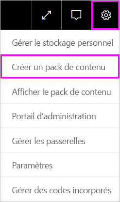
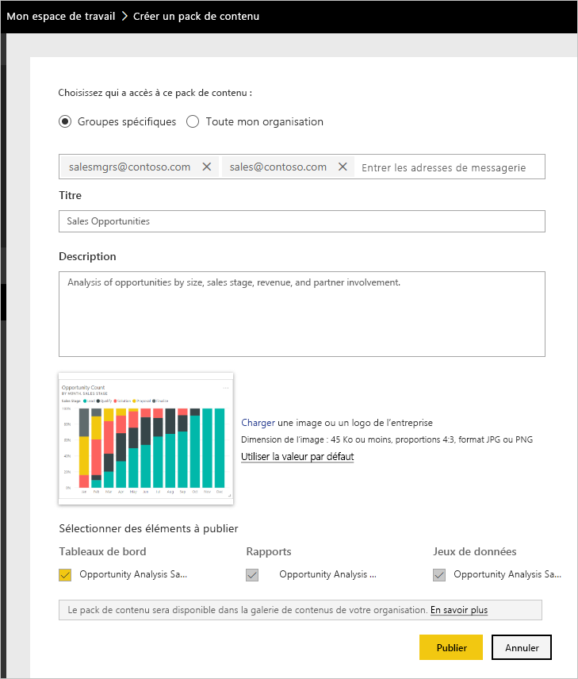
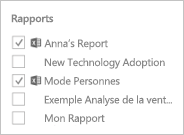
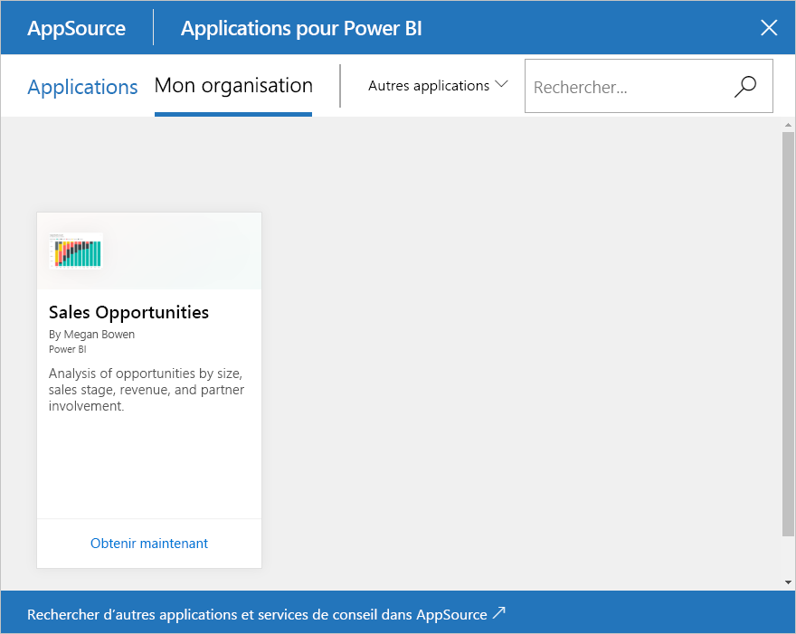

# Tutoriel : Créer et publier un pack de contenu d’organisation Power BI

Dans ce tutoriel, vous allez créer un pack de contenu d’organisation, en donner l’accès à un groupe spécifique et le publier dans la bibliothèque de packs de contenu de votre organisation sur Power BI.

La création de packs de contenu est différente du partage de tableaux de bord ou de la collaboration sur ces derniers dans un groupe. Lisez [Moyens de partager votre travail dans Power BI](service-how-to-collaborate-distribute-dashboards-reports.md) pour choisir l’option la mieux adaptée à votre cas.

Pour créer un pack de contenu d’organisation, vos collègues et vous devez avoir un [compte Power BI Pro](https://powerbi.microsoft.com/pricing).

> [!NOTE]
> Vous ne pouvez pas créer ou installer des packs de contenu d’organisation dans les expériences des nouveaux espaces de travail. Si vous n’avez pas déjà commencé à le faire, c’est le moment idéal pour mettre à niveau vos packs de contenu vers des applications. Découvrez plus d’informations sur [l’expérience des nouveaux espaces de travail](service-create-the-new-workspaces.md).

## Créer et publier un pack de contenu

Supposons que vous êtes responsable de la mise en production chez Contoso et que vous préparez le lancement d’un nouveau produit.  Vous avez créé un tableau de bord avec des rapports que vous souhaiteriez partager. Ils pourraient intéresser d’autres employés en charge du lancement. Vous voulez regrouper les tableaux de bord et les rapports dans une solution que vos collègues peuvent utiliser.

Comment procéder ? Dans le [service Power BI](https://powerbi.com), accédez à votre espace **Mon espace de travail**. Accédez ensuite à **Obtenir des données** > **Exemples** > **Exemple Analyse des opportunités** > **Se connecter** pour obtenir votre propre copie.

1. Dans le volet de navigation, sélectionnez **Espaces de travail** > **Mon espace de travail**.

1. Dans le volet de navigation du haut, sélectionnez l’icône d’engrenage . > **Créer un pack de contenu**.

   

1. Dans la fenêtre **Créer un pack de contenu**, entrez les informations suivantes.  

   Ne perdez pas de vue que la bibliothèque de packs de contenu de votre organisation peut se remplir rapidement. La bibliothèque peut au final contenir plusieurs centaines de packs de contenu publiés pour l’organisation ou des groupes. Prenez le temps de donner un nom explicite à votre pack de contenu, d’ajouter une description utile et de sélectionner le public adéquat.  Utilisez des mots qui faciliteront la recherche de votre pack de contenu. Les utilisateurs le retrouveront ainsi plus facilement.

      

    1. Sélectionnez **Groupes spécifiques**.

    1. Entrez les adresses e-mail complètes de chaque membre, des [groupes Microsoft 365](https://support.office.com/article/Create-a-group-in-Office-365-7124dc4c-1de9-40d4-b096-e8add19209e9), des groupes de distribution ou des groupes de sécurité. Par exemple : salesmgrs@contoso.com ; sales@contoso.com

        Pour ce tutoriel, essayez d’utiliser l’adresse e-mail de votre groupe.

    1. Nommez le pack de contenu *Opportunités de ventes*.

        > [!TIP]
        > Envisagez d’inclure le nom du tableau de bord dans le nom du pack de contenu. De cette manière, vos collègues trouveront le tableau de bord plus facilement une fois connectés à votre pack de contenu.

    1. Configuration recommandée : Ajoutez une description. Cela aide les collègues à trouver plus facilement les packs de contenu dont ils ont besoin. Outre la description, ajoutez des mots clés que vos collègues pourront utiliser pour trouver le pack de contenu. Ajoutez vos informations de contact au cas où vos collègues auraient des questions ou besoin d’aide.

    1. Chargez une image ou un logo pour permettre aux membres du groupe de trouver plus facilement le pack de contenu.

        Une image est plus facilement repérable que du texte. La capture d’écran montre une image de la vignette de l’histogramme **Nombre d’opportunités**.

    1. Sélectionnez le tableau de bord **Exemple Analyse des opportunités** pour l’ajouter au pack de contenu.

        Power BI ajoute automatiquement le rapport et le jeu de données associés. Vous pouvez en ajouter d’autres, si vous le souhaitez.

       > [!NOTE]
       > Power BI liste uniquement les tableaux de bord, rapports, jeux de données et classeurs que vous pouvez modifier. L’application n’affiche donc rien qui n’a pas été partagé avec vous.

   1. Si vous avez des classeurs Excel, ils s’affichent sous **Rapports** avec une icône Excel. Vous pouvez les ajouter également au pack de contenu.

      

      > [!NOTE]
      > Si des membres du groupe ne peuvent pas afficher le classeur Excel, vous devrez peut-être [partager le classeur avec eux dans OneDrive Entreprise](https://support.office.com/article/Share-documents-or-folders-in-Office-365-1fe37332-0f9a-4719-970e-d2578da4941c).

1. Sélectionnez **Publier** pour ajouter le pack de contenu à la bibliothèque de packs de contenu d’organisation du groupe.  

   Un message de confirmation s’affichera si la publication s’est correctement déroulée.

1. Quand les membres de votre groupe accèdent à **Obtenir des données** > **Packs de contenu d'organisation**, ils voient votre pack de contenu.

   

   > [!TIP]
   > L’URL qui s’affiche dans votre navigateur est l’adresse unique de ce pack de contenu.  Vous voulez informer vos collègues de la disponibilité de ce nouveau pack de contenu ?  Collez l’URL dans un message électronique.

1. Quand les membres de votre groupe sélectionnent **Se connecter**, ils peuvent [voir et utiliser votre pack de contenu](service-organizational-content-pack-copy-refresh-access.md).

## Étapes suivantes

* [Présentation des packs de contenu d’organisation dans Power BI](service-organizational-content-pack-introduction.md).

* [Gérer, mettre à jour et supprimer des packs de contenu d’organisation](service-organizational-content-pack-manage-update-delete.md).

* [Publier une application dans Power BI](service-create-distribute-apps.md).

* [Qu’est-ce que OneDrive Entreprise ?](https://support.office.com/article/What-is-OneDrive-for-Business-187f90af-056f-47c0-9656-cc0ddca7fdc2)

* D’autres questions ? [Posez vos questions à la communauté Power BI](https://community.powerbi.com/)
