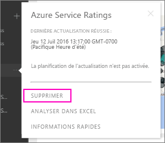

# Supprimer votre connexion à un pack de contenu d’organisation Power BI

> [!NOTE]
> Les packs de contenu d’organisation sont dépréciés. C’est donc le bon moment pour mettre à niveau vos packs de contenu vers des applications, si vous n’avez pas encore commencé à le faire. Consultez la section sur la feuille de route de mise à niveau de l’espace de travail dans le billet de blog intitulé [Announcing Power BI admins can upgrade classic workspaces](https://powerbi.microsoft.com/blog/announcing-power-bi-admins-can-upgrade-classic-workspaces-and-roadmap-update/) (Annonce relative au fait que les administrateurs Power BI peuvent mettre à niveau les espaces de travail classiques) pour connaître la chronologie.
> 

Un collaborateur créé un pack de contenu. Vous l’avez découvert dans AppSource et ajouté à votre espace de travail Power BI. À présent, vous n’en avez plus besoin.  Comment le supprimer ?

Pour supprimer un pack de contenu, supprimez son jeu de données.  

* Dans le volet de navigation, sélectionnez les points de suspension à droite du jeu de données, puis sélectionnez **Supprimer \> Oui**.  
  
  

La suppression du jeu de données supprime également tous les rapports et tableaux de bord qui lui sont associés. Toutefois, la suppression de votre connexion au pack de contenu ne supprime pas ce dernier de l’environnement AppSource de votre organisation.  Vous pouvez toujours revenir à l’environnement AppSource et ajouter le pack de contenu à votre espace de travail. Vous pouvez uniquement [supprimer un pack de contenu d’AppSource](service-organizational-content-pack-manage-update-delete.md) si vous l’avez créé.

## Étapes suivantes
* [Introduction aux packs de contenu d’organisation](service-organizational-content-pack-introduction.md) 
* [Créer et distribuer une application dans Power BI](service-create-distribute-apps.md) 
* [Fondamentaux pour les concepteurs dans le service Power BI](../fundamentals/service-basic-concepts.md)  
* D’autres questions ? [Posez vos questions à la communauté Power BI](https://community.powerbi.com/)
