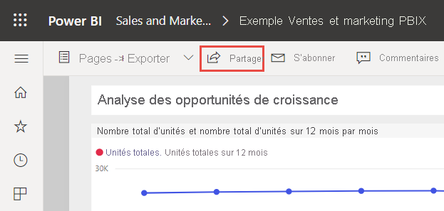
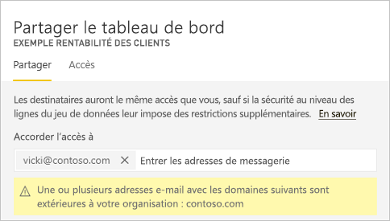
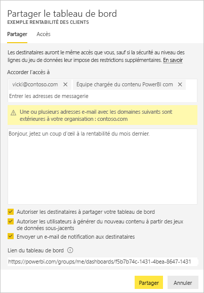
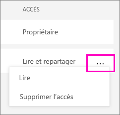
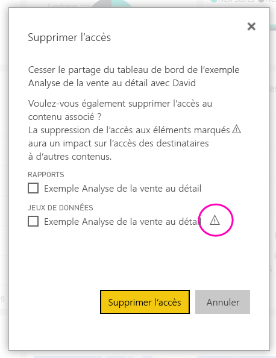

# Partager des rapports et des tableaux de bord Power BI avec des collègues et d’autres utilisateurs
Le *partage* est le moyen le plus simple de donner accès à vos tableaux de bord et rapports dans le service Power BI. Vous pouvez les partager avec des membres de votre organisation ou des personnes extérieures.

Quand vous partagez un tableau de bord ou un rapport avec des utilisateurs, ces derniers peuvent l’afficher et interagir avec, mais pas le modifier. Ils voient les mêmes données que vous dans le tableaux de bord et les rapports, et ont accès à la totalité du jeu de données sous-jacent, sauf si la sécurité au niveau des lignes est appliquée au jeu de données sous-jacent.  Ils peuvent également le partager avec leurs collègues, si vous les y autorisez. Les personnes qui ne font pas partie de votre organisation peuvent consulter le tableau de bord ou le rapport, et interagir avec lui, mais pas le partager. 

Il est possible de partager des tableaux de bord et des rapports en de nombreux endroits du service Power BI : Favoris, Récemment utilisés, Mon espace de travail. Vous pouvez également partager à partir d’autres espaces de travail, si vous avez le [rôle Administrateur, Membre ou Contributeur](service-new-workspaces.md#roles-in-the-new-workspaces) dans l’espace de travail. De même, vous pouvez partager des tableaux de bord et des rapports dans Partagés avec moi, si le propriétaire l’autorise. 

Le service Power BI propose également d’autres façons de collaborer et de distribuer des tableaux de bord et des rapports. Pour connaître la méthode la plus adaptée à votre situation, consultez [Techniques de collaboration et de partage dans Power BI](service-how-to-collaborate-distribute-dashboards-reports.md) . 

Que vous partagiez du contenu à l’intérieur ou à l’extérieur de votre organisation, vous devez disposer d’une [licence Power BI Pro](../fundamentals/service-features-license-type.md). Vos destinataires ont également besoin d’une licence Power BI Pro à moins que le contenu ne soit au niveau de [capacité Premium](../admin/service-premium-what-is.md). 

Vous ne pouvez pas *partager* directement à partir de Power BI Desktop. Vous [publiez des rapports à partir de Power BI Desktop](../create-reports/desktop-upload-desktop-files.md) dans le service Power BI. Toutefois, vous pouvez [partager un tableau de bord à partir des applications mobiles Power BI](../consumer/mobile/mobile-share-dashboard-from-the-mobile-apps.md).  

## Partager un tableau de bord ou un rapport

1. Dans une liste de tableaux de bord ou de rapports, ou dans un tableau de bord ou un rapport ouvert, sélectionnez **Partager** :::image type="icon" source="../media/power-bi-share-icon.png" border="false":::.

2. Dans la zone supérieure, entrez les adresses e-mail complètes des personnes, des groupes de distribution ou des groupes de sécurité. Vous ne pouvez pas effectuer de partage avec des listes de distribution dynamique. 
   
   Vous pouvez partager avec des personnes dont les adresses électroniques sont externes à votre organisation, mais un message d’avertissement s’affiche. Découvrez-en plus sur le [partage en dehors de votre organisation](#share-a-dashboard-or-report-outside-your-organization) plus loin dans cet article.
   
    
 
   >[!NOTE]
   >La zone d’entrée prend en charge au maximum 100 utilisateurs ou groupes distincts. Pour plus d’informations sur le partage avec d’autres personnes, consultez [Partager avec plus de 100 utilisateurs distincts](#share-with-more-than-100-separate-users) plus loin dans cet article.

3. Ajoutez un message si vous le souhaitez. Ceci est facultatif.
4. Pour permettre à vos collègues de partager votre contenu avec d’autres personnes, cochez la case **Autoriser les destinataires à partager votre tableau de bord (ou rapport)** .
   
   Autoriser le partage par d’autres utilisateurs est appelé *repartage*. Si vous les y autorisez, les utilisateurs peuvent repartager à partir du service Power BI et des applications mobiles ou transférer le message d’invitation à d’autres membres de votre organisation. L’invitation expire après un mois. Les personnes extérieures à votre organisation ne sont pas autorisées à le partager à nouveau. En tant que propriétaire du contenu, vous pouvez désactiver la possibilité de le partager à nouveau, ou la révoquer au cas par cas. Consultez [Arrêter ou changer le partage](#stop-or-change-sharing) plus loin dans cet article.

5. Si vous sélectionnez **Autoriser les utilisateurs à générer du nouveau contenu à partir des jeux de données sous-jacents**, ils peuvent créer leurs propres rapports dans d’autres espaces de travail en fonction du jeu de données de ce tableau de bord. Découvrez-en plus sur la [création de rapports basés sur des jeux de données à partir de différents espaces de travail](../connect-data/service-datasets-discover-across-workspaces.md).

1. Sélectionnez **Partager**.
   
     
   
   Power BI envoie à des personnes (et non à des groupes) un e-mail d’invitation contenant un lien vers le contenu partagé. Une notification **Réussite** s’affiche. 
   
   Lorsque les destinataires de votre organisation cliquent sur le lien, Power BI ajoute le tableau de bord ou le rapport à leur page de liste **Partagés avec moi**. Ils peuvent sélectionner votre nom pour voir tout le contenu que vous avez partagé avec eux. 
   
   
   
   Lorsque des destinataires extérieurs à votre organisation cliquent sur le lien, ils voient le tableau de bord ou le rapport, mais pas sur le portail Power BI habituel. Découvrez-en plus sur le [partage avec des utilisateurs en dehors de votre organisation](#share-a-dashboard-or-report-outside-your-organization) plus loin dans cet article.

## Découvrez qui a accès à un tableau de bord ou à un rapport
Il est parfois utile de voir avec qui vous avez partagé un contenu, et avec qui ces utilisateurs l’ont partagé.

1. Dans la liste des tableaux de bord et des rapports, ou dans le tableau de bord ou le rapport proprement dit, sélectionnez **Partager** :::image type="icon" source="../media/power-bi-share-icon.png" border="false":::. 
2. Dans la boîte de dialogue **Partager un tableau de bord** ou **Partager un rapport**, sélectionnez **Accès**.
   
    

    Les personnes extérieures à votre organisation sont répertoriées en tant qu’ **Invités**.

    Dans cette vue, vous pouvez [arrêter ou changer le partage d’autorisations](#stop-or-change-sharing), comme indiqué plus bas dans cet article. 

## Partager un tableau de bord ou un rapport hors de l’organisation
Quand vous partagez avec des personnes extérieures à votre organisation, celles-ci reçoivent un e-mail contenant un lien vers le tableau de bord ou rapport partagé. Elles doivent se connecter à Power BI pour voir ce que vous avez partagé. Si elles ne disposent pas d’une licence Power BI Pro, elles peuvent en demander une quand elles cliquent sur le lien.

Une fois connectées, elles verront apparaître le tableau de bord ou le rapport partagés dans leur propre fenêtre de navigateur, et non sur le portail Power BI habituel. Pour accéder ultérieurement à ce tableau de bord ou à ce rapport, elles doivent ajouter un signet pour le lien.

Elles ne peuvent modifier aucun contenu dans ce tableau de bord ou ce rapport. Elles peuvent interagir avec les graphiques et changer les filtres et les segments, mais non enregistrer leurs modifications. 

Seuls les destinataires directs voient le tableau de bord ou le rapport partagé. Par exemple, si vous avez envoyé l’e-mail à Vicki@contoso.com, seule Vicki voit le tableau de bord. Personne d’autre ne peut voir le tableau de bord, même si Vicki transfère le lien. Vicki doit utiliser la même adresse e-mail pour y accéder. Si Vicki se connecte avec une autre adresse e-mail, elle n’a pas accès au tableau de bord.

Les personnes extérieures à votre organisation ne voient pas du tout les données si la sécurité au niveau des rôles ou des lignes est établie selon les modèles tabulaires Analysis Services locaux.

Utilisez un groupe de sécurité, et non un groupe de distribution, à partager avec un groupe qui comprend des personnes disposant d’adresses e-mail externes. Les personnes disposant d’adresses e-mail externes dans un groupe de distribution ne peuvent pas voir le contenu que vous partagez, à moins qu’il ne s’agisse d’utilisateurs invités Azure Active Directory (Azure AD) B2B. Découvrez-en plus sur les [utilisateurs invités Azure AD B2B](../admin/service-admin-azure-ad-b2b.md).

Si vous envoyez un lien à partir d’une application mobile Power BI à des personnes extérieures à votre organisation, le fait de cliquer sur le lien ouvre le tableau de bord dans un navigateur, et pas dans l’application mobile Power BI.

### Autoriser les utilisateurs externes à modifier le contenu

Votre administrateur Power BI peut autoriser les utilisateurs invités externes à modifier et à gérer le contenu de votre organisation. Dans ce cas, vos utilisateurs externes ne peuvent pas bénéficier de l’expérience limitée à la consommation. Ils peuvent modifier et gérer le contenu au sein de votre organisation. Découvrez-en plus sur la [distribution du contenu Power BI à des utilisateurs invités externes avec Azure AD B2B](../admin/service-admin-azure-ad-b2b.md).

## Partager avec plus de 100 utilisateurs distincts

Au maximum, vous pouvez partager du contenu avec 100 utilisateurs ou groupes lors d’une seule action de partage. Toutefois, vous pouvez permettre à plus de 500 utilisateurs d’accéder à un élément. Voici quelques suggestions :

- Partagez plusieurs fois en spécifiant les utilisateurs individuellement.
- Partagez avec un groupe d’utilisateurs qui contient tous les utilisateurs. 
- Créez le rapport ou le tableau de bord dans un espace de travail, puis créez une application à partir de ce dernier. Vous pouvez partager l’application avec beaucoup plus de personnes. Découvrez-en plus sur la [publication d’applications dans Power BI](service-create-distribute-apps.md).

## Arrêter ou changer le partage
Seul le propriétaire du tableau de bord ou du rapport peut activer et désactiver la possibilité de le partager de nouveau.

### Si vous n’avez pas encore envoyé l’invitation de partage
* Décochez la case **Autoriser les destinataires à partager le tableau de bord (ou rapport)** en bas de l’invitation avant de l’envoyer.

### Si vous avez déjà partagé le tableau de bord ou le rapport
1. Dans la liste des tableaux de bord et des rapports, ou dans le tableau de bord ou le rapport proprement dit, sélectionnez **Partager** :::image type="icon" source="../media/power-bi-share-icon.png" border="false":::. 
2. Dans la boîte de dialogue **Partager un tableau de bord** ou **Partager un rapport**, sélectionnez **Accès**.
   
    
3. Sélectionnez le bouton de sélection ( **...** ) en regard de **Lire et repartager**, puis sélectionnez :
   
   
   
   * **Lire** pour empêcher cette personne de partager avec quiconque.
   * **Supprimez l’accès** pour empêcher cette personne de voir le contenu partagé.

4. Dans la boîte de dialogue **Supprimer l’accès**, décidez si vous voulez également supprimer l’accès au contenu associé, tel que les rapports et les jeux de données. Si vous supprimez des éléments avec une icône d’avertissement , il est recommandé de supprimer également le contenu associé. Dans le cas contraire, il ne s’affiche pas correctement.

    

## Considérations et limitations
Voici quelques éléments à prendre en compte avant de partager des tableaux de bord et des rapports :

* Quand vous partagez un tableau de bord avec des collègues, vous partagez également le jeu de données sous-jacent. Vos collègues ont accès à l’ensemble du jeu de données, sauf si [la sécurité au niveau des lignes (RLS)](../admin/service-admin-rls.md) limite leur accès. Les auteurs de rapports peuvent utiliser des fonctionnalités qui personnalisent les expériences utilisateur lors de l’affichage ou de l’interaction avec les rapports, par exemple le masquage de colonnes ou la limitation des actions sur les visuels. Ces expériences utilisateur personnalisées ne limitent pas les données auxquelles les utilisateurs peuvent accéder dans le jeu de données. Utilisez la [sécurité au niveau des lignes (RLS)](../admin/service-admin-rls.md) dans le jeu de données pour que les informations d’identification de chaque personne déterminent les données auxquelles elle peut accéder.
* Tous les utilisateurs avec qui vous partagez le tableau de bord peuvent le voir et interagir avec les rapports associés en [mode Lecture](../consumer/end-user-reading-view.md#reading-view). En général, ils ne peuvent pas créer de rapports ni enregistrer les modifications apportées aux rapports existants. Toutefois, si vous sélectionnez **Autoriser les utilisateurs à générer du nouveau contenu à partir des jeux de données sous-jacents**, ils peuvent créer leurs propres rapports dans d’autres espaces de travail en fonction du jeu de données de ce tableau de bord ou rapport.
* Même si les utilisateurs ne peuvent pas voir ni télécharger le jeu de données, ils peuvent y accéder directement à l’aide de la fonctionnalité Analyser dans Excel. Un administrateur peut limiter la capacité à utiliser Analyser dans Excel pour tous les membres d’un groupe. Cependant, la restriction s’applique à tous les membres de ce groupe et à chaque espace de travail auquel le groupe appartient.
* Tout le monde peut [actualiser manuellement les données](../connect-data/refresh-data.md).
* Si vous utilisez Microsoft 365 pour la messagerie électronique, vous pouvez partager avec les membres d’un groupe de distribution en entrant l’adresse de messagerie associée au groupe de distribution.
* Les collègues qui partagent votre domaine de courrier, ainsi que les collègues dont le domaine est différent, mais inscrit auprès du même locataire, peuvent partager le tableau de bord avec d’autres utilisateurs. Par exemple, supposons que les domaines contoso.com et contoso2.com sont enregistrés dans le même locataire et que votre adresse e-mail est konrads@contoso.com. ravali@contoso.com et gustav@contoso2.com peuvent partager votre tableau de bord, à condition que vous leur accordiez l’autorisation de partager.
* Si vos collègues ont déjà accès à un tableau de bord ou à un rapport spécifique, vous pouvez envoyer un lien direct en copiant l’URL qui s’affiche quand vous vous trouvez dessus. Par exemple : `https://powerbi.com/dashboards/g12466b5-a452-4e55-8634-xxxxxxxxxxxx`.
* De même, si vos collègues ont déjà accès à un tableau de bord spécifique, vous pouvez [envoyer un lien direct vers le rapport sous-jacent](service-share-reports.md). 

## Étapes suivantes

- [Comment partager des tableaux de bord, rapports et vignettes ?](service-how-to-collaborate-distribute-dashboards-reports.md)
- [Résolution des problèmes de partage de tableaux de bord et de rapports](service-troubleshoot-sharing.md)
- [Demande ou autorisation d’accès à des tableaux de bord ou des rapports partagés](service-request-access.md)
- [Partager un rapport Power BI filtré](service-share-reports.md)
- Vous avez des questions ? [Essayez la communauté Power BI](https://community.powerbi.com/)
