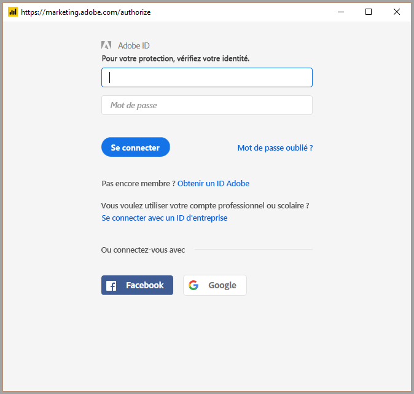
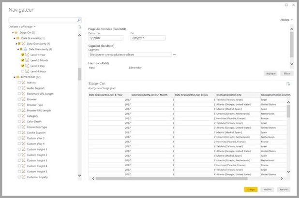
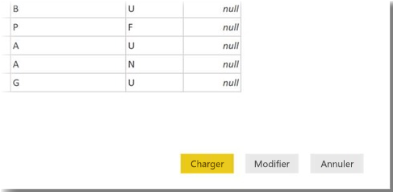

# Se connecter à Adobe Analytics dans Power BI Desktop 
Dans **Power BI Desktop**, vous pouvez vous connecter à **Adobe Analytics** et utiliser les données sous-jacentes comme n’importe quelle autre source de données dans Power BI Desktop. 

## Se connecter aux données Adobe Analytics
Pour vous connecter aux données **Adobe Analytics**, sélectionnez **Obtenir des données** dans le ruban **Accueil** de Power BI Desktop. Sélectionnez **Services en ligne** dans les catégories à gauche pour afficher le **connecteur Adobe Analytics**.

Dans la fenêtre **Adobe Analytics** qui s’affiche, sélectionnez le bouton **Se connecter**, puis entrez vos informations d’identification pour vous connecter à votre compte Adobe Analytics. La fenêtre de connexion Adobe s’affiche, comme ci-dessous.

Lorsque vous y êtes invité, indiquez votre nom d’utilisateur et votre mot de passe. Une fois que la connexion est établie, vous pouvez prévisualiser et sélectionner différentes dimensions et mesures dans la boîte de dialogue **Navigateur** de Power BI pour créer une sortie tabulaire. Vous pouvez également spécifier les paramètres d’entrée nécessaires pour les éléments sélectionnés. 

Vous pouvez **charger** la table sélectionnée, ce qui permet d’afficher la table entière dans **Power BI Desktop**, ou **modifier** la requête, ce qui permet d’ouvrir l’**éditeur de requête**. Vous pouvez ainsi filtrer et affiner l’ensemble de données que vous souhaitez utiliser, puis charger ce jeu de données affiné dans **Power BI Desktop**.

## Étapes suivantes
Vous pouvez connecter toutes sortes de données à l’aide de Power BI Desktop. Pour plus d’informations sur les sources de données, consultez les ressources suivantes :

* [Qu’est-ce que Power BI Desktop ?](../fundamentals/desktop-what-is-desktop.md)
* [Sources de données dans Power BI Desktop](desktop-data-sources.md)
* [Mettre en forme et combiner des données dans Power BI Desktop](desktop-shape-and-combine-data.md)
* [Se connecter à des classeurs Excel dans Power BI Desktop](desktop-connect-excel.md)   
* [Entrer des données directement dans Power BI Desktop](desktop-enter-data-directly-into-desktop.md)   
