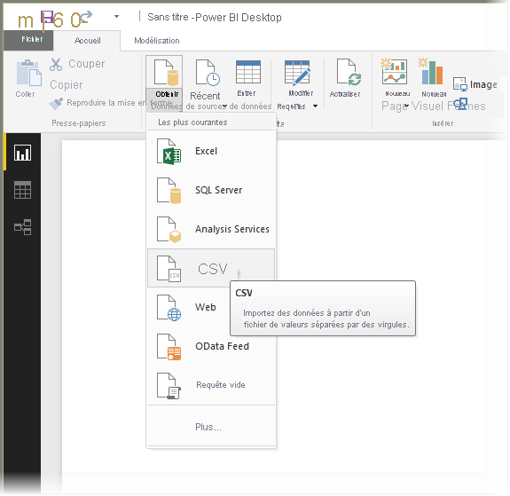
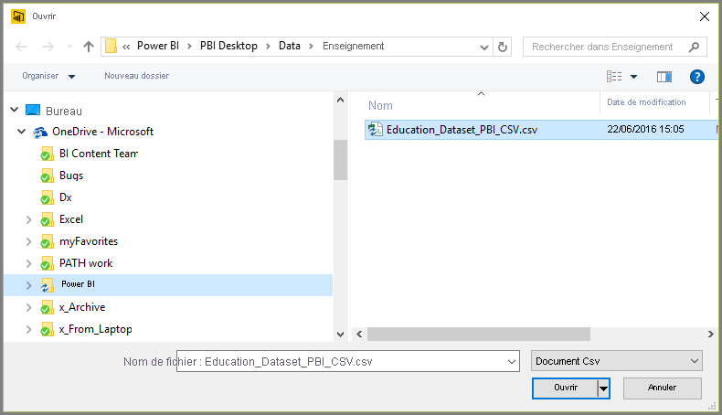
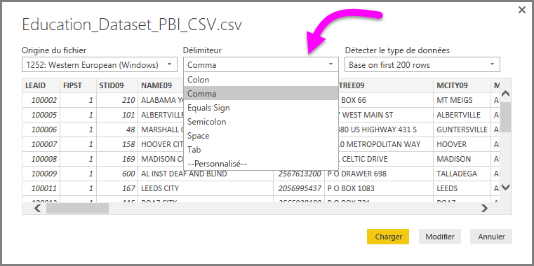

# Se connecter à des fichiers CSV dans Power BI Desktop
La connexion à un fichier *CSV* à partir de Power BI Desktop est très semblable à la connexion à un classeur Excel. Ces deux types de connexion sont faciles et cet article décrit pas à pas comment se connecter à un fichier CSV auquel vous avez accès.

Pour commencer, dans Power BI Desktop, sélectionnez **Obtenir des données > CSV** dans le ruban **Accueil**.

Sélectionnez votre fichier CSV dans la boîte de dialogue **Ouvrir** qui s’affiche.

Lorsque vous sélectionnez **Ouvrir**, Power BI Desktop accède au fichier et détermine certains de ces attributs, par exemple l’origine du fichier, le type de délimiteur et le nombre de lignes qui doit être utilisé pour détecter les types de données dans le fichier.

Ces attributs de fichier et options s’affichent dans les sélections de la liste déroulante en haut de la boîte de dialogue **Importation CSV**, illustrée ci-dessous. Vous pouvez modifier ces paramètres manuellement, en choisissant une autre option dans les listes déroulantes.

Lorsque vous êtes satisfait des sélections, vous pouvez sélectionner **Charger** pour importer le fichier dans Power BI Desktop. Vous pouvez aussi sélectionner **Modifier** pour ouvrir l’**Éditeur de requête** afin de mettre en forme et de transformer les données avant de les importer.

Une fois que vous chargez les données dans Power BI Desktop, vous voyez la table et ses colonnes (qui sont présentés sous forme de champs dans Power BI Desktop) dans le volet **Champs**, à droite de la vue Rapport dans Power BI Desktop.

Et c’est tout ce que vous avez à faire : les données de votre fichier CSV sont désormais dans Power BI Desktop.

Vous pouvez utiliser ces données dans Power BI Desktop pour créer des éléments visuels et des rapports ou bien pour interagir avec toutes les autres données auxquelles vous souhaitez vous connecter et que vous voulez importer, par exemple des classeurs Excel, des bases de données ou toute autre source de données.

> [!IMPORTANT]
> Quand vous importez un fichier CSV, Power BI Desktop génère un compteur *colonnes=x* (où *x* est le nombre de colonnes dans le fichier CSV lors de l’importation initiale) comme étape dans l’éditeur Power Query. Si vous ajoutez par la suite des colonnes supplémentaires et que la source de données est définie pour s’actualiser, les colonnes au-delà du nombre initial de colonnes *x* ne sont pas actualisées. 

## Étapes suivantes
Vous pouvez connecter toutes sortes de données à l’aide de Power BI Desktop. Pour plus d’informations sur les sources de données, consultez les ressources suivantes :

* [Qu’est-ce que Power BI Desktop ?](../fundamentals/desktop-what-is-desktop.md)
* [Sources de données dans Power BI Desktop](desktop-data-sources.md)
* [Mettre en forme et combiner des données dans Power BI Desktop](desktop-shape-and-combine-data.md)
* [Se connecter à des classeurs Excel dans Power BI Desktop](desktop-connect-excel.md)   
* [Entrer des données directement dans Power BI Desktop](desktop-enter-data-directly-into-desktop.md)   
