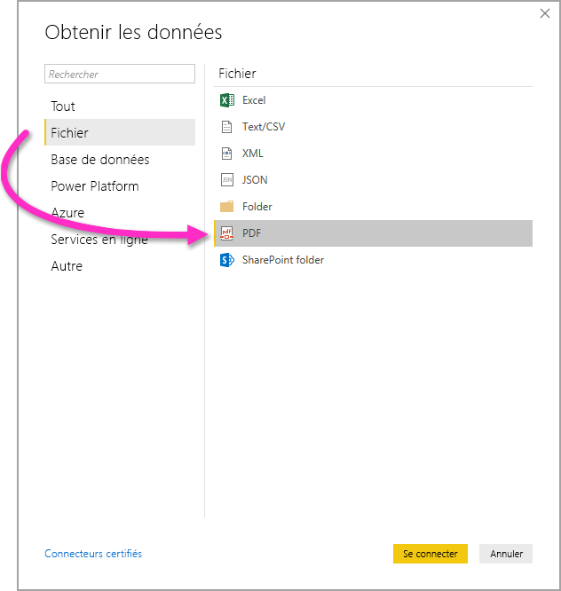

# Se connecter à des fichiers PDF dans Power BI Desktop
Dans Power BI Desktop, vous pouvez vous connecter à un **fichier PDF** et utiliser les données qui s’y trouvent, comme toute autre source de données dans Power BI Desktop.

Les sections suivantes décrivent comment se connecter à un **fichier PDF**, sélectionner des données et importer des données dans **Power BI Desktop**.

Nous recommandons toujours de mettre à niveau vers la version la plus récente de **Power BI Desktop**, que vous pouvez obtenir à partir d’un lien dans [Obtenir Power BI Desktop](../fundamentals/desktop-get-the-desktop.md). 

## Se connecter à un fichier PDF
Pour vous connecter à un fichier **PDF**, sélectionnez **Obtenir des données** dans le ruban **Accueil** de Power BI Desktop. Sélectionnez **Fichier** dans les catégories à gauche : vous voyez **PDF**.

Vous êtes invité à indiquer l’emplacement du fichier PDF que vous souhaitez utiliser. Une fois que vous avez fourni l’emplacement du fichier et que le fichier PDF s’est chargé, une fenêtre **Navigateur** apparaît et affiche les données disponibles du fichier. Vous pouvez ensuite sélectionner un ou plusieurs éléments à importer et à utiliser dans **Power BI Desktop**.

Quand vous cochez une case en regard des éléments découverts dans le fichier PDF, vous les voyez s’afficher dans le volet droit. Une fois que vous êtes prêt à importer, sélectionnez le bouton **Charger** pour afficher les données dans **Power BI Desktop**.

À partir de la version de novembre 2018 de **Power BI Desktop**, vous pouvez spécifier la **Page de démarrage** et la **Page de fin** en tant que paramètres facultatifs pour votre connexion PDF. Vous pouvez également spécifier ces paramètres dans le langage de formule M, en utilisant le format suivant :

`Pdf.Tables(File.Contents("c:\sample.pdf"), [StartPage=10, EndPage=11])`

## Étapes suivantes
Vous pouvez connecter toutes sortes de données à l’aide de Power BI Desktop. Pour plus d’informations sur les sources de données, consultez les ressources suivantes :

* [Qu’est-ce que Power BI Desktop ?](../fundamentals/desktop-what-is-desktop.md)
* [Sources de données dans Power BI Desktop](desktop-data-sources.md)
* [Mettre en forme et combiner des données dans Power BI Desktop](desktop-shape-and-combine-data.md)
* [Se connecter à des classeurs Excel dans Power BI Desktop](desktop-connect-excel.md)   
* [Entrer des données directement dans Power BI Desktop](desktop-enter-data-directly-into-desktop.md)   
