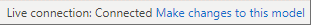
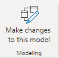
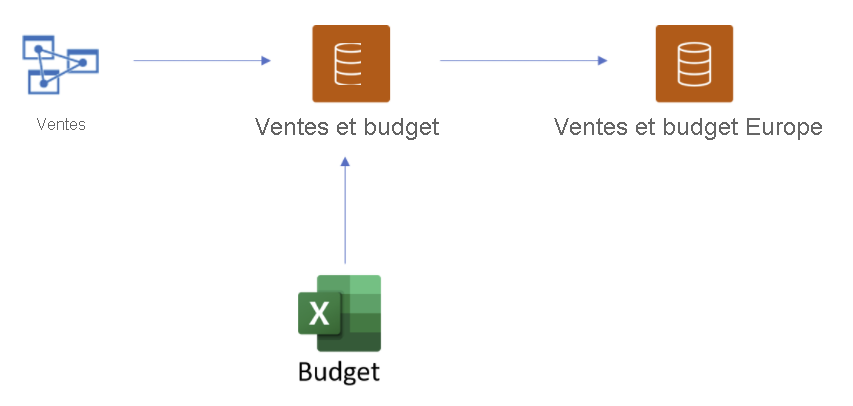
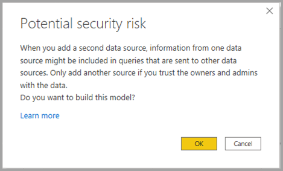
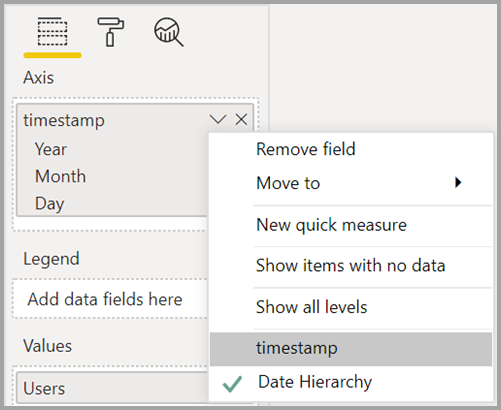

# Utilisation de DirectQuery pour jeux de données Power BI et Azure Analysis Services (préversion)

Avec **DirectQuery pour les jeux de données Power BI et Azure Analysis Services (AAS)** , vous pouvez utiliser DirectQuery pour vous connecter à des jeux de données AAS ou Power BI et, si vous le souhaitez, le combiner avec d’autres données DirectQuery et données importées. Les auteurs de rapports qui souhaitent combiner les données de leur modèle sémantique d’entreprise avec d’autres données qu’ils possèdent, comme une feuille de calcul Excel, ou qui souhaitent personnaliser ou enrichir les métadonnées de leur modèle sémantique d’entreprise, trouveront cette fonctionnalité particulièrement utile.

## Activer la fonctionnalité de préversion

Étant donné que la fonctionnalité est actuellement en préversion, vous devez d’abord l’activer. Pour ce faire, dans Power BI Desktop, sélectionnez **Fichier > Options et paramètres > Options**, puis dans la section **Fonctionnalités en préversion**, cochez la case **DirectQuery pour jeux de données Power BI et Analysis Services** pour activer cette fonctionnalité en préversion. Vous devrez peut-être redémarrer Power BI Desktop pour que les modifications entrent en vigueur.

## Utilisation de DirectQuery pour les connexions actives

L’utilisation de DirectQuery pour les jeux de données Power BI et Azure Analysis Services nécessite que votre rapport comporte un modèle local. Vous pouvez démarrer à partir d’une connexion active et ajouter un modèle local (ou le mettre à niveau), ou démarrer avec une connexion DirectQuery ou des données importées, ce qui crée automatiquement un modèle local dans votre rapport.

Pour voir quelles connexions sont utilisées dans votre modèle, consultez la barre d’état dans le coin inférieur droit de Power BI Desktop. Si vous êtes connecté uniquement à une source Azure Analysis Services, un message semblable à l’image suivante s’affiche :

Si vous êtes connecté à un jeu de données Power BI, un message s’affiche vous indiquant le jeu de données Power BI auquel vous êtes connecté :

Si vous souhaitez personnaliser les métadonnées des champs dans votre jeu de données connecté en temps réel, sélectionnez **Make changes to this model** (Apporter des modifications à ce modèle) dans la barre d’état. Vous pouvez également cliquer sur le bouton **Make changes to this model** (Apporter des modifications à ce modèle) dans le ruban, comme illustré dans l’image suivante. Dans la **vue Rapport**, le bouton **Make changes to this model** (Apporter des modifications à ce modèle) se trouve dans l’onglet **Modélisation**. Dans la vue Modèle, le bouton se trouve dans l’onglet **Accueil**.

La sélection du bouton affiche une boîte de dialogue confirmant l’ajout d’un modèle local. Sélectionnez **Ajouter un modèle local** pour permettre la création de nouvelles colonnes ou la modification des métadonnées, pour les champs de jeux de données Power BI ou Azure Analysis Services. L’image suivante montre la boîte de dialogue qui s’affiche. 

Quand vous êtes connecté en temps réel à une source Analysis Services, aucun modèle local n’est disponible. Afin d’utiliser DirectQuery pour des sources connectées en temps réel, par exemple des jeux de données Power BI et Azure Analysis Services, vous devez ajouter un modèle local à votre rapport. Lorsque vous publiez un rapport avec un modèle local dans le service Power BI, un jeu de données pour ce modèle local est également publié.

## Chaînage

Les jeux de données, ainsi que les jeux de données et les modèles sur lesquels ils sont basés, forment une *chaîne* . Ce processus, appelé **chaînage**, vous permet de publier un rapport et un jeu de données basé sur d’autres jeux de données Power BI, une fonctionnalité qui n’était pas possible auparavant.

Par exemple, imaginez que votre collègue publie un jeu de données Power BI appelé *Ventes et budget* basé sur un modèle Azure Analysis Services appelé *Ventes*, et l’associe à une feuille Excel appelée *Budget*.

Lorsque vous publiez un nouveau rapport (et un jeu de données) appelé *Ventes et budget Europe* basé sur le jeu de données Power BI *Ventes et budget* publié par votre collègue, en y apportant des modifications ou en y ajoutant des extensions, vous ajoutez en fait un rapport et un jeu de données à une chaîne de 3 éléments, qui commence par le modèle Azure Analysis Services *Ventes* et se termine par votre jeu de données Power BI *Ventes et budget Europe*. L’image suivante illustre ce processus de chaînage.

La chaîne de l’image précédente se compose de trois éléments, ce qui correspond à la longueur maximale pendant cette période de préversion. L’extension d’une chaîne au-delà de trois éléments n’est pas prise en charge et génère des erreurs.

## Avertissement de sécurité

L’utilisation de la fonctionnalité **DirectQuery pour les jeux de données Power BI et Azure Analysis Services (AAS)** affiche une boîte de dialogue d’avertissement de sécurité, comme le montre l’image suivante.

Les données peuvent être envoyées d’une source de données vers une autre, ce qui génère le même avertissement de sécurité pour combiner DirectQuery et importer des sources dans un modèle de données. Pour en savoir plus sur ce comportement, consultez [Utilisation de modèles composites dans Power BI Desktop](../transform-model/desktop-composite-models.md).

## Fonctionnalités et scénarios à essayer

La liste suivante fournit des suggestions sur la façon dont vous pouvez explorer **DirectQuery pour les jeux de données Power BI et Azure Analysis Services (AAS)** pour votre cas personnel :

- Connexion à des données de différentes sources : Importer (par exemple des fichiers), jeux de données Power BI, Azure Analysis Services
- Création de relations entre différentes sources de données
- Écriture de mesures qui utilisent des champs de différentes sources de données
- Création de nouvelles colonnes pour des tables de jeux de données Power BI d’Azure Analysis Services
- Création de visuels utilisant des colonnes de différentes sources de données

## Considérations et limitations

Il existe quelques **points à prendre en compte** lorsque vous utilisez **DirectQuery pour les jeux de données Power BI et Azure Analysis Services (AAS)**  :

- Si vous actualisez vos sources de données et que des erreurs apparaissent au niveau des noms de champs ou de tables en conflit, Power BI résout les erreurs pour vous.

- Pour générer des rapports dans le service Power BI sur un modèle composite basé sur un autre jeu de données, toutes les informations d’identification doivent être définies. Dans la page d’actualisation des paramètres des informations d’identification, pour les sources Azure Analysis Services, l’erreur suivante s’affiche, même si les informations d’identification ont été définies :
    
    
- Comme ce message est confus et incorrect, nous nous en occuperons très prochainement.

- Des règles RLS seront appliquées à la source sur laquelle elles sont définies, mais elles ne seront pas appliquées à d’autres jeux de données du modèle. Les règles RLS définies dans le rapport ne seront pas appliquées aux sources distantes, et celles définies sur des sources distantes ne seront pas appliquées à d’autres sources de données.

- Les dossiers d’affichage, les indicateurs de performance clés, les tables de dates, la sécurité au niveau des lignes et les traductions ne seront pas importés à partir de la source dans cette préversion. Vous pouvez néanmoins créer des dossiers d’affichage dans le modèle local.

- Vous risquez de constater un comportement inattendu lors de l’utilisation d’une hiérarchie de dates. Pour résoudre ce problème, utilisez plutôt une colonne de date. Après avoir ajouté une hiérarchie de dates à un visuel, vous pouvez basculer vers une colonne de date en cliquant sur la flèche vers le bas dans le nom du champ, puis en cliquant sur le nom de ce champ au lieu d’utiliser *Hiérarchie de dates* :

    

    Pour plus d’informations sur l’utilisation de colonnes de date par rapport à des hiérarchies de dates, consultez cet article.

- Des messages d’erreur inutiles peuvent s’afficher lorsque vous utilisez des fonctionnalités IA avec un modèle qui établit une connexion DirectQuery à Azure Analysis Services. 

- Utiliser ALLSELECTED avec une source DirectQuery entraîne des résultats incomplets.

- Filtres et relations :
    - Un filtre appliqué d’une source de données à une table d’une autre source DirectQuery ne peut être défini que sur une seule colonne

    - Le filtrage croisé de deux tables dans une source DirectQuery en les filtrant avec une table en dehors de la source n’est pas une méthode recommandée et n’est pas prise en charge.

    - Un filtre ne peut s’appliquer qu’une seule fois à une table. L’application à deux reprises du même filtre à une table par le biais d’une ou de plusieurs tables situées en dehors de la source DirectQuery, n’est pas prise en charge.

- Pendant la préversion, la longueur maximale d’une chaîne de modèles est de trois éléments. L’extension de la chaîne au-delà de trois éléments n’est pas prise en charge et génère des erreurs. 

- À l’aide d’outils tiers, un indicateur de type *empêcher le chaînage* peut être défini sur un modèle pour empêcher la création ou l’extension d’une chaîne. Pour le définir, recherchez la propriété *DiscourageCompositeModels* sur un modèle. 

Il existe également quelques **limitations** dont vous devez tenir compte :

- Les paramètres pour les noms de base de données et de serveur sont actuellement désactivés. 

- La définition de la sécurité au niveau des tables (RLS) d’une source distante n’est pas prise en charge.

- L’utilisation de SQL Server Analysis Services (SSAS) comme source DirectQuery n’est pas prise en charge actuellement. 

- L’utilisation de DirectQuery sur des jeux de données à partir de « Mon espace de travail » n’est pas prise en charge actuellement. 

- La suppression de connexions à des sources distantes qui utilisent DirectQuery n’est pas prise en charge actuellement.

- L’utilisation de Power BI Embedded avec des jeux de données qui incluent une connexion DirectQuery à des jeux de données Power BI ou un modèle Azure Analysis Services n’est pas prise en charge actuellement.

- Les chaînes de format sur les colonnes et mesures d’une source distante ne sont pas importées dans le modèle composite.

- Les groupes de calcul sur des sources distantes ne sont pas pris en charge, avec des résultats de requête non définis.

- Certaines requêtes peuvent retourner des résultats incorrects lorsqu’il existe une relation entre des tables calculées et une ou plusieurs tables d’une source distante. La création de tables calculées sur un jeu de données distant n’est pas prise en charge, bien qu’elle ne soit pas actuellement bloquée dans l’interface.

- Le tri par colonne n’est pas pris en charge à ce stade.

- L’actualisation automatique de la page (APR) est prise en charge uniquement pour certains scénarios, en fonction du type de source de données. Pour plus d’informations, consultez l’article [Actualisation automatique des pages dans Power BI](../create-reports/desktop-automatic-page-refresh.md).

## Étapes suivantes

Pour plus d’informations sur DirectQuery, consultez les ressources suivantes :

- [Utiliser DirectQuery dans Power BI Desktop](desktop-use-directquery.md)
- [Modèles DirectQuery dans Power BI Desktop](desktop-directquery-about.md)
- [Aide sur le modèle DirectQuery dans Power BI Desktop](../guidance/directquery-model-guidance.md)
- Vous avez des questions ? [Essayez d’interroger la communauté Power BI](https://community.powerbi.com/)
