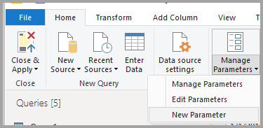
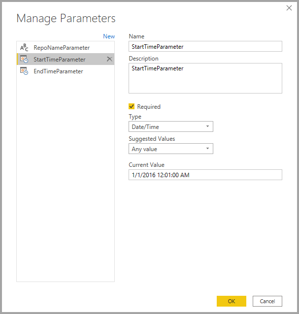
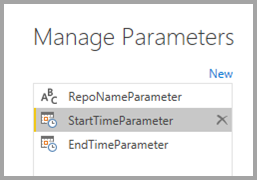
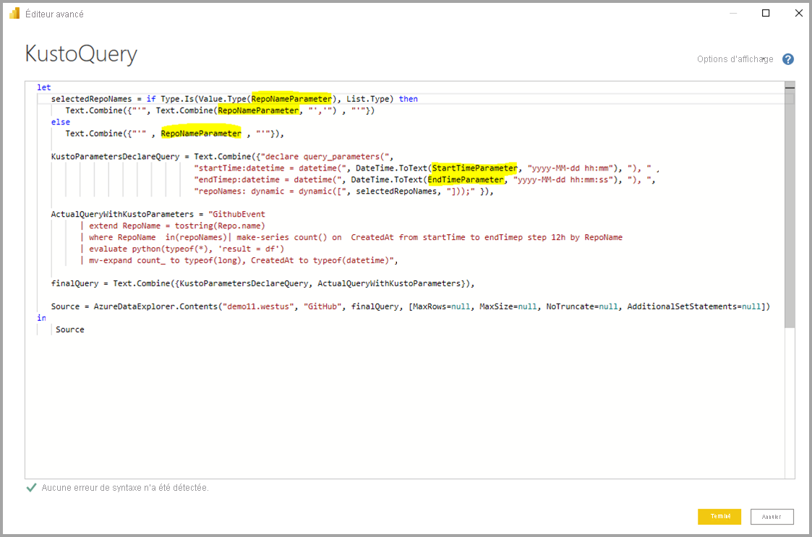
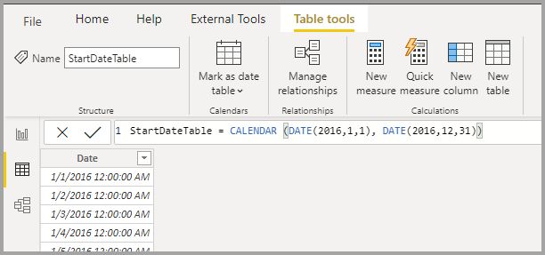
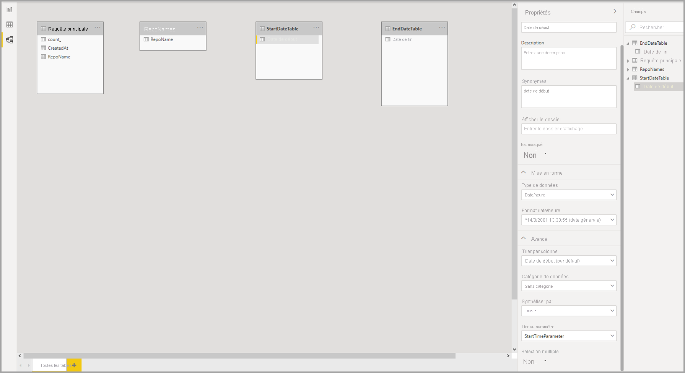
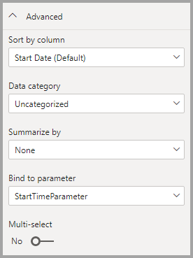
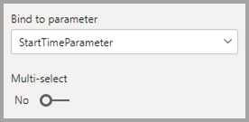

# <a name="dynamic-m-query-parameters-in-power-bi-desktop-preview"></a>Paramètres de requête M dynamiques dans Power BI Desktop (préversion)

Avec les **Paramètres de requête M dynamiques**, les créateurs de modèles peuvent permettre aux **lecteurs de rapports** d’utiliser des filtres ou des segments pour définir la ou les valeurs d’un [paramètre de requête M](/power-query/power-query-query-parameters), ce qui peut s’avérer particulièrement utile pour optimiser les performances des requêtes. Avec les paramètres de requête M dynamiques, les créateurs de modèles disposent d’un contrôle supplémentaire sur la manière dont les sélections de filtres sont incorporées dans les requêtes sources DirectQuery. 

Lorsque les auteurs de modèles comprennent la sémantique prévue de leurs filtres, ils savent souvent comment écrire des requêtes efficaces sur leur source de données et peuvent ainsi s’assurer que les sélections de filtre sont incorporées dans les requêtes sources au bon endroit pour atteindre leurs résultats prévus avec des performances améliorées.

## <a name="enabling-dynamic-m-query-parameters"></a>Activer les paramètres de requête M dynamiques

**Les paramètres de requête M dynamiques** sont actuellement en préversion et doivent être activés pour être utilisés. Sélectionnez **Fichier > Options et paramètres > Options**, puis **Fonctionnalités en version préliminaire** dans le volet de gauche. À partir de là, vérifiez que la case à cocher **Paramètres de requête M dynamiques** est activée. Vous devez redémarrer Power BI Desktop pour que les modifications entrent en vigueur.


Comme condition préalable pour cette fonctionnalité, vous devez disposer d’un [paramètre de requête M](/power-query/power-query-query-parameters) valide créé et référencé dans une ou plusieurs tables de requête directe. Examinons un exemple de passage d’une **valeur unique** à un paramètre de manière dynamique :

1. Dans Power BI Desktop, lancez **Power Query** à partir de l’onglet **Données**, puis sélectionnez **Nouveaux paramètres** sous le bouton **Gérer les paramètres** dans le ruban.

    

2. Renseignez ensuite les informations suivantes sur le paramètre.

    

3. Cliquez à nouveau sur **Nouveau** si vous avez plus de paramètres à ajouter.

    

4. Une fois que vous avez créé les paramètres, vous pouvez les référencer dans la requête M. Pour modifier la requête M, ouvrez l’éditeur avancé pendant que vous avez la requête que vous souhaitez modifier sélectionnée :

    

5. Ensuite, référencez les paramètres dans la requête M, mise en surbrillance en jaune dans l’image suivante. 

    

6. Maintenant que vous avez créé les paramètres et que vous les avez référencés dans la requête M, vous devez ensuite créer une table avec une colonne qui fournit les valeurs possibles disponibles pour ce paramètre. Cela lui permettra de définir de manière dynamique les paramètres en fonction de la sélection de filtre. Dans cet exemple, nous voulons que nos paramètres *StartTime* et *EndTime* soient dynamiques. Étant donné que ces paramètres requièrent un paramètre de date/heure, nous souhaitons générer des entrées de date qui peuvent être utilisées pour définir la date du paramètre. Pour commencer, nous créons une nouvelle table :

    

7. Voici la première table créée pour les valeurs du paramètre *StartTime* :

    ```StartDateTable = CALENDAR (DATE(2016,1,1), DATE(2016,12,31))```

    

8. Voici la deuxième table créée pour les valeurs du paramètre EndTime :

    ```EndDateTable = CALENDAR (DATE(2016,1,1), DATE(2016,12,31))```

    

    > [!NOTE]
    > Nous vous recommandons d’utiliser un nom de colonne qui ne se trouve pas dans une table réelle. S’il s’agit du même nom, la valeur sélectionnée sera appliquée comme filtre sur la requête réelle.

9. Maintenant que les tables avec le champ *Date* ont été créées, nous pouvons lier chaque champ à un paramètre. La liaison du champ à un paramètre signifie essentiellement que lorsque la valeur sélectionnée pour le champ change, la valeur est passée au paramètre et met à jour la requête dans laquelle le paramètre est référencé. Pour lier le champ, accédez à l’onglet **Modélisation**, sélectionnez le champ nouvellement créé, puis accédez aux propriétés **Avancées** :

    > [!NOTE]
    > Le type de données de la colonne doit correspondre au type de paramètre M.

    

10. Sélectionnez la liste déroulante sous **Lier au paramètre** et sélectionnez le paramètre que vous souhaitez lier au champ :

    

    Dans la mesure où cet exemple concerne une valeur à sélection unique (en définissant le paramètre sur une seule valeur), vous souhaiterez laisser **Sélection multiple** sur **Non**, qui est la valeur par défaut :

    

    Si vos cas d’usage nécessitent une sélection multiple (passage de plusieurs valeurs à un même paramètre), vous devez basculer le commutateur sur **Oui** et vous assurer que votre requête M est configurée correctement pour accepter plusieurs valeurs dans la requête M. Voici un exemple de *RepoNameParameter*, qui autorise plusieurs valeurs :

    

11. Vous pouvez répéter ces étapes si vous avez d’autres champs à lier à d’autres paramètres :

    

12. Enfin, vous pouvez référencer ce champ dans un segment ou en tant que filtre :

    

Si la colonne mappée est définie sur **Non** pour la sélection multiple, vous devez utiliser un mode de sélection unique dans le segment ou exiger une sélection unique dans la carte de filtre.

## <a name="potential-security-risk"></a>Risque de sécurité potentiel

Lorsque vous autorisez les lecteurs du rapport à définir dynamiquement les valeurs des paramètres de requête M, ils pourraient être en mesure d’accéder à des données supplémentaires ou déclencher des modifications sur le système source à l’aide d’**attaques par injection**, selon la façon dont les paramètres sont référencés dans la requête M et les valeurs transmises à ce paramètre.

Par exemple, imaginons que vous avez une requête Kusto paramétrable construite comme suit :

```
Products
| where Category == [Parameter inserted here] & HasReleased == 'True'
 | project ReleaseDate, Name, Category, Region```
```

Vous n’avez peut-être pas d’objection à ce qu’un utilisateur bienveillant transmette une valeur appropriée pour le paramètre, par exemple, *Jeux* :

```
| where Category == 'Games' & HasReleased == 'True'
```

Toutefois, une personne malveillante peut être en mesure de transmettre une valeur qui modifie la requête pour obtenir l’accès à plus de données, par exemple, *'Jeux' //* :

```
Products
| where Category == 'Games'// & HasReleased == 'True'
| project ReleaseDate, Name, Category, Region
```

Dans cet exemple, l’attaquant peut accéder à des informations sur des jeux qui n’ont pas encore été publiés en changeant une partie de la requête en commentaire.

**Comment atténuer le risque**

Pour atténuer le risque de sécurité, il est préférable d’éviter la concaténation de chaînes de valeurs de paramètre M dans la requête.  Au lieu de cela, consommez ces valeurs de paramètre dans des opérations M qui se replient sur la requête source, afin que le moteur et le connecteur M construisent la requête finale. Sinon, si cela est possible, utilisez un mécanisme de passage de paramètres intégré au langage de requête source et aux connecteurs. Par exemple, [Azure Data Explorer](/azure/data-explorer/kusto/query/queryparametersstatement?pivots=azuredataexplorer) dispose de fonctionnalités de paramètres de requête intégrées qui sont conçues pour protéger contre les attaques par injection.

Voici quelques exemples :

* Exemple utilisant les opérations de filtrage de requête M :
    ```
    Table.SelectRows(Source, (r) =\&gt; r[Columns] = Parameter)
    ```

* Exemple déclarant le paramètre dans la requête source (ou en passant la valeur de paramètre en tant qu’entrée à une fonction de requête source) :
    ```
    declare query\_parameters (Name of Parameter : Type of Parameter);
    ```

## <a name="considerations-and-limitations"></a>Observations et limitations

Certaines considérations et limitations sont à prendre en compte lors de l’utilisation de paramètres de requête M dynamiques :

* Un seul paramètre ne peut pas être lié à plusieurs champs et inversement.
* La fonctionnalité est uniquement prise en charge pour une source de données basée sur M et exclut la prise en charge des requêtes SQL natives.
* Les types de paramètres prédéfinis non pris en charge sont les suivants :
  * Quelconque
  * Duration
  * Vrai/Faux
  * Binary

* Filtres non pris en charge :
  * Segment ou filtre d’heure relative
  * Date relative
  * Segment de hiérarchie
  * Filtre d’inclusion à plusieurs champs
  * Filtre d’exclusion/Filtre N’est pas
  * Mise en surbrillance croisée
  * Filtre Descendre dans la hiérarchie
  * Filtre d’extraction croisée
  * Filtre N principaux
* Opérations non prises en charge :
  * And
  * Contient
  * Inférieur à
  * Supérieur à
  * Starts With (Commence par)
  * Ne commence pas par
  * N'est pas
  * Ne contient pas
  * Tout sélectionner
  * Est vierge
  * N’est pas vide


## <a name="next-steps"></a>Étapes suivantes

Power BI Desktop permet d’effectuer des tâches très diverses. Pour plus d’informations sur ses fonctionnalités, passez en revue les ressources suivantes :

* [À propos de l’utilisation de DirectQuery dans Power BI](desktop-directquery-about.md)
* [Qu’est-ce que Power BI Desktop ?](../fundamentals/desktop-what-is-desktop.md)
* [Vue d’ensemble des requêtes dans Power BI Desktop](../transform-model/desktop-query-overview.md)
* [Types de données dans Power BI Desktop](desktop-data-types.md)
* [Mettre en forme et combiner des données dans Power BI Desktop](desktop-shape-and-combine-data.md)
* [Tâches courantes relatives aux requêtes dans Power BI Desktop](../transform-model/desktop-common-query-tasks.md)