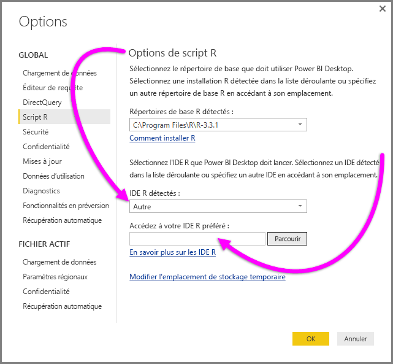
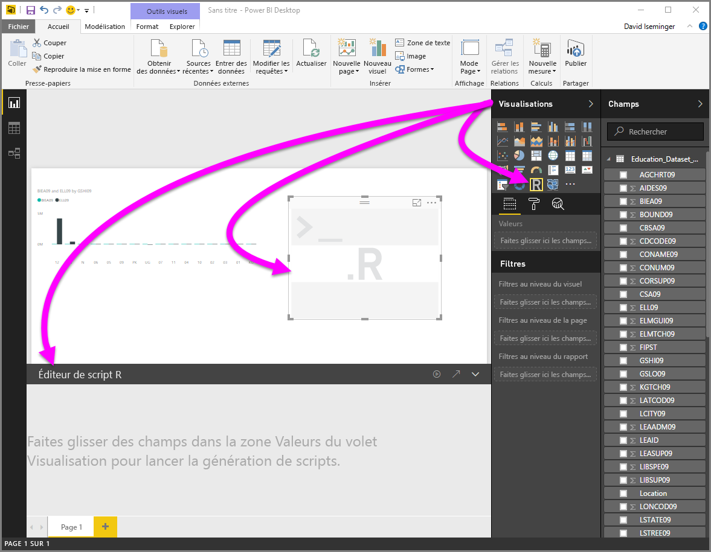
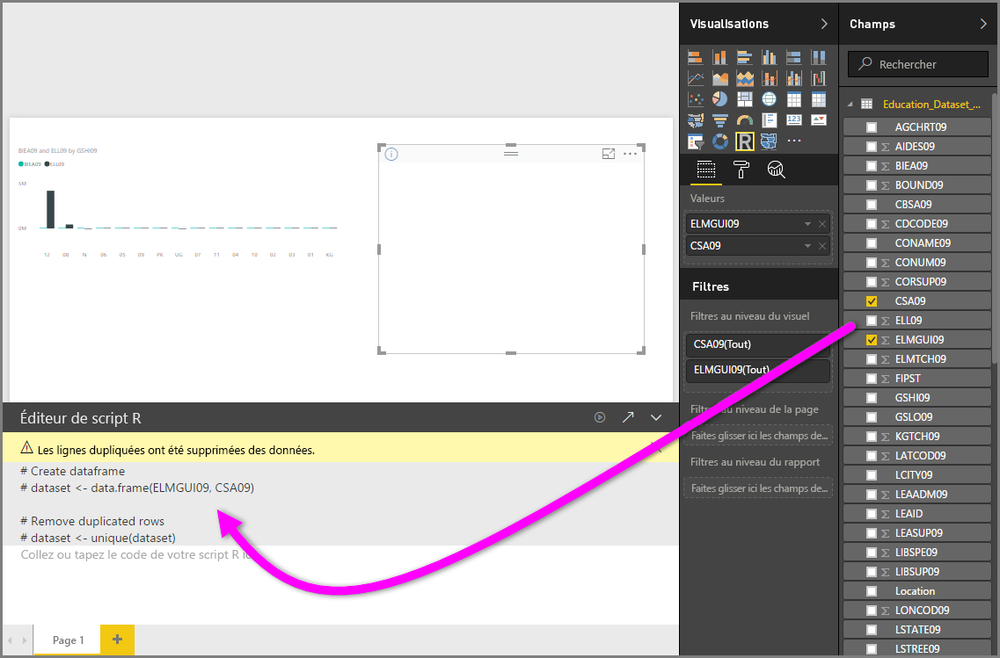
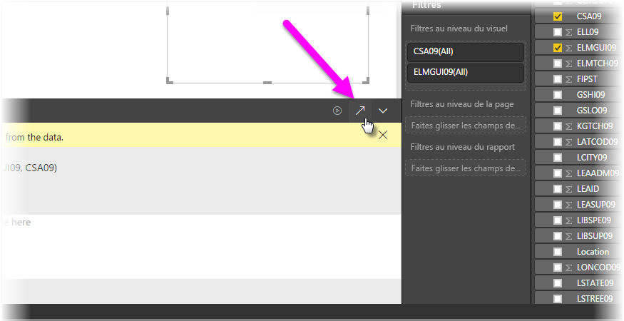
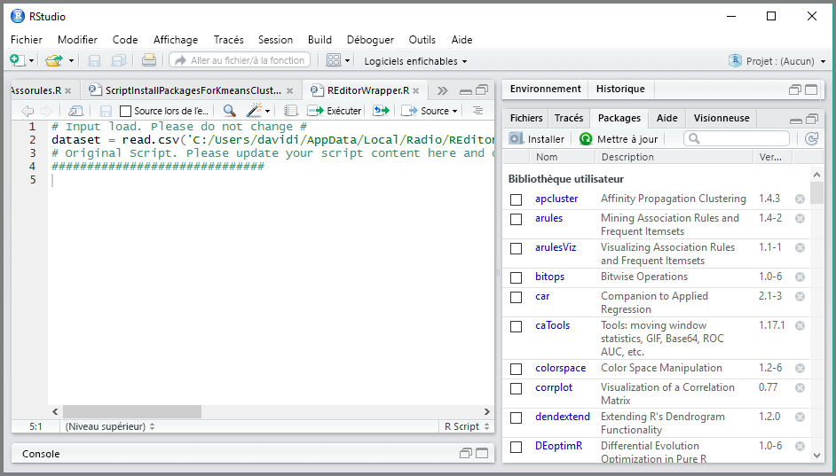

# Utiliser un IDE R externe avec Power BI
Avec **Power BI Desktop**, vous pouvez utiliser un IDE (environnement de développement intégré) R externe pour créer et affiner les scripts R, puis utiliser ces scripts dans Power BI.

## Activer un IDE R externe
Auparavant, vous deviez utiliser l’éditeur de script R dans **Power BI Desktop** pour créer et exécuter des scripts R. Avec cette version, vous pouvez lancer votre IDE R externe à partir de **Power BI Desktop** et importer et afficher vos données automatiquement dans l’IDE R. À partir de là, vous pouvez modifier le script dans cet IDE R externe, puis le coller dans **Power BI Desktop** pour créer des rapports et des éléments visuels Power BI.

À partir de la version de septembre 2016 de **Power BI Desktop** (version 2.39.4526.362), vous pouvez spécifier l’IDE R que vous souhaitez utiliser et le lancer automatiquement à partir de **Power BI Desktop**.

### Configuration requise
Pour utiliser cette fonctionnalité, vous devez installer un **IDE R** sur votre ordinateur local. **Power BI Desktop** n’inclut pas, ne déploie pas et n’installe pas le moteur R. Vous devez donc installer **R** séparément sur votre ordinateur local. Vous pouvez choisir l’IDE R à utiliser avec les options suivantes :

* Vous pouvez installer votre IDE R favori (nombre des IDE R étant disponibles gratuitement), tel que [Revolution Open](https://mran.revolutionanalytics.com/download/) et [CRAN Repository](https://cran.r-project.org/bin/windows/base/).
* **Power BI Desktop** prend également en charge [R Studio](https://www.rstudio.com/) et **Visual Studio 2015** avec les éditeurs [*Outils R pour Visual Studio*](/visualstudio/rtvs).
* Vous pouvez également installer un autre IDE R et configurer **Power BI Desktop** pour lancer cet **IDE R** en effectuant l’une des opérations suivantes :
  
  * Vous pouvez associer des fichiers **.R** à l’IDE externe que vous souhaitez lancer à l’aide de **Power BI Desktop**.
  * Vous pouvez spécifier l’exécutable que **Power BI Desktop** doit lancer en sélectionnant *Autres* à partir de la section **Options de script R** de la boîte de dialogue **Options**. Pour ouvrir la boîte de dialogue **Options**, accédez à **Fichier > Options et paramètres > Options**.
    
    

Si vous avez plusieurs IDE R installés, vous pouvez spécifier lequel lancer en le sélectionnant à partir de la liste déroulante *IDE R détectés* dans la boîte de dialogue **Options**.

Par défaut, **Power BI Desktop** lance **R Studio** en tant qu’IDE R externe s’il est installé sur votre ordinateur local ; si **R Studio** n’est pas installé et que vous avez **Visual Studio 2015** avec les **Outils R pour Visual Studio**, ces derniers seront lancés à la place. Si aucun de ces IDE R n’est installé, l’application associée aux fichiers **.R** est lancée.

Si aucune association au fichier **.R** n’existe, il est possible de spécifier un chemin d’accès à un IDE personnalisé dans la section *Accédez à votre IDE R préféré* de la boîte de dialogue **Options**. Vous pouvez également lancer un autre IDE R en sélectionnant l’icône en forme d’engrenage **Paramètres** en regard de l’icône représentant une flèche **Lancer un IDE R**, dans **Power BI Desktop**.

## Lancer un IDE R à partir de Power BI Desktop
Pour lancer un IDE R à partir de **Power BI Desktop**, effectuez les étapes suivantes :

1. Chargez des données dans **Power BI Desktop**.
2. Sélectionnez quelques champs que vous souhaitez utiliser dans le volet **Champs**. Si vous n’avez pas encore activé les éléments visuels de script, vous êtes invité à le faire.
   
   
3. Lorsque les éléments visuels de script sont activés, vous pouvez sélectionner un élément visuel R à partir du volet **Visualisations**, qui crée un élément visuel R vide qui est prêt à afficher les résultats de votre script. Le volet **Éditeur de script R** s’affiche également.
   
   
4. Vous pouvez maintenant sélectionner les champs que vous souhaitez utiliser dans votre script R. Lorsque vous sélectionnez un champ, le champ **Éditeur de script R** crée automatiquement un code de script basé sur le ou les champs que vous sélectionnez. Vous pouvez créer (ou coller) votre script R directement dans le volet **Éditeur de script R**, ou le laisser vide.
   
   
   
   > [!NOTE]
   > Le type d’agrégation par défaut pour les éléments visuels R est *Ne pas résumer*.
   > 
   > 
5. Vous pouvez maintenant lancer votre IDE R directement à partir de **Power BI Desktop**. Sélectionnez le bouton **Lancer l’IDE R** qui se trouve à droite de la barre de titre **Éditeur de script R**, comme indiqué ci-dessous.
   
   
6. L’IDE R spécifié est lancé par Power BI Desktop, comme illustré dans l’image suivante où **RStudio** est l’IDE R par défaut.
   
   
   
   > [!NOTE]
   > **Power BI Desktop** ajoute les trois premières lignes du script afin qu’il puisse importer vos données à partir de **Power BI Desktop** une fois que vous exécutez le script.
   > 
   > 
7. Les scripts que vous avez créés dans le **volet Éditeur de script R** de **Power BI Desktop** apparaissent à partir de la ligne 4 de votre IDE R. À ce stade, vous pouvez créer votre script R dans l’IDE R. Une fois que votre script R est terminé dans votre IDE R, vous devez le copier et le coller dans le volet **Éditeur de script R** de **Power BI Desktop**, *à l’exclusion des* trois premières lignes du script générées automatiquement par **Power BI Desktop**. Ne recopiez pas les trois premières lignes du script dans **Power BI Desktop**. Celles-ci ont été utilisées uniquement pour importer vos données dans votre IDE R à partir de **Power BI Desktop**.

### Limites connues
Le lancement de l’IDE R directement à partir de Power BI Desktop présente quelques limitations :

* L’exportation automatique de votre script de l’IDE R vers **Power BI Desktop** n’est pas prise en charge.
* L’éditeur **R Client** (RGui.exe) n’est pas pris en charge, car l’éditeur lui-même ne prend pas en charge l’ouverture de fichiers.

## Étapes suivantes
Consultez les informations supplémentaires suivantes sur R dans Power BI.

* [Exécution de scripts R dans Power BI Desktop](desktop-r-scripts.md)
* [Créer des visuels Power BI avec R](../create-reports/desktop-r-visuals.md)
