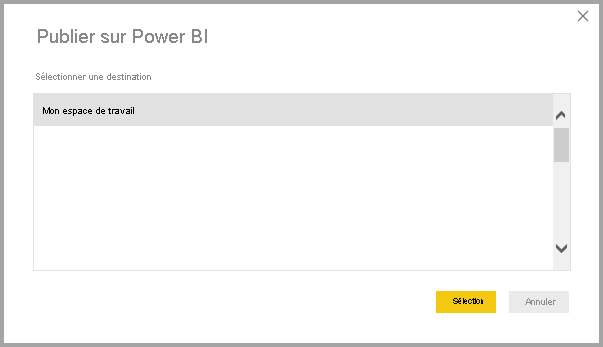
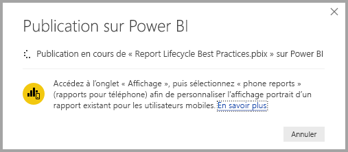
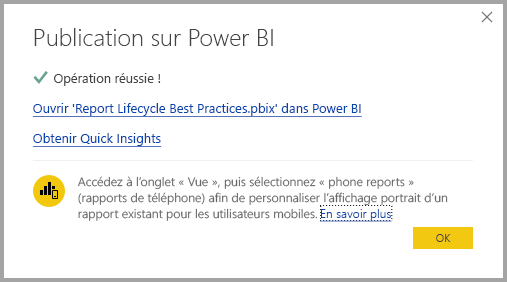
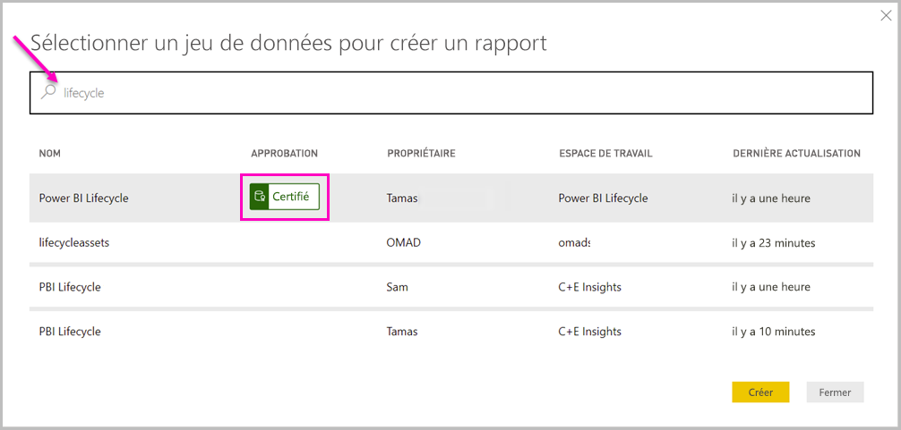
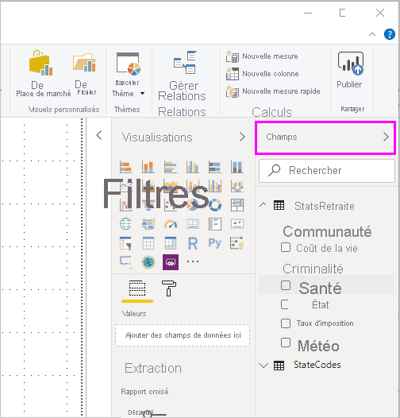

# Se connecter à des jeux de données dans le service Power BI à partir de Power BI Desktop

Il est possible d’établir une connexion active à un jeu de données partagé dans le *service Power BI* et de créer plusieurs rapports différents à partir du même jeu de données. Vous pouvez créer votre modèle de données idéal dans Power BI Desktop et le publier sur le service Power BI. Ensuite, vos coéquipiers et vous-même avez la possibilité de créer plusieurs rapports différents dans des fichiers *.pbix* distincts à partir de ce modèle de données commun, et de les enregistrer dans différents espaces de travail. Cette fonctionnalité est appelée *Connexion active du service Power BI*.

Cette fonctionnalité présente toutes sortes d’avantages, dont des meilleures pratiques, qui sont abordés dans cet article. Nous vous recommandons de prendre connaissance des [considérations et limitations](#limitations-and-considerations) de cette fonctionnalité.

## Utilisation d’une Connexion active du service Power BI pour gérer le cycle de vie des rapports

L’un des problèmes liés à la popularité de Power BI est la prolifération des rapports, des tableaux de bord et de leurs modèles de données sous-jacents. Il est facile de créer des rapports percutants dans Power BI Desktop, puis de les [publier](../create-reports/desktop-upload-desktop-files.md) sur le service Power BI, ainsi que de créer de beaux tableaux de bord à partir de ces jeux de données. Étant donné que de nombreux utilisateurs procèdent de la sorte, souvent en utilisant (presque) les mêmes jeux de données, il peut devenir difficile de savoir sur quel jeu de données est basé chaque rapport et de déterminer s’il est récent. La connexion active du service Power BI résout ce problème en facilitant et en harmonisant la création, le partage et l’étoffement de rapports et tableaux de bord basés sur un jeu de données commun.

### Créer et partager un jeu de données utilisable par chacun

Prenons l’exemple d’Anna, une analyste d’entreprise de votre équipe. Elle est douée pour créer de bons modèles de données, souvent appelés jeux de données. Elle sait créer un jeu de données et un rapport, puis partager ce dernier sur le service Power BI.

Tout le monde trouve le rapport et le jeu de données d’Anna intéressants. C’est là que les difficultés commencent. En effet, tous les membres de son équipe tentent de créer *leur propre version* de ce jeu de données, puis partagent leur rapport avec l’équipe. Soudainement, votre équipe se retrouve avec une multitude de rapports basés sur des jeux de données différents dans son espace de travail dans le service Power BI. Quel est le plus récent ? Les jeux de données utilisés sont-ils identiques, ou seulement presque identiques ? Quelles sont les différences ? La fonctionnalité de connexion active du service Power BI peut améliorer les choses. La section suivante explique comment d’autres personnes peuvent utiliser le jeu de données d’Annette pour créer leurs propres rapports, dans leurs propres espaces de travail, et permettre à chacun d’utiliser le même jeu de données solide, vérifié et publié pour générer leurs rapports uniques.

### Se connecter à un jeu de données du service Power BI à l’aide d’une connexion active

Anna crée un rapport et le jeu de données sur lequel il se base. Elle le publie ensuite sur le service Power BI. Le rapport apparaît dans l’espace de travail de l’équipe dans le service Power BI. Si Anna l’enregistre dans un *espace de travail nouvelle expérience* , elle peut définir *l’autorisation de génération* de façon à le rendre consultable et utilisable par tout le monde au sein et en dehors de son espace de travail.

Pour en savoir plus sur les espaces de travail de nouvelle expérience, consultez [Espaces de travail](../collaborate-share/service-new-workspaces.md).

D’autres membres de l’espace de travail d’Anna et d’autres personnes extérieures à son espace de travail peuvent à présent établir une connexion active au modèle de données qu’elle a partagé à l’aide de la fonctionnalité de connexion active du service Power BI. Ils peuvent créer leurs propres rapports uniques, à partir de *leur jeu de données d’origine* , dans *leurs propres espaces de travail nouvelle expérience*.

L’image suivante montre comment Anna crée un rapport Power BI Desktop, modèle de données compris, et le publie sur le service Power BI. Ensuite, d’autres personnes peuvent se connecter à son modèle de données à l’aide de la connexion active du service Power BI et créer leurs propres rapports uniques dans leur propre espace de travail, à partir de son jeu de données.

> [!NOTE]
> Si vous enregistrez votre jeu de données dans un [espace de travail partagé classique](../collaborate-share/service-create-workspaces.md), seuls les membres de cet espace de travail génèrent des rapports sur votre jeu de données. Pour que vous puissiez établir une Connexion active du service Power BI, le jeu de données auquel vous vous connectez doit figurer dans un espace de travail partagé dont vous êtes membre.
> 
> 

## Procédure détaillée d’utilisation de la connexion active du service Power BI

Maintenant que nous connaissons l’utilité de la connexion active du service Power BI et que nous avons vu comment s’en servir en suivant les bonnes pratiques de gestion du cycle de vie des rapports, étudions les étapes qui permettent de passer de l’excellent rapport et du jeu de données d’Anna à un jeu de données partagé que ses coéquipiers Power BI peuvent utiliser.

### Publier un rapport et un jeu de données Power BI

La première étape de la gestion du cycle de vie des rapports à l’aide de la connexion active du service Power BI consiste à disposer d’un rapport et d’un jeu de données que les coéquipiers ont envie utiliser. Anna doit donc commencer par *publier* le rapport à partir de Power BI Desktop. Sélectionnez **Publier** sur le ruban **Accueil** de Power BI Desktop.

Si Anna n’est pas connectée au compte de service Power BI, Power BI l’invite à le faire.

À partir de là, elle peut choisir l’espace de travail sur lequel le rapport et le jeu de données doivent être publiés. Rappelez-vous que si elle l’enregistre dans un espace de travail de nouvelle expérience, toute personne disposant de l’autorisation Générer peut accéder à ce jeu de données. L’autorisation Générer est définie dans le service Power BI, après la publication. Si le travail est enregistré dans un espace de travail classique, seuls les membres ayant accès à l’espace de travail dans lequel le rapport est publié peuvent accéder à son jeu de données à l’aide d’une connexion active du service Power BI.

Le processus de publication commence et Power BI Desktop affiche sa progression.

Une fois la publication terminée, Power BI Desktop indique la réussite de l’opération et fournit quelques liens pour accéder au rapport proprement dit sur le service Power BI, ainsi qu’un lien pour accéder à des informations rapides sur le rapport.

Maintenant que le rapport se trouve avec son jeu de données dans le service Power BI, vous pouvez également le *promouvoir*. La promotion consiste à attester sa qualité et sa fiabilité. Vous pouvez même demander qu’il soit *certifié* par une autorité centrale dans votre locataire Power BI. Avec l’une de ces approbations, votre jeu de données apparaît toujours en haut de la liste quand des utilisateurs recherchent des jeux de données. Pour plus d’informations, consultez [Approuver votre contenu](../collaborate-share/service-endorse-content.md).

La dernière étape consiste à définir l’autorisation de génération pour le jeu de données sur lequel se base le rapport. L’autorisation Générer détermine qui peut voir et utiliser votre jeu de données. Vous pouvez la définir dans l’espace de travail proprement dit, ou quand vous partagez une application à partir de l’espace de travail. Pour plus d’informations, voir [Autorisation de génération pour les jeux de données partagés](service-datasets-build-permissions.md).

Voyons à présent comment les autres coéquipiers ayant accès à l’espace de travail dans lequel le rapport et le jeu de données ont été publiés peuvent se connecter au jeu de données pour créer leurs propres rapports.

### Établir une Connexion active du service Power BI au jeu de données publié

Pour établir une connexion au rapport publié et créer votre propre rapport basé sur le jeu de données publié, sélectionnez **Obtenir des données** dans le ruban **Accueil** de Power BI Desktop, puis **Power Platform** dans le volet gauche et enfin **Jeux de données Power BI**.

Power BI vous invite à vous connecter si ce n’est pas déjà fait. Power BI affiche alors les espaces de travail dont vous êtes membre. Vous pouvez sélectionner l’espace de travail qui contient le jeu de données auquel vous souhaitez établir une connexion active du service Power BI.

Les jeux de données figurant dans la liste sont tous les jeux de données partagés pour lesquels vous disposez de l’autorisation Générer, dans n’importe quel espace de travail. Vous pouvez rechercher un jeu de données spécifique et voir son nom, son propriétaire, l’espace de travail où il réside et la date de sa dernière actualisation. **L’APPROBATION** des jeux de données, soit certifiés soit promus, figure également en haut de la liste.

Lorsque vous sélectionnez **Créer** , vous établissez une connexion active au jeu de données sélectionné. Power BI Desktop charge les champs et leurs valeurs en temps réel.

À présent, vous et vos coéquipiers pouvez créer et partager des rapports personnalisés basés sur le même jeu de données. Cette approche est un excellent moyen de faire en sorte qu’une seule personne compétente, comme Anna, crée un jeu de données de qualité. De nombreux coéquipiers peuvent utiliser ce jeu de données partagé pour créer leurs propres rapports.

## Considérations et limitations

Il y a quelques considérations et limitations à garder à l’esprit concernant la connexion active du service Power BI.

* Seuls les utilisateurs disposant de l’autorisation de génération pour un jeu de données peuvent se connecter à un jeu de données publié à l’aide de la connexion active du service Power BI.
* Les utilisateurs de la version gratuite voient uniquement les jeux de données de leur **espace de travail personnel** et des espaces de travail Premium.
* Étant donné qu’il s’agit d’une connexion active, la navigation vers la gauche et la modélisation sont désactivées. Vous ne pouvez vous connecter qu’à un seul jeu de données dans chaque rapport, comme avec *SQL Server Analysis Services*.
* Étant donné qu’il s’agit d’une connexion active, la Sécurité au niveau des lignes (SNL) et d’autres comportements de connexion de ce type sont appliqués, comme avec SQL Server Analysis Services.
* Si le propriétaire modifie le fichier *.pbix* partagé d’origine, le jeu de données et le rapport partagé dans le service Power BI sont remplacés. Les rapports basés sur ce jeu de données ne sont pas remplacés, mais toutes les modifications apportées au jeu de données sont répercutées dans le rapport.
* Les membres d’un espace de travail ne peuvent pas remplacer le rapport partagé d’origine. Sinon, un avertissement vous invite à renommer le fichier et à le publier.
* Si vous supprimez le jeu de données partagé dans le service Power BI, les autres rapports basés sur ce jeu de données cessent de fonctionner correctement ou d’afficher leurs visuels.
* En ce qui concerne les packs de contenu, vous devez commencer par en créer une copie pour pouvoir les utiliser comme base afin de partager un rapport et un jeu de données *.pbix* sur le service Power BI.
* En ce qui concerne les packs de contenu issus de *Mon organisation* , il n’est pas possible de remplacer le rapport créé sur le service ou dans le cadre de la copie du pack de contenu par une connexion active une fois la copie effectuée. Sinon, un avertissement vous invite à renommer le fichier et à le publier. Dans ce cas, vous pouvez uniquement remplacer des rapports publiés connectés en direct.
* Quand vous supprimez un jeu de données partagé dans le service Power BI, personne ne peut plus y accéder à partir de Power BI Desktop.
* Les rapports qui partagent un jeu de données sur le service Power BI ne prennent pas en charge les déploiements automatisés avec l’API REST de Power BI.
