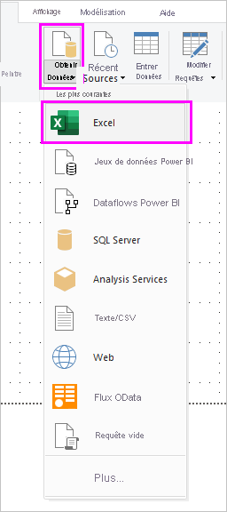
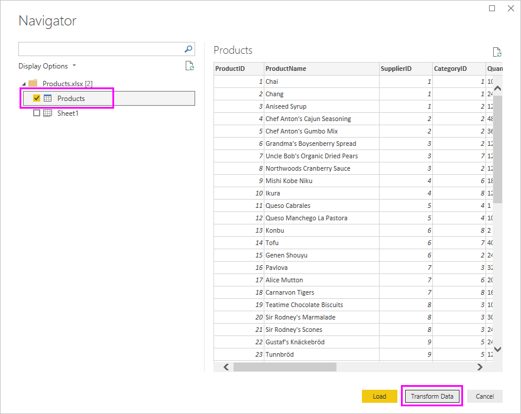
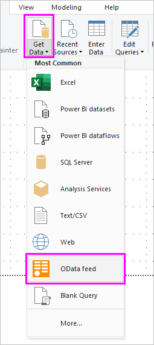
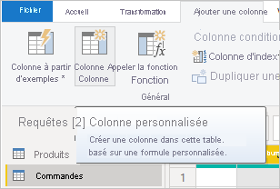
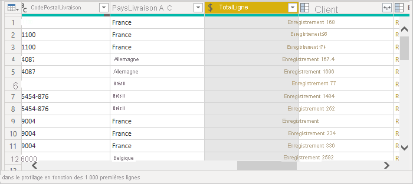
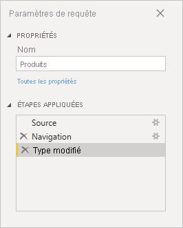
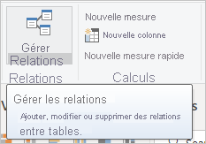
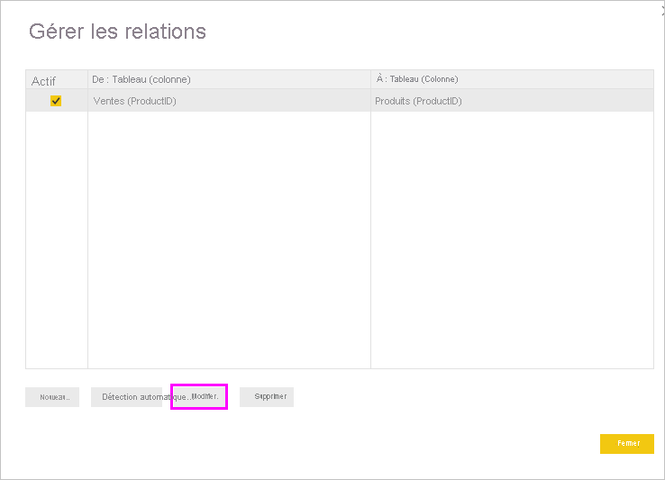
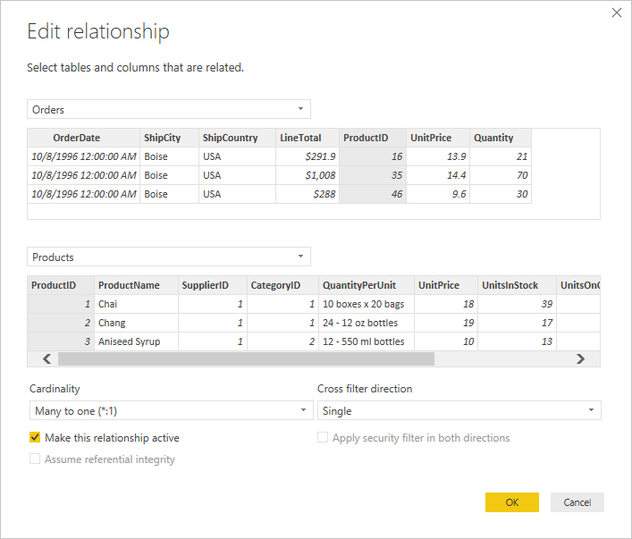
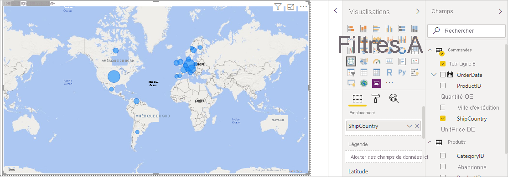

# Tutoriel : Analyser des données de vente à partir d’Excel et d’un flux OData

Il est courant d’avoir des données dans plusieurs sources de données. Par exemple, vous pouvez avoir deux bases de données : l’une pour les produits et l’autre pour les ventes. Avec *Power BI Desktop*, vous pouvez combiner des données à partir de sources différentes pour créer des visualisations et des analyses de données intéressantes.

Dans ce tutoriel, vous allez combiner les données provenant de deux sources de données :

* Un classeur Excel avec des informations sur les produits
* Un flux OData contenant des données relatives aux commandes

Vous allez importer chaque jeu de données et effectuer des opérations de transformation et d’agrégation. Ensuite, vous allez utiliser les données des deux sources afin de générer un rapport d’analyse des ventes comprenant des visualisations interactives. Plus tard, vous pourrez appliquer ces techniques aux requêtes SQL Server, aux fichiers CSV et à d’autres sources de données dans Power BI Desktop.

>[!NOTE]
>Dans Power BI Desktop, vous pouvez souvent accomplir une tâche de plusieurs façons. Par exemple, vous pouvez cliquer avec le bouton droit ou utiliser le menu **Plus d’options** d’une colonne ou d’une cellule pour afficher d’autres sélections de ruban. Plusieurs méthodes alternatives sont décrites dans les étapes ci-dessous.

## Importer des données de produit provenant d’Excel

Tout d’abord, importez des données de produit à partir du classeur Excel *Products.xlsx* dans Power BI Desktop.

1. [Téléchargez le classeur Excel Products.xlsx](https://download.microsoft.com/download/1/4/E/14EDED28-6C58-4055-A65C-23B4DA81C4DE/Products.xlsx) et enregistrez-le sous *Products.xlsx*.

1. Sélectionnez la flèche à côté de **Obtenir des données**, sous l’onglet **Accueil** du ruban Power BI Desktop, puis sélectionnez **Excel** dans le menu **Les plus courantes**.

   

   >[!NOTE]
   >Vous pouvez également sélectionner l’élément **Obtenir des données** lui-même, ou sélectionnez **Obtenir des données** dans la boîte de dialogue **Bien démarrer** de Power BI. Sélectionnez ensuite **Excel** ou **Fichier** > **Excel** dans la boîte de dialogue **Obtenir des données**, puis sélectionnez **Se connecter**.

1. Dans la boîte de dialogue **Ouvrir**, accédez au fichier **Products.xlsx**, ouvrez-le, puis sélectionnez **Ouvrir**.

1. Dans le **Navigateur**, sélectionnez la table **Products**, puis sélectionnez **Transformer les données**.

   

Un aperçu de la table s’ouvre dans l’éditeur Power Query, où vous pouvez appliquer des transformations pour nettoyer les données.

>[!NOTE]
>Vous pouvez également ouvrir l’éditeur Power Query en sélectionnant **Modifier les requêtes** > **Modifier les requêtes** à partir du ruban **Accueil** dans Power BI Desktop, ou en cliquant avec le bouton droit ou en choisissant **Plus d’options** à côté de n’importe quelle requête dans la vue **Rapport**, puis en sélectionnant **Modifier la requête**.

## Nettoyer les colonnes de produits

Votre rapport combiné utilisera uniquement les colonnes **ProductID**, **ProductName**, **QuantityPerUnit** et **UnitsInStock** du classeur Excel. Vous pouvez supprimer les autres colonnes.

1. Dans l’éditeur Power Query, sélectionnez les colonnes **ProductID**, **ProductName**, **QuantityPerUnit** et **UnitsInStock**. Vous pouvez utiliser la touche Ctrl pour sélectionner plusieurs colonnes ou la touche Maj pour sélectionner des colonnes qui se trouvent côte à côte.

1. Cliquez avec le bouton droit sur l’un des en-têtes sélectionnés. Dans le menu déroulant, sélectionnez **Supprimer d’autres colonnes**.
   Vous pouvez également sélectionner **Supprimer les colonnes** > **Supprimer d’autres colonnes** à partir du groupe **Gérer les colonnes** dans l’onglet du ruban **Accueil**.

   

## Importer les données relatives aux commandes à partir du flux OData

Ensuite, importez les données de commandes à partir du flux OData sur l’exemple du système de ventes Northwind.

1. Dans l’éditeur Power Query, sélectionnez **Nouvelle source**, puis, dans le menu **Les plus courantes**, sélectionnez **Flux OData**.

   

1. Dans la boîte de dialogue **Flux OData**, collez l’URL du flux OData de Northwind (`https://services.odata.org/V3/Northwind/Northwind.svc/`). Sélectionnez **OK**.

   

1. Dans le **Navigateur**, sélectionnez la table **Orders**, puis sélectionnez **Transformer les données** pour charger les données dans l’éditeur Power Query.

   

   >[!NOTE]
   >Dans le **Navigateur**, vous pouvez sélectionner n’importe nom de table, sans cocher la case, pour afficher un aperçu.

## Développer les données de commandes

Vous pouvez utiliser des références de table pour générer des requêtes lors de la connexion aux sources de données comprenant plusieurs tables, comme les bases de données relationnelles ou le flux OData Northwind. La table **Commandes** contient des références à plusieurs tables connexes. Vous pouvez utiliser l’opération de développement pour ajouter les colonnes **ProductID**, **UnitPrice** et **Quantity** de la table **Order_Details** associée dans la table de sujet (**Orders**).

1. Faites défiler vers la droite dans la table **Commandes** jusqu’à ce que la colonne **Order_Details** s’affiche. Elle contient des références à une autre table, et non des données.

   

1. Sélectionnez l’icône **Développer** () dans l’en-tête de colonne **Order_Details**.

1. Dans le menu déroulant :

   1. Sélectionnez **(Sélectionner toutes les colonnes)** pour effacer toutes les colonnes.

   1. Sélectionnez **ProductID**, **UnitPrice** et **Quantity**, puis sélectionnez **OK**.

      

Après le développement de la table **Order_Details**, trois nouvelles colonnes de table imbriquée remplacent la colonne **Order_Details**. La table contient de nouvelles lignes pour les données ajoutées de chaque commande.

## Créer une colonne calculée personnalisée

L’éditeur Power Query vous permet de créer des calculs et des champs personnalisés pour enrichir vos données. Vous allez créer une colonne personnalisée qui multiplie le prix unitaire par la quantité d’articles afin de calculer le prix total des articles de chaque commande.

1. Sous l’onglet du ruban **Ajouter une colonne** de l’éditeur Power Query, sélectionnez **Colonne personnalisée**.

   

1. Dans la boîte de dialogue **Colonne personnalisée**, tapez **LineTotal** dans le champ **nouveau nom de colonne**.

1. Dans le champ **Formule de colonne personnalisée**, après **=** , entrez **[Order_Details.UnitPrice]** \* **[Order_Details.Quantity]** . Vous pouvez également sélectionner les noms des champs à partir de la case de défilement **Colonnes disponibles** et sélectionner **<< Insérer** au lieu de les taper.

1. Sélectionnez **OK**.

   

   Le nouveau champ **LineTotal** s’affiche en tant que dernière colonne dans la table **Commandes**.

## Définir le type de données du nouveau champ

Lorsque l’éditeur Power Query se connecte aux données, il tente de deviner le type de données de chaque champ pour l’affichage. Une icône d’en-tête indique le type de données attribué à chaque champ. Vous pouvez également regarder sous **Type de données**, dans le groupe **Transformer** situé sous l’onglet du ruban **Accueil**.

Les données de la nouvelle colonne **LineTotal** sont de type **Tous**, mais la colonne contient des valeurs de devise. Pour affecter un type de données, cliquez avec le bouton droit sur l’en-tête de la colonne **LineTotal**, sélectionnez **Modifier le type** dans le menu déroulant, puis sélectionnez **Nombre décimal fixe**.

>[!NOTE]
>Vous pouvez également sélectionner la colonne **LineTotal**, puis sélectionner la flèche à côté de **Type de données** dans la zone **Transformer** de l’onglet du ruban **Accueil**, puis sélectionner **Nombre décimal fixe**.

## Nettoyer les colonnes de commandes

Pour simplifier l’utilisation de votre modèle dans les rapports, vous pouvez supprimer, renommer et réorganiser certaines colonnes.

Votre rapport va utiliser les colonnes suivantes :

* **OrderDate**
* **ShipCity**
* **ShipCountry**
* **Order_Details.ProductID**
* **Order_Details.UnitPrice**
* **Order_Details.Quantity**
* **LineTotal**

Sélectionnez ces colonnes et utilisez **Supprimer d’autres colonnes** comme vous l’avez fait avec les données Excel. Vous pouvez aussi sélectionner les colonnes non listées, cliquer avec le bouton droit sur l’une d’elles, puis sélectionner **Supprimer les colonnes**.

Vous pouvez renommer les colonnes portant le préfixe « **Order_Details** » pour les rendre plus faciles à lire :

1. Double-cliquez sur chaque en-tête de colonne, ou appuyez dessus en continu. Vous pouvez également cliquer avec le bouton droit sur l’en-tête de colonne et sélectionner **Renommer** dans le menu déroulant.

1. Supprimez les préfixes **Order_Details.** de chaque nom.

Enfin, pour rendre la colonne **LineTotal** plus accessible, faites-la glisser vers la gauche et déposez-la, à droite de la colonne **ShipCountry**.

## Passer en revue les étapes de la requête

Les actions que vous effectuez dans l’éditeur Power Query pour former et transformer les données sont enregistrées. Chaque action s’affiche sur la droite dans le volet **Paramètres d’une requête**, sous **Étapes appliquées**. Vous pouvez revenir aux **Étapes appliquées** afin de les passer en revue, et de les modifier, supprimer ou réorganiser si nécessaire. Toutefois, la modification d’étapes précédentes est risquée, car cela peut bloquer les étapes ultérieures.

Sélectionnez chacune de vos requêtes dans la liste **Requêtes** sur le côté gauche de l’éditeur Power Query et passez en revue les **Étapes appliquées** dans **Paramètres de requête**. Après avoir appliqué les transformations de données précédentes, les **Étapes appliquées** de vos deux requêtes doivent se présenter ainsi :

 &nbsp;&nbsp; 

>[!TIP]
>À la base des Étapes appliquées se trouvent des formules écrites à l’aide du *langage Power Query*, également appelé [langage M](https://docs.microsoft.com/powerquery-m/power-query-m-reference). Pour voir et modifier les formules, sélectionnez **Éditeur avancé** dans le groupe **Requête** de l’onglet **Accueil** du ruban.

## Importer les requêtes transformées

Quand vous êtes satisfait des données transformées et que vous êtes prêt à les importer dans la vue **Rapport** de Power BI Desktop, sélectionnez **Fermer et appliquer** > **Fermer et appliquer** dans le groupe **Fermer** de l’onglet du ruban **Accueil**.

Une fois les données chargées, les requêtes s’affichent dans la liste **Champs** de la vue **Rapport** de Power BI Desktop.

## Gérer la relation entre les jeux de données

Power BI Desktop ne vous demande pas de combiner des requêtes pour créer des rapports les concernant. Toutefois, vous pouvez utiliser les relations entre les jeux de données, en fonction des champs qu’ils ont en commun, afin d’étendre et d’enrichir vos rapports. Power BI Desktop peut détecter automatiquement les relations. Vous pouvez aussi les créer dans la boîte de dialogue **Gérer les relations** de Power BI Desktop. Pour plus d’informations, consultez [Créer et gérer les relations dans Power BI Desktop](../transform-model/desktop-create-and-manage-relationships.md).

Le champ `ProductID` partagé crée une relation entre les jeux de données `Orders` et `Products` de ce tutoriel.

1. Dans la vue **Rapport** de Power BI Desktop, sélectionnez **Gérer les relations** dans la zone **Relations** de l’onglet du ruban **Accueil**.

   

1. Dans la boîte de dialogue **Gérer les relations**, vous pouvez voir que Power BI Desktop a déjà détecté et listé une relation active entre les tables **Products** et **Orders**. Pour afficher la relation, sélectionnez **Modifier**.

   

   **Modifier la relation** s’ouvre et affiche des détails sur la relation.  

   

1. Power BI Desktop a détecté automatiquement la relation, donc vous pouvez sélectionner **Annuler**, puis **Fermer**.

Dans Power BI Desktop, sur le côté gauche, sélectionnez **Modèle** pour voir et gérer les relations des requêtes. Double-cliquez sur la flèche de la ligne reliant les deux requêtes pour ouvrir la boîte de dialogue **Modifier la relation** et afficher ou modifier la relation.

Pour revenir à la vue **Rapport** à partir de la vue de **Modèle**, sélectionnez l’icône **Rapport**.

## Créer des visualisations à l’aide de vos données

Vous pouvez créer différentes visualisations dans la vue Révision de Power BI Desktop afin d’avoir un aperçu des données. Les rapports peuvent comprendre plusieurs pages, et chaque page peut contenir plusieurs visuels. Les utilisateurs et vous-même pouvez interagir avec vos visualisations pour analyser et comprendre vos données. Pour plus d’informations, consultez [Interagir avec un rapport en mode Édition dans le service Power BI](../create-reports/service-interact-with-a-report-in-editing-view.md).

Vous pouvez utiliser vos deux jeux de données, et la relation entre eux, pour visualiser et analyser vos données de ventes.

Commencez par créer un histogramme empilé qui utilise des champs des deux requêtes afin d’afficher la quantité de chaque produit commandé.

1. Sélectionnez le champ **Quantité** sous **Commandes** dans le volet **Champs** à droite, ou faites-le glisser vers un espace vide du canevas. Cette opération crée un histogramme empilé affichant la quantité totale de tous les produits commandés.

1. Pour afficher la quantité de chaque produit commandé, sélectionnez **ProductName** sous **Produits** dans le volet **Champs**, ou faites-le glisser sur l’histogramme.

1. Pour trier les produits du plus commandé au moins commandé, sélectionnez les points de suspension **Plus d’options** ( **...** ) en haut à droite de la visualisation, puis sélectionnez **Trier par quantité**.

1. Utilisez les poignées dans les angles de l’histogramme empilé pour l’agrandir afin d’afficher davantage de noms de produits.

   

Ensuite, créez un graphique indiquant les montants en dollars des commandes (**LineTotal**) au fil du temps (**OrderDate**).

1. Sans que rien ne soit sélectionné sur le canevas, sélectionnez **LineTotal** sous **Commandes** dans le volet **Champs**, ou faites-le glisser vers un espace vide sur le canevas. L’histogramme empilé affiche la somme totale en dollars de toutes les commandes.

1. Sélectionnez l’histogramme empilé, puis sélectionnez **OrderDate** sous **Commandes**, ou faites-le glisser sur l’histogramme. Le graphique affiche maintenant les totaux par ligne pour chaque date de commande.

1. Faites glisser les angles pour redimensionner la visualisation et afficher davantage de données.

   

   >[!TIP]
   >Si seul l’élément **Years** est affiché sur le graphique avec seulement trois points de données, sélectionnez la flèche à côté de **OrderDate** dans le champ **Axe** du volet **Visualisations**, puis sélectionnez **OrderDate** au lieu de **Date Hierarchy**.

Enfin, créez une visualisation Carte affichant les quantités de commande de chaque pays.

1. Sans que rien ne soit sélectionné sur le canevas, sélectionnez **ShipCountry** sous **Commandes** dans le volet **Champs**, ou faites-le glisser vers un espace vide sur le canevas. Power BI Desktop détecte que les données correspondent à des noms de pays. Ensuite, il crée automatiquement une visualisation de type Carte, avec un point de données pour chaque pays ayant commandé des produits.

1. Pour que la taille des points de données reflète la quantité de produits commandée par chaque pays, faites glisser le champ **LineTotal** sur la carte. Vous pouvez également le faire glisser dans **Faites glisser ici les champs de données** sous **Taille**, dans le volet **Visualisations**. Les tailles des cercles sur la carte reflètent désormais les montants en dollars des commandes de chaque pays.

   

## Interagir avec vos éléments visuels de rapports pour approfondir l’analyse

Dans Power BI Desktop, vous pouvez interagir avec les visuels de manière à les comparer et à les filtrer pour dévoiler d’autres tendances. Pour plus d’informations, consultez [Filtres et sélections dans les rapports Power BI](../create-reports/power-bi-reports-filters-and-highlighting.md).

En raison de la relation entre vos requêtes, les interactions avec une visualisation affectent toutes les autres visualisations de la page.

Sur la visualisation Carte, sélectionnez le cercle centré sur le **Canada**. Les deux autres visualisations appliquent un filtre pour mettre en évidence les totaux de ligne et les quantités commandées pour le Canada.

Sélectionnez un produit dans le graphique **Quantity by ProductName** (Quantité par Nom de produit) pour afficher la carte, ainsi que le filtre de date pour afficher les données relatives au produit. Sélectionnez une date dans le graphique **LineTotal by OrderDate** (Total des lignes par Date de commande) pour afficher la carte, ainsi que le filtre de produit pour afficher les données relatives à cette date.

>[!TIP]
>Pour désélectionner une sélection, sélectionnez-la à nouveau, ou sélectionnez l’une des autres visualisations.

## Terminer le rapport d’analyse des ventes

Votre rapport terminé combine les données du fichier Excel *Products.xlsx* et du flux OData Northwind dans des visuels qui vous permettent d’analyser les informations sur les commandes, délais et produits de différents pays. Lorsque votre rapport est prêt, vous pouvez [le charger dans le service Power BI](../create-reports/desktop-upload-desktop-files.md) afin de le partager avec d’autres utilisateurs de Power BI.

## Étapes suivantes

* [Autres didacticiels Power BI Desktop](/power-bi/guided-learning/)
* [Vidéos relatives à Power BI Desktop](/power-bi/desktop-videos)
* [Forum Power BI](https://go.microsoft.com/fwlink/?LinkID=519326)
* [Blog Power BI](https://go.microsoft.com/fwlink/?LinkID=519327)
