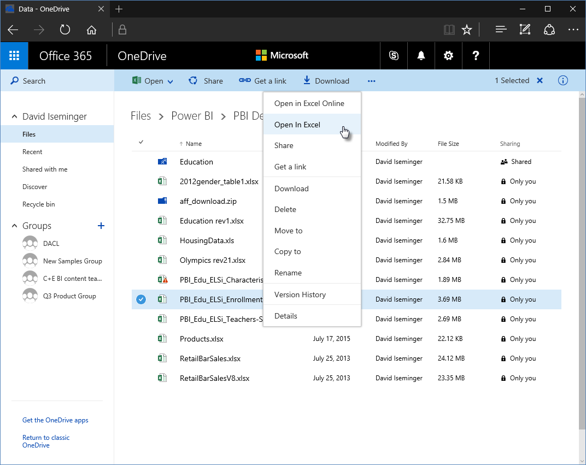
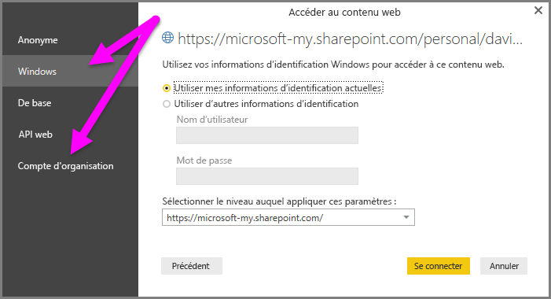

# Utilisation des liens OneDrive Entreprise dans Power BI Desktop
De nombreux utilisateurs ont des classeurs Excel stockés dans OneDrive Entreprise qui pourraient parfaitement être utilisés avec Power BI Desktop. Avec Power BI Desktop, vous pouvez utiliser les liens en ligne pour les fichiers Excel stockés dans OneDrive Entreprise pour créer des rapports et des visuels. Vous pouvez utiliser un compte de groupe OneDrive Entreprise ou votre compte OneDrive Entreprise individuel.

L’obtention d’un lien en ligne de OneDrive Entreprise nécessite d’effectuer quelques étapes spécifiques. Les sections suivantes détaillent ces étapes, ce qui vous permet de partager le lien de fichier au sein des groupes, sur différentes machines, et avec vos collègues.

## Obtenir un lien d’Excel
1. Accédez à votre emplacement OneDrive Entreprise avec un navigateur. Faites un clic droit sur le fichier que vous souhaitez utiliser, puis sélectionnez **Ouvrir dans Excel**
   
   > [!NOTE]
   > L’interface de votre navigateur peut différer de celle de l’image. Il existe de nombreuses façons de sélectionner **Ouvrir dans Excel** pour les fichiers de l’interface de votre navigateur OneDrive Entreprise. Vous pouvez utiliser n’importe quelle option qui vous permet d’ouvrir le fichier dans Excel.
   > 
   > 
   
   
2. Dans Excel, sélectionnez **Fichiers** > **Informations**, puis sélectionnez **Copier le chemin** au-dessus de **Protéger le classeur**.
   
   

## Utiliser le lien dans Power BI Desktop
Dans Power BI Desktop, vous pouvez utiliser le lien que vous venez de copier dans le presse-papiers. Procédez comme suit :

1. Dans Power BI Desktop, sélectionnez **Obtenir des données** > **Web**.
   
   
2. L’option **De base** étant sélectionnée, collez le lien dans la boîte de dialogue **À partir du web**.
3. Supprimez la chaîne *?web=1* à la fin du lien afin que Power BI Desktop puisse accéder correctement à votre fichier, puis sélectionnez **OK**.
   
     
4. Si Power BI Desktop vous demande des informations d’identification, choisissez **Windows** (pour les sites SharePoint locaux) ou **Compte professionnel** (pour les sites Microsoft 365 ou OneDrive Entreprise).
   
   

   Une boîte de dialogue **Navigateur** s’affiche et vous permet d’effectuer une sélection dans la liste de tableaux, de feuilles et de plages du classeur Excel. Ensuite, vous pouvez utiliser le fichier OneDrive Entreprise comme n’importe quel autre fichier Excel. Vous pouvez créer des rapports et les utiliser dans des jeux de données comme vous le feriez avec n’importe quelle autre source de données.

> [!NOTE]
> Pour utiliser un fichier OneDrive Entreprise en tant que source de données dans le service Power BI, avec l’option d’**actualisation du service** activée pour ce fichier, veillez à sélectionner **OAuth2** comme **Méthode d’authentification** lors de la configuration de vos paramètres d’actualisation. Sinon, vous pouvez rencontrer une erreur (comme *Échec de la mise à jour des informations d’identification de la source de données*) quand vous tentez de vous connecter ou d’effectuer une actualisation. Si vous sélectionnez **OAuth2** comme méthode d’authentification, vous résolvez cette erreur d’informations d’identification.
> 
> 

