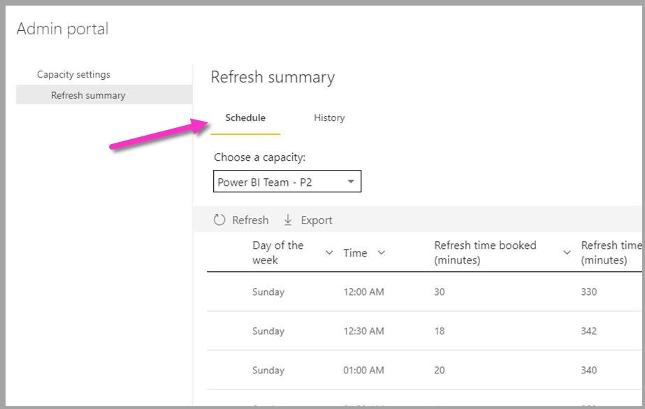
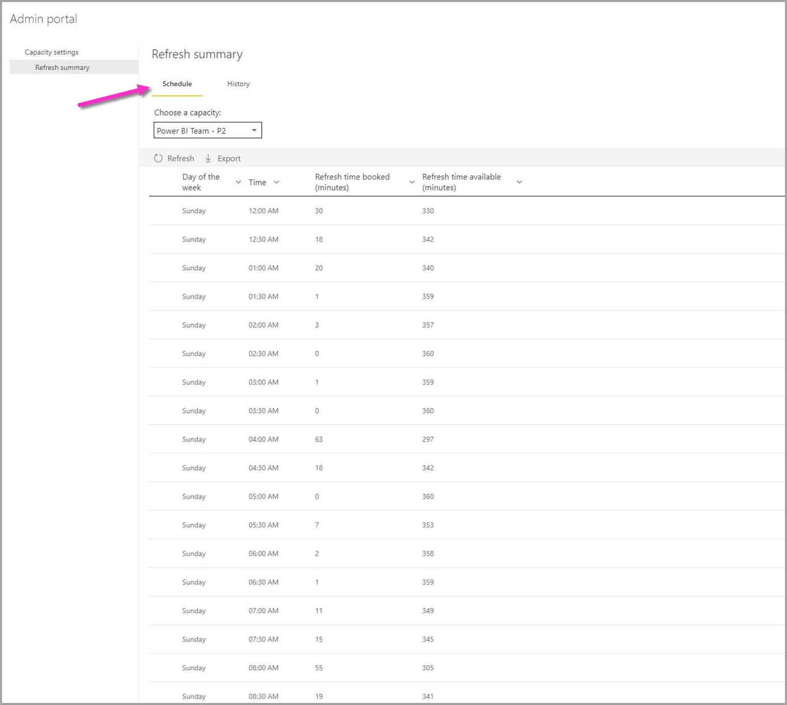

# Récapitulatifs des actualisations pour Power BI

La page **Récapitulatifs des actualisations** de Power BI, qui se trouve dans le portail d’administration de Power BI, fournit un contrôle et des insights sur vos planifications d’actualisation, les capacités et les chevauchements potentiels des planifications des actualisations. Vous pouvez utiliser la page Récapitulatifs des actualisations pour déterminer si vous devez ajuster les planifications des actualisations, découvrir les codes d’erreur associés aux problèmes d’actualisation et gérer correctement la planification des actualisations de vos données. 

La page Récapitulatifs des actualisations a deux vues :

* **Historique** : affiche l’historique des récapitulatifs des actualisations pour les capacités Power BI Premium dont vous êtes administrateur.

* **Planification** : affiche la vue de planification pour les actualisations planifiées, qui peut également montrer les problèmes liés aux créneaux horaires qui sont suralloués.

Vous pouvez également exporter les informations relatives à un événement d’actualisation vers un fichier .CSV, qui peut fournir des informations et des insights importants sur les événements ou les erreurs d’actualisation qui peuvent avoir un impact sur les performances ou la réalisation des événements d’actualisation planifiés.

Les sections suivantes examinent chacune de ces vues. 

## Historique des actualisations

Vous pouvez sélectionner la vue **Historique** en cliquant sur **Historique** dans la page Récapitulatifs des actualisations.

L’historique fournit une vue d’ensemble des résultats des actualisations planifiées récemment sur les capacités pour lesquelles vous disposez d’un privilège d’administrateur. Vous pouvez trier la vue selon n’importe quelle colonne en cliquant sur la colonne. Vous pouvez choisir de trier la vue selon la colonne sélectionnée par ordre croissant, par ordre décroissant ou en utilisant des filtres de texte.

Dans la vue Historique, les données associées à une actualisation particulière sont basées sur les 60 enregistrements les plus récents pour chaque actualisation planifiée.

Vous pouvez également exporter des informations pour n’importe quelle actualisation planifiée vers un fichier .CSV, qui inclut des informations détaillées, notamment les messages d’erreur pour chaque événement d’actualisation. L’exportation vers un fichier .CSV vous permet de trier le fichier sur n’importe quelle colonne, de rechercher des mots, de trier en fonction des codes d’erreur ou des propriétaires, etc. L’image suivante montre un exemple de fichier .CSV exporté. 

Avec les informations contenues dans le fichier exporté, vous pouvez passer en revue la capacité, la durée et les messages d’erreur enregistrés pour l’instance d’actualisation. 

## Planification de l’actualisation

Vous pouvez sélectionner la vue **Planification** en cliquant sur **Planification** dans Récapitulatifs des actualisations. La vue Planification affiche les informations de planification pour la semaine, décomposées en intervalles de 30 minutes. 

La vue Planification est très pratique pour déterminer si les événements d’actualisation planifiés sont correctement espacés, ce qui permet à toutes les actualisations de se terminer sans chevauchement, ou pour voir si vous avez planifié des événements d’actualisation qui prennent trop de temps et créent des conflits de ressources. Si vous trouvez un conflit de ressources, vous devez ajuster vos planifications d’actualisation afin d’éviter les conflits ou un chevauchement, afin que vos actualisations planifiées puissent se terminer correctement. 

La colonne *Durée d’actualisation réservée (minutes)* est un calcul de la moyenne de 60 enregistrements maximum pour chaque jeu de données associé. La valeur numérique pour chaque plage horaire de 30 minutes est la somme des minutes calculées pour toutes les actualisations planifiées pour démarrer sur la plage horaire **et** les actualisations planifiées définies pour démarrer sur la plage horaire *précédente*, mais dont la durée moyenne déborde sur la plage horaire sélectionnée.

Vous pouvez sélectionner une plage horaire, puis sélectionner le bouton **Détails** associé pour voir quels événements d’actualisation planifiés contribuent à la durée d’actualisation réservée, ses propriétaires et à la durée nécessaire à leur exécution.

Prenons un exemple pour voir comment cela fonctionne. La boîte de dialogue suivante s’affiche quand nous sélectionnons la plage horaire 20:30 pour dimanche, puis que nous cliquons sur **Détails**.

Trois événements d’actualisation planifiée se produisent dans cette plage horaire. 

Les actualisations planifiées #1 et #3 sont planifiées pour ce créneau horaire de 20:30, ce que nous pouvons déterminer en examinant la valeur dans la colonne **Plage horaire planifiée**. Leurs durées moyennes sont respectivement de 4:39 et de 6 secondes (0:06). Tout est parfait ici.

Cependant, l’actualisation planifiée #2 est planifiée pour la plage horaire de 20:00, mais comme sa durée d’exécution moyenne est de plus de 48 minutes (ce qui se voit dans la colonne **Durée moyenne**), cet événement d’actualisation déborde sur la plage horaire de 30 minutes suivante. 

Ce n’est pas bon. Dans ce cas, l’administrateur doit contacter les propriétaires de cette instance d’actualisation planifiée et suggérer qu’ils trouvent une plage horaire différente pour cette actualisation planifiée, replanifier les autres actualisations afin qu’il n’y ait pas de chevauchement ou rechercher une autre solution pour éviter ce chevauchement. 

## Étapes suivantes

- [Actualisation des données dans Power BI](refresh-data.md)  
- [Power BI Gateway - Personal](service-gateway-personal-mode.md)  
- [Passerelle de données locale (mode personnel)](service-gateway-onprem.md)  
- [Résolution des problèmes de passerelle de données locale](service-gateway-onprem-tshoot.md)  
- [Résolution des problèmes liés à Power BI Gateway - Personal](service-admin-troubleshooting-power-bi-personal-gateway.md)  

D’autres questions ? [Essayez d’interroger la communauté Power BI](https://community.powerbi.com/)