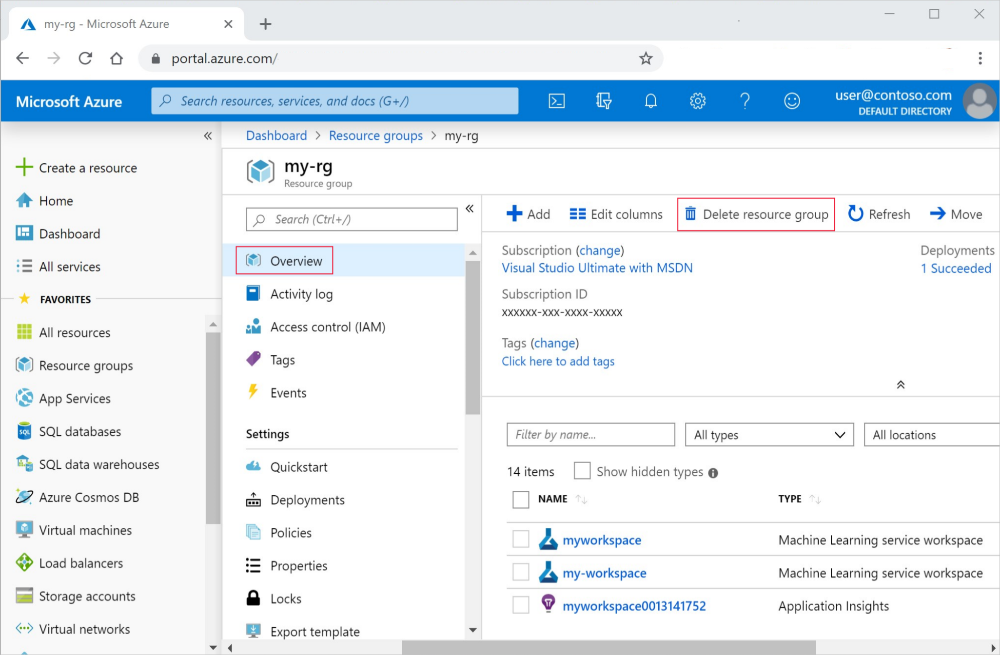

# <a name="tutorial-consume-azure-machine-learning-models-in-power-bi"></a>Tutoriel : Consommation de modèles Azure Machine Learning dans Power BI

Ce tutoriel présente pas à pas la création d’un rapport Power BI basé sur un modèle Machine Learning. À la fin de ce tutoriel, vous serez en mesure d’effectuer les opérations suivantes :

> [!div class="checklist"]
> * Scorer des modèles Machine Learning (déployés avec Azure Machine Learning) dans Power BI
> * Se connecter à un modèle Azure Machine Learning dans l’Éditeur Power Query
> * Créer un rapport contenant une visualisation basée sur ce modèle
> * Publier ce rapport dans le service Power BI
> * Configurer l’actualisation planifiée du rapport

## <a name="prerequisites"></a>Prérequis

Avant de commencer ce tutoriel, vous devez effectuer les opérations suivantes :

- Entraînez et déployez un modèle Machine Learning dans Azure Machine Learning, avec l’un des trois tutoriels Azure Machine Learning suivants : 

    - [Option A : Code](/azure/machine-learning/tutorial-power-bi-custom-model)
    - [Option B : Concepteur](/azure/machine-learning/tutorial-power-bi-designer-model)
    - [Option C : ML automatisé](/azure/machine-learning/tutorial-power-bi-automated-model)

- Inscrivez-vous à un [essai gratuit de Power BI](https://app.powerbi.com/signupredirect?pbi_source=web).
- [Installez Power BI Desktop](https://powerbi.microsoft.com/desktop/) sur un ordinateur local.

## <a name="create-the-data-model"></a>Créer le modèle de données

Ouvrez Power BI Desktop et sélectionnez **obtenir les données**. Dans la boîte de dialogue **Obtenir des données**, recherchez **Web**. Sélectionnez la source **Web** > **Se connecter**.

:::image type="content" source="media/service-aml-integrate/pbi-get-data.png" alt-text="Capture d’écran des données web":::

Dans la boîte de dialogue **À partir du Web**, copiez et collez l’URL suivante dans la zone :

```txt 
https://www4.stat.ncsu.edu/~boos/var.select/diabetes.tab.txt
```

:::image type="content" source="media/service-aml-integrate/pbi-data.png" alt-text="Capture d’écran de l’URL web":::

Sélectionnez **OK**.

Sélectionnez **Transformer les données** pour ouvrir la fenêtre **Éditeur Power Query**.

Dans le ruban Accueil de l’Éditeur Power Query, sélectionnez le bouton **Azure Machine Learning**.

:::image type="content" source="media/service-aml-integrate/aml-button.png" alt-text="Capture d’écran de l’Éditeur Power Query":::

Connectez-vous à votre compte Azure avec l’authentification unique. La liste des services disponibles apparaît. Sélectionnez le service **my-sklearn-service** que vous avez créé dans le tutoriel Entraîner et déployer un modèle Machine Learning. 

Power Query remplit automatiquement les colonnes. Pour rappel, dans le schéma du service, un élément décoratif Python spécifiait les entrées. Sélectionnez **OK**.

:::image type="content" source="media/service-aml-integrate/aml-pbi-run.png" alt-text="Capture d’écran des modèles Azure Machine Learning":::

Azure Machine Learning service est appelé. Il déclenche un avertissement de confidentialité pour les données et le point de terminaison.

:::image type="content" source="media/service-aml-integrate/data_privacy_warning.png" alt-text="Capture d’écran de l’avertissement de confidentialité":::

Sélectionnez **Continuer**. Dans l’écran suivant, sélectionnez **Ignorer les contrôles des niveaux de confidentialité pour ce fichier** > **Enregistrer**.

Une fois les données scorées, Power Query crée une colonne supplémentaire nommée **AzureML.my-diabetes-model**.

:::image type="content" source="media/service-aml-integrate/scored-data.png" alt-text="Capture d’écran de la colonne scorée ajoutée":::

Le service retourne une **liste**. 

> [!NOTE]
> Si vous avez déployé un modèle de concepteur, vous voyez apparaître un **enregistrement**.

Pour récupérer les prédictions, sélectionnez le bouton **Développer la colonne** > **Développer sur de nouvelles lignes** dans le ruban **Transformer**.

Après l’expansion, les prédictions apparaissent dans la colonne AzureML.my-diabetes-model.

:::image type="content" source="media/service-aml-integrate/after-expand.png" alt-text="Capture d’écran de l’expansion":::

Suivez les étapes ci-dessous pour terminer le nettoyage de votre modèle de données.

1. Renommez la colonne **AzureML.my-diabetes-model** **predicted**.
1. Renommez la colonne **Y** **actual**.
1. Modifiez le type de la colonne **actual** : Sélectionnez la colonne, puis **Type de données** > **Nombre décimal** dans le ruban **Transformer**.
1. Modifiez le type de la colonne **predicted** : Sélectionnez cette colonne, puis **Type de données** > **Nombre décimal** dans le ruban **Transformer**.
1. Dans le ruban **Accueil**, sélectionnez **Fermer et appliquer**.

## <a name="create-a-report-with-visualizations"></a>Création d’un rapport contenant des visualisations

Vous pouvez maintenant créer des visualisations pour afficher vos données.

1. Dans le volet **Visualisations**, sélectionnez **Graphique en courbes**. 
1. Après avoir sélectionné le visuel de type graphique en courbes :
1. Faites glisser le champ **AGE** dans **Axe**.
1. Faites glisser le champ **actual** dans **Valeurs**.
1. Faites glisser le champ **predicted** dans **Valeurs**.

Redimensionnez le graphique en courbes de sorte qu’il remplisse la page. Votre rapport contient maintenant un seul graphique en courbes avec deux lignes, l’une pour les valeurs prédites et l’autre pour les valeurs réelles, distribuées par âge.

:::image type="content" source="media/service-aml-integrate/report-viz.png" alt-text="Capture d’écran de la visualisation du rapport":::

## <a name="publish-the-report"></a>Publier le rapport

Vous pouvez ajouter d’autres visualisations si vous le souhaitez. Dans un souci de concision, nous allons dans ce tutoriel publier le rapport.

1. Enregistrez le rapport.
1. Sélectionnez **Fichier** > **Publier** > **Publier sur Power BI**.
1. Connectez-vous au service Power BI.
1. Sélectionnez **Mon espace de travail**.
1. Une fois le rapport publié, sélectionnez le lien **Ouvrir <MON_FICHIER_PBIX.pbix> dans Power BI**. Le rapport s’ouvre le rapport dans Power BI avec votre navigateur.

     :::image type="content" source="media/service-aml-integrate/publish-success.png" alt-text="Capture d’écran de la publication réussie":::

## <a name="enable-datasets-to-refresh"></a>Actualisation des jeux de données

Dans un scénario où la source de données est actualisée avec de nouvelles données à scorer, vous devez mettre à jour vos informations d’identification afin que les données puissent être scorées. 

Dans Mon espace de travail dans le service Power BI, sélectionnez **Plus d’options (…)**  > **Paramètres** > **Paramètres** dans la barre d’en-tête noire.

:::image type="content" source="media/service-aml-integrate/settings-pbi.png" alt-text="Capture d’écran des paramètres":::

Sélectionnez **Jeux de données**, développez **Informations d’identification de la source de données**, puis sélectionnez **Modifier les informations d’identification**.

:::image type="content" source="media/service-aml-integrate/data-refresh.png" alt-text="Capture d’écran de l’actualisation des informations d’identification":::

Suivez les instructions pour **azureMLFunctions** et **Web**. Veillez à sélectionner un niveau de confidentialité. Vous pouvez maintenant définir une **Actualisation planifiée** des données. Sélectionnez une **Fréquence d’actualisation** et un **Fuseau horaire**. Vous pouvez également sélectionner une adresse e-mail. Power BI enverra les notifications d’échec d’actualisation à cette adresse.

:::image type="content" source="media/service-aml-integrate/schedule-refresh.png" alt-text="Capture d’écran de l’actualisation des jeux de données et des scores":::

Sélectionnez **Appliquer**.

>[!NOTE]
> Une fois les données actualisées, il les envoie également à votre point de terminaison Azure Machine Learning pour le scoring.

## <a name="clean-up-resources"></a>Nettoyer les ressources

>[!IMPORTANT]
>Vous pouvez utiliser les ressources que vous avez créées comme prérequis pour d’autres didacticiels et articles de guides pratiques Azure Machine Learning.

Si vous ne prévoyez pas d’utiliser les ressources que vous avez créées, supprimez-les afin de ne pas occasionner de frais.

1. Dans le portail Azure, sélectionnez **Groupes de ressources** tout à gauche.
 
1. Dans la liste, sélectionnez le groupe de ressources créé.

1. Sélectionnez **Supprimer le groupe de ressources**.

   

1. Entrez le nom du groupe de ressources. Puis sélectionnez **Supprimer**.
1. Dans Mon espace de travail dans le service Power BI, supprimez le rapport et le jeu de données associé. Vous n’avez pas besoin de supprimer Power BI Desktop ni le rapport sur votre ordinateur. Power BI Desktop est gratuit.

## <a name="next-steps"></a>Étapes suivantes

Dans cette série de tutoriels, vous avez appris à configurer une planification dans Power BI afin que les nouvelles données puissent être scorées par votre point de terminaison de scoring dans Azure Machine Learning.
