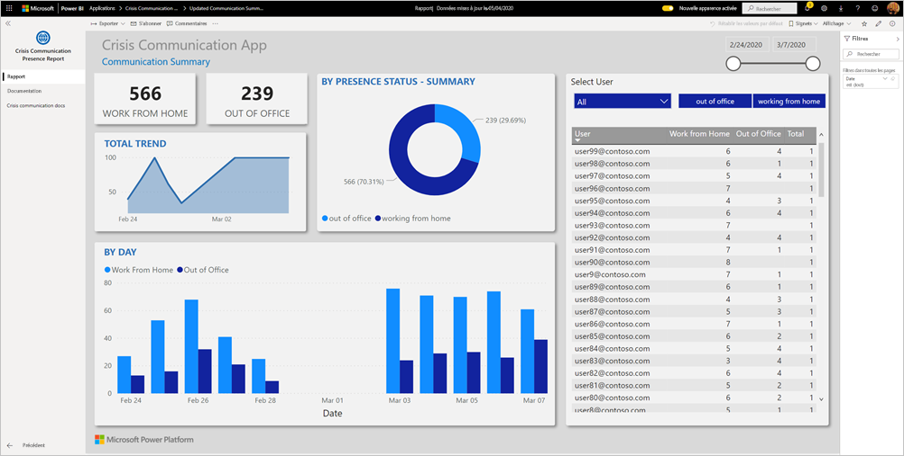
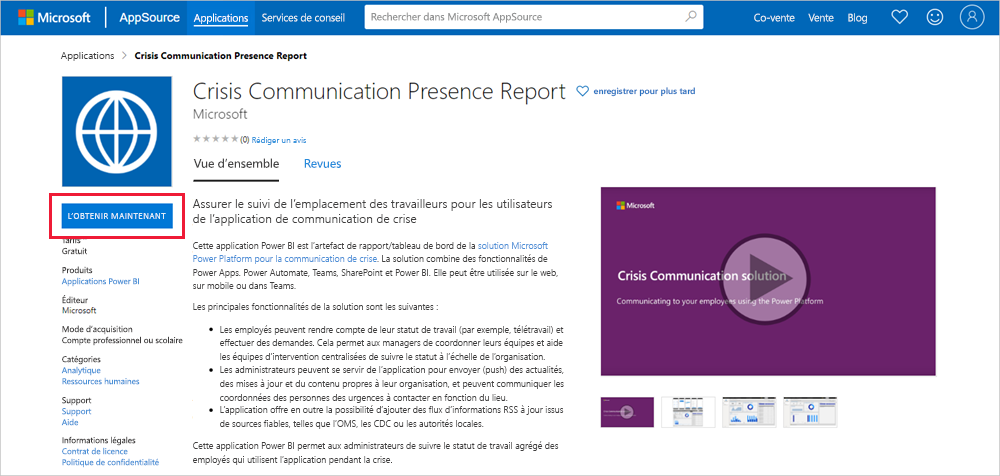
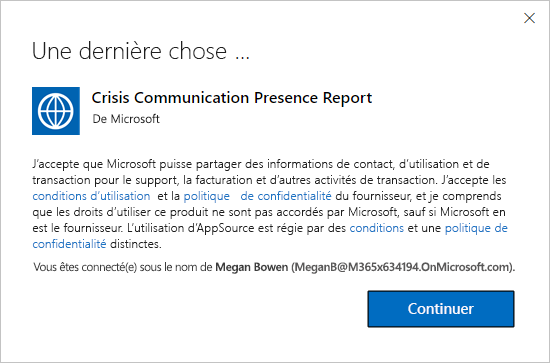
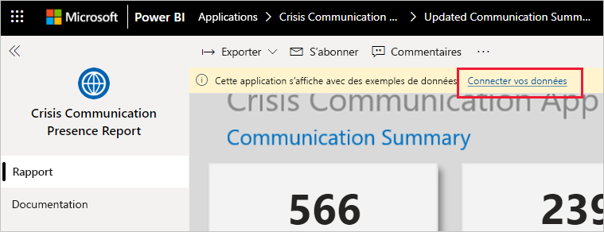
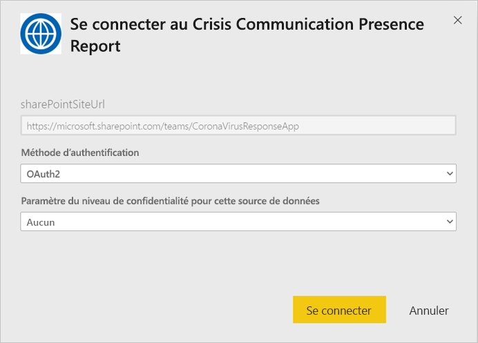
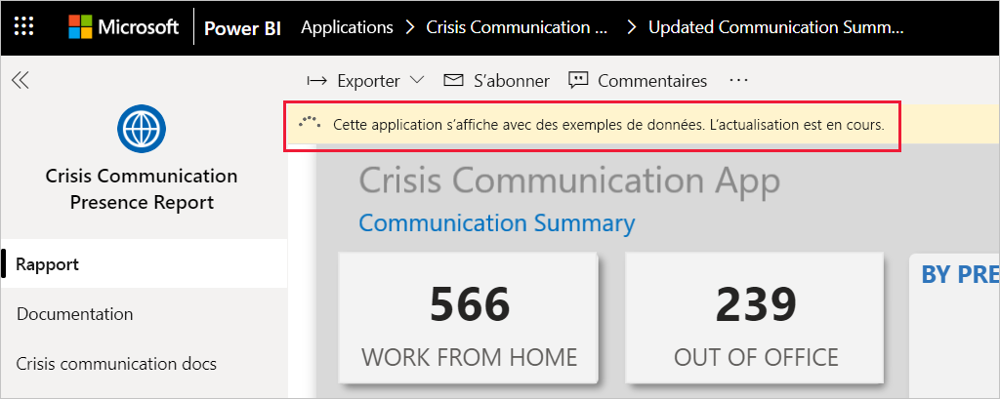
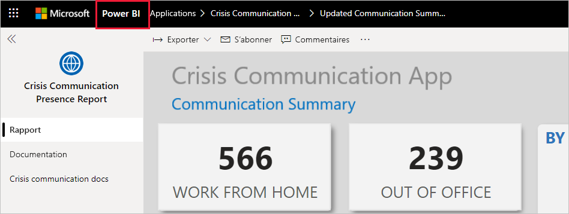

# Se connecter au Rapport de présence dans les communications de crise

Cette application Power BI est l’artefact de rapport/tableau de bord dans la solution Microsoft Power Platform pour la communication de crise. Elle fait le suivi de l’emplacement des travailleurs à l’attention des utilisateurs de l’application de communication de crise. La solution combine les fonctionnalités de Power Apps, Power Automate, Teams, SharePoint et Power BI. Elle peut être utilisée sur le web, en version mobile ou dans Teams.

Le tableau de bord montre aux responsables des services d’urgence des données agrégées à l’échelle de leur système de santé pour les aider à prendre des décisions opportunes et éclairées.

Cet article vous explique comment installer l’application et comment se connecter aux sources de données. Pour plus d’informations sur l’application de communication de crise, consultez [Configurer et découvrir l’exemple de modèle de communication de crise dans Power Apps](https://docs.microsoft.com/powerapps/maker/canvas-apps/sample-crisis-communication-app)

Après avoir installé l’application modèle et établi la connexion aux sources de données, vous pouvez personnaliser le rapport selon vos besoins. Vous pouvez ensuite le distribuer en tant qu’application aux collègues de votre organisation.

## Prérequis

Avant d’installer cette application modèle, vous devez installer et configurer l’[exemple de communication de crise](https://docs.microsoft.com/powerapps/maker/canvas-apps/sample-crisis-communication-app). L’installation de cette solution crée les références nécessaires aux sources de données pour renseigner l’application avec des données.

Quand vous installez l’exemple de communication de crise, prenez note [du chemin au dossier de liste SharePoint « CI_Employee Status » et de l’ID de liste](https://docs.microsoft.com/powerapps/maker/canvas-apps/sample-crisis-communication-app#monitor-office-absences-with-power-bi).

## Installer l’application

1. Cliquez sur le lien suivant pour accéder à l’application : [Application modèle Rapport de présence dans les communications de crise](https://appsource.microsoft.com/en-us/product/power-bi/pbi-contentpacks.crisiscomms)

1. Dans la page AppSource de l’application, sélectionnez [**OBTENIR MAINTENANT**](https://appsource.microsoft.com/en-us/product/power-bi/pbi-contentpacks.crisiscomms).

    

1. Lisez les informations contenues dans **Encore une chose**, puis sélectionnez **Continuer**.

    

1. Sélectionnez **Installer**. 

    

    Une fois l’application installée, elle apparaît dans votre page Applications.

   

## Se connecter à la source de données

1. Sélectionnez l’icône dans votre page Applications pour ouvrir l’application.

1. Dans l’écran de démarrage, sélectionnez **Explorer**.

   

   L’application s’ouvre et présente des exemples de données.

1. Sélectionnez le lien **Connecter vos données** dans la bannière en haut de la page.

   

1. Dans la boîte de dialogue :
   1. Dans le champ SharePoint_Folder, entrez votre [chemin de liste SharePoint « CI_Employee Status »](https://docs.microsoft.com/powerapps/maker/canvas-apps/sample-crisis-communication-app#monitor-office-absences-with-power-bi).
   1. Dans le champ List_ID, entrez l’ID de liste provenant des paramètres de la liste. Quand vous avez terminé, cliquez sur **Suivant**.

   

1. Dans la boîte de dialogue suivante qui s’ouvre, choisissez **OAuth2** comme méthode d’authentification. Ne changez pas le paramètre de niveau de confidentialité.

   Sélectionnez **Connexion**.

   

1. Dans l’écran de connexion Microsoft, connectez-vous à Power BI.

   

   Une fois que vous êtes connecté, le rapport se connecte aux sources de données et est renseigné avec les dernières données disponibles. Pendant ce temps, le moniteur d’activité tourne.

   

## Planifier l’actualisation du rapport

Une fois l’actualisation des données terminée, [configurez une planification de l’actualisation](../connect-data/refresh-scheduled-refresh.md) pour tenir les données du rapport à jour.

1. Dans la barre d’en-tête supérieure, sélectionnez **Power BI**.

   

1. Dans le volet de navigation de gauche, recherchez l’espace de travail Tableau de bord d’aide à la prise de décision en réponse aux urgences des hôpitaux sous **Espaces de travail**, puis suivez les instructions décrites dans l’article [Configurer l’actualisation planifiée](../connect-data/refresh-scheduled-refresh.md).

## Personnaliser et partager

Pour plus d’informations, consultez [Personnaliser et partager l’application](../connect-data/service-template-apps-install-distribute.md#customize-and-share-the-app). Veillez à passer en revue les [exclusions de responsabilité du rapport](../create-reports/sample-covid-19-us.md#disclaimers) avant de publier ou de distribuer l’application.

## Étapes suivantes
* [Configurer et découvrir l’exemple de modèle de communication de crise dans Power Apps](https://docs.microsoft.com/powerapps/maker/canvas-apps/sample-crisis-communication-app)
* Vous avez des questions ? [Essayez d’interroger la communauté Power BI](https://community.powerbi.com/)
* [Que sont les applications modèles Power BI ?](../connect-data/service-template-apps-overview.md)
* [Installer et distribuer des applications modèles dans votre organisation](../connect-data/service-template-apps-install-distribute.md)
