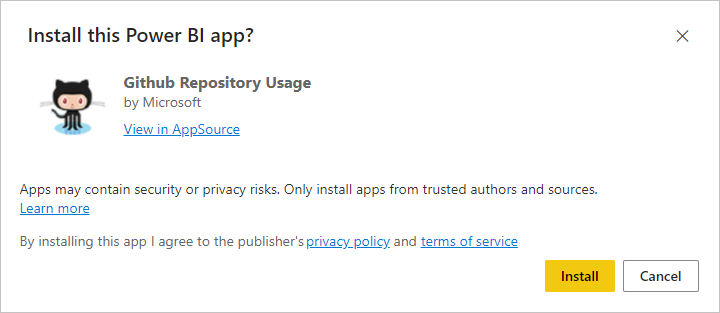
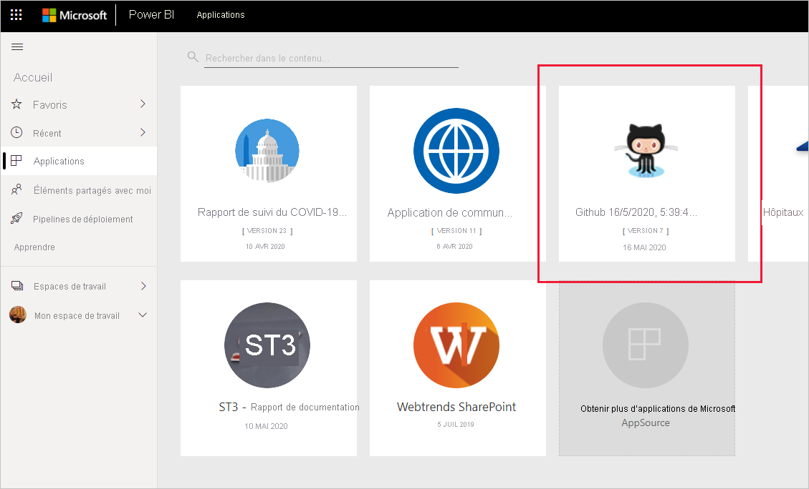
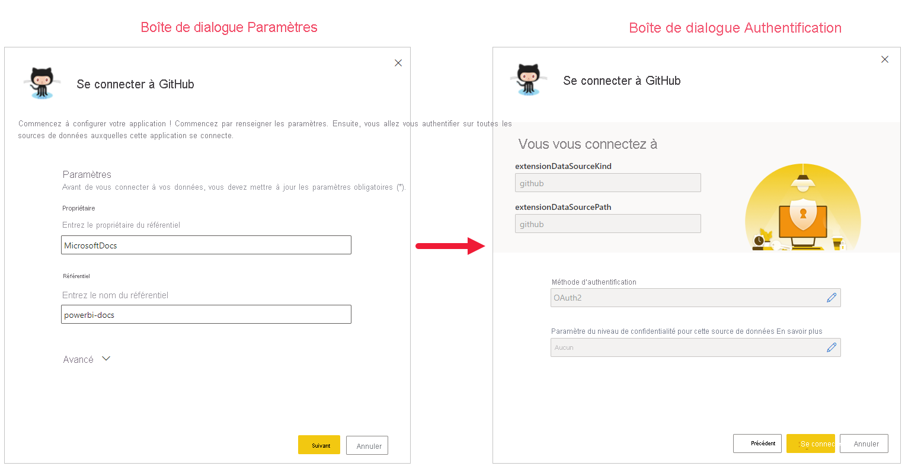
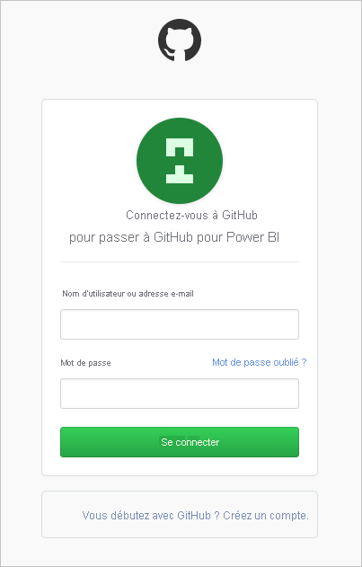
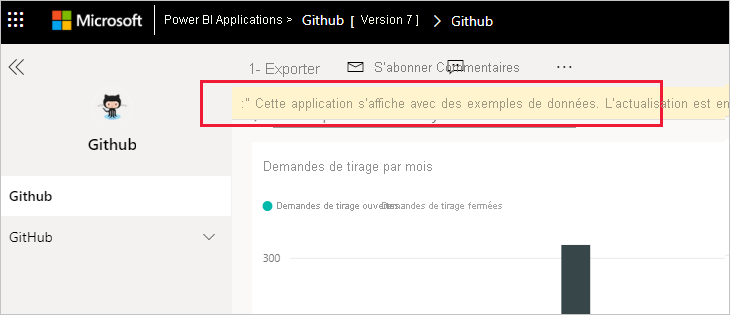

# <a name="connect-to-github-with-power-bi"></a>Se connecter à GitHub avec Power BI
Cet article vous guide tout au long de l’extraction de vos données à partir de votre compte GitHub à l’aide d’une application de modèle Power BI. L’application de modèle génère un espace de travail avec un tableau de bord, un ensemble de rapports et un jeu de données pour vous permettre d’explorer vos données GitHub. L’application GitHub pour Power BI vous montre un aperçu de votre référentiel GitHub (ou repo) avec des données relatives à des contributions, des problèmes, des requêtes d’extraction et des utilisateurs actifs.


Une fois l’application de modèle installée, vous pouvez modifier le tableau de bord et le rapport. Vous pouvez ensuite le distribuer en tant qu’application aux collègues de votre organisation.

Connectez-vous à [l’application de modèle GitHub](https://app.powerbi.com/groups/me/getapps/services/pbi-contentpacks.pbiapps-github) ou obtenez davantage d’informations sur l’[intégration de GitHub](https://powerbi.microsoft.com/integrations/github) avec Power BI.

Vous pouvez également essayer le [didacticiel de GitHub](service-tutorial-connect-to-github.md). Il installe des données GitHub réelles sur le référentiel public pour la documentation de Power BI.

>[!NOTE]
>Cette application de modèle exige que le compte GitHub ait accès au dépôt. Vous trouverez plus d’informations sur la configuration requise ci-dessous.
>
>Cette application de modèle ne prend pas en charge GitHub Enterprise.

## <a name="install-the-app"></a>Installer l’application

1. Cliquez sur le lien suivant pour accéder à l’application : [Application modèle GitHub](https://app.powerbi.com/groups/me/getapps/services/pbi-contentpacks.pbiapps-github)

1. Dans la page AppSource de l’application, sélectionnez [**OBTENIR MAINTENANT**](https://app.powerbi.com/groups/me/getapps/services/pbi-contentpacks.pbiapps-github).

    [](https://app.powerbi.com/groups/me/getapps/services/pbi-contentpacks.pbiapps-github)

1. Sélectionnez **Installer**. 

    

    Une fois l’application installée, elle apparaît dans votre page Applications.

   

## <a name="connect-to-data-sources"></a>Se connecter à la source de données

1. Sélectionnez l’icône dans votre page Applications pour ouvrir l’application.

   L’application s’ouvre et présente des exemples de données.

1. Sélectionnez le lien **Connecter vos données** dans la bannière en haut de la page.

   

1. La boîte de dialogue Paramètres s’ouvre. Vous pouvez y modifier la source de données en remplaçant l’exemple de données par votre propre source de données (cf. [limitations connues](service-template-apps-overview.md#known-limitations)). Ensuite vient la boîte de dialogue Méthode d’authentification. Vous devrez peut-être redéfinir les valeurs indiquées dans ces boîtes de dialogue.

   


1. Entrez vos informations d’identification GitHub et suivez le processus d’authentification de GitHub (cette étape peut être ignorée si vous êtes déjà connecté avec votre navigateur).

   


Une fois que vous avez fini de renseigner les boîtes de dialogue de connexion et que vous vous êtes connecté à GitHub, le processus de connexion démarre. Une bannière vous informe que les données sont en cours d’actualisation et qu’en attendant, vous voyez des exemples de données.



Les données de votre rapport sont actualisées automatiquement une fois par jour, sauf si vous avez désactivé cela lors du processus de connexion. Vous pouvez également [configurer votre propre planification de l’actualisation](./refresh-scheduled-refresh.md) pour mettre à jour les données du rapport comme vous le souhaitez.

## <a name="customize-and-share"></a>Personnaliser et partager

Pour personnaliser et partager votre application, sélectionnez l’icône de crayon dans le coin supérieur droit de la page.


Pour obtenir des informations sur la modification des artefacts dans l’espace de travail, consultez
* [Visite guidée de l’éditeur de rapport dans Power BI](../create-reports/service-the-report-editor-take-a-tour.md)
* [Fondamentaux pour les concepteurs dans le service Power BI](../fundamentals/service-basic-concepts.md)

Une fois que vous avez apporté toutes les modifications souhaitées aux artefacts dans l’espace de travail, vous êtes prêt à publier et à partager l’application. Consultez [Publier votre application](../collaborate-share/service-create-distribute-apps.md#publish-your-app) pour voir comment procéder.

## <a name="whats-included-in-the-app"></a>Ce qui est inclus dans l’application
Les données suivantes sont disponibles à partir de GitHub dans Power BI :     

| Nom du tableau | Description |
| --- | --- |
| Contributions |Le tableau Contributions indique les ajouts, suppressions et validations totaux créés par le contributeur, agrégés par semaine. Les 100 premiers collaborateurs sont inclus. |
| Problèmes |Ce tableau répertorie tous les problèmes pour le dépôt sélectionné et contient des calculs tels que le temps total et moyen pour fermer un problème, le nombre total de problèmes ouverts et le nombre total de problèmes fermés. Ce tableau est vide si le dépôt ne contient aucun problème. |
| Pull requests |Ce tableau contient toutes les requêtes d’extraction pour le dépôt et leurs auteurs. Elle indique également le nombre de requêtes d’extraction ouvertes, fermées et totales, le temps nécessaire pour extraire les requêtes et la durée moyenne des requêtes d’extraction. Ce tableau est vide si le référentiel ne contient aucune demande de tirage (pull request). |
| Utilisateurs |Ce tableau répertorie les utilisateurs ou contributeurs GitHub qui ont collaboré, enregistré des problèmes ou résolu des requêtes d’extraction pour le dépôt sélectionné. |
| Milestones |Ce tableau recense les étapes majeures pour le dépôt sélectionné. |
| DateTable |Ce tableau, qui contient des dates sur plusieurs années dans le passé à partir de la date du jour, vous permet d’analyser vos données GitHub par date. |
| ContributionPunchCard |Ce tableau peut être utilisé comme une carte à perforer des contributions pour le dépôt sélectionné. Il indique les validations par jour de la semaine et heure de la journée. Ce tableau n’est pas connecté aux autres tableaux du modèle. |
| RepoDetails |Ce tableau fournit des détails sur le dépôt sélectionné. |

## <a name="system-requirements"></a>Configuration requise
* Compte GitHub ayant accès au dépôt.  
* Autorisation accordée à l’application Power BI pour GitHub à la première connexion. Consultez les détails ci-dessous sur la révocation de l’accès.  
* Suffisamment d’appels d’API sont disponibles pour l’extraction et l’actualisation des données.
>[!NOTE]
>Cette application de modèle ne prend pas en charge GitHub Enterprise.

### <a name="de-authorize-power-bi"></a>Retirer l’autorisation à Power BI
Pour retirer à Power BI l’autorisation de se connecter à votre dépôt GitHub, vous pouvez révoquer l’accès dans GitHub. Consultez cette rubrique d’[aide GitHub](https://help.github.com/articles/keeping-your-ssh-keys-and-application-access-tokens-safe/#reviewing-your-authorized-applications-oauth) pour plus de détails.

<a name="FindingParams"></a>
## <a name="finding-parameters"></a>Recherche de paramètres
Vous pouvez déterminer le propriétaire et le dépôt en examinant le dépôt GitHub lui-même :


La première partie « Azure » représente le propriétaire, tandis que la deuxième partie « azure-sdk-for-php » correspond au dépôt proprement dit.  Ces deux mêmes éléments apparaissent dans l’URL du dépôt :

```console
<https://github.com/Azure/azure-sdk-for-php> .
```

## <a name="troubleshooting"></a>Résolution des problèmes
Si nécessaire, vous pouvez vérifier vos informations d’identification GitHub.  

1. Dans une autre fenêtre de navigateur, accédez au site web GitHub et connectez-vous à GitHub. Vous pouvez voir que vous êtes connecté dans le coin supérieur droit du site GitHub.    
2. Dans GitHub, accédez à l’URL du dépôt auquel vous envisagez d’accéder dans Power BI. Par exemple : https://github.com/dotnet/corefx.  
3. Dans Power BI, essayez de vous connecter à GitHub. Dans la boîte de dialogue Configurer GitHub, utilisez les noms du dépôt et du propriétaire de ce même dépôt.  

## <a name="next-steps"></a>Étapes suivantes

* [Tutoriel : Se connecter à un référentiel GitHub à l’aide de Power BI](service-tutorial-connect-to-github.md)
* [Créer les nouveaux espaces de travail dans Power BI](../collaborate-share/service-create-the-new-workspaces.md)
* [Installer et utiliser des applications dans Power BI](../consumer/end-user-apps.md)
* [Se connecter aux applications Power BI pour des services externes](service-connect-to-services.md)
* Vous avez des questions ? [Essayez d’interroger la communauté Power BI](https://community.powerbi.com/)
