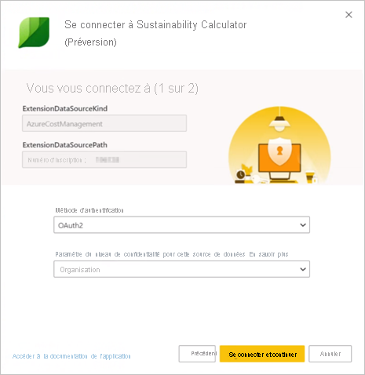
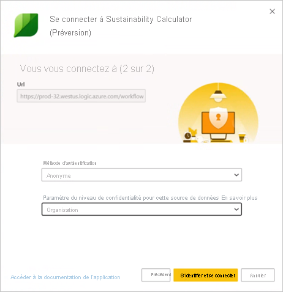

# Page de support de Microsoft Sustainability Calculator

Microsoft Sustainability Calculator fournit une nouvelle visibilité pour les données relatives aux émissions de carbone associées aux services Azure. Les responsables de la durabilité et des rapports associés au sein de leur organisation peuvent maintenant quantifier l’impact carbone de chaque abonnement Azure et voir une estimation des économies de carbone réalisées en exécutant ces charges de travail dans Azure plutôt que dans des centres de données locaux. Ces données peuvent être utilisées dans les rapports sur les émissions de gaz à effet de serre (GES) « Scope 3 ».

> [!NOTE]
> Cette version du connecteur ne prend en charge que les inscriptions effectuées sur [Azure Enterprise Portal](https://ea.azure.com). Les inscriptions en Chine ne sont pas prises en charge actuellement.

## Prérequis

Pour accéder à Microsoft Sustainability Calculator, vous devez demander les informations suivantes à l’administrateur Azure de votre organisation :

- ID client
- Clé d’accès
- Numéro d’inscription
- Seuls les rôles Administrateur Azure peuvent s’authentifier et connecter la calculatrice aux données de l’entreprise. (**Uniquement pour la préversion de décembre 2020**)

Pour trouver le numéro d’inscription de votre entreprise, procédez comme suit :

1. Connectez-vous à [Azure Enterprise Portal](https://ea.azure.com) en tant qu’administrateur.
2. Sélectionnez **Active Directory** ou **Gérer** dans la barre de navigation de gauche. Le numéro d’inscription de votre entreprise s’affiche.

   

Pour trouver la clé d’accès de votre entreprise, procédez comme suit :

1. Connectez-vous à [Azure Enterprise Portal](https://ea.azure.com) en tant qu’administrateur.
2. Sélectionnez **Rapports**, puis **Clé d’accès API** pour obtenir la clé du compte d’inscription principal.

## Version de janvier 2020 de Sustainability Calculator

### Comment se connecter

[!INCLUDE [powerbi-service-apps-get-more-apps](../includes/powerbi-service-apps-get-more-apps.md)]

3. Sélectionnez **Microsoft Sustainability Calculator**, puis **Obtenir maintenant**.

4. Dans **Installer cette application Power BI ?** , sélectionnez **Installer**.

5. Dans le volet **Applications**, sélectionnez la vignette **Microsoft Sustainability Calculator**.

6. Dans **Démarrer avec votre nouvelle application**, sélectionnez **Se connecter**.

   

7. Entrez le **Nom de l’entreprise**, le **Numéro d’inscription de l’utilisateur** et le **Nombre de mois**. Pour savoir comment obtenir votre numéro d’inscription, consultez [Prérequis](#prerequisites). Sélectionnez **Suivant**.

   

8. Entrez les informations suivantes :

   | Champ | Valeur |
   | --- | --- |
   | **Méthode d'authentification** | Sélectionner **Clé**. |
   | **Clé de compte** | Entrez votre clé d’accès. |
   | **Paramètre du niveau de confidentialité pour cette source de données** | Sélectionnez **Organisationnel**. |

   

9. Sélectionnez **Connexion**.

10. Le processus d’importation commence automatiquement. Une fois le processus terminé, de nouveaux tableau de bord, rapport et modèle apparaissent dans le **volet de navigation**. Sélectionnez le rapport pour afficher vos données importées.

### Utilisation de l’application

Pour mettre à jour les paramètres, procédez comme suit :

1. Accédez aux paramètres **Jeu de données**, puis aux paramètres associés à l’espace de travail de l’application.
2. Mettez à jour le **Nom de l’entreprise**, le **Numéro d’inscription de l’utilisateur** et le **Nombre de mois** si nécessaire.
3. Sélectionnez **Actualiser** pour recharger les données en appliquant les nouveaux paramètres.

## Version de décembre 2020 de Sustainability Calculator (préversion)

Calculez dès aujourd’hui vos émissions de CO2 liées au cloud avec Microsoft Sustainability Calculator.

Réaliser un bilan carbone précis implique d’obtenir de bonnes informations auprès des partenaires et des fournisseurs. Microsoft Sustainability Calculator vous indique en toute transparence les émissions de CO2 engendrées par votre utilisation d’Azure et de Microsoft Dynamics.

Le bilan carbone de Microsoft couvre les trois niveaux (« Scope ») d’émissions selon une méthodologie validée par l’Université Stanford en 2018. Il quantifie de manière cohérente et précise l’impact des services cloud Microsoft sur l’empreinte environnementale des clients. Microsoft est le seul fournisseur de cloud à proposer ce niveau de transparence aux clients tout en compilant des rapports exigés d’un point de vue légal et des rapports non obligatoires.

### Avant de commencer

Microsoft Sustainability Calculator s’exécute sur Power BI Pro. Si vous ne disposez pas de Power BI Pro, [demandez dès maintenant un essai gratuit](https://powerbi.microsoft.com/power-bi-pro).

Vous aurez besoin de votre numéro d’inscription Azure. Si vous ne le connaissez pas, demandez de l’aide à l’administrateur Azure de votre organisation. Pour plus d’informations, consultez [Prérequis](#prerequisites).

### Connexion de la calculatrice : le bilan carbone en cinq étapes simples

1. Téléchargez l’application sur [AppSource](https://go.microsoft.com/fwlink/?linkid=2151690).

   

   Vous pouvez également rechercher l’application dans Power BI.

   

2. Ouvrez l’application.

3. Entrez votre numéro d’inscription. Sélectionnez **Connecter vos données**, puis entrez votre numéro d’inscription. Pour savoir comment obtenir votre numéro d’inscription, consultez [Prérequis](#prerequisites).

   

4. Connectez votre compte :
   - Dans **Vous vous connectez à (1/2)** , sélectionnez **OAuth2** sous **Méthode d’authentification**, puis **Organisationnel** sous **Paramètre de niveau de confidentialité pour cette source de données**.

      
 
   - Sélectionnez le compte d’utilisateur.

      
       
   - Dans **Vous vous connectez à (2/2)** , sélectionnez **Anonyme** sous **Méthode d’authentification**, puis **Organisationnel** sous **Paramètre de niveau de confidentialité pour cette source de données**.

     
    
5. Attendez que la vue soit générée, ce qui peut prendre jusqu’à 24 heures.

### Ressources supplémentaires

- [Guide pratique vidéo](https://go.microsoft.com/fwlink/?linkid=2151608)
- [Les avantages du cloud computing en matière de carbone : Étude de Microsoft Cloud en partenariat avec WSP](https://download.microsoft.com/download/7/3/9/739BC4AD-A855-436E-961D-9C95EB51DAF9/Microsoft_Cloud_Carbon_Study_2018.pdf)

### Forum Aux Questions

#### Configuration de l’application

**Je reçois une erreur lors de la connexion de mes données avec la calculatrice. Que faire ?**

Tout d’abord, vérifiez dans Azure Cost Management que vous disposez des privilèges Administrateur informatique. Si ce n’est pas le cas, demandez cet accès à votre administrateur. Ensuite, assurez-vous que vous utilisez le bon numéro d’inscription.

**J’ai entré mon numéro d’inscription, mais mes données d’entreprise ne se chargent pas. Quel est le problème ?**

La préversion publique de Sustainability Calculator peut mettre jusqu’à 24 heures à charger vos données. Revenez au bout de 24 heures et sélectionnez le bouton **Actualiser** dans Power BI.

**S’agit-il d’une tentative de Microsoft de rejeter la responsabilité des émissions sur moi ?**

Non. Les émissions de carbone des services Azure sont signalées comme des émissions de Microsoft « Scope 1 » et « Scope 2 », conformément au [protocole GHG (Greenhouse Gas)](https://ghgprotocol.org/) conventionnel. Ce protocole définit les émissions « Scope 3 » comme émises en votre nom par une autre entité. Elles sont par nature comptée deux fois. Microsoft Sustainability Calculator offre une transparence inédite sur vos émissions « Scope 3 » associées à l’utilisation des services Azure, en particulier dans la catégorie 1 « Achat de produits et services ».

**Pourquoi mes émissions liées à l’utilisation du cloud Microsoft sont-elles nettement plus basses que si j’utilisais une solution locale ?**

Microsoft a mené une [étude, publiée en 2018](https://blogs.microsoft.com/on-the-issues/2018/05/17/microsoft-cloud-delivers-when-it-comes-to-energy-efficiency-and-carbon-emission-reductions-study-finds/), visant à évaluer la différence entre les centres de donnée cloud Microsoft et locaux (traditionnels). Les résultats montrent qu’Azure Compute et le Stockage Azure sont 52 à 79 % plus économes en énergie que les centres de donnés d’entreprise traditionnels, en fonction de la comparaison spécifique effectuée (efficacité locale trop faible, moyenne ou haute). Si l’on prend en compte nos achats d’énergie renouvelable, Azure est 79 à 98 % plus performant en matière de carbone. Ces économies sont dues à quatre caractéristiques clés de Microsoft Cloud : l’efficacité opérationnelle du service informatique, l’efficacité de l’équipement informatique, l’efficacité de l’infrastructure des centres de données et l’électricité renouvelable.

**Si les activités de Microsoft sont neutres en carbone et alimentées par des énergies renouvelables, pourquoi les émissions clients des services Azure ne sont-elles pas égales à zéro ?**

Il existe deux raisons principales au fait que les émissions clients de Microsoft ne sont pas égales à zéro. La première est liée aux pratiques de bilan des GES, la seconde à la limite de cette analyse. Pour atteindre la neutralité carbone dans ses activités, Microsoft réduit certaines sources d’émissions (par exemple la consommation locale de carburant pour les générateurs de secours, les réfrigérants et les parcs de véhicules) grâce à des compensations carbone. Celles-ci annulent les émissions *nettes* de Microsoft. La calculatrice signale les émissions *brutes* de GES avant application de ces compensations, bien que le volume des compensations appliquées et des émissions nettes soit indiqué dans l’onglet **Rapports GES** pour plus de transparence. La deuxième raison est la suivante : en plus de l’énergie et des émissions associées au fonctionnement des centres de données de Microsoft, l’empreinte des émissions comprend l’énergie utilisée par les fournisseurs de services Internet en dehors de la limite opérationnelle de Microsoft pour transmettre des données entre les centres de données Microsoft et les clients Azure.

**Comment dois-je utiliser ces données et où les signaler ?**

Vos émissions peuvent être signalées dans les émissions indirectes de CO2 « Scope 3 » de votre entreprise. Ces émissions « Scope 3 » sont souvent divulguées dans les rapports de durabilité, la mesure CDP du changement climatique et auprès d’autres organismes de reporting. En plus des émissions totales, les économies d’émissions donnent un exemple clair de l’impact sur la réduction des émissions globales de la décision qu’a prise votre entreprise d’utiliser les services Microsoft Azure. Pour mettre les choses en perspective, l’application indique l’équivalent en véhicule-miles évités de la réduction des émissions de GES, en fonction des facteurs du calculateur d’équivalences de l’EPA en janvier 2020.

**Que puis-je faire pour réduire davantage les émissions ?**

De bons rapports ressources-efficacité et coût-efficacité dans Azure permettent de réduire l’impact sur l’environnement lié à l’utilisation d’Azure. Par exemple, les machines virtuelles inutilisées représentent un gaspillage, que ce soit dans le cloud ou localement. Un dimensionnement des machines virtuelles approprié, qui améliore les facteurs d’utilisation du calcul (CUF, Compute Utilization Factor), permet de réduire la consommation d’énergie par sortie utile, comme avec les serveurs physiques. [Azure Cost Management](/azure/cost-management-billing/costs/cost-mgt-best-practices) vous donne les outils nécessaires pour anticiper, analyser et réduire vos dépenses afin d’optimiser votre investissement cloud.

#### Méthodologie

**Sur quelle méthodologie repose l’outil ?**

Microsoft Sustainability Calculator reflète spécifiquement les services cloud consommés et les exigences associées en matière d’énergie, l’efficacité des centres de données qui fournissent ces services, les mix électricité/carburants proposés dans les régions de ces centres de donnée et les achats d’énergie renouvelable de Microsoft. Dans le cadre du développement de l’application, la méthodologie et sa mise en œuvre ont été vérifiées par des tiers pour garantir le respect des normes de compte rendu et de comptabilité des sociétés quant au protocole GHG (Greenhouse Gas) du WRI (World Resources Institute)/WBCSD (World Business Council for Sustainable Development). Le champ de la vérification, effectuée conformément à la norme ISO 14064-3 : Gaz à effet de serre – Partie 3 : Spécifications et lignes directrices pour la validation et la vérification des déclarations des gaz à effet de serre, inclut l’estimation des émissions des services Azure, mais exclut celle des émissions locales en raison de la nature contrefactuelle de cette estimation. Une description plus détaillée du calcul CO2 est documentée dans l’onglet **Méthodologie de calcul** de l’outil.

**Quelles sont les données nécessaires pour calculer l’empreinte carbone d’Azure ? Accédez-vous aux données de mon entreprise ?**

Les calculs CO2 estimés sont effectués en fonction de la consommation de services Azure accessible avec le Revenu consommé Azure. La calculatrice n’accède à aucune de vos données client stockées. Les données de consommation sont combinées avec les données de suivi de l’énergie et du carbone de Microsoft pour calculer les émissions estimées associées à votre consommation de services Azure en fonction des centres de données qui fournissent ces services.

**Toutes les régions Azure et tous les services Azure sont-ils inclus dans ce calcul ?**

Les estimations incluent tous les services Azure de toutes les régions Azure associées à l’ID de locataire indiqué lors de l’installation.

#### Caractérisation des émissions locales

**Où Microsoft Sustainability Calculator obtient-il des données sur les émissions et les opérations locales ?**

Microsoft Sustainability Calculator ne récupère pas d’informations concernant spécifiquement vos centres de données locaux *en dehors de* celles que vous fournissez. Il s’appuie sur la recherche industrielle et sur les entrées utilisateur concernant l’efficacité et le mix énergétique des solutions locales pour développer une estimation des émissions locales (cf. questions suivantes).

**Quelles sont les hypothèses formulées concernant les estimations locales ? Les gains d’efficacité proviennent-ils uniquement de l’amélioration de l’indicateur d’efficacité énergétique (PUE, Power Usage Effectiveness) ?**

Les gains d’efficacité associés aux services cloud Microsoft dépassent largement l’amélioration de l’indicateur PUE. Les principales améliorations concernent l’efficacité opérationnelle du service informatique (provisionnement dynamique, architecture mutualisée, utilisation des serveurs) et l’efficacité de l’équipement informatique (ajustement du matériel aux services garantissant davantage d’énergie pour la sortie utile), en plus de l’efficacité de l’infrastructure des centres de données Microsoft (optimisation de l’indicateur PUE). Notre [étude 2018](https://blogs.microsoft.com/on-the-issues/2018/05/17/microsoft-cloud-delivers-when-it-comes-to-energy-efficiency-and-carbon-emission-reductions-study-finds/) quantifie ces économies par rapport à un éventail de solutions locales (centres de données peu efficaces à très efficaces). Ces constats d’évaluation permettent d’estimer la consommation d’énergie nécessaire pour qu’un centre de données local correspondant fournisse au client les mêmes services que ceux qu’il utilise sur le cloud Microsoft.

**Quel est le mix énergétique supposé pour l’infrastructure locale ?**

Par défaut, Microsoft Sustainability Calculator évalue les émissions locales en fonction du mix d’énergies renouvelables et non renouvelables du réseau. Il est supposé que le centre de centres local se trouve sur le même réseau que les centres de donnes de Microsoft. Toutefois, les clients qui achètent de l’électricité renouvelable *en plus* de ce qui se trouve sur le réseau (par exemple dans le cadre de contrats de vente directe d’électricité) peuvent sélectionner un pourcentage d’électricité renouvelable. Microsoft Sustainability Calculator ajustera les émissions locales en conséquence.

**Quand dois-je choisir l’efficacité Faible, Moyenne ou Élevée de l’infrastructure locale ?**

Les utilisateurs doivent sélectionner l’efficacité la plus représentative du déploiement local qu’ils aimeraient comparer, en fonction des caractéristiques de l’équipement et du centre de données :

- **Faible** : serveurs physiques et stockage en attachement direct dans un petit centre de données localisé (entre 500 et 1 999 pieds carrés)
- **Moyenne** : combinaison de serveurs physiques/virtualisés et de stockage attaché/dédié dans un centre de données interne de niveau intermédiaire (entre 2 000 et 19 999 pieds carrés)
- **Élevée** : serveurs virtualisés et stockage dédié dans un centre de données interne haut de gamme (plus de 20 000 pieds carrés)