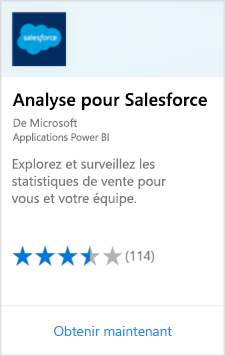
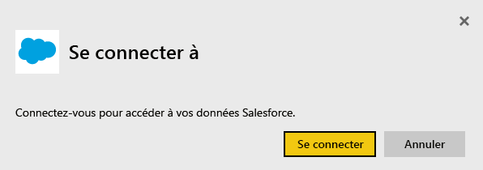
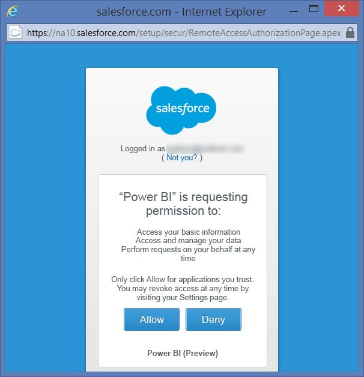
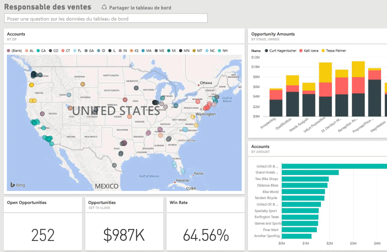

# Se connecter à Salesforce avec Power BI
Avec Power BI, vous pouvez facilement vous connecter à votre compte Salesforce.com. Avec cette connexion, vous pouvez récupérer vos données Salesforce et bénéficier automatiquement d’un tableau de bord et d’un rapport.

En savoir plus sur l’[intégration Salesforce](https://powerbi.microsoft.com/integrations/salesforce) à Power BI.

## Comment se connecter
1. Dans Power BI, sélectionnez **Obtenir des données** en bas du volet de navigation.
   
    
2. Dans la zone **Services**, sélectionnez **Obtenir**.
   
    
3. Sélectionnez **Analytique pour Salesforce**, puis sélectionnez **Obtenir**.  
   
   
4. Sélectionnez **Se connecter** pour démarrer le processus de connexion.
   
    
5. Quand vous y êtes invité, entrez vos informations d’identification Salesforce. Sélectionnez **Autoriser** pour que Power BI ait accès à vos informations et données Salesforce de base.
   
   
6. Configurez ce que vous souhaitez importer dans Power BI à l’aide de l’option de liste déroulante :
   
   * **Tableau de bord**
     
     Sélectionnez un tableau de bord prédéfini basé sur un rôle (tel que **Responsable des ventes**). Ces tableaux de bord récupèrent un ensemble spécifique de données standard Salesforce (les champs personnalisés ne sont pas compris).
     
     
   * **Rapports**
     
     Sélectionnez un ou plusieurs rapports personnalisés à partir de votre compte Salesforce. Ces rapports correspondent à vos vues dans Salesforce et peuvent inclure des données de champs ou d’objets personnalisés.
     
     
     
     Si vous ne voyez aucun rapport, ajoutez-en ou créez-en dans votre compte Salesforce, puis reconnectez-vous.

7. Sélectionnez **Se connecter** pour commencer le processus d’importation. Pendant l’importation, une notification vous indique que l’importation est en cours. Une fois l’importation terminée, un tableau de bord, un rapport et un jeu de données pour vos données Salesforce sont listés dans le volet de navigation.
   
   

Vous pouvez modifier ce tableau de bord pour afficher vos données comme vous le souhaitez. Vous pouvez poser des questions dans la zone Questions et réponses, ou bien [sélectionner une vignette](../consumer/end-user-tiles.md) pour ouvrir le rapport sous-jacent et [modifier ou supprimer les vignettes du tableau de bord](../create-reports/service-dashboard-edit-tile.md).

**Et maintenant ?**

* Essayez de [poser une question dans la zone Q&R](../consumer/end-user-q-and-a.md) en haut du tableau de bord.
* [Modifier ou supprimer une vignette](../create-reports/service-dashboard-edit-tile.md) du tableau de bord
* [Sélectionnez une vignette](../create-reports/service-dashboard-tiles.md) pour ouvrir le rapport sous-jacent.
* Même si une actualisation quotidienne de votre jeu de données est planifiée, vous pouvez modifier la planification de l’actualisation ou essayer d’actualiser le jeu de données sur demande à l’aide de l’option **Actualiser maintenant**.

## Configuration requise et considérations

- Être connecté avec un compte Salesforce de production qui autorise l’accès des API.

- Autorisation accordée à l’application Power BI pendant la connexion.

- Compte disposant de suffisamment d’appels d’API pour extraire et actualiser les données.

- Un jeton d’authentification valide est nécessaire pour l’actualisation. Salesforce imposant une limite de 5 jetons d’authentification par application, vérifiez qu’au maximum 5 jeux de données Salesforce sont importés.

- L’API des Rapports Salesforce possède une restriction qui prend en charge jusqu'à 2 000 lignes de données.

## Résolution des problèmes

Si vous rencontrez des erreurs, reportez-vous à la configuration requise ci-dessus. 

La connexion à un domaine personnalisé ou sandbox n’est pas prise en charge.

### Message « Impossible de se connecter au serveur distant »

Si vous recevez le message « Impossible de se connecter au serveur distant » lorsque vous tentez de vous connecter à votre compte Salesforce, consultez cette solution sur le forum suivant : [Salesforce Connector sign in Error Message: Unable to connect to the remote server](https://www.outsystems.com/forums/Forum_TopicView.aspx?TopicId=17674&TopicName=log-in-error-message-unable-to-connect-to-the-remote-server&)

## Étapes suivantes
[Qu’est-ce que Power BI ?](../fundamentals/power-bi-overview.md)

[Sources de données pour le service Power BI](service-get-data.md)
