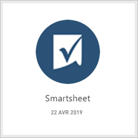
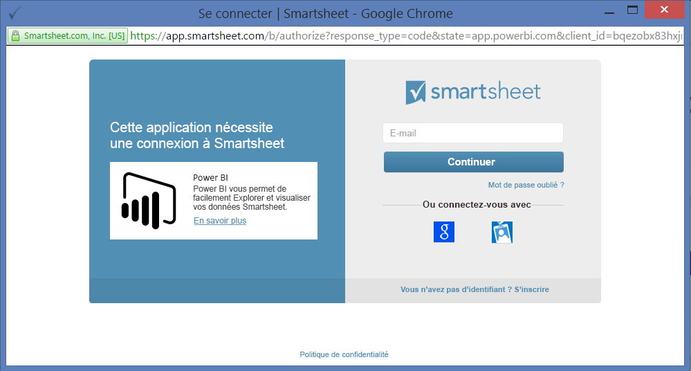
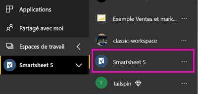
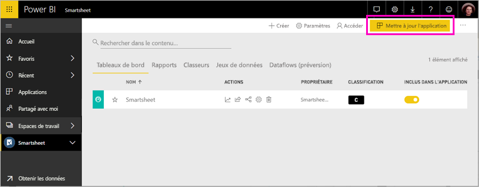

# Se connecter à Smartsheet avec Power BI
Cet article vous guide tout au long de l’extraction de vos données à partir de votre compte Smartsheet à l’aide d’une application de modèle Power BI. Smartsheet offre une plateforme simple de collaboration et de partage de fichiers. L’application de modèle Smartsheet pour Power BI fournit un tableau de bord, des rapports, ainsi qu’un jeu de données offrant une vue d’ensemble de votre compte Smartsheet. Vous pouvez également utiliser [Power BI Desktop](desktop-connect-to-data.md) pour vous connecter directement à des feuilles individuelles dans votre compte. 

Une fois l’application de modèle installée, vous pouvez modifier le tableau de bord et le rapport. Vous pouvez ensuite le distribuer en tant qu’application aux collègues de votre organisation.

Connectez-vous à l’[application modèle Smartsheet](https://app.powerbi.com/groups/me/getapps/services/pbi-contentpacks.pbiapps-smartsheet) pour Power BI.

>[!NOTE]
>Pour charger l’application de modèle Power BI, il est recommandé de se connecter avec un compte d’administrateur Smartsheet, car celui-ci dispose de droits d’accès supplémentaires.

## Comment se connecter

[!INCLUDE [powerbi-service-apps-get-more-apps](../includes/powerbi-service-apps-get-more-apps.md)]

3. Sélectionnez **Smartsheet**  \> **Obtenir maintenant**.
4. Dans **Installer cette application Power BI ?** , sélectionnez **Installer**.
4. Dans le volet **Applications**, sélectionnez la vignette **Smartsheet**.

    

6. Dans **Démarrer avec votre nouvelle application**, sélectionnez **Se connecter**.

    

4. Pour la Méthode d’authentification, sélectionnez **oAuth2 \> Se connecter**.
   
   Quand vous y êtes invité, entrez vos informations d’identification Smartsheet et suivez le processus d’authentification.
   
   
   
   

5. Une fois que Power BI importe les données, le tableau de bord Smartsheet s’ouvre.
   
   

## Modifier et distribuer votre application

Vous avez installé l’application de modèle Smartsheet. Cela signifie que vous avez également créé l’espace de travail Smartsheet. Dans l’espace de travail, vous pouvez modifier le rapport et le tableau de bord, puis distribuez-le en tant qu’*application* aux collègues de votre organisation. 

1. Pour afficher tout le contenu de votre nouvel espace de travail Smartsheet, dans le volet de navigation, sélectionnez **Espaces de travail** > **Smartsheet**. 

    

    Cette vue est la liste de contenu de l’espace de travail. Dans l’angle supérieur droit, vous voyez **Mettre à jour l’application**. Lorsque vous êtes prêt à distribuer votre application à vos collègues, c’est là que vous allez commencer. 

    

2. Sélectionnez **Rapports** et **Jeux de données** pour afficher les autres éléments dans l’espace de travail.

    En savoir plus sur [la distribution d’applications](../collaborate-share/service-create-distribute-apps.md) à vos collègues.

## Ce qui est inclus
L’application de modèle Smartsheet pour Power BI comprend une vue d’ensemble de votre compte Smartsheet, comme le nombre d’espaces de travail, de rapports et de feuilles dont vous disposez, la date de leur mise à jour, etc. Les administrateurs ont également accès à des informations sur les utilisateurs dans leur système, comme les créateurs de feuilles principaux.  

Pour vous connecter directement à des feuilles individuelles dans votre compte, vous pouvez utiliser le connecteur Smartsheet dans [Power BI Desktop](desktop-connect-to-data.md).  

## Étapes suivantes

* [Créer les nouveaux espaces de travail dans Power BI](../collaborate-share/service-create-the-new-workspaces.md)
* [Installer et utiliser des applications dans Power BI](../consumer/end-user-apps.md)
* [Se connecter aux applications Power BI pour des services externes](service-connect-to-services.md)
* Vous avez des questions ? [Essayez d’interroger la communauté Power BI](https://community.powerbi.com/)