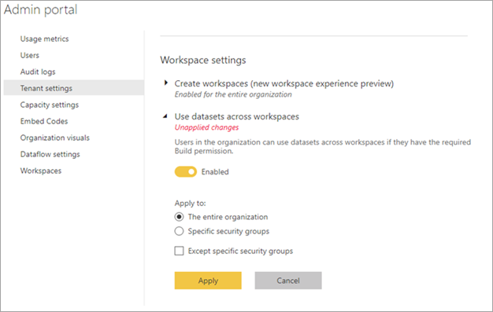

# Contrôler l’utilisation de jeux de données dans des espaces de travail

L’utilisation de jeux de données dans les espaces de travail constitue un moyen puissant de favoriser la culture et la vulgarisation des données au sein d’une organisation. Cependant, si vous êtes un administrateur Power BI, vous souhaitez parfois limiter le flux d’informations dans votre locataire Power BI. Avec le paramètre de locataire **Utiliser des jeux de données dans des espaces de travail** , vous pouvez limiter la réutilisation de jeu de données complètement ou partiellement par groupes de sécurité.

Si vous désactivez ce paramètre, voici les effets sur les créateurs de rapports :

- Le bouton pour copier des rapports sur les espaces de travail n’est pas disponible. 
- Dans un rapport basé sur un jeu de données partagé, le bouton **Modifier le rapport** n’est pas disponible.
- Dans le service Power BI, l’expérience de découverte affiche uniquement les jeux de données dans l’espace de travail actuel.
- Dans Power BI Desktop, l’expérience de découverte affiche uniquement les jeux de données d’espaces de travail desquels vous êtes membre.
- Dans Power BI Desktop, si les utilisateurs ouvrent un fichier .pbix avec une connexion active à un jeu de données en dehors des espaces de travail desquels ils sont membres, ils voient un message d’erreur leur demandant de se connecter à un jeu de données différent.

## Fournir un lien pour le processus de certification

En tant qu’administrateur Power BI, vous pouvez fournir une URL pour le lien **En savoir plus** dans la page des paramètres **Approbation**.  Consultez [Activer la certification de contenu](../admin/service-admin-setup-certification.md) pour plus d’informations. Ce lien permet d’accéder à la documentation relative à votre processus de certification. Si vous n’indiquez aucune destination pour le lien **En savoir plus** , il pointe par défaut vers l’article intitulé [Approuver votre contenu](../collaborate-share/service-endorse-content.md).

## Étapes suivantes

- [Utiliser des jeux de données entre des espaces de travail](service-datasets-across-workspaces.md)
- Vous avez des questions ? [Essayez d’interroger la communauté Power BI](https://community.powerbi.com/)
