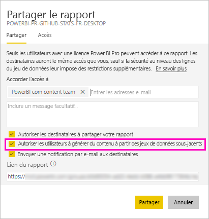
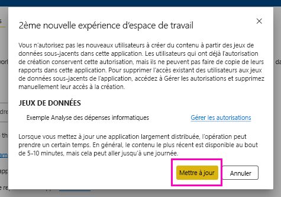

# Autorisation de génération pour les jeux de données partagés

Quand vous créez un rapport dans Power BI Desktop, les données de ce rapport sont stockées dans un *modèle de données*. Quand vous publiez vos rapports dans le service Power BI, vous publiez également les données sous la forme d’un *jeu de données*. Vous pouvez accorder à d’autres utilisateurs l’*autorisation de génération* pour ce rapport. Ils peuvent ainsi découvrir et réutiliser le jeu de données que vous avez partagé. Cet article explique comment contrôler l’accès aux données à l’aide de l’autorisation de génération.

L’autorisation de génération s’applique aux jeux de données. Quand vous accordez aux utilisateurs l’autorisation de génération, ils peuvent créer un nouveau contenu sur votre jeu de données, comme des rapports, des tableaux de bord, des vignettes épinglées à partir de Questions et réponses et Insights Discovery. 

Les utilisateurs ont également besoin d’autorisations de génération pour utiliser les données *en dehors* de Power BI :

- Pour exporter les données sous-jacentes
- Pour créer un nouveau contenu sur le jeu de données, par exemple avec la fonctionnalité [Analyser dans Excel](../collaborate-share/service-analyze-in-excel.md)
- Pour accéder aux données par le biais du point de terminaison XMLA

## Méthodes pour accorder l’autorisation de génération

Vous accordez l'autorisation de génération pour un jeu de données de différentes façons :

- Les membres d’un espace de travail avec au moins le rôle Contributeur disposent automatiquement de l’autorisation de génération de jeux de données dans cet espace de travail, ainsi que de l’autorisation de copier un rapport.
 
- Les membres de l’espace de travail où se trouve le jeu de données peuvent attribuer l’autorisation à des utilisateurs ou des groupes de sécurité spécifiques dans le Centre des autorisations. Si vous êtes membre de l’espace de travail, sélectionnez **Plus d’options** (...) à côté d’un jeu de données > **Gérer les autorisations**.

    

    Cette opération ouvre le Centre des autorisations pour ce jeu de données, où vous pouvez définir et modifier les autorisations.

    

- Un administrateur ou un membre de l’espace de travail où se trouve le jeu de données peut décider, pendant la publication de l’application, que les utilisateurs autorisés à accéder à l’application reçoivent également des autorisations de génération pour les jeux de données sous-jacents. Voir [Partager un jeu de données](service-datasets-share.md) pour plus de détails.

- Imaginons que vous disposez des autorisations de repartage et de génération sur un jeu de données. Quand vous partagez un rapport ou un tableau de bord reposant sur ce jeu de données, vous pouvez spécifier que les destinataires obtiennent également l’autorisation de génération pour le jeu de données sous-jacent.

    

Vous pouvez supprimer l’autorisation de création dont dispose un utilisateur pour un jeu de données. Dans ce cas, ils peuvent toujours voir le rapport généré sur le jeu de données partagé, mais ils ne peuvent plus le modifier. Voir la section suivante pour plus de détails.

## Supprimer l’autorisation de génération pour un jeu de données

À un moment donné, vous devrez peut-être supprimer l'autorisation de génération pour certains utilisateurs d'un jeu de données partagé. 

1. Dans un espace de travail, allez à la page de la liste des **jeux de données**. 
1. Sélectionnez **Plus d’options** (...) en regard du jeu de données > **Gérer les autorisations**.

    

1. Sélectionnez **Plus d’options** (...) à côté d’un nom > **Supprimer l’autorisation de génération**.

    

    Ils peuvent toujours voir le rapport généré sur le jeu de données partagé, mais ils ne peuvent plus le modifier.

### Supprimer l’autorisation de génération pour un jeu de données dans une application

Supposons que vous ayez distribué une application d'un espace de travail à un groupe de personnes. Plus tard, vous décidez de supprimer l'accès à l'application pour certaines personnes. La suppression de leur accès à l'application ne supprime pas automatiquement leurs autorisations de génération et de partage. Il s’agit d’une étape supplémentaire. 

1. Dans une page de la liste des espaces de travail, sélectionnez **Mettre à jour l’application**. 

    

1. Dans l'onglet **Autorisations**, sélectionnez **X** pour supprimer la personne ou le groupe. 

    
1. Sélectionnez **Mettre à jour l’application**.

    Un message vous explique que vous devez aller à la section **Gérer autorisations** afin de supprimer les autorisations de génération pour les utilisateurs disposant d’un accès. 

    

1. Sélectionnez **Mettre à jour**.

1. Dans l'espace de travail, allez à la page de la liste des **jeux de données**. 
1. Sélectionnez **Plus d’options** (...) à côté du jeu de données > **Gérer les autorisations**.

    

1. Sélectionnez **Plus d’options** (...) à côté des noms correspondants > **Supprimer l’autorisation de génération**.

    

    Ils peuvent toujours voir le rapport généré sur le jeu de données partagé, mais ils ne peuvent plus le modifier.

## Autorisations plus granulaires

Power BI a introduit l’autorisation de génération en juin 2019 en complément des autorisations existantes : lecture et repartage. Tous les utilisateurs qui, à ce moment-là, disposaient déjà de l’autorisation de lecture pour les jeux de données par le biais des autorisations d’application, du partage ou de l’accès aux espaces de travail obtenaient aussi l’autorisation de génération pour ces mêmes jeux de données. Ils obtenaient automatiquement l’autorisation de génération car l’autorisation de lecture leur accordait déjà le droit de générer du nouveau contenu basé sur le jeu de données, en utilisant la fonctionnalité Analyser dans Excel ou Export.

Avec cette autorisation de génération plus granulaire, vous pouvez choisir qui peut uniquement afficher le contenu du rapport ou du tableau de bord existant et qui peut créer du contenu connecté aux jeux de données sous-jacents.

Si votre jeu de données est actuellement utilisé par un rapport hors de l’espace de travail du jeu de données, vous ne pouvez pas supprimer ce jeu de données. Au lieu de cela, un message d’erreur s’affiche.

Vous pouvez supprimer l’autorisation de génération. Si vous le faites, les personnes dont vous avez révoqué les autorisations peuvent toujours visualiser le rapport, mais elles ne peuvent plus le modifier ni exporter des données sous-jacentes. Les utilisateurs disposant de l’autorisation en lecture seule peuvent toujours exporter les données récapitulatives. 

## Étapes suivantes

- [Utiliser des jeux de données entre des espaces de travail](service-datasets-across-workspaces.md)
- Vous avez des questions ? [Essayez d’interroger la communauté Power BI](https://community.powerbi.com/)
