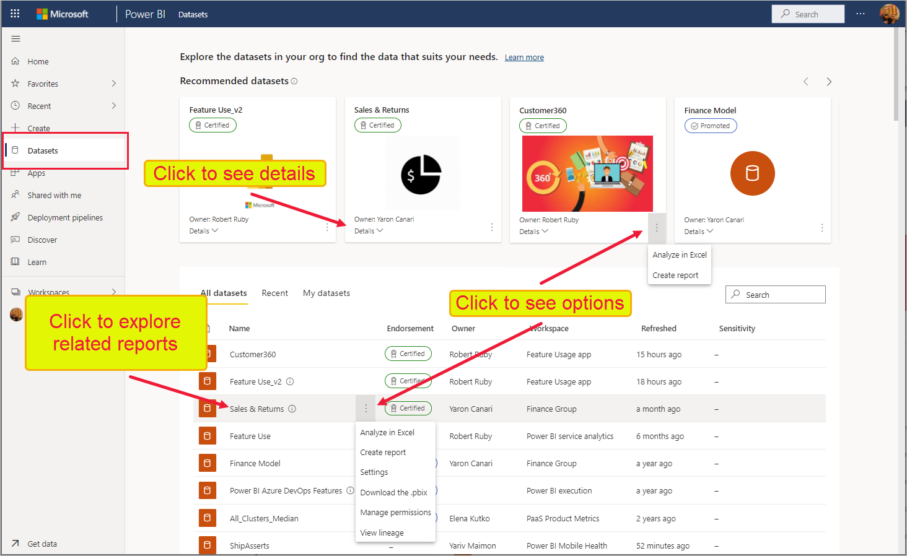

# Découverte de jeux de données à l’aide du hub de jeux de données (préversion)

Le hub de jeux de données facilite la recherche, l’exploration et l’utilisation des jeux de données dans votre organisation. Il fournit des informations sur les jeux de données ainsi que des points d’entrée pour créer des rapports en plus de ces jeux de données ou pour utiliser ces jeux de données avec la fonction Analyser dans Excel.

Le hub de jeux de données peut être utile dans de nombreux scénarios :
* Les propriétaires de jeux de données peuvent voir les métriques d’utilisation, l’état d’actualisation, les rapports associés et la traçabilité du jeu de données pour faciliter la surveillance et la gestion de leurs jeux de données.
* Les créateurs de rapports peuvent utiliser le hub afin de rechercher des jeux de données appropriés sur lesquels générer leurs rapports. Ils peuvent utiliser des liens pour créer facilement des rapports basés sur le jeu de données, à partir de zéro ou à partir de modèles.
* Les consommateurs de rapports peuvent utiliser cette page pour rechercher des rapports basés sur des jeux de données dignes de confiance.

En facilitant la recherche de jeux de données de qualité et de leurs rapports associés, le hub de jeux de données permet d’éviter la création de rapports redondants. Il facilite également la recherche de bons rapports à utiliser comme points de départ pour la création de nouveaux rapports.

Cet article explique ce que vous voyez dans le hub de jeux de données et décrit comment l’utiliser. Pour les propriétaires de jeux de données, il comprend également un certain nombre de conseils pour [améliorer la détectabilité et la facilité d’utilisation de leurs jeux de données](#make-your-dataset-discoverable).

**Quels jeux de données puis-je voir dans le hub de jeux de données ?**
* Pour qu’un jeu de données apparaisse dans le hub de jeux de données, il doit se trouver dans une [nouvelle expérience d’espace de travail](../collaborate-share/service-new-workspaces.md).
* Les jeux de données que vous pouvez voir dans le hub de jeux de données sont ceux pour lesquels vous avez au moins des [autorisations de génération](service-datasets-build-permissions.md).
* Si vous êtes un utilisateur avec un abonnement gratuit, vous voyez uniquement les jeux de données de votre espace *Mon espace de travail*, ou les jeux de données pour lesquels vous disposez [d’autorisations de génération](service-datasets-build-permissions.md) et qui se trouvent dans des espaces de travail de capacité Premium.

## Rechercher le jeu de données dont vous avez besoin

L’expérience de découverte du jeu de données démarre sur la page du hub de jeux de données. Pour accéder à la page du hub de jeux de données :
* Dans le service Power BI : Dans le volet de navigation, sélectionnez **Jeux de données**.
* Dans l’application Power BI dans Teams : Sélectionnez l’onglet **Jeux de données** ou **Jeux de données** dans le volet de navigation.

L’image ci-dessous montre le hub de jeux de données dans le service Power BI.

Le hub de jeux de données vous présente une sélection de jeux de données recommandés et une liste de tous les jeux de données dans l’organisation auxquels vous êtes autorisé à accéder.

Les paragraphes ci-dessous décrivent ces sections et les actions que vous pouvez effectuer.

### Jeux de données recommandés

Les jeux de données recommandés sont des jeux de données approuvés (promus ou certifiés) qui vous sont présentés en fonction d’un calcul qui prend en compte la date de leur dernière actualisation et la dernière fois que vous avez consulté des rapports et/ou des tableaux de bord qui y sont associés.

### Liste des jeux de données

La liste des jeux de données affiche les jeux de données dans l’organisation pour lesquels vous disposez au moins [d’autorisations de génération](service-datasets-build-permissions.md). La liste comporte trois onglets pour filtrer les jeux de données.
* **Tous les jeux de données** : Affiche tous les jeux de données dans l’organisation pour lesquels vous disposez au moins [d’autorisations de génération](service-datasets-build-permissions.md).
* **Récent** : Affiche les jeux de données pour lesquels vous avez accédé récemment aux rapports associés. Lorsque vous accédez à un rapport, il peut y avoir un délai de plusieurs minutes jusqu’à l’affichage du jeu de données associé dans la colonne Récent.
* **Mes jeux de données** : Affiche les jeux de données que vous possédez. 

Utilisez la zone de recherche pour filtrer davantage les éléments dans l’onglet actif.

Les colonnes de la liste sont décrites ci-dessous. Cliquez sur un en-tête de colonne pour trier selon cette colonne. 
* **Nom** : Nom du jeu de données. Cliquez sur le nom du jeu de données pour explorer les rapports générés à l’aide de ce jeu de données.
* **Approbation** : État d’approbation.
* **Propriétaire** : Propriétaire du jeu de données.
* **Espace de travail** : Espace de travail dans lequel se trouve le jeu de données.
* **Actualisé** : Heure de la dernière actualisation (arrondie à l’heure, au jour, au mois et à l’année. Consultez les informations du jeu de données sur la page des détails du jeu de données pour connaître l’heure exacte de la dernière actualisation).
* **Sensibilité** : Sensibilité, si elle est définie. Cliquez sur l’icône d’information pour afficher la description de l’étiquette de sensibilité/confidentialité.

### Créer des rapports ou extraire des données dans Excel via Analyser dans Excel

Pour créer un rapport basé sur un jeu de données, ou pour extraire les données dans Excel avec [Analyser dans Excel](../collaborate-share/service-analyze-in-excel.md), sélectionnez **Autres options (...)** dans le coin inférieur droit de la vignette d’un jeu de données recommandé ou sur la ligne d’un jeu de données dans la liste des jeux de données. D’autres actions peuvent apparaître dans le menu déroulant, en fonction des autorisations dont vous disposez sur le jeu de données.

Lorsque vous créez un rapport basé sur le jeu de données, le canevas de modification de rapport s’ouvre. Lorsque vous enregistrez le nouveau rapport, il est enregistré dans l’espace de travail qui contient le jeu de données si vous disposez d’autorisations d’accès en écriture sur cet espace de travail. Si vous n’avez pas d’autorisations d’accès en écriture sur cet espace de travail, ou si vous êtes un utilisateur avec un abonnement gratuit et que le jeu de données réside dans un espace de travail de capacité Premium, le nouveau rapport est enregistré dans *Mon espace de travail*.

## Afficher les détails du jeu de données et explorer les rapports associés

Pour afficher plus d’informations sur le jeu de données, explorer les rapports associés ou créer un rapport basé sur le jeu de données, à partir de zéro ou d’un modèle, choisissez un jeu de données parmi les jeux de données recommandés ou dans la liste des jeux de données. Une page s’ouvre et affiche des informations sur le jeu de données, répertorie les rapports générés sur le jeu de données et fournit des points d’entrée pour la création de rapports basés sur le jeu de données ou l’extraction des données dans Excel via la fonction [Analyser dans Excel](../collaborate-share/service-analyze-in-excel.md).

L’en-tête de page affiche le nom du jeu de données, l’approbation, le cas échéant, et le propriétaire du jeu de données. Pour envoyer un e-mail au propriétaire du jeu de données ou au certificateur du jeu de données (le cas échéant), cliquez sur l’en-tête, puis sur le nom du propriétaire.

### Détails du jeu de données

La section Détails du jeu de données affiche le nom de l’espace de travail où se trouve le jeu de données, l’heure exacte de la dernière actualisation, la sensibilité (si elle est définie), la description du jeu de données (le cas échéant) et le nom du certificateur (si le jeu de données est certifié). Vous pouvez également ouvrir la traçabilité du jeu de données à partir de cet emplacement.

### Rapports associés

La section Explorer les rapports associés affiche tous les rapports qui sont générés sur le jeu de données sélectionné. Vous pouvez créer une copie d’un rapport en sélectionnant la ligne du rapport dans la liste, puis en cliquant sur l’icône Enregistrer une copie de ce rapport.

Les colonnes de la liste des rapports associés sont les suivantes :
* **Nom** : Nom du rapport. Si le nom se termine par (modèle), cela signifie que ce rapport a été spécialement généré pour être utilisé comme modèle.
* **Approbation** : État d’approbation.
* **Espace de travail** : Nom de l’espace de travail dans lequel se trouve le rapport.

### Créer un rapport basé sur le jeu de données

Dans la section Créer un rapport, cliquez sur le bouton **Créer**. S’il existe un modèle de rapport pour le jeu de données, un menu déroulant offre deux options :
* **À partir du modèle** : Crée une copie du modèle dans *Mon espace de travail*.
* **À partir de zéro** : Ouvre le canevas de modification de rapport sur un nouveau rapport basé sur le jeu de données. Votre nouveau rapport est enregistré dans l’espace de travail qui contient le jeu de données, si vous disposez d’autorisations d’accès en écriture sur cet espace de travail. Si vous n’avez pas d’autorisations d’accès en écriture sur l’espace de travail, ou si vous êtes un utilisateur avec un abonnement gratuit et que le jeu de données réside dans un espace de travail de capacité Premium, le nouveau rapport est enregistré dans *Mon espace de travail*.

S’il n’existe aucun modèle de rapport, cliquez sur **Créer** pour ouvrir directement le canevas de modification de rapport.

>[!NOTE]
> Un seul modèle s’affiche dans la liste déroulante Créer un rapport, même s’il existe plusieurs modèles de rapport pour ce jeu de données. 

### Extraire le jeu de données dans Excel via Analyser dans Excel

Dans la section Analyser dans Excel, sélectionnez **Analyser** pour extraire le jeu de données dans Excel via Analyser dans Excel.

## Rendre votre jeu de données détectable

Vous pouvez améliorer la détectabilité de vos jeux de données de plusieurs façons :
* **Approuver votre jeu de données** : Vous pouvez promouvoir ou certifier votre jeu de données pour en faciliter la recherche par les utilisateurs et informer ceux-ci qu’il s’agit d’une source de données digne de confiance. Les jeux de données approuvés sont étiquetés avec des badges et sont facilement identifiables dans Power BI. Dans le hub de jeux de données, seuls les jeux de données approuvés apparaissent dans la section des jeux de données recommandés, et la liste des jeux de données par défaut répertorie en premier les jeux de données approuvés.

    [Découvrez comment approuver vos jeux de données](../collaborate-share/service-endorse-content.md). 
* **Fournir une description explicite du jeu de données** : Vous pouvez aider les utilisateurs à découvrir les jeux de données appropriés en fournissant des descriptions utiles et explicites de vos jeux de données. [Vous fournissez la description dans le cadre du processus d’approbation du jeu de données](../collaborate-share/service-endorse-content.md#promote-content). 
* **Donner à votre jeu de données une image mémorable** : Donnez à vos jeux de données une image mémorable pour en faciliter la recherche et la mémorisation par les utilisateurs. Ainsi, votre jeu de données se démarque sur la page du hub de jeux de données et partout où l’affichage des images des jeux de données est pris en charge. Pour attribuer une image à votre jeu de données, ouvrez les paramètres de votre jeu de données, puis développez la section Image du jeu de données.
* **Créer un modèle de rapport basé sur le jeu de données** : Vous pouvez créer un modèle de rapport que les utilisateurs peuvent utiliser pour commencer à créer leurs propres rapports basés sur votre jeu de données. Il s’agit simplement d’un rapport standard que vous avez conçu en gardant à l’esprit qu’il doit être utilisé comme modèle. Lorsque vous l’enregistrez, vous devez ajouter le suffixe « (modèle) » au nom du rapport, par exemple *Ventes mensuelles (modèle)* .

    Quand un utilisateur sélectionne **Créer > À partir du modèle** dans la section Créer un rapport de la vue Détails du jeu de données du hub de jeux de données, une copie du modèle est créée dans *l’espace de travail de l’utilisateur*, puis ouverte dans le canevas de modification de rapport.

    Les modèles de rapport sont également facilement identifiables dans la liste des rapports associés de la vue Détails du jeu de données du hub de jeux de données.
  
## Étapes suivantes
* [Utiliser des jeux de données entre des espaces de travail](service-datasets-across-workspaces.md)
* [Créer des rapports basés sur des jeux de données à partir de différents espaces de travail](service-datasets-discover-across-workspaces.md)
* [Approuver votre jeu de données](../collaborate-share/service-endorse-content.md)
* Des questions ? [Essayez d’interroger la communauté Power BI](https://community.powerbi.com/)
