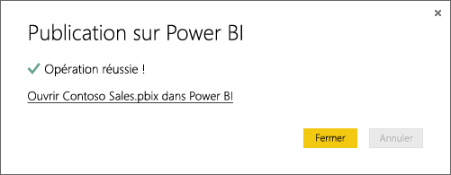

# Obtenir des données de fichiers Power BI Desktop

**Power BI Desktop** facilite la création de rapports et la prise de décisions. **Power BI Desktop** simplifie la connexion à différentes sources de données, l’interrogation et la transformation de données, la modélisation des données et la création de rapports puissants et dynamiques, ce qui rend les tâches décisionnelles plus rapides et intuitives. Si vous ne maîtrisez pas très bien **Power BI Desktop**, nous vous recommandons de consulter [Prise en main de Power BI Desktop](../fundamentals/desktop-getting-started.md).

Une fois que vous avez mis des données dans **Power BI Desktop** et créé quelques rapports, récupérez votre fichier enregistré dans le **service Power BI**.

## L’emplacement d’enregistrement de votre fichier change tout
**Local** : si votre fichier est enregistré sur un disque local sur votre ordinateur ou un autre emplacement de votre organisation, vous pouvez *importer* votre fichier ou *publier* à partir de Power BI pour récupérer les données et rapports qu’il contient dans Power BI. Votre fichier est en fait conservé sur votre disque local. Il n’est donc pas entièrement déplacé vers Power BI. En réalité, un nouveau jeu de données est créé dans Power BI et les données et le modèle de données du classeur Power BI Desktop sont chargés dans ce jeu de données. Si votre fichier contient des rapports, ceux-ci apparaissent dans votre site Power BI sous Rapports.

**OneDrive Entreprise** : si vous disposez de OneDrive Entreprise et que vous vous connectez avec le même compte que pour Power BI, cette méthode est de loin la plus efficace pour que votre travail dans Power BI Desktop et vos jeux de données, rapports et tableaux de bord dans Power BI restent synchronisés. Power BI et OneDrive étant tous les deux dans le cloud, Power BI *se connecte* à votre fichier sur OneDrive toutes les heures environ. Si des modifications sont détectées, vos jeu de données, rapports et tableaux de bord sont automatiquement mis à jour dans Power BI.

**OneDrive personnel** : si vous enregistrez vos fichiers sur votre compte OneDrive personnel, vous bénéficiez de la plupart des avantages obtenus avec OneDrive Entreprise. La différence principale réside dans le fait que, la première fois que vous vous connectez à votre fichier (via Obtenir des données > Fichiers > OneDrive personnel), vous devez vous connecter à votre compte OneDrive avec votre compte Microsoft, qui est généralement différent de celui utilisé pour vous connecter à Power BI. Lorsque vous vous connectez à OneDrive avec votre compte Microsoft, veillez à sélectionner l’option Maintenir la connexion. Power BI peut ainsi se connecter à votre fichier toutes les heures environ et s’assurer que votre jeu de données dans Power BI est synchronisé.

**Sites d’équipe SharePoint** : l’enregistrement de vos fichiers Power BI Desktop sur des sites d’équipe SharePoint revient plus ou moins à enregistrer dans OneDrive Entreprise. La différence majeure réside dans la manière dont vous vous connectez au fichier à partir de Power BI. Vous pouvez spécifier une URL ou vous connecter au dossier racine. Vous pouvez également <a href="https://support.microsoft.com/office/sync-sharepoint-and-teams-files-with-the-onedrive-sync-app-6de9ede8-5b6e-4503-80b2-6190f3354a88">configurer un dossier de synchronisation</a> qui pointe vers le dossier SharePoint ; les fichiers y sont synchronisés avec la copie principale sur SharePoint.

## Importer un fichier Power BI Desktop ou s’y connecter à partir de Power BI
>[!IMPORTANT]
>La taille de fichier maximale que vous pouvez importer dans Power BI est de 1 gigaoctet.

1. Dans Power BI, dans le volet de navigation, cliquez sur **Obtenir des données**.
   
   
2. Dans **Fichiers**, cliquez sur **Obtenir**.
   
   
3. Recherchez votre fichier. Les fichiers Power BI Desktop portent l’extension .pbix.
   
   

## Publier un fichier à partir de Power BI Desktop sur votre site Power BI
L’utilisation de l’opération Publier dans Power BI Desktop est similaire à l’utilisation de l’opération Obtenir des données dans Power BI, en matière d’importation initiale de vos données de fichier à partir d’un lecteur local ou de connexion à ces données sur OneDrive. Toutefois, il existe des différences : si vous effectuez un téléchargement à partir d’un lecteur local, vous souhaiterez actualiser ces données fréquemment pour vous assurer que les copies en ligne et locales des données sont synchronisées. 

Nous vous présentons ici la procédure rapide, mais vous pouvez consulter [Publier à partir de Power BI Desktop](../create-reports/desktop-upload-desktop-files.md) pour en savoir plus.

1. Dans Power BI Desktop, cliquez sur **Fichier** > **Publier** > **Publier sur Power BI** ou cliquez sur **Publier** dans le ruban.
   
   
2. Connectez-vous à Power BI. Cette étape est requise uniquement lors de la première utilisation.
   
   Une fois terminé, vous obtiendrez un lien pour ouvrir votre rapport dans votre site Power BI.
   
   

## Étapes suivantes
**Explorez vos données** : une fois vos données et rapports importés dans Power BI à partir de votre fichier, il est temps de les explorer. Si votre fichier comprenait déjà des rapports, ceux-ci s’affichent dans le volet de navigation sous **Rapports**. Si votre fichier contenait uniquement des données, vous pouvez créer de nouveaux rapports. Cliquez simplement avec le bouton droit sur le nouveau jeu de données, puis sélectionnez **Explorer**.

**Actualisez les sources de données externes** : si votre fichier Power BI Desktop se connecte à des sources de données externes, vous pouvez configurer l’actualisation planifiée pour être sûr que votre jeu de données est toujours à jour. Dans la plupart des cas, la configuration de l’actualisation planifiée est relativement simple, mais nous n’en décrivons pas la procédure détaillée dans cet article. Pour en savoir plus, consultez [Actualisation des données dans Power BI](refresh-data.md).
