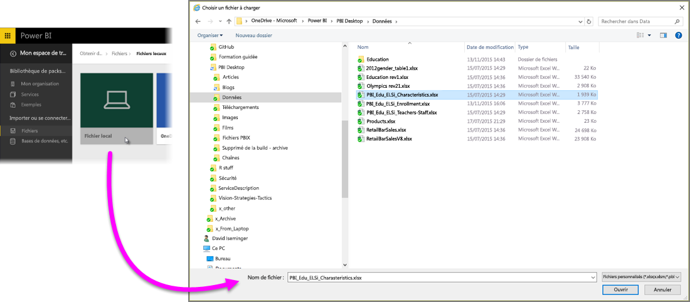
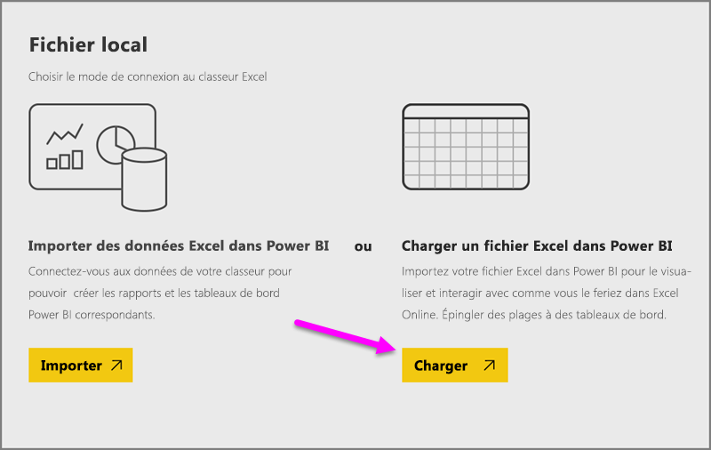
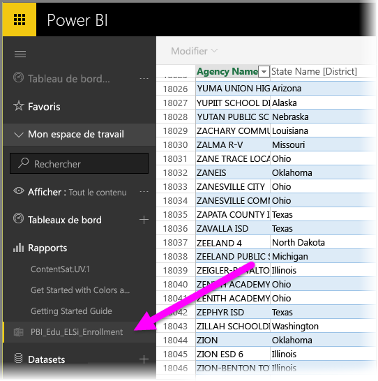

# Obtenir des données de classeurs Excel

Microsoft Excel est l’une des applications métier les plus utilisées dans le monde. C’est également l’une des méthodes les plus courantes pour importer vos données dans Power BI.

## Quels types de classeur sont pris en charge dans Power BI ?
Power BI prend en charge l’importation ou la connexion aux classeurs créés dans Excel 2007 et versions ultérieures. Les classeurs doivent être enregistrés au format de fichier .xlsx ou .xlsm et ne pas dépasser 1 Go. Certaines fonctionnalités décrites dans cet article sont disponibles uniquement dans les versions les plus récentes d’Excel.

### Classeurs contenant des plages ou des tableaux de données
Si votre classeur contient des feuilles de calcul simples avec des plages de données, veillez à mettre vos données sous forme de tableau pour en tirer le meilleur parti dans Power BI. Lors de la création de rapports dans Power BI, les colonnes et tables nommées apparaissent dans le volet Champs, ce qui facilite la visualisation de vos données.

### Classeurs avec modèles de données
Les classeurs peuvent contenir un modèle de données avec une ou deux tables de données chargées à l’aide de tables liées, de Power Query (Obtenir et transformer dans Excel 2016) ou de Power Pivot. Power BI prend en charge toutes les propriétés des modèles de données telles que les relations, les mesures, les hiérarchies et les indicateurs de performances clés.

> [!NOTE]
> Les classeurs contenant des modèles de données ne peuvent pas être partagés entre les locataires Power BI. Par exemple, un utilisateur qui se connecte à l’aide de Power BI avec un compte *contoso.com* ne peut pas partager un classeur Excel avec un utilisateur qui se connecte à l’aide d’un compte de connexion Power BI à partir de *woodgrovebank.com*.
> 
> 

### Classeurs avec des connexions à des sources de données externes
Si vous utilisez Excel pour vous connecter à une source de données externe, une fois votre classeur dans Power BI, vous pouvez créer des rapports et des tableaux de bord basés sur les données issues de cette source de données connectée. Vous pouvez également configurer l’actualisation planifiée pour automatiser la connexion à la source de données et l’obtention des mises à jour. Vous n’avez plus à actualiser les données manuellement à partir du ruban Données dans Excel. Les visualisations des rapports et vignettes des tableaux de bord basées sur les données issues de cette source de données sont automatiquement mises à jour. Pour en savoir plus, consultez [Actualisation des données dans Power BI](refresh-data.md).

### Classeurs avec des feuilles Power View, des tableaux croisés dynamiques et des graphiques
La présence, ou l’absence, de vos feuilles PowerView, tableaux croisés dynamiques et graphiques dans Power BI dépend de l’emplacement où est enregistré votre classeur et de la manière dont vous l’intégrez à Power BI. Nous allons approfondir ce sujet ci-dessous.

## Types de données
Power BI prend en charge les types de données suivants : Nombre entier, Nombre décimal, Devise, Date, True/False, Texte. Le marquage des données en tant que types de données spécifiques dans Excel améliore l’expérience de Power BI.

## Préparer votre classeur pour Power BI
Regardez cette vidéo pratique pour savoir comment vérifier que vos classeurs Excel sont prêts pour Power BI.

<iframe width="500" height="281" src="https://www.youtube.com/embed/l2wy4XgQIu0" frameborder="0" allowfullscreen></iframe>

## L’emplacement d’enregistrement de votre classeur change tout
**Local** : si votre classeur est enregistré sur un disque local sur votre ordinateur ou un autre emplacement de votre organisation, vous pouvez charger votre fichier dans Power BI. Votre fichier est en fait conservé sur votre disque local. Il n’est donc pas entièrement importé dans Power BI. En réalité, un nouveau jeu de données est créé dans Power BI, et les données et le modèle de données (le cas échéant) du classeur sont chargés dans ce jeu de données. Si votre classeur contient des feuilles Power View, celles-ci apparaissent dans votre site Power BI sous Rapports. Excel 2016 propose également la fonctionnalité **Publier** (sous le menu **Fichier**). L’utilisation de la fonctionnalité **Publier** revient à utiliser **Obtenir des données > Fichiers > Fichier local** dans Power BI, mais il est souvent plus facile de mettre à jour votre jeu de données dans Power BI si vous apportez régulièrement des modifications au classeur.

**OneDrive Entreprise** : si vous disposez de OneDrive Entreprise et que vous vous connectez avec le même compte que pour Power BI, cette méthode est de loin la plus efficace pour que votre travail dans Excel et vos jeu de données, rapports et tableaux de bord dans Power BI restent synchronisés. Power BI et OneDrive étant tous les deux dans le cloud, Power BI *se connecte* à votre classeur sur OneDrive toutes les heures environ. Si des modifications sont détectées, vos jeu de données, rapports et tableaux de bord sont automatiquement mis à jour dans Power BI. De la même manière que si vous enregistrez votre classeur sur un disque local, vous pouvez également utiliser la fonctionnalité Publier pour mettre à jour immédiatement votre jeu de données et vos rapports dans Power BI. Power BI synchronise automatiquement une heure après.

**OneDrive personnel** : si vous enregistrez vos classeurs sur votre compte OneDrive personnel, vous bénéficiez de la plupart des avantages obtenus avec OneDrive Entreprise. La différence principale réside dans le fait que, la première fois que vous vous connectez à votre fichier (via Obtenir des données > Fichiers > OneDrive personnel), vous devez vous connecter à votre compte OneDrive avec votre compte Microsoft, qui est généralement différent de celui utilisé pour vous connecter à Power BI. Lorsque vous vous connectez à OneDrive avec votre compte Microsoft, veillez à sélectionner l’option Maintenir la connexion. Power BI peut ainsi se connecter à votre classeur toutes les heures environ et s’assurer que votre jeu de données et vos rapports dans Power BI sont synchronisés.

**Sites d’équipe SharePoint** : l’enregistrement de vos fichiers Power BI Desktop sur des sites d’équipe SharePoint revient plus ou moins à enregistrer dans OneDrive Entreprise. La différence majeure réside dans la manière dont vous vous connectez au fichier à partir de Power BI. Vous pouvez spécifier une URL ou vous connecter au dossier racine.

## Un classeur Excel, deux manières de l’utiliser
Si vous enregistrez vos classeurs dans **OneDrive**, vous pouvez explorer vos données dans Power BI de plusieurs manières.

### Importer des données Excel dans Power BI
Lorsque vous sélectionnez **Importer**, toutes les données prises en charge des tables et/ou modèles de données sont importées dans un nouveau jeu de données dans Power BI. Si vous avez des feuilles Power View, celles-ci sont recréées dans Power BI sous forme de rapports.

Vous pouvez continuer à modifier votre classeur. Lorsque vos modifications sont enregistrées, elles sont synchronisées avec le jeu de données dans Power BI, généralement une heure plus tard environ. Pour un résultat immédiat, vous pouvez simplement cliquer de nouveau sur Publier afin d’exporter aussitôt vos modifications. Les visualisations présentes dans vos rapports et tableaux de bord sont également mises à jour.

Choisissez cette option si vous avez utilisé la fonctionnalité Obtenir et transformer ou Power Pivot pour charger vos données dans un modèle de données, ou si votre classeur contient des feuilles Power View avec des visualisations que vous voulez afficher dans Power BI.

Dans Excel 2016, vous pouvez également utiliser Publier > Exporter. Cela revient sensiblement au même. Pour plus d’informations, consultez [Publier dans Power BI à partir d’Excel 2016](service-publish-from-excel.md).

### Se connecter, gérer et afficher Excel dans Power BI
Lorsque vous choisissez **Connecter**, votre classeur apparaît dans Power BI comme il le ferait dans Excel Online. Mais contrairement à Excel Online, Power BI offre des fonctionnalités utiles pour épingler des éléments directement de vos classeurs sur vos tableaux de bord.

Vous ne pouvez pas modifier votre classeur dans Power BI. Toutefois, si vous devez apporter des modifications, vous pouvez cliquer sur Modifier, puis choisir de modifier votre classeur dans Excel Online ou l’ouvrir dans Excel sur votre ordinateur. Toutes les modifications apportées sont enregistrées dans le classeur sur OneDrive.

Choisissez cette option si vous avez uniquement des données dans des feuilles de calcul, ou si vous avez des plages, des tableaux croisés dynamiques et des graphiques que vous voulez épingler aux tableaux de bord.

Dans Excel 2016, vous pouvez également utiliser Publier > Télécharger. Cela revient sensiblement au même. Pour plus d’informations, consultez [Publier dans Power BI à partir d’Excel 2016](service-publish-from-excel.md).

## Importer ou se connecter à un classeur Excel à partir de Power BI
1. Dans Power BI, dans le volet de navigation, cliquez sur **Obtenir des données**.
   
   
2. Dans Fichiers, cliquez sur **Obtenir**.
   
   
3. Recherchez votre fichier.
   
   
4. Si votre classeur se trouve sur OneDrive ou sur un site d’équipe SharePoint, sélectionnez **Importer** ou **Connecter**.

## Classeurs Excel locaux
Vous pouvez également utiliser un fichier Excel local et le charger dans Power BI. Sélectionnez simplement **Fichier local** dans le menu précédent, puis accédez à l’endroit où vos classeurs Excel sont enregistrés.

Une fois l’option sélectionnée, choisissez de Charger votre fichier dans Power BI.

Une fois votre classeur téléchargé, vous recevez une notification vous indiquant que le classeur est prêt.

Une fois le classeur prêt, vous pouvez le trouver dans la section **Rapports** de Power BI.

## Publier à partir d’Excel 2016 sur votre site Power BI
L’utilisation de la fonctionnalité **Publier sur Power BI** dans Excel 2016 revient à utiliser **Obtenir des données** dans Power BI pour importer votre fichier ou vous y connecter. Nous n’entrerons pas dans les détails ici, mais vous pouvez consulter l’article [Publier sur Power BI à partir d’Excel 2016](service-publish-from-excel.md) pour en savoir plus.

## Résolution des problèmes
Votre classeur est trop volumineux ? Consultez [Réduire la taille d’un classeur Excel pour l’afficher dans Power BI](reduce-the-size-of-an-excel-workbook.md).

Actuellement, quand vous sélectionnez Importer, Power BI importe uniquement les données qui font partie d’une table nommée ou d’un modèle de données. Par conséquent, si le classeur ne contient ni table nommée, ni feuille Power View, ni modèle de données Excel, cette erreur risque de se produire : **« Impossible de trouver des données dans ce classeur Excel »** . [Cet article](service-admin-troubleshoot-excel-workbook-data.md) explique comment corriger votre classeur et l’importer à nouveau.

## Étapes suivantes
**Explorez vos données** : une fois vos données et rapports importés dans Power BI à partir de votre fichier, il est temps de les explorer. Cliquez simplement avec le bouton droit sur le nouveau jeu de données, puis cliquez sur Explorer. Si vous avez choisi de vous connecter à un classeur sur OneDrive à l’étape 4, votre classeur apparaît dans Rapports. Lorsque vous cliquez dessus, il s’ouvre dans Power BI, comme il le ferait dans Excel Online.

**Planifiez l’actualisation** : si votre classeur Excel se connecte à des sources de données externes, ou si vous avez importé à partir d’un disque local, vous pouvez configurer l’actualisation planifiée pour vérifier que votre jeu de données ou rapport est toujours à jour. Dans la plupart des cas, la configuration de l’actualisation planifiée est relativement simple, mais nous n’en décrivons pas la procédure détaillée dans cet article. Pour en savoir plus, consultez [Actualisation des données dans Power BI](refresh-data.md).

[Publier sur Power BI à partir d’Excel 2016](service-publish-from-excel.md)

[Actualisation des données dans Power BI](refresh-data.md)
