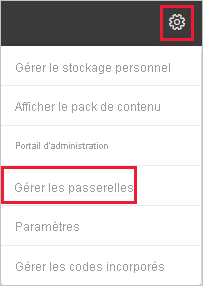
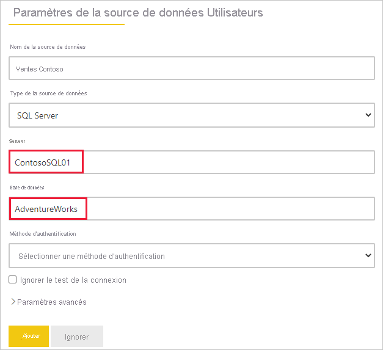
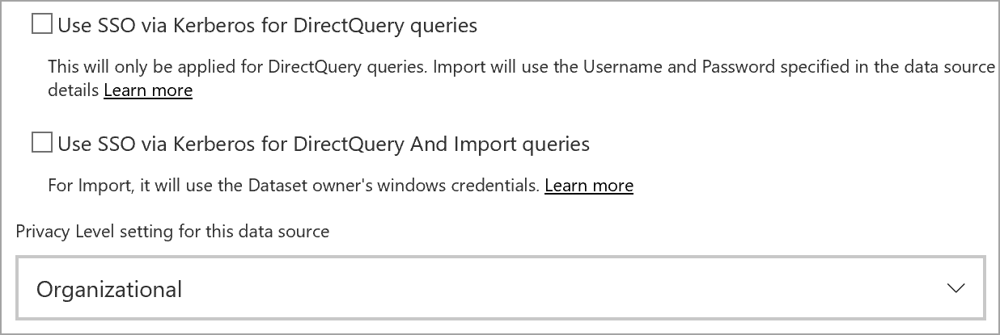
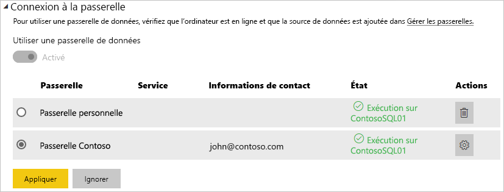

# Ajouter ou supprimer une source de données de type passerelle

[!INCLUDE [gateway-rewrite](../includes/gateway-rewrite.md)]

Power BI prend en charge de nombreuses [sources de données locales](power-bi-data-sources.md), chacune ayant ses propres exigences. Une passerelle peut être utilisée pour une seule ou plusieurs sources de données. Pour cet exemple, nous vous montrons comment ajouter SQL Server en tant que source de données. Les étapes sont similaires pour d’autres sources de données.

La plupart des opérations de gestion des sources de données peuvent également être effectuées avec des API. Pour plus d’informations, voir [API REST (passerelles)](/rest/api/power-bi/gateways).

Si aucune passerelle n’est encore installée, commencez par consulter [Installer une passerelle de données locale](/data-integration/gateway/service-gateway-install).

## Ajouter une source de données

1. Dans l’en-tête de page du service Power BI, sélectionnez **Paramètres** > **Gérer les passerelles**.

    

2. Choisissez une passerelle, puis sélectionnez **Ajouter une source de données**. Vous pouvez sélectionner le texte d’en-tête **AJOUTER UNE SOURCE DE DONNÉES** ou placer votre curseur à proximité de l’entrée de la passerelle pour afficher le menu Plus d’options.

    

3. Attribuez un nom à votre source de données, puis sélectionnez le **Type de source de données**. Dans cet exemple, nous choisirons SQL Server.

    

4. Entrez les informations sur la source de données. Pour SQL Server, indiquez le **Serveur** et la **Base de données**.

    

5. Sélectionnez la **Méthode d’authentification** à utiliser lors de la connexion à la source de données. Pour SQL Server, choisissez **Windows** ou **De base** (authentification SQL). Entrez les informations d’identification pour votre source de données.

   :::image type="content" source="media/service-gateway-data-sources/basic-auth.png" alt-text="Paramètres d’authentification de base.":::

    > [!NOTE]
    > Si la méthode d’authentification sélectionnée est OAuth, toute requête qui s’exécute plus longtemps que la durée définie dans la stratégie d’expiration du jeton OAuth peut échouer.

6. Sous **Paramètres avancés**, vous pouvez configurer l’[Authentification unique (SSO)](service-gateway-sso-overview.md) pour votre source de données. 

    

    Vous pouvez configurer **Utiliser SSO via Kerberos pour les requêtes DirectQuery** ou **Utiliser SSO via Kerberos pour les requêtes DirectQuery et d’importation** pour les rapports basés sur DirectQuery et **Utiliser SSO via Kerberos pour les requêtes DirectQuery et d’importation** pour les rapports basés sur l’actualisation.

    Si vous utilisez **Utiliser SSO via Kerberos pour les requêtes DirectQuery** et que vous utilisez cette source de données pour un rapport basé sur DirectQuery, elle utilise les informations d’identification de l’utilisateur qui se connecte au service Power BI. Pour un rapport basé sur l’actualisation, elle utilise les informations d’identification que vous entrez dans les champs **Nom d’utilisateur** et **Mot de passe**.

    Quand vous utilisez **Utiliser SSO via Kerberos pour les requêtes DirectQuery et d’importation**, vous n’avez pas besoin de fournir d’informations d’identification. Si cette source de données est utilisée pour un rapport basé sur DirectQuery, elle utilise l’utilisateur mappé à l’utilisateur (Azure) Active Directory qui se connecte au service Power BI.  Pour un rapport basé sur l’actualisation, elle utilise le contexte de sécurité du propriétaire du jeu de données.

    > [!NOTE]
    >L’authentification unique pour les requêtes d’importation est disponible uniquement pour la liste des sources de données SSO utilisant la [délégation Kerberos contrainte](service-gateway-sso-kerberos.md).

7. Sous **Paramètres avancés**, vous pouvez si vous le souhaitez configurer le [niveau de confidentialité](https://support.office.com/article/Privacy-levels-Power-Query-CC3EDE4D-359E-4B28-BC72-9BEE7900B540) de votre source de données (ne s’applique pas à [DirectQuery](desktop-directquery-about.md)).

    :::image type="content" source="media/service-gateway-data-sources/privacy-level.png" alt-text="Sélections de niveaux de confidentialité.":::

8. Sélectionnez **Ajouter**. Le message *Connexion établie* apparaît si l’opération réussit.

    

Vous pouvez maintenant utiliser cette source de données pour inclure des données provenant de SQL Server dans vos tableaux de bord Power BI et vos rapports.

## Supprimez une source de données.

Vous pouvez supprimer une source de données si vous ne l’utilisez plus. La suppression d’une source de données entraîne l’arrêt des éventuels tableaux de bord ou rapports qui reposent sur celle-ci.

Pour supprimer une source de données, accédez à celle-ci, puis sélectionnez **Supprimer** dans le menu Plus d’options. Le menu Plus d’options s’affiche quand vous placez votre curseur près du nom de la source de données.

## Utiliser la source de données pour une actualisation planifiée ou DirectQuery

Une fois la source de données créée, elle peut être utilisée avec des connexions DirectQuery ou via une actualisation planifiée. Vous pouvez en apprendre davantage sur la configuration d’une actualisation planifiée dans [Configurer une actualisation planifiée](refresh-scheduled-refresh.md).

> [!NOTE]
>Le nom du serveur et celui de la base de données doivent correspondre entre Power BI Desktop et la source de données ajoutée à la passerelle de données locale.

Le lien entre votre jeu de données et la source de données dans la passerelle est basé sur le nom de votre serveur et sur le nom de votre base de données. Ces noms doivent correspondre. Par exemple, si vous fournissez une adresse IP pour le nom du serveur, dans Power BI Desktop, vous devez utiliser l’adresse IP pour la source de données dans la configuration de la passerelle. Si vous utilisez *SERVEUR\INSTANCE*, dans Power BI Desktop, vous devez utiliser la même valeur dans la source de données configurée pour la passerelle.

Si vous êtes répertorié sous l’onglet **Utilisateurs** de la source de données configurée dans la passerelle, et que le nom du serveur et celui de la base de données correspondent, la passerelle s’affiche comme option à utiliser avec l’actualisation planifiée.

> [!WARNING]
> Si votre jeu de données contient plusieurs sources de données, chaque source de données doit être ajoutée dans la passerelle. Si une ou plusieurs sources de données ne sont pas ajoutées à la passerelle, celle-ci n’apparaît pas comme disponible pour l’actualisation planifiée.

### Limites

OAuth est un schéma d’authentification pris en charge seulement pour les connecteurs personnalisés avec la passerelle de données locale. Vous ne pouvez pas ajouter d’autres sources de données qui nécessitent OAuth. Si votre jeu de données a une source de données qui nécessite OAuth et que celle-ci n’est pas un connecteur personnalisé, vous ne pouvez pas utiliser la passerelle pour une actualisation planifiée.

## Gérer les utilisateurs

Après avoir ajouté une source de données à une passerelle, vous donnez aux utilisateurs et aux groupes de sécurité activés par e-mail l’accès à la source de données spécifique (et non à l’ensemble de la passerelle). La liste d’accès de la source de données contrôle uniquement les personnes autorisées à publier des rapports incluant des données de la source de données. Les propriétaires des rapports peuvent créer des tableaux de bord, des packs de contenu et des apps, puis partager ces éléments avec d’autres utilisateurs.

Vous pouvez également donner aux utilisateurs et groupes de sécurité un accès administratif à la passerelle.

> [!NOTE]
> Les utilisateurs ayant accès à la source de données peuvent associer des jeux de données à la source de données et s’y connecter, en fonction des options de sécurité qui ont été sélectionnées lors de la création de la source de données (informations d’identification stockées ou authentification unique).

### Ajouter des utilisateurs à une source de données

1. Dans l’en-tête de page du service Power BI, sélectionnez **Paramètres** > **Gérer les passerelles**.

2. Sélectionnez la source de données à laquelle vous souhaitez ajouter des utilisateurs.

3. Sélectionnez **Utilisateurs**, puis entrez les utilisateurs et les groupes de sécurité à extension messagerie de votre organisation qui sont appelés à accéder à la source de données sélectionnée. Sélectionnez **Ajouter** pour que le nom du membre ajouté soit ajouté à la liste des personnes autorisées à publier des rapports utilisant cette source de données.

    

Rappelez-vous que vous devez ajouter des utilisateurs à chaque source de données à laquelle vous souhaitez accorder l’accès. Chaque source de données possède une liste distincte d’utilisateurs. Ajoutez des utilisateurs à chaque source de données séparément.

### Supprimer des utilisateurs d’une source de données

Sous l’onglet **Utilisateurs** de la source de données, vous pouvez supprimer des utilisateurs et des groupes de données qui peuvent utiliser cette source de données.

## Stocker des informations d’identification chiffrées dans le cloud

Lorsque vous ajoutez une source de données à la passerelle, vous devez fournir les informations d’identification associées. Toutes les requêtes à la source de données sont exécutées à l’aide de ces informations d’identification. Les informations d’identification sont chiffrées en toute sécurité. Elle utilisent un chiffrement symétrique afin qu’il ne soit pas possible de les déchiffrer dans le cloud avant de les y stocker. Les informations d’identification sont envoyées à la machine exécutant la passerelle en local, où elles sont déchiffrées lors de l’accès aux sources de données.

## Liste des types de sources de données disponibles

Pour plus d’informations sur les sources de données prises en charge par la passerelle de données locale, consultez [Sources de données Power BI](power-bi-data-sources.md).

## Étapes suivantes

* [Gérer votre source de données - Analysis Services](service-gateway-enterprise-manage-ssas.md)
* [Gérer votre source de données - SAP HANA](service-gateway-enterprise-manage-sap.md)
* [Gérer votre source de données - SQL Server](service-gateway-enterprise-manage-sql.md)
* [Gérer votre source de données - Oracle](service-gateway-onprem-manage-oracle.md)
* [Gérer votre source de données – Importation/actualisation planifiée](service-gateway-enterprise-manage-scheduled-refresh.md)
* [Conseils de déploiement d’une passerelle de données](service-gateway-deployment-guidance.md)

D’autres questions ? Essayez la [communauté Power BI](https://community.powerbi.com/).
