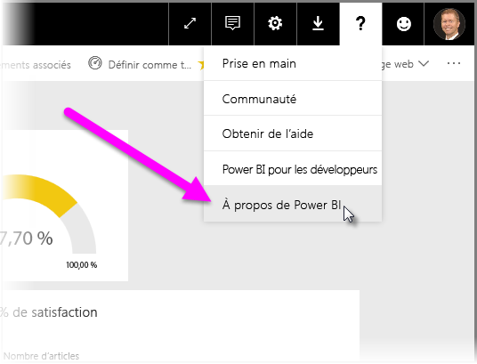

# Conseils relatifs au déploiement d’une passerelle de données pour Power BI

[!INCLUDE [gateway-rewrite](../includes/gateway-rewrite.md)]

Cet article fournit des conseils et indications sur le déploiement d’une passerelle de données pour Power BI dans votre environnement réseau.

Pour plus d’informations sur le téléchargement, l’installation, la configuration et la gestion de la passerelle de données locale, voir [Qu’est-ce qu’une passerelle de données locale ?](/data-integration/gateway/service-gateway-onprem). Vous pouvez également en savoir plus sur la passerelle de données locale et Power BI en consultant le [blog Microsoft Power BI](https://powerbi.microsoft.com/blog/) et le site de la [Communauté Microsoft Power BI](https://community.powerbi.com/).

## Éléments à prendre en compte lors de l’installation de la passerelle de données locale

Avant d’installer la passerelle de données locale pour votre service cloud Power BI, vous devez garder à l’esprit certaines considérations. qui sont décrites dans les sections suivantes.

### Nombre d’utilisateurs

Le nombre d’utilisateurs qui utilisent un rapport par le biais de la passerelle est un critère important pour déterminer où installer la passerelle. Posez-vous les questions suivantes :

* Les utilisateurs utilisent-ils ces rapports à différents moments de la journée ?
* Quels types de connexions utilisent-ils (DirectQuery ou Importer) ?
* Tous les utilisateurs utilisent-ils le même rapport ?

Si tous les utilisateurs accèdent à un rapport donné au même moment chaque jour, veillez à installer la passerelle sur un ordinateur capable de gérer toutes ces requêtes. Consultez les sections suivantes pour découvrir les compteurs de performances et la configuration minimale requise qui peuvent vous aider à déterminer si un ordinateur est adéquat.

Dans Power bi, une contrainte n’autorise qu’*une seule* passerelle par *rapport*. Même si un rapport est basé sur plusieurs sources de données, toutes celles-ci doivent traverser une seule passerelle. Si un tableau de bord est basé sur *plusieurs* rapports, vous pouvez utiliser une passerelle dédiée pour chacun d’eux. De cette façon, vous répartissez la charge de la passerelle entre les nombreux rapports qui contribuent au tableau de bord unique.

### Type de connexion

Power BI propose deux types de connexions : DirectQuery et Importer. Certaines sources de données ne prennent pas en charge les deux types de connexions. De nombreux facteurs peuvent contribuer à votre choix de l’une plutôt que l’autre : exigences de sécurité, performances, limites de données et tailles des modèles de données. Pour en savoir plus sur les type de connexions et sur les sources de données prises en charge, voir [Liste des types de sources de données disponibles](service-gateway-data-sources.md#list-of-available-data-source-types).

Selon le type de connexion, l’utilisation de la passerelle peut être différente. Par exemple, essayez de séparer les sources de données DirectQuery des sources de données d’actualisation planifiée chaque fois que c’est possible. L’hypothèse est qu’elles figurent dans des rapports différents et peuvent être séparées. La séparation des sources permet d’éviter la mise en file d’attente de milliers de requêtes DirectQuery dans la passerelle au moment de l’actualisation matinale planifiée d’un modèle de données volumineux utilisé pour le tableau de bord principal de l’entreprise. 

Voici les éléments à prendre en compte pour chaque option :

* **Actualisation planifiée** : selon la taille de votre requête et le nombre d’actualisations quotidiennes, vous pouvez vous en tenir à la configuration matérielle minimale recommandée ou procéder à une mise à niveau vers une machine plus performante. Si une requête donnée n’est pas pliée, les transformations se produisent sur la machine de passerelle. Par conséquent, la machine de passerelle dispose d’une RAM plus importante.

* **DirectQuery** : une requête est envoyée chaque fois qu’un utilisateur ouvre le rapport ou consulte les données. Si vous prévoyez que plus de 1 000 utilisateurs accéderont simultanément aux données, veillez à ce que les composants matériels de votre ordinateur soient robustes et fiables. Dans le cadre d’une connexion DirectQuery, un nombre accru de cœurs de processeur offre un meilleur débit.

Pour connaître la configuration requise pour l’installation de la machine, voir la [configuration requise pour l’installation](/data-integration/gateway/service-gateway-install#requirements) de la passerelle de données locale.

### Emplacement

L’emplacement d’installation de la passerelle peut avoir un impact significatif sur les performances de vos requêtes. Assurez-vous que votre passerelle, les emplacements des sources de données et le locataire Power BI sont aussi proches que possible pour minimiser la latence du réseau. Pour déterminer l’emplacement de votre locataire Power BI, dans le service Power BI, sélectionnez l’icône **?** dans le coin supérieur droit. Sélectionnez ensuite **À propos de Power BI**.

Si vous envisagez d’utiliser la passerelle Power BI avec Azure Analysis Services, vérifiez que les régions de données sont identiques. Pour plus d’informations sur la définition des régions de données pour plusieurs services, voir [cette vidéo](https://guyinacube.com/2018/01/power-bi-azure-analysis-services-gateway-data-region/).

## Étapes suivantes

* [Configuration des paramètres de proxy](/data-integration/gateway/service-gateway-proxy)  
* [Résoudre les problèmes liés aux passerelles - Power BI](service-gateway-onprem-tshoot.md)  
* [Questions fréquentes (FAQ) sur la passerelle de données locale - Power BI](service-gateway-power-bi-faq.md)  

D’autres questions ? Essayez la [communauté Power BI](https://community.powerbi.com/).
