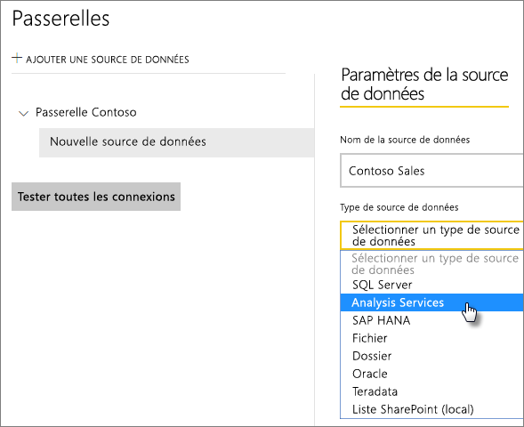
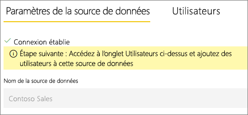
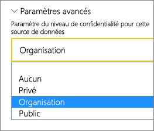
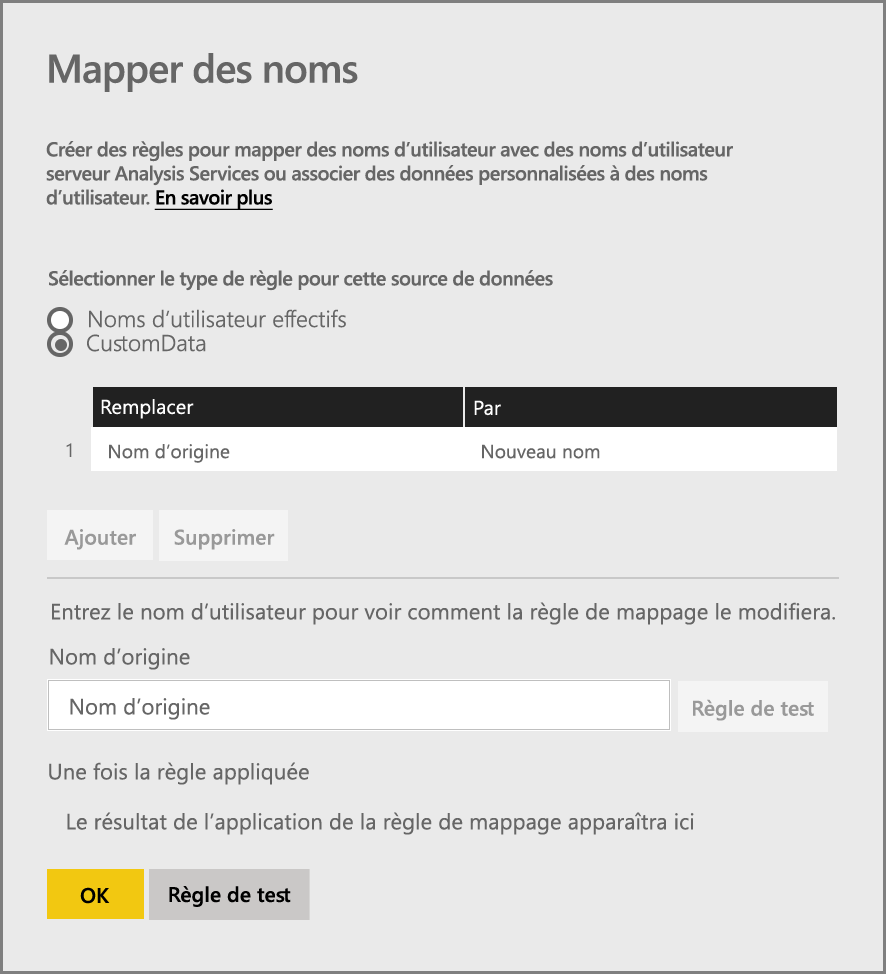
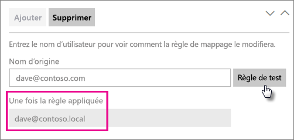
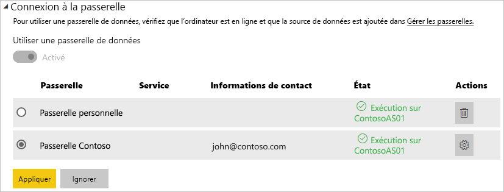

# <a name="manage-your-data-source---analysis-services"></a>Gérer votre source de données - Analysis Services

[!INCLUDE [gateway-rewrite](../includes/gateway-rewrite.md)]

Une fois que vous avez [installé la passerelle de données locale](/data-integration/gateway/service-gateway-install), vous devez [ajouter des sources de données](service-gateway-data-sources.md#add-a-data-source) qui peuvent être utilisées avec la passerelle. Cet article examine comment travailler avec des passerelles et des sources de données SQL Server Analysis Services (SSAS) utilisées pour l’actualisation planifiée ou pour des connexions actives.

Pour plus d’informations sur la configuration d’une connexion active à Analysis Services, [regardez cette vidéo](https://www.youtube.com/watch?v=GPf0YS-Xbyo&feature=youtu.be).

> [!NOTE]
> Si vous avez une source de données Analysis Services, vous devez installer la passerelle sur un ordinateur associé à la même forêt ou au même domaine que votre serveur Analysis Services.

## <a name="add-a-data-source"></a>Ajouter une source de données

Pour plus d’informations sur l’ajout d’une source de données, consultez [Ajouter une source de données](service-gateway-data-sources.md#add-a-data-source). Sélectionnez **Analysis Services** comme **Type de source de données** si vous vous connectez à un serveur multidimensionnel ou tabulaire.



Renseignez les informations relatives à la source de données, notamment le **Serveur** et la **Base de données**. La passerelle utilise les informations que vous entrez dans **Nom d’utilisateur** et **Mot de passe** pour se connecter à l’instance Analysis Services.

> [!NOTE]
> Le compte Windows que vous entrez doit être membre du rôle Administrateur de serveur sur l’instance Analysis Services à laquelle vous vous connectez. Si le mot de passe de ce compte s’accompagne d’une date d’expiration, une erreur de connexion peut survenir si le mot de passe n’a pas été mis à jour pour la source des données. Pour plus d’informations sur la façon dont les informations d’identification sont stockées, voir [Stocker des informations d’identification chiffrées dans le cloud](service-gateway-data-sources.md#store-encrypted-credentials-in-the-cloud).


Une fois que vous avez renseigné toutes les valeurs,sélectionnez **Ajouter**. Vous pouvez à présent utiliser cette source de données pour l’actualisation planifiée ou des connexions actives sur une instance Analysis Services locale. L’indication *Connexion réussie* apparaît une fois la connexion établie.



### <a name="advanced-settings"></a>Paramètres avancés

Vous pouvez aussi configurer le niveau de confidentialité de votre source de données. Ce paramètre contrôle la façon dont les données peuvent être combinées. Il concerne uniquement l’actualisation planifiée. Le paramètre de niveau de confidentialité ne s’applique pas aux connexions actives. Pour plus d’informations sur les niveaux de confidentialité de votre source de données, consultez [Niveaux de confidentialité (Power Query)](https://support.office.com/article/Privacy-levels-Power-Query-CC3EDE4D-359E-4B28-BC72-9BEE7900B540).



## <a name="user-names-with-analysis-services"></a>Noms d’utilisateur avec Analysis Services

<iframe width="560" height="315" src="https://www.youtube.com/embed/Qb5EEjkHoLg" frameborder="0" allowfullscreen></iframe>

Chaque fois qu’un utilisateur interagit avec un rapport connecté à Analysis Services, le nom de l’utilisateur effectif est transmis à la passerelle, puis à votre serveur Analysis Services local. L’adresse e-mail que vous utilisez pour vous connecter à Power BI est transmise à Analysis Services pour identifier l’utilisateur effectif. Elle est transmise dans la propriété de connexion [EffectiveUserName](/analysis-services/instances/connection-string-properties-analysis-services#bkmk_auth). 

Cette adresse e-mail doit correspondre à un nom d’utilisateur principal défini dans le domaine Active Directory local. L’UPN est une propriété de compte Active Directory. Ce compte Windows doit figurer dans un rôle d’Analysis Services. S’il n’existe pas correspondance dans Active Directory, la connexion échoue. Pour plus d’informations sur Active Directory et le nommage des utilisateurs, voir [Attributs du nommage des utilisateurs](/windows/win32/ad/naming-properties).

Vous pouvez aussi [mapper votre nom de connexion Power BI à un UPN d’un annuaire local](service-gateway-enterprise-manage-ssas.md#map-user-names-for-analysis-services-data-sources).

## <a name="map-user-names-for-analysis-services-data-sources"></a>Mapper des noms d’utilisateurs pour les sources de données Analysis Services

<iframe width="560" height="315" src="https://www.youtube.com/embed/eATPS-c7YRU" frameborder="0" allowfullscreen></iframe>

Power BI autorise le mappage des noms d’utilisateurs pour les sources de données Analysis Services. Vous pouvez configurer des règles pour mapper un nom d’utilisateur connecté avec Power BI au nom qui a été transmis comme valeur pour EffectiveUserName sur la connexion Analysis Services. La fonctionnalité de mappage des noms d’utilisateurs est un excellent moyen de contournement quand votre nom d’utilisateur Azure Active Directory (Azure AD) ne correspond pas à un nom d’utilisateur principal (UPN) dans votre instance Active Directory locale. Par exemple, si votre adresse e-mail est nancy@contoso.onmicrsoft.com, vous la mappez à nancy@contoso.com et cette valeur est transmise à la passerelle.

Vous pouvez mapper les noms d’utilisateur Analysis Services de deux manières :

* Remappage manuel des utilisateurs
* Recherche de propriétés Active Directory locale pour remapper des UPN (nom d’utilisateur principal) AAD avec des utilisateurs Active Directory (mappage de recherche Active Directory)

S’il est possible d’effectuer un mappage manuel avec la deuxième approche, cette opération est fastidieuse et difficile à gérer. Elle est particulièrement difficile lorsque des critères spéciaux ne suffisent pas. C’est par exemple le cas lorsque les noms de domaine sont différents entre Azure AD et l’Active Directory local, ou lorsque les noms de compte d’utilisateur sont différents entre Azure AD et Active Directory. C’est pourquoi un mappage manuel avec la deuxième approche n’est pas recommandé.

Nous décrivons ces deux approches dans l’ordre, dans les deux sections suivantes.

### <a name="manual-user-name-remapping"></a>Remappage manuel des noms d’utilisateur

Pour les sources de données Analysis Services, vous pouvez configurer des règles de nom d’utilisateur principal (UPN) personnalisées. Des règles personnalisées sont utiles si vos noms de connexion au service Power BI ne correspondent pas à votre UPN dans l’annuaire local. Par exemple, si vous vous connectez à Power BI avec john@contoso.com, mais que votre UPN dans l’annuaire local est john@contoso.local, vous pouvez configurer une règle de mappage pour que john@contoso.local soit transmis à Analysis Services.

Pour accéder à l’écran de mappage d’UPN, procédez comme suit.

1. Accédez à l’icône d’engrenage, puis sélectionnez **Gérer les passerelles**.
2. Développez la passerelle qui contient la source de données Analysis Services. Ou, si vous n’avez pas créé la source de données Analysis Services, vous pouvez aussi le faire à ce stade.
3. Sélectionnez la source de données, puis l’onglet **Utilisateurs**.
4. Sélectionnez **Mapper les noms d’utilisateur**.

    

Vous voyez des options permettant d’ajouter des règles et un test pour un utilisateur donné.

> [!NOTE]
> Vous risquez de modifier un utilisateur par inadvertance. Par exemple, si la valeur du champ **Remplacer (valeur d’origine)** est contoso.com et la valeur du champ **Par (nouveau nom)** est @contoso.local, tous les utilisateurs dont l’ID de connexion contient @contoso.com sont remplacés par @contoso.local. De même, si la valeur du champ **Remplacer (valeur d’origine)** est dave@contoso.com et la valeur du champ **Par (nouveau nom)** est dave@contoso.local, un utilisateur dont l’ID de connexion est v-dave@contoso.com et envoyé comme v-dave@contoso.local.

### <a name="active-directory-lookup-mapping"></a>Mappage de recherche Active Directory

Pour effectuer la recherche de propriétés Active Directory en local afin de remapper les UPN Azure AD à des utilisateurs Active Directory, suivez les étapes décrites dans cette section. Pour commencer, voyons comment cela fonctionne.

Dans le service Power BI, voici ce qui se passe :

* Pour chaque requête effectuée par un utilisateur Azure AD Power BI à un serveur SSAS local, une chaîne d’UPN est transmise, par exemple, firstName.lastName@contoso.com.

> [!NOTE]
> Les mappages manuels d’utilisateurs UPN définis dans la configuration de la source de données Power BI sont toujours appliqués *avant* l’envoi de la chaîne de nom d’utilisateur à la passerelle de données locale.

Dans la passerelle de données locale avec le mappage d’utilisateur personnalisé configurable, procédez comme suit.

1. Trouvez l’Active Directory dans lequel rechercher. Vous pouvez utiliser l’option automatique ou configurable.
2. Recherchez l’attribut de la personne Active Directory, par exemple E-mail, dans le service Power BI. L’attribut est basé sur une chaîne UPN entrante, telle que firstName.lastName@contoso.com.
3. Si la recherche dans Active Directory échoue, elle tente d’utiliser l’UPN transmis en tant que valeur d’EffectiveUser à SSAS.
4. Si la recherche dans Active Directory réussit, elle récupère la valeur UserPrincipalName de cette personne Active Directory.
5. Elle passe l’e-mail de UserPrincipalName en tant que valeur d’EffectiveUser à SSAS, par exemple, Alias@corp.on-prem.contoso.

Pour configurer votre passerelle afin qu’elle effectue la recherche dans Active Directory :

1. [Téléchargez et installez la passerelle la plus récente](/data-integration/gateway/service-gateway-install).

2. Dans la passerelle, modifiez le service de passerelle de données locale pour qu’il s’exécute avec un compte de domaine au lieu d’un compte de service local. Dans le cas contraire, la recherche dans Active Directory ne fonctionnera pas correctement au moment de l’exécution. Accédez à l’[application de passerelle de données locale](/data-integration/gateway/service-gateway-app) sur votre machine, puis accédez à **Paramètres du service** > **Modifier le compte de service**. Vérifiez que vous disposez de la clé de récupération pour cette passerelle, car vous devrez la restaurer sur le même ordinateur, sauf si vous souhaitez créer une passerelle à la place. Redémarrez le service de passerelle pour que les modifications entrent en vigueur.

3. Accédez au dossier d’installation de la passerelle *C:\Program Files\Passerelle de données locale* en tant qu’administrateur pour vérifier que vous disposez d’autorisations d’écriture. Ouvrez le fichier *Microsoft.PowerBI.DataMovement.Pipeline.GatewayCore.dll.config*.

4. Modifiez les deux valeurs de configuration suivantes en fonction de *vos* configurations d’attributs Active Directory pour vos utilisateurs Active Directory. Les valeurs de configuration suivantes sont des exemples. Spécifiez les valeurs en fonction de votre configuration d’Active Directory. Ces configurations sont sensibles à la casse : veillez donc à ce qu’elles correspondent aux valeurs spécifiées dans Active Directory.

    

    Si aucune valeur n’est fournie pour la configuration ADServerPath, la passerelle utilise le catalogue global par défaut. Vous pouvez également spécifier plusieurs valeurs pour ADServerPath. Chaque valeur doit être séparée par un point-virgule, comme dans l’exemple suivant :

    ```xml
    <setting name="ADServerPath" serializeAs="String">
        <value> >GC://serverpath1; GC://serverpath2;GC://serverpath3</value>
    </setting>
    ```

    La passerelle analyse les valeurs spécifiées pour ADServerPath de gauche à droite jusqu'à ce qu’elle trouve une correspondance. Si aucune correspondance n’est trouvée, l’UPN d’origine est utilisé. Assurez-vous que le compte exécutant le service de passerelle (PBIEgwService) dispose des autorisations de requête pour tous les serveurs Active Directory que vous spécifiez dans ADServerPath.

    La passerelle prend en charge deux types de chemin ADServerPath, comme dans les exemples suivants :

    **WinNT**

    ```xml
    <value="WinNT://usa.domain.corp.contoso.com,computer"/>
    ```

    **GC**

    ```xml
    <value> GC://USA.domain.com </value>
    ```

5. Redémarrez le service Passerelle de données locale pour que les modifications de configuration entrent en vigueur.

### <a name="work-with-mapping-rules"></a>Utiliser des règles de mappage

Pour créer une règle de mappage, entrez une valeur pour **Nom d’origine** et pour **Nouveau nom**, puis sélectionnez **Ajouter**.

| Champ | Description |
| --- | --- |
| Remplacer (nom d’origine) |Adresse de messagerie que vous avez utilisée pour vous connecter à Power BI. |
| Par (nouveau nom) |Valeur par laquelle vous voulez la remplacer. Le résultat du remplacement est ce qui sera passé à la propriété EffectiveUserName pour la connexion Analysis Services. |


Quand vous sélectionnez un élément dans la liste, vous pouvez choisir de modifier sa position à l’aide des icônes de chevron. Vous pouvez également supprimer l’entrée.


### <a name="use-a-wildcard"></a>Utiliser un caractère générique

Vous pouvez utiliser un caractère générique (*) pour votre chaîne **Remplacer (nom d’origine)** . Il peut être utilisé seul uniquement, et non avec une autre partie de la chaîne. Utilisez un caractère générique pour prendre tous les utilisateurs et transmettre une valeur unique à la source de données. Cette approche est utile lorsque vous souhaitez que tous les utilisateurs de votre organisation utilisent le même utilisateur dans votre environnement local.

### <a name="test-a-mapping-rule"></a>Tester une règle de mappage

Pour valider ce qui remplace un nom d’origine, entrez une valeur pour **Nom d’origine**. Sélectionnez **Tester la règle**.



> [!NOTE]
> Le service commence à utiliser les règles enregistrées après quelques minutes. Les règles fonctionnent immédiatement dans le navigateur.

### <a name="limitations-for-mapping-rules"></a>Limitations relatives aux règles de mappage

Le mappage s’applique à la source de données spécifique en cours de configuration. Il ne s’agit pas d’un paramétrage global. Si vous avez plusieurs sources de données Analysis Services, vous devez mapper les utilisateurs pour chaque source de données.

## <a name="authentication-to-a-live-analysis-services-data-source"></a>Authentification auprès d’une source de données Analysis Services active

Chaque fois qu’un utilisateur interagit avec Analysis Services, le nom d’utilisateur effectif est transmis à la passerelle, puis à votre serveur Analysis Services local. L’UPN, qui est généralement l’adresse de messagerie que vous utilisez pour vous connecter au cloud, est transmis à Analysis Services en tant qu’utilisateur effectif. Le nom d’utilisateur principal est transmis dans la propriété de connexion EffectiveUserName. 

Cette adresse de messagerie doit correspondre à un nom d’utilisateur principal défini dans le domaine Active Directory local. L’UPN est une propriété de compte Active Directory. Pour avoir accès au serveur, ce compte Windows doit se trouver dans un rôle Analysis Services. Si aucune correspondance n’est trouvée dans Active Directory, la connexion échoue.

Analysis Services peut également fournir un filtrage basé sur ce compte. Le filtrage peut se produire avec la sécurité basée sur les rôles ou au niveau des lignes.

## <a name="role-based-security"></a>Sécurité basée sur les rôles

Les modèles fournissent une solution de sécurité basée sur les rôles d’utilisateur. Les rôles sont définis pour un projet de modèle spécifique pendant la procédure de création dans SQL Server Data Tools – Business Intelligence ou, après le déploiement d’un modèle, à l’aide de SQL Server Management Studio. Les rôles contiennent des membres définis par leurs noms d’utilisateur Windows ou par leur groupe Windows. Les rôles définissent les autorisations dont dispose un utilisateur pour interroger le modèle ou effectuer des actions sur ce dernier. La plupart des utilisateurs appartiennent à un rôle doté d’autorisations de lecture. Les autres rôles sont destinés aux administrateurs qui possèdent des autorisations pour traiter les éléments, gérer les fonctions de base de données et gérer les autres rôles.

## <a name="row-level-security"></a>Sécurité au niveau des lignes

La sécurité au niveau des lignes est propre à Analysis Services. Les modèles peuvent proposer une solution de sécurité dynamique au niveau des lignes. Contrairement au cas où les utilisateurs appartiennent à au moins un rôle, la sécurité dynamique n’est pas requise pour un modèle tabulaire. À un haut niveau, la sécurité dynamique définit l’accès en lecture d’un utilisateur à des données directement au niveau d’une ligne particulière dans une table donnée. Similaire aux rôles, la sécurité dynamique au niveau des lignes s’appuie sur le nom d’utilisateur Windows d’un utilisateur.

La capacité d’un utilisateur à interroger et afficher les données du modèle est déterminée par :

- les rôles auxquels appartient leur compte d’utilisateur Windows en tant que membre ;
- la sécurité dynamique au niveau des lignes si elle est configurée.

La mise en œuvre d’une sécurité basée sur les rôles et dynamique au niveau des lignes dans les modèles dépasse le cadre de cet article. Pour en savoir plus, voir les rubriques [Rôles (SSAS Tabulaire)](/analysis-services/tabular-models/roles-ssas-tabular) et [Rôles de sécurité (Analysis Services – Données multidimensionnelles)](/analysis-services/multidimensional-models/olap-logical/security-roles-analysis-services-multidimensional-data) sur MSDN. Pour approfondir au maximum votre compréhension de la sécurité des modèles tabulaires, téléchargez et lisez le livre blanc [Sécurisation du modèle sémantique décisionnel au format tabulaire](https://download.microsoft.com/download/D/2/0/D20E1C5F-72EA-4505-9F26-FEF9550EFD44/Securing%20the%20Tabular%20BI%20Semantic%20Model.docx).

## <a name="what-about-azure-ad"></a>Qu’en est-il d’Azure AD ?

Les services cloud Microsoft utilisent [Azure AS](/azure/active-directory/fundamentals/active-directory-whatis) pour prendre en charge l’authentification des utilisateurs. Azure AS est le locataire qui contient les groupes de sécurité et les noms d’utilisateur. En règle générale, un utilisateur se connecte avec l’adresse de messagerie qui correspond au nom d’utilisateur principal du compte.

## <a name="what-is-the-role-of-my-local-active-directory-instance"></a>Quel est le rôle de mon instance Active Directory locale ?

Pour qu’Analysis Services puisse déterminer si un utilisateur se connectant à ce dernier appartient à un rôle doté d’autorisations de lecture des données, le serveur doit convertir le nom d’utilisateur effectif transmis d’Azure AD à la passerelle, puis au serveur Analysis Services. Le serveur Analysis Services passe le nom d’utilisateur effectif à un contrôleur de domaine Active Directory. Le contrôleur de domaine Active Directory vérifie que le nom d’utilisateur effectif est un UPN valide sur un compte local. Il retourne le nom d’utilisateur Windows de cet utilisateur au serveur Analysis Services.

Le nom d’utilisateur effectif ne peut pas être utilisé sur un serveur Analysis Services non joint au domaine. Le serveur Analysis Services doit être joint à un domaine pour éviter les erreurs de connexion.

## <a name="how-do-i-tell-what-my-upn-is"></a>Comment savoir quel est mon UPN ?

Vous ne connaissez peut-être pas votre UPN, et vous n’êtes peut-être pas un administrateur de domaine. Vous pouvez utiliser la commande suivante à partir de votre station de travail pour connaître l’UPN de votre compte.

```dos
whoami /upn
```

Le résultat est similaire à une adresse e-mail, mais il s’agit en fait de l’UPN figurant sur votre compte de domaine. Si vous utilisez une source de données Analysis Services pour des connexions actives, et si cet UPN ne correspond pas à l’adresse e-mail que vous utilisez pour vous connectez à Power BI, il peut être utile de regarder comment [mapper des noms d’utilisateur](#map-user-names-for-analysis-services-data-sources).

## <a name="synchronize-an-on-premises-active-directory-with-azure-ad"></a>Synchroniser un Active Directory local avec Azure AD

Si vous envisagez d’utiliser des connexions actives Analysis Services, vos comptes Active Directory locaux doivent correspondre au coptes Azure AD. L’UPN doit correspondre entre les comptes.

Les services cloud reconnaissent uniquement les comptes dans Azure AD. Peu importe que vous ayez ajouté un compte dans votre instance Active Directory locale. Si le compte n’existe pas dans Azure AD, il ne peut pas être utilisé. Il existe différentes méthodes pour faire correspondre vos comptes Active Directory locaux avec Azure AD :

- Vous pouvez ajouter des comptes manuellement à Azure AD.

   Vous pouvez créer un compte sur le portail Azure ou dans le centre d’administration Microsoft 365. Le nom du compte correspond alors au nom d’utilisateur principal du compte Active Directory local.

- Vous pouvez utiliser l’outil [Azure AD Connect](/azure/active-directory/hybrid/how-to-connect-sync-whatis) pour synchroniser les comptes locaux avec votre locataire Azure AD.

   L’outil Azure AD Connect fournit des options pour la synchronisation d’annuaires et la configuration de l’authentification. Ces options incluent la synchronisation du hachage de mot de passe, l’authentification directe et la fédération. Si vous n’êtes ni administrateur ni administrateur de domaine local, contactez votre administrateur informatique pour qu’il vous aide à effectuer la configuration.

   L’utilisation d’Azure AD Connect garantit la correspondance des UPN dans Azure AD et votre instance Active Directory locale.

> [!NOTE]
> La synchronisation des comptes avec l’outil Azure AD Connect crée des comptes au sein de votre locataire Azure AD.

## <a name="use-the-data-source"></a>Utiliser la source de données

Une fois la source de données créée, elle peut être utilisée avec des connexions actives ou via une actualisation planifiée.

> [!NOTE]
> Le nom du serveur et celui de la base de données doivent correspondre entre Power BI Desktop et la source de données dans la passerelle de données locale.

Le lien entre votre jeu de données et la source de données dans la passerelle est basé sur le nom de votre serveur et sur le nom de votre base de données. Ces noms doivent correspondre. Par exemple, si vous fournissez une adresse IP pour le nom du serveur dans Power BI Desktop, vous devez utiliser l’adresse IP de la source de données dans la configuration de la passerelle. Si vous utilisez *SERVEUR\INSTANCE*, dans Power BI Desktop, vous devez utiliser la même valeur dans la source de données configurée pour la passerelle.

Cette exigence s’applique tant aux connexions actives qu’à l’actualisation planifiée.

### <a name="use-the-data-source-with-live-connections"></a>Utiliser la source de données avec des connexions actives

Vérifiez que le nom du serveur et celui de la base de données correspondent entre Power BI Desktop et la source de données configurée pour la passerelle. Vous devez également vérifier que votre utilisateur est listé sous l’onglet **Utilisateurs** de la source de données pour pouvoir publier des jeux de données de connexion active. Pour les connexions actives, la sélection se produit dans Power BI Desktop la première fois que vous importez des données.

Une fois la publication effectuée, que ce soit à partir de Power BI Desktop ou de l’option **Obtenir les données**, vos rapports doivent commencer à fonctionner. Après la création de la source de données dans la passerelle, plusieurs minutes peuvent s’écouler avant que la connexion soit utilisable.

### <a name="use-the-data-source-with-scheduled-refresh"></a>Utiliser la source de données avec une actualisation planifiée

Si vous êtes répertorié sous l’onglet **Utilisateurs** de la source de données configurée dans la passerelle, et que le nom du serveur et celui de la base de données correspondent, la passerelle s’affiche comme option à utiliser avec l’actualisation planifiée.



### <a name="limitations-of-analysis-services-live-connections"></a>Limitations des connexions actives Analysis Services

Vous pouvez utiliser une connexion active à des instances tabulaires ou multidimensionnelles.

| **Version du serveur** | **Référence (SKU) requise** |
| --- | --- |
| 2012 SP1 CU4 ou version ultérieure |Business Intelligence et Enterprise |
| 2014 |Business Intelligence et Enterprise |
| 2016 |Référence (SKU) standard ou version ultérieure |

* Les fonctionnalités de mise en forme au niveau de la cellule et les fonctions de traduction ne sont pas prises en charge.
* Les actions et les jeux nommés ne sont pas exposés à Power BI. Vous pouvez toujours vous connecter à des cubes multidimensionnels qui contiennent également les propriétés Actions ou Jeux nommés et créer des rapports et des visuels.

## <a name="next-steps"></a>Étapes suivantes

* [Résolution des problèmes de passerelle de données locale](/data-integration/gateway/service-gateway-tshoot)
* [Résoudre les problèmes liés aux passerelles - Power BI](service-gateway-onprem-tshoot.md)

D’autres questions ? Essayez la [communauté Power BI](https://community.powerbi.com/).
