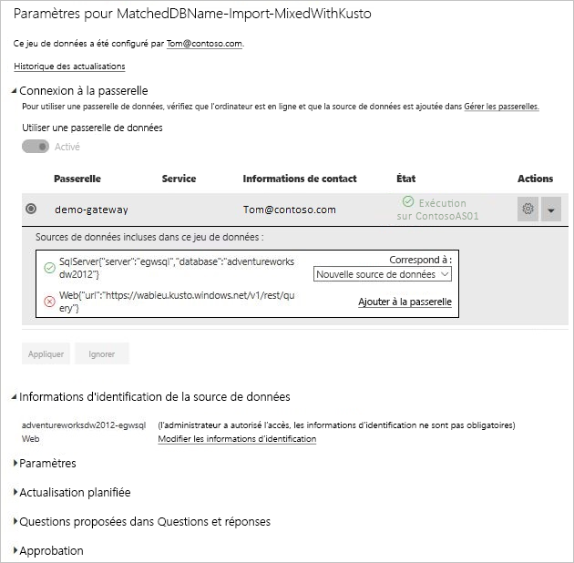

# Fusionner ou ajouter des sources de données locales et cloud

[!INCLUDE [gateway-rewrite](../includes/gateway-rewrite.md)]

Vous pouvez utiliser la passerelle de données locale pour fusionner ou ajouter des sources de données locales et cloud dans la même requête. Cette solution est utile si vous souhaitez combiner des données provenant de plusieurs sources sans avoir à utiliser des requêtes distinctes.

>[!NOTE]
>Cet article s’applique uniquement aux jeux de données dont les sources de données cloud et locales ont été fusionnées ou ajoutées dans une seule requête. Pour les jeux de données qui incluent des requêtes distinctes (une qui se connecte à une source de données locale et l’autre à une source de données cloud), la passerelle n’exécute pas la requête de la source de données cloud.

## Conditions préalables

- Une [passerelle installée](/data-integration/gateway/service-gateway-install) sur un ordinateur local.
- Un fichier Power BI Desktop avec des requêtes qui combinent des sources de données locales et cloud.

>[!NOTE]
>Pour accéder à n’importe quelle source de données cloud, vous devez vérifier que la passerelle a accès à ces sources de données.

1. Dans l’angle supérieur droit du service Power BI, sélectionnez l’ > **Gérer les passerelles**.

    

2. Sélectionnez la passerelle que vous souhaitez configurer.

3. Sous **Paramètres du cluster de passerelle**, sélectionnez **Autorisez les sources de données cloud de l’utilisateur à s’actualiser via ce cluster de passerelle** > **Appliquer**.

    

4. Sous ce cluster de passerelle, ajoutez les [sources de données locales](service-gateway-enterprise-manage-scheduled-refresh.md#add-a-data-source) utilisées dans vos requêtes. Vous n’avez pas besoin d’ajouter des sources de données cloud ici.

5. Chargez sur le service Power BI votre fichier Power BI Desktop avec des requêtes qui combinent des sources de données locales et cloud.

6. Dans la page **Paramètres du jeu de données** du nouveau jeu de données :

   - Pour la source locale, sélectionnez la passerelle associée à cette source de données.
   - Sous **Informations d’identification de la source de données**, modifiez les informations d’identification des sources de données cloud selon vos besoins.

    Vérifiez que les niveaux de confidentialité des sources de données cloud et locales sont définis de manière appropriée pour assurer le traitement sécurisé des jointures.

     

7. Avec le jeu d’informations d’identification cloud, vous pouvez maintenant actualiser le jeu de données à l’aide de l’option **Actualiser maintenant**. Vous pouvez également planifier son actualisation périodique.

## Étapes suivantes

Pour en savoir plus sur l’actualisation des données des passerelles, consultez [Utiliser la source de données pour une actualisation planifiée](service-gateway-enterprise-manage-scheduled-refresh.md#use-the-data-source-for-scheduled-refresh).
