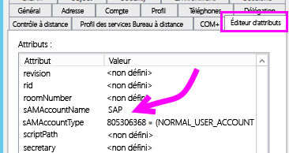
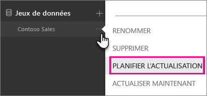
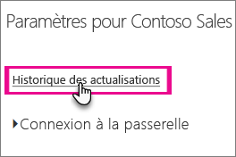

# <a name="troubleshoot-gateways---power-bi"></a>Résoudre les problèmes liés aux passerelles - Power BI

[!INCLUDE [gateway-rewrite](../includes/gateway-rewrite.md)]

Cet article traite de certains problèmes courants rencontrés lors de l’utilisation de la passerelle de données locale avec Power BI. Si vous rencontrez un problème non répertorié ici, vous pouvez utiliser le site de la [Communauté Power BI](https://community.powerbi.com). Vous pouvez également créer un [ticket de support](https://powerbi.microsoft.com/support).

## <a name="configuration"></a>Configuration

### <a name="error-power-bi-service-reported-local-gateway-as-unreachable-restart-the-gateway-and-try-again"></a>Erreur : Le service Power BI a signalé que la passerelle locale est inaccessible. Redémarrez la passerelle, puis réessayez.

À la fin de la configuration, le service Power BI est rappelé pour valider la passerelle. Le service Power BI ne signale pas la passerelle comme étant active. Un redémarrage du service Windows peut permettre à la communication d’aboutir. Pour obtenir plus de détails, vous pouvez collecter et passer en revue les journaux, comme décrit dans [Collecter les journaux de l’application de passerelle de données locale](/data-integration/gateway/service-gateway-tshoot#collect-logs-from-the-on-premises-data-gateway-app).

## <a name="data-sources"></a>Sources de données

### <a name="error-unable-to-connect-details-invalid-connection-credentials"></a>Erreur : Connexion impossible. Détails : « Informations d'identification de connexion non valides »

Le message d’erreur reçu de la source de données apparaît dans **Afficher les détails**. Pour SQL Server, vous voyez un message comme celui-ci :

    Login failed for user 'username'.

Vérifiez l’exactitude du nom d’utilisateur et du mot de passe. Vérifiez également que les informations d’identification permettent bien de se connecter à la source de données. Vérifiez que le compte utilisé correspond à la méthode d’authentification.

### <a name="error-unable-to-connect-details-cannot-connect-to-the-database"></a>Erreur : Connexion impossible. Détails : « Impossible de se connecter à la base de données »

Vous avez établi la connexion au serveur, mais pas à la base de données fournie. Vérifiez le nom de la base de données et que les informations d’identification de l’utilisateur possèdent les autorisations appropriées pour accéder à cette base de données.

Le message d’erreur reçu de la source de données apparaît dans **Afficher les détails**. Pour SQL Server, vous voyez un message comme celui-ci :

    Cannot open database "AdventureWorks" requested by the login. The login failed. Login failed for user 'username'.

### <a name="error-unable-to-connect-details-unknown-error-in-data-gateway"></a>Erreur : Connexion impossible. Détails : « Erreur inconnue dans la passerelle de données »

Cette erreur peut se produire pour différentes raisons. Veillez à valider que vous pouvez vous connecter à la source de données à partir de l’ordinateur qui héberge la passerelle. Cette situation peut résulter d’une inaccessibilité du serveur.

Le code d’erreur **DM_GWPipeline_UnknownError**apparaît dans **Afficher les détails**.

Pour plus d’informations, vous pouvez également accéder à **Journaux des événements** > **Journaux des applications et des services** > **Service Passerelle de données locale**.

### <a name="error-we-encountered-an-error-while-trying-to-connect-to-server-details-we-reached-the-data-gateway-but-the-gateway-cant-access-the-on-premises-data-source"></a>Erreur : Nous avons rencontré une erreur lors de la tentative de connexion à \<server\>. Détails : « Nous avons pu accéder à la passerelle de données, mais elle ne peut pas accéder à la source de données locale. »

Vous n’avez pas pu vous connecter à la source de données spécifiée. Veillez à valider les informations fournies pour cette source de données.

Le code d’erreur **DM_GWPipeline_Gateway_DataSourceAccessError**apparaît dans **Afficher les détails**.

Si le message d’erreur sous-jacent est similaire à ce qui suit, cela signifie que le compte que vous utilisez pour la source de données n’est pas un administrateur de serveur pour cette instance Analysis Services. Pour plus d’informations, voir [Accorder des droits d’administrateur de serveur à une instance de Analysis Services](/sql/analysis-services/instances/grant-server-admin-rights-to-an-analysis-services-instance).

    The 'CONTOSO\account' value of the 'EffectiveUserName' XML for Analysis property is not valid.

Si le message d’erreur sous-jacent est similaire à ce qui suit, cela peut signifier qu’un attribut d’annuaire [token-groups-global-and-universal](/windows/win32/adschema/a-tokengroupsglobalanduniversal) (TGGAU) est peut-être absent du compte de service Analysis Services.

    The username or password is incorrect.

Dans les domaines avec un accès de compatibilité antérieurs à Windows 2000, l’attribut TGGAU est activé. Il n’est pas activé par défaut dans la plupart des domaines créés récemment. Pour plus d’informations, voir [Certaines applications et l’API ont besoin d’accéder à des informations d’autorisation sur les objets de compte](https://support.microsoft.com/kb/331951).

Pour vérifier si l’attribut est activé, procédez comme suit.

1. Connectez-vous à l’ordinateur Analysis Services dans SQL Server Management Studio. Dans les propriétés de connexion avancées, incluez EffectiveUserName pour l’utilisateur en question et voyez si cet ajout reproduit l’erreur.
2. Vous pouvez utiliser l’outil dsacls d’Active Directory pour vérifier si l’attribut est répertorié. Cet outil se trouve sur un contrôleur de domaine. Vous devez connaître le nom de domaine unique du compte et le passer à l’outil.

        dsacls "CN=John Doe,CN=UserAccounts,DC=contoso,DC=com"

    Les résultats doivent avoir l’aspect suivant :

            Allow BUILTIN\Windows Authorization Access Group
                                          SPECIAL ACCESS for tokenGroupsGlobalAndUniversal
                                          READ PROPERTY

Pour corriger ce problème, vous devez activer TGGAU sur le compte utilisé pour le service Windows Analysis Services.

#### <a name="another-possibility-for-the-username-or-password-is-incorrect"></a>Autre motif pouvant expliquer un nom d’utilisateur ou un mot de passe incorrect.

Cette erreur peut également se produire si le serveur Analysis Services est situé dans un autre domaine que les utilisateurs et s’il n’est pas configuré pour une approbation bidirectionnelle.

Collaborez avec les administrateurs de domaine pour vérifier la relation d’approbation entre les domaines.

#### <a name="unable-to-see-the-data-gateway-data-sources-in-the-get-data-experience-for-analysis-services-from-the-power-bi-service"></a>Impossible de voir les sources de données de la passerelle de données dans l’expérience Obtenir les données pour Analysis Services à partir du service Power BI

Vérifiez que votre compte est répertorié sous l’onglet **Utilisateurs** de la source de données dans la configuration de la passerelle. Si vous n’avez pas accès à la passerelle, contactez son administrateur pour lui demander d’effectuer des vérifications. Seuls les comptes figurant dans la liste **Utilisateurs** peuvent voir la source de données dans la liste Analysis Services.

### <a name="error-you-dont-have-any-gateway-installed-or-configured-for-the-data-sources-in-this-dataset"></a>Erreur : Aucune passerelle n’est installée ou configurée pour les sources de données de ce jeu de données.

Vérifiez que vous avez ajouté une ou plusieurs sources de données à la passerelle, comme décrit dans [Ajouter une source de données](service-gateway-data-sources.md#add-a-data-source). Si la passerelle n’apparaît pas dans le portail d’administration sous **Gérer les passerelles**, effacez le cache de votre navigateur ou déconnectez-vous du service, puis reconnectez-vous.

## <a name="datasets"></a>Jeux de données

### <a name="error-there-is-not-enough-space-for-this-row"></a>Erreur : Espace insuffisant pour cette ligne.

Cette erreur se produit si la taille d’une seule ligne est supérieure à 4 Mo. Identifiez la ligne provenant votre source de données et essayez de l’éliminer ou d’en réduire la taille.

### <a name="error-the-server-name-provided-doesnt-match-the-server-name-on-the-sql-server-ssl-certificate"></a>Erreur : Le nom de serveur fourni ne correspond pas au nom de serveur du certificat SSL SQL Server.

Cette erreur peut se produire quand le nom commun du certificat correspond au nom de domaine complet du serveur, mais que vous avez fourni seulement le nom NetBIOS du serveur. Cette situation provoque une erreur de non-correspondance du certificat. Pour résoudre ce problème, faites en sorte que le nom de serveur de la source de données de la passerelle et le fichier PBIX utilisent le nom de domaine complet du serveur.

### <a name="error-you-dont-see-the-on-premises-data-gateway-present-when-you-configure-scheduled-refresh"></a>Erreur : Vous ne voyez pas la passerelle de données locale quand vous configurez l’actualisation planifiée.

Plusieurs scénarios peuvent expliquer cette erreur :

- Le nom du serveur et celui de la base de données ne correspondent pas à ce qui a été entré dans Power BI Desktop et la source de données configurée pour la passerelle. Ces noms doivent être identiques. Ils ne respectent pas la casse.
- Votre compte n’est pas répertorié sous l’onglet **Utilisateurs** de la source de données dans la configuration de la passerelle. L’administrateur de la passerelle doit vous ajouter à cette liste.
- Votre fichier Power BI Desktop a plusieurs sources de données et celles-ci ne sont pas toutes configurées avec la passerelle. Chaque source de données définie avec la passerelle doit s’afficher dans l’actualisation planifiée.

### <a name="error-the-received-uncompressed-data-on-the-gateway-client-has-exceeded-the-limit"></a>Erreur : Les données non compressées reçues sur le client de la passerelle ont dépassé la limite.

La limitation exacte est de 10 Go de données non compressées par table. Si vous rencontrez ce problème, plusieurs options d’optimisation permettent de l’éviter. En particulier, réduisez l’utilisation de valeurs de chaîne longues et extrêmement constantes, en utilisant plutôt une clé normalisée. Vous avez également supprimer la colonne si elle n’est pas utilisée.

## <a name="reports"></a>Rapports

### <a name="error-report-could-not-access-the-data-source-because-you-do-not-have-access-to-our-data-source-via-an-on-premises-data-gateway"></a>Erreur : Le rapport n’a pas pu accéder à la source de données, car vous n’avez pas accès à notre source de données via une passerelle de données locale.

Cette erreur est généralement due à l’une des causes suivantes :

- Les informations de la source de données ne correspondent pas à ce qui est dans le jeu de données sous-jacent. Le nom du serveur et celui de la base de données doivent correspondre entre la source de données définie pour la passerelle de données locale et ce que vous indiquez dans Power BI Desktop. Si vous utilisez une adresse IP dans Power BI Desktop, la source de données pour la passerelle de données locale doit également utiliser une adresse IP.
- Aucune source de données n’est disponible sur les passerelles au sein de votre organisation. Vous pouvez configurer la source de données sur une passerelle de données locale nouvelle ou existante.

### <a name="error-data-source-access-error-please-contact-the-gateway-administrator"></a>Erreur : Erreur d’accès à la source de données. Contactez l’administrateur de la passerelle.

Si ce rapport utilise une connexion Analysis Services en direct, vous pouvez rencontrer un problème dans lequel une valeur est passée à un élément EffectiveUserName qui n’est pas valide ou ne dispose pas d’autorisations sur l’ordinateur Analysis Services. En règle générale, un problème d’authentification est dû au fait que la valeur transmise pour EffectiveUserName ne correspond pas au nom d’utilisateur principal local (UPN).

Pour confirmer le nom d’utilisateur effectif, procédez comme suit.

1. Recherchez le nom d’utilisateur en vigueur dans les [journaux de la passerelle](/data-integration/gateway/service-gateway-tshoot#collect-logs-from-the-on-premises-data-gateway-app).
2. Une fois la valeur transmise, vérifiez qu’elle est correcte. S’il s’agit de votre utilisateur, vous pouvez utiliser la commande suivante à partir d’une invite de commandes pour voir le nom d’utilisateur principal. Celui-ci se présente comme une adresse e-mail.

        whoami /upn

Si vous le souhaitez, vous pouvez voir ce que Power BI obtient d’Azure Active Directory.

1. Accédez à [https://developer.microsoft.com/graph/graph-explorer](https://developer.microsoft.com/graph/graph-explorer).
2. Sélectionnez **Se connecter** dans le coin supérieur droit.
3. Exécutez la requête suivante. Vous voyez une réponse JSON assez longue.

        https://graph.windows.net/me?api-version=1.5
4. Recherchez **userPrincipalName**.

Si votre nom d’utilisateur principal Azure Active Directory ne correspond pas à votre nom d’utilisateur principal Active Directory local, vous pouvez utiliser la fonctionnalité [Mapper les noms d’utilisateur](service-gateway-enterprise-manage-ssas.md#map-user-names-for-analysis-services-data-sources) pour la remplacer par une valeur valide. Vous pouvez également contacter l’administrateur de votre locataire ou l’administrateur Active Directory local pour demander la modification de votre nom d’utilisateur principal (UPN).

## <a name="kerberos"></a>Kerberos

Si le serveur de base de données sous-jacent et la passerelle de données locale ne sont pas configurés correctement pour une [délégation Kerberos contrainte](service-gateway-sso-kerberos.md), activez la [journalisation détaillée](/data-integration/gateway/service-gateway-performance#slow-performing-queries) sur la passerelle. Ensuite, recherchez les erreurs ou les traces dans les fichiers journaux de la passerelle comme point de départ pour la résolution des problèmes. Pour collecter et afficher les journaux de la passerelle, consultez [Collecter les journaux de l’application de passerelle de données locale](/data-integration/gateway/service-gateway-tshoot#collect-logs-from-the-on-premises-data-gateway-app).

### <a name="impersonationlevel"></a>ImpersonationLevel

ImpersonationLevel est lié à la configuration SPN ou au paramètre de stratégie locale.

```
[DataMovement.PipeLine.GatewayDataAccess] About to impersonate user DOMAIN\User (IsAuthenticated: True, ImpersonationLevel: Identification)
```

**Solution**

Pour résoudre le problème, procédez comme suit.

1. Configurez un nom de principal du service (SPN) pour la passerelle locale.
2. Configurez une délégation contrainte dans votre Active Directory.

### <a name="failedtoimpersonateuserexception-failed-to-create-windows-identity-for-user-userid"></a>FailedToImpersonateUserException : Impossible de créer l’identité Windows pour l’utilisateur userid

Une exception FailedToImpersonateUserException se produit si vous ne pouvez pas emprunter l’identité d’un autre utilisateur. Cette erreur peut également se produire si le compte dont vous tentez d’emprunter l’identité provient d’un autre domaine que celui du domaine de service de la passerelle. Il s’agit d’une limitation.

**Solution**

* Vérifiez que la configuration est correcte conformément à la procédure de la section « ImpersonationLevel » ci-dessus.
* Vérifiez que l’ID utilisateur objet de la tentative d’emprunt est un compte Active Directory valide.

### <a name="general-error-1033-error-while-you-parse-the-protocol"></a>Erreur générale : 1033 erreur lors de l’analyse du protocole

Vous recevez l’erreur 1033 quand votre ID externe qui est configuré dans SAP HANA ne correspond pas à la connexion si l’emprunt d’identité de l’utilisateur est fait avec l’UPN (alias@domain.com). Dans les journaux, l’UPN d’origine alias@domain.com est remplacé par un nouvel UPN alias@domain.com en haut des journaux d’erreurs, comme ci-dessous :

```
[DM.GatewayCore] SingleSignOn Required. Original UPN 'alias@domain.com' replaced with new UPN 'alias@domain.com.'
```

**Solution**

* SAP HANA oblige l’utilisateur impersonné à utiliser l’attribut sAMAccountName dans Active Directory (alias de l’utilisateur). Si cet attribut n’est pas correct, vous voyez l’erreur 1033.

    

* Dans les journaux, vous voyez sAMAccountName (alias) et non pas l’UPN, qui est l’alias suivi du domaine (alias@doimain.com).

    

```xml
      <setting name="ADUserNameReplacementProperty" serializeAs="String">
        <value>sAMAccount</value>
      </setting>
      <setting name="ADServerPath" serializeAs="String">
        <value />
      </setting>
      <setting name="CustomASDataSource" serializeAs="String">
        <value />
      </setting>
      <setting name="ADUserNameLookupProperty" serializeAs="String">
        <value>AADEmail</value>
```

### <a name="sap-aglibodbchdb-dllhdbodbc-communication-link-failure-10709-connection-failed-rte-1-kerberos-error-major-miscellaneous-failure-851968-minor-no-credentials-are-available-in-the-security-package"></a>[SAP AG][LIBODBCHDB DLL][HDBODBC] Communication link failure:-10709 Connection failed (RTE:[-1] Kerberos error. Majeur : « Défaillance diverse [851968]. » Mineure : « Aucune information d’identification disponible dans le package de sécurité. »

Vous recevez le message d’erreur « -10709 Échec de la connexion » si votre délégation n’est pas configurée correctement dans Active Directory.

**Solution**

* Vérifiez que le serveur SAP Hana figure sous l’onglet Délégation dans Active Directory pour le compte de service de la passerelle.

   

## <a name="refresh-history"></a>Historique des actualisations

Lorsque vous utilisez la passerelle pour une actualisation planifiée, l’**Historique des actualisations** peut vous aider à identifier les erreurs qui se sont produites. Il peut également contenir des données utiles si vous avez besoin de créer une demande de support. Vous pouvez visualiser les actualisations planifiées et les actualisations à la demande. Les étapes suivantes montrent comment accéder à l’historique des actualisations.

1. Dans le volet de navigation de Power BI, dans **Jeux de données**, sélectionnez un jeu de données. Ouvrez le menu, puis sélectionnez **Planifier l’actualisation**.

    

2. Dans **Paramètres pour...** &gt; **Planifier l’actualisation**, sélectionnez **Historique des actualisations**.

    

    

Pour plus d’informations sur les scénarios de résolution de problèmes d’actualisation, voir [Scénarios de résolution de problèmes liés à l’actualisation](refresh-troubleshooting-refresh-scenarios.md).

## <a name="fiddler-trace"></a>Trace Fiddler

[Fiddler](https://www.telerik.com/fiddler) est un outil gratuit de Telerik qui surveille le trafic HTTP. Vous pouvez voir les allers-retours entre le service Power BI et l’ordinateur client. Cette liste de trafic peut indiquer des erreurs et des informations connexes.


## <a name="next-steps"></a>Étapes suivantes

* [Résoudre les problèmes de passerelle de données locale](/data-integration/gateway/service-gateway-tshoot)
* [Configurer les paramètres de proxy de la passerelle de données locale](/data-integration/gateway/service-gateway-proxy)  
* [Gérer votre source de données - Analysis Services](service-gateway-enterprise-manage-ssas.md)  
* [Gérer votre source de données - SAP HANA](service-gateway-enterprise-manage-sap.md)  
* [Gérer votre source de données - SQL Server](service-gateway-enterprise-manage-sql.md)  
* [Gérer votre source de données – Importation/actualisation planifiée](service-gateway-enterprise-manage-scheduled-refresh.md)  

D’autres questions ? Essayez la [communauté Power BI](https://community.powerbi.com/).