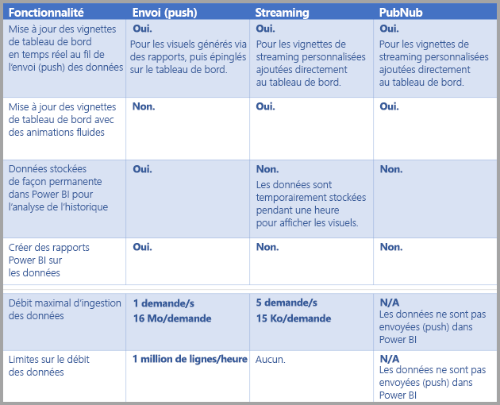
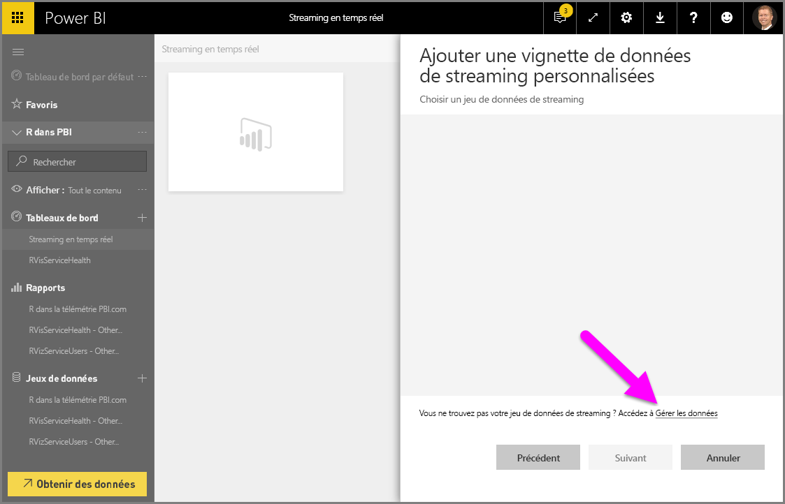
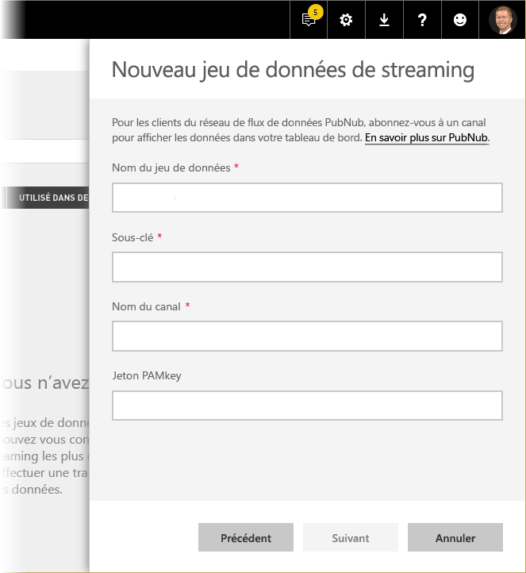
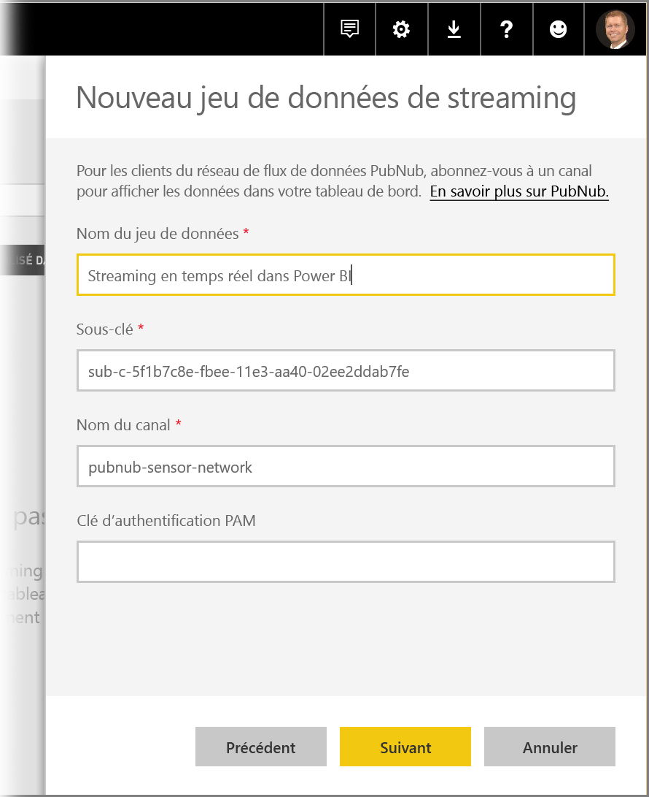
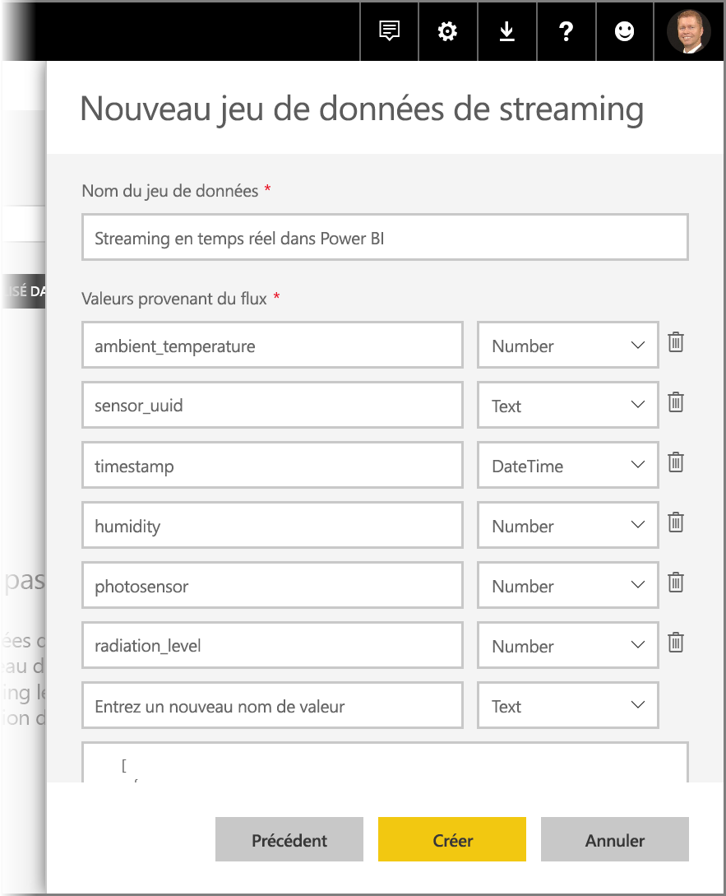

# Streaming en temps réel dans Power BI
Le streaming en temps réel de Power BI vous permet de diffuser des données et de mettre à jour des tableaux de bord en temps réel. Tout visuel ou tableau de bord créé dans Power BI peut afficher et mettre à jour des données et des visuels en temps réel. Les appareils et autres sources de données de streaming peuvent être des capteurs, des sources de médias sociaux, des métriques d’utilisation de service, ou d’autres dispositifs permettant de collecter ou transmettre des données.

Cet article vous montre comment configurer un jeu de données de streaming en temps réel dans Power BI. Avant toute chose, il est important de connaître les types de jeux de données en temps réel qui sont conçus pour s’afficher dans les vignettes (et les tableaux de bord), ainsi que ce qui les différencie.

## Types de jeux de données en temps réel
Il existe trois types de jeux de données en temps réel qui sont conçus pour un affichage dans les tableaux de bord en temps réel :

* Jeu de données de transmission
* Jeu de données de streaming
* Jeu de données de streaming PubNub

Tout d’abord, voyons dans cette section en quoi ces jeux de données sont différents. Nous verrons ensuite comment transmettre les données à chacun de ces jeux de données.

### Jeu de données de transmission
Avec un **jeu de données de transmission**, les données sont transmises au service Power BI. Lorsque le jeu de données est créé, le service Power BI crée automatiquement une base de données dans le service pour y stocker les données. Dans la mesure où il existe une base de données sous-jacente qui continue de stocker les données lorsque celles-ci arrivent, les rapports peuvent être créés avec les données. Ces rapports et les visuels associés sont comme les autres visuels de rapport. Vous pouvez par conséquent utiliser toutes les fonctionnalités de création de rapports de Power BI pour créer des visuels, y compris des visuels Power BI, des alertes de données, des vignettes épinglées sur les tableaux de bord et bien plus encore.

Une fois qu’un rapport a été créé à l’aide du jeu de données de transmission, les visuels associés peuvent être épinglés à un tableau de bord. Sur ce tableau de bord, les visuels sont mis à jour en temps réel en même temps que les données. Au sein du service, le tableau de bord déclenche une actualisation de la vignette à chaque fois que de nouvelles données sont reçues.

Il existe deux éléments à prendre en compte concernant les vignettes épinglées à partir d’un jeu de données de transmission :

* L’épinglage d’un rapport complet à l’aide de l’option *Épingler une page dynamique* n’entraîne **pas** la mise à jour automatique des données.
* Une fois qu’un visuel est épinglé à un tableau de bord, vous pouvez utiliser la fonction **Questions et réponses** pour poser des questions au jeu de données de transmission en langage naturel. Une fois que vous avez envoyé une requête à la fonction **Questions et réponses**, vous pouvez le visuel généré au tableau de bord. Ce dernier est alors *également* mis à jour en temps réel.

### Jeu de données de streaming
Avec un **jeu de données de streaming**, des données sont également transmises au service Power BI, avec toutefois une différence importante : Power BI stocke uniquement les données dans un cache temporaire qui expire rapidement. Le cache temporaire est utilisé uniquement pour afficher des visuels qui ont un historique temporaire, par exemple un graphique en courbes ayant une fenêtre d’une heure.

Avec un **jeu de données de streaming**, il n’y a *aucune* base de données sous-jacente. Vous ne *pouvez donc pas* créer de visuels de rapport à l’aide des données qui transitent à partir du flux. Par conséquent, vous ne pouvez pas utiliser les fonctionnalités de rapport telles que le filtrage, les visuels Power BI et d’autres fonctions de rapport.

La seule façon de visualiser un jeu de données de streaming consiste à ajouter une vignette et à utiliser le jeu de données de streaming en tant que source de **données de streaming personnalisées**. Les vignettes de streaming personnalisées basées sur un **jeu de données de streaming** sont optimisées pour afficher rapidement les données en temps réel. Il existe une faible latence entre le moment où les données sont envoyées (push) au service Power BI et celui où le visuel est mis à jour, car il n’est pas nécessaire d’entrer ni de lire des données dans une base de données.

Dans la pratique, l’utilisation des jeux de données de streaming et des visuels de streaming associés est plus appropriée dans les situations où il est essentiel de minimiser la latence entre le moment où les données sont transmises et celui où elles sont visualisées. En outre, il est recommandé d’utiliser les données transmises dans un format qui peut être affiché tel quel, sans agrégations supplémentaires, par exemple des températures et des moyennes précalculées.

### Jeu de données de streaming PubNub
Avec un jeu de données de streaming **PubNub**, le client web Power BI utilise le SDK PubNub pour lire un flux de données PubNub existant. Aucune donnée n’est stockée par le service Power BI. Dans la mesure où cet appel est effectué directement à partir du client web, vous devez autoriser le trafic vers PubNub si vous autorisez uniquement le trafic sortant en provenance de votre réseau. Reportez-vous aux instructions de l’article de support relatif à l’[autorisation du trafic sortant pour PubNub](https://support.pubnub.com/support/solutions/articles/14000043522-can-i-whitelist-ips-for-pubnub-traffic-).

Comme avec le **jeu de données de streaming**, avec le **jeu de données de streaming PubNub**, il n’existe aucune base de données sous-jacente dans Power BI. Vous ne pouvez donc pas créer de visuels de rapport sur les données qui transitent, ni utiliser les fonctionnalités de rapport telles que le filtrage, les visuels Power BI, etc. Par conséquent, le **jeu de données de streaming PubNub** peut uniquement être visualisé en ajoutant une vignette au tableau de bord et en configurant le flux de données PubNub en tant que source.

Les vignettes basées sur le **jeu de données de streaming PubNub** sont optimisées pour afficher rapidement les données en temps réel. Comme Power BI est connecté directement au flux de données PubNub, il existe une faible latence entre le moment où les données sont envoyées (push) au service Power BI et le moment où le visuel est mis à jour.

### Matrice de jeu de données de streaming
Le tableau suivant (ou la matrice si vous préférez) décrit les trois types de jeux de données de streaming en temps réel et répertorie leurs fonctionnalités et limitations.

> [!NOTE]
> Pour plus d’informations sur les limites **d’envoi** et la quantité de données pouvant être envoyées, voir [cet article](../developer/automation/api-rest-api-limitations.md).

## Transmission de données aux jeux de données
La section précédente a décrit les trois principaux types de jeux de données en temps réel que vous pouvez utiliser dans le streaming en temps réel, ainsi que leurs différences. Cette section montre comment créer et transmettre des données aux jeux de données en question.

Il existe trois méthodes principales pour transmettre des données à un jeu de données :

* Utilisation des API REST Power BI
* Utilisation de l’interface utilisateur du jeu de données de streaming
* Utilisation d’Azure Stream Analytics

Jetons un œil à chacune de ces approches.

### Utilisation des API REST Power BI pour transmettre des données
Vous pouvez utiliser les **API REST Power BI** pour créer et envoyer des données à des jeux de données de **transmission** et à des jeux de données de **streaming**. Lorsque vous créez un jeu de données à l’aide des API REST Power BI, l’indicateur *defaultMode* spécifie s’il s’agit d’un jeu de données de transmission ou de streaming. Si aucun indicateur *defaultMode* n’est défini, il s’agit par défaut d’un jeu de données de **transmission**.

Si la valeur de l’indicateur *defaultMode* est *pushStreaming*, le jeu de données est à la fois un jeu de données de **transmission** *et de* **streaming**, avec les avantages de ces deux types de jeu de données. 

> [!NOTE]
> Lorsque vous utilisez des jeux de données avec l’indicateur *defaultMode* défini sur *pushStreaming*, si une requête dépasse la restriction de taille de 15 Ko pour un jeu de données de **streaming**, mais qu’elle est inférieure à la restriction de taille de 16 Mo d’un jeu de données de **transmission**, la requête aboutit et les données sont actualisées dans le jeu de données de transmission. Toutefois, les vignettes de streaming échouent de façon temporaire.

Une fois que vous avez créé un jeu de données, utilisez les API REST pour transmettre les données à l’aide de l’[API **PostRows**](/rest/api/power-bi/pushdatasets/datasets_postrows).

Toutes les demandes aux API REST sont sécurisées à l’aide d’**Azure AD OAuth**.

### Utilisation de l’interface utilisateur du jeu de données de streaming pour transmettre des données
Dans le service Power BI, vous pouvez créer un jeu de données en sélectionnant une **API** comme indiqué dans l’image suivante.

Lorsque vous créez le jeu de données de streaming, vous pouvez choisir d’activer **Analyse des données d’historique** comme indiqué ci-dessous, ce qui a un impact significatif.

Quand l’option **Analyse des données d’historique** est désactivée (c’est le cas par défaut), créez un **jeu de données de streaming**, comme décrit précédemment dans cet article. Lorsque l’option **Analyse des données d’historique** est *activée*, le jeu de données créé est à la fois un **jeu de données de streaming** et un **jeu de données de transmission**. Cela équivaut à utiliser les API REST Power BI pour créer un jeu de données dont l’indicateur *defaultMode* est défini sur *pushStreaming*, comme décrit précédemment dans cet article.

> [!NOTE]
> Pour les jeux de données en streaming créés à l’aide de l’interface utilisateur du service Power BI, comme décrit dans le paragraphe précédent, l’authentification Azure Active Directory n’est pas requise. Le propriétaire de ces jeux de données reçoit une URL avec une clé de ligne, qui autorise le demandeur à transmettre des données au jeu de données sans utiliser de jeton de porteur Azure AD OAuth. Notez toutefois que l’approche avec Azure AD (AAD) fonctionne également pour transmettre des données au jeu de données.
> 
> 

### Utilisation d’Azure Stream Analytics pour transmettre des données
Vous pouvez ajouter Power BI en tant que sortie dans **Azure Stream Analytics** (ASA), puis visualiser ces flux de données dans le service Power BI en temps réel. Cette section présente des détails techniques sur ce processus.

Azure Stream Analytics utilise les API REST Power BI pour créer son flux de données de sortie vers Power BI, avec *defaultMode* défini sur *pushStreaming*, ce qui génère un jeu de données qui peut exploiter aussi bien l’**envoi (push)** que le **streaming**. Lorsque le jeu de données est créé, Azure Stream Analytics définit l’indicateur **retentionPolicy** sur *basicFIFO*. Avec ce paramètre, la base de données qui prend en charge son jeu de données push stocke 200 000 lignes. Ces lignes sont supprimées selon la méthode FIFO (premier entré, premier sorti).

> [!CAUTION]
> Si votre requête Azure Stream Analytics entraîne une sortie très rapide vers Power BI (par exemple, une ou deux fois par seconde), Azure Stream Analytics traite ces sorties en une seule requête. La taille de la requête risque donc de dépasser la limite de vignette de streaming. Dans ce cas, comme indiqué dans les sections précédentes, le rendu des vignettes de streaming échoue. Dans ce cas de figure, il est conseillé de ralentir la vitesse de sortie des données dans Power BI. Par exemple, au lieu d’une valeur maximale par seconde, affectez-lui une valeur maximale de plus de 10 secondes.
> 
> 

## Configurer votre jeu de données de streaming en temps réel dans Power BI
Maintenant que nous avons couvert les trois principaux types de jeux de données pour le streaming en temps réel et les trois manières principales de transmettre des données à un jeu de données, utilisez votre jeu de données de streaming en temps réel dans Power BI.

Pour commencer un streaming en temps réel, vous devez choisir entre deux manières d’utiliser les données de streaming dans Power BI :

* des **vignettes** contenant des éléments visuels de données de streaming ;
* des **jeux de données** créés à partir de données de streaming qui persistent dans Power BI.

Dans les deux cas, vous devrez configurer les **données de streaming** dans Power BI. Pour ce faire, dans votre tableau de bord (existant ou nouveau), sélectionnez **Ajouter une vignette**, puis sélectionnez **Données de streaming personnalisées**.

Si vous n’avez pas encore configuré de données de streaming, ne vous inquiétez pas. Vous pouvez sélectionner **Gérer les données** pour commencer.

Dans cette page, vous pouvez entrer le point de terminaison de votre jeu de données de streaming si vous en avez déjà créé un (dans la zone de texte). Si vous n’avez pas encore de jeu de données de streaming, sélectionnez l’icône plus ( **+** ) dans l’angle supérieur droit afin d’afficher les options disponibles pour créer un jeu de données de streaming.

Lorsque vous cliquez sur l’icône **+** , vous voyez deux options :

La section suivante décrit ces options et approfondit le mode de création, à partir de la source de données de streaming, d’une **vignette** ou d’un **jeu de données** de streaming que vous pouvez ensuite utiliser pour générer des rapports.

## Créer votre jeu de données de streaming avec l’option qui vous convient le mieux
Il existe deux façons de créer un flux de données de streaming en temps réel qui puisse être utilisé et visualisé par Power BI :

* **API REST Power BI** utilisant un point de terminaison de streaming en temps réel
* **PubNub**

Les sections suivantes examinent successivement chaque option.

### Utilisation de l’API REST Power BI
**API REST Power BI**les récentes améliorations de l’API REST Power BI visent à faciliter le streaming en temps réel pour les développeurs. Lorsque vous sélectionnez **API** dans la fenêtre **Nouveau jeu de données de streaming**, vous devez fournir des entrées permettant à Power BI se connecter à votre point de terminaison et de l’utiliser :

Si vous souhaitez que Power BI stocke les données envoyées via ce flux de données, activez *Analyse des données d’historique* afin de pouvoir générer des rapports et effectuer des analyses à partir du flux des données collectées. Vous pouvez également [en savoir plus sur l’API](/rest/api/power-bi/).

Après avoir correctement créé votre flux de données, vous disposez d’un point de terminaison associé à une URL d’API REST, que votre application peut appeler à l’aide de requêtes *POST* pour envoyer vos données au jeu de **données de streaming** Power BI que vous avez créé.

Lors de l’établissement d’une demande *POST*, vous devez vous assurer que le corps de celle-ci correspond à l’exemple de JSON fourni par l’interface utilisateur de Power BI. Par exemple, encapsulez vos objets JSON dans un tableau.

### Utilisation de PubNub
Avec l’intégration d’un streaming de **PubNub** avec Power BI, vous pouvez utiliser vos flux de données de **PubNub** à faible latence (ou en créer de nouveaux), puis les utiliser dans Power BI. Lorsque vous sélectionnez **PubNub**, puis **Suivant**, vous voyez la fenêtre suivante :

> [!WARNING]
> Les canaux PubNub peuvent être sécurisés à l’aide d’une clé d’authentification PAM (PubNub Access Manager). Cette clé est partagée entre tous les utilisateurs qui ont accès au tableau de bord. Si vous le souhaitez, des [informations supplémentaires sur le contrôle d’accès PubNub ](https://www.pubnub.com/docs/web-javascript/pam-security) sont disponibles.
> 
> 

Les flux de données de **PubNub** sont souvent très volumineux, et ne conviennent pas toujours dans leur forme d’origine pour le stockage et l’analyse historique. Pour utiliser Power BI pour une analyse historique de données de PubNub, vous devez agréger le flux de PubNub brut et l’envoyer à Power BI. Une manière de procéder consiste à utiliser [Azure Stream Analytics](https://azure.microsoft.com/services/stream-analytics/).

## Exemple d’utilisation d’un streaming en temps réel dans Power BI
Voici un exemple rapide du fonctionnement du streaming en temps réel dans Power BI. Vous pouvez le suivre pour voir par vous-même la valeur du streaming en temps réel.

Dans cet exemple, nous utilisons un flux de données accessible au public de **PubNub**. Voici les étapes à suivre :

1. Dans le **service Power BI**, sélectionnez un tableau de bord (ou créez-en un), puis sélectionnez **Ajouter une vignette** > **Données de streaming personnalisées**, puis appuyez sur le bouton **Suivant**.
   
   
2. Si vous n’avez pas encore de sources de données de streaming, sélectionnez le lien **Gérer les données** (juste au-dessus du bouton **Suivant**), puis sélectionnez **+ Ajouter des données de streaming** à partir du lien dans l’angle supérieur droit de la fenêtre. Sélectionnez **PubNub**, puis sélectionnez **Suivant**.
3. Créez un nom pour votre jeu de données, collez les valeurs suivantes dans la fenêtre qui s’affiche, puis sélectionnez **Next** :
   
   *Clé d’abonnement :*
   
       sub-c-5f1b7c8e-fbee-11e3-aa40-02ee2ddab7fe
   *Canal :*
   
       pubnub-sensor-network
   
   
4. Dans la fenêtre suivante, sélectionnez simplement les valeurs par défaut (qui sont automatiquement renseignées), puis sélectionnez **Create**.
   
   
5. De retour dans votre espace de travail Power BI, créez un tableau de bord, puis ajoutez une vignette (voir ci-dessus pour savoir comment procéder si nécessaire). À présent, lorsque vous créez une vignette, puis sélectionnez **Données de streaming personnalisées**, vous disposez d’un jeu de données de streaming pour travailler. Continuons et manipulons-les. En ajoutant les champs *nombre* à des graphiques en courbes, puis en ajoutant d’autres vignettes, vous pouvez obtenir un tableau de bord en temps réel qui ressemble à ceci :
   
   

Faites un essai et manipulez l’exemple de jeu de données. Passez ensuite à la création de vos propres jeux de données, et envoyez le flux de données en direct à Power BI.

## Questions et réponses
Voici quelques questions courantes concernant le streaming en temps réel dans Power BI et les réponses associées.

#### Puis-je utiliser des filtres sur le jeu de données de transmission ? Qu’en est-il du jeu de données de streaming ?
Malheureusement, les jeux de données de streaming ne prennent pas en charge le filtrage. Pour les jeux de données de transmission, vous pouvez créer un rapport, filtrer le rapport et épingler les visuels filtrés sur un tableau de bord. Toutefois, il n’existe aucun moyen de modifier le filtre sur le visuel une fois que celui-ci est sur le tableau de bord.

Séparément, vous pouvez épingler la vignette de rapport dynamique au tableau de bord et, dans ce cas, vous pouvez modifier les filtres. Toutefois, les vignettes de rapport dynamiques ne sont pas mises à jour en temps réel à mesure que les données sont transmises. Vous devez donc mettre à jour manuellement le visuel à l’aide de l’option *Actualiser les vignettes du tableau de bord* dans le menu **Plus**.

Lorsque de l’application de filtres pour envoyer des jeux de données comportant des champs *DateHeure* d’une précision à la milliseconde, les opérateurs d’*équivalence* ne sont pas pris en charge. En revanche, des opérateurs tels que supérieur à (>) ou inférieur à (<) fonctionnent correctement.

#### Comment afficher la valeur la plus récente sur un jeu de données de transmission ? Qu’en est-il du jeu de données de streaming ?
Les jeux de données de streaming sont conçus pour afficher les données les plus récentes. Vous pouvez utiliser le visuel de streaming **Carte** pour voir facilement les dernières valeurs numériques. Malheureusement, la carte ne prend pas en charge les données de type *DateTime* ou *Text*.

Pour les jeux de données de type push, en supposant qu’un horodatage se trouve dans le schéma, vous pouvez essayer de créer un visuel de rapport avec le dernier filtre N.

#### Puis-je me connecter à des jeux de données de transmission ou de streaming dans Power BI Desktop ?
Les jeux de données hybrides et de type push peuvent être connectés en temps réel dans Power BI Desktop. D’autres jeux de données de streaming ne peuvent pas être connectés dans Power BI Desktop.

#### Étant donné la question précédente, comment puis-je modéliser les jeux de données en temps réel ?
La modélisation n’est pas possible sur un jeu de données de streaming, car les données ne sont pas stockées définitivement. Pour un jeu de données de type push, vous pouvez utiliser l’API REST afin de créer un jeu de données avec des relations et des mesures, et/ou afin d’utiliser les API REST de mise à jour de table pour ajouter des mesures à une table existante. 

#### Comment effacer toutes les valeurs d’un jeu de données de transmission ? Qu’en est-il du jeu de données de streaming ?
Sur un jeu de données de transmission, vous pouvez utiliser l’appel de l’API REST de suppression de lignes. Il n’existe actuellement aucun moyen d’effacer les données d’un jeu de données de streaming, bien que les données s’effacent d’elles-mêmes au bout d’une heure.

#### J’ai configuré une sortie Azure Stream Analytics vers Power BI, mais elle n’apparaît pas dans Power BI : que se passe-t-il ?
Voici une liste de contrôle pour résoudre le problème :

1. Redémarrez le travail Azure Stream Analytics (les travaux créés avant la disponibilité générale du streaming nécessitent un redémarrage).
2. Essayez de nouveau d’autoriser votre connexion Power BI dans Azure Stream Analytics.
3. Quel espace de travail avez-vous spécifié dans la sortie Azure Stream Analytics ? Dans le service Power BI, êtes-vous connecté à ce même espace de travail ?
4. Est-ce que la requête Azure Stream Analytics effectue une sortie explicite vers la sortie Power BI ? (en utilisant le mot clé INTO)
5. Le travail Azure Stream Analytics a-t-il des données transitant par son intermédiaire ? Le jeu de données est créé uniquement lorsque des données sont transmises.
6. Pouvez-vous consulter les journaux Azure Stream Analytics pour voir s’il y a des avertissements ou erreurs ?

## Actualisation automatique de la page

L’actualisation automatique de la page fonctionne au niveau de la page de rapport et permet de définir un intervalle d’actualisation pour les visuels qui soit uniquement actif lorsque la page est consommée. L’actualisation automatique de la page est uniquement disponible pour les sources de données DirectQuery. L’intervalle d’actualisation minimal dépend du type d’espace de travail dans lequel le rapport est publié, ainsi que des paramètres d’administration de capacité pour les espaces de travail Premium.

Pour plus d’informations sur l’actualisation automatique de la, consultez l’article [Actualisation automatique de la page](../create-reports/desktop-automatic-page-refresh.md).

## Étapes suivantes
Voici quelques liens qui peuvent vous être utiles lorsque vous travaillez avec le streaming en temps réel dans Power BI :

* [Vue d’ensemble de l’API REST Power BI avec les données en temps réel](/rest/api/power-bi/)
* [Azure Stream Analytics](https://azure.microsoft.com/services/stream-analytics/)